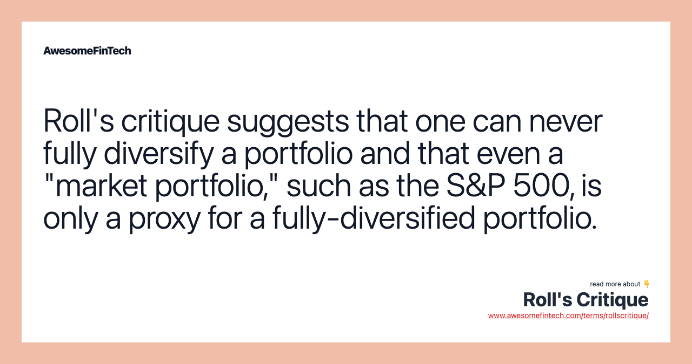

## Table of Contents

## What is Roll's Critique?

Roll's Critique is a famous argument made by economist Richard Roll in 1977. He said that it's hard to test if the Capital Asset Pricing Model (CAPM) is true because we can't see the real market portfolio. The market portfolio should include all types of assets, like stocks, bonds, real estate, and even things like art and wine. But, we usually only use stock market data to test CAPM. Roll argued that if we don't have the full market portfolio, we can't really know if CAPM is working right.

This critique is important because it shows a big problem in finance research. If we can't test CAPM properly, then we can't be sure if it's a good model or not. Roll's point made people think more about how to measure and test financial theories. It also made researchers look for other ways to check if CAPM and similar models are correct, even without the complete market portfolio.

## Who is Richard Roll and why is his critique significant?

Richard Roll is a well-known economist and professor who has worked at places like the University of California, Los Angeles (UCLA) and the California Institute of Technology. He is famous for his work in finance, especially in how we understand and test models that predict how much return we should expect from investments. One of his most famous ideas is called Roll's Critique, which he came up with in 1977.

Roll's Critique is important because it points out a big problem with testing a popular model in finance called the Capital Asset Pricing Model (CAPM). CAPM tries to explain how much return investors should expect from an investment based on how risky it is. Roll said that we can't really test CAPM properly because we don't have a full picture of the market. The market should include everything you can invest in, like stocks, bonds, real estate, and even things like art and wine. But, we usually only look at stock market data. Roll's point made people think more carefully about how they test financial theories and look for new ways to do it better.

## What are the main components of Roll's Critique?

Roll's Critique is about a problem with testing the Capital Asset Pricing Model (CAPM). CAPM is a model that tries to predict how much money you should expect to make from an investment based on how risky it is. Richard Roll said that we can't test CAPM properly because we don't have a complete picture of the market. The market should include everything you can invest in, like stocks, bonds, real estate, and even things like art and wine. But, we usually only look at stock market data. This means our tests of CAPM might not be accurate because we're missing a lot of the market.

This critique is important because it shows a big problem in finance research. If we can't test CAPM the right way, we can't be sure if it's a good model or not. Roll's point made people think more carefully about how they test financial theories. It also made researchers look for other ways to check if CAPM and similar models are correct, even without the complete market portfolio. This has led to more careful and thoughtful approaches in finance research.

## How does Roll's Critique challenge the Capital Asset Pricing Model (CAPM)?

Roll's Critique challenges the Capital Asset Pricing Model (CAPM) by saying that we can't test it properly. CAPM is a model that tries to tell us how much money we should expect to make from an investment based on how risky it is. But to test CAPM, we need a full picture of the market, which includes everything you can invest in, like stocks, bonds, real estate, and even things like art and wine. The problem is, we usually only look at stock market data when testing CAPM. Richard Roll argued that if we don't have the complete market, our tests of CAPM might not be accurate. This means we can't be sure if CAPM is a good model or not.

This critique is important because it points out a big problem in finance research. If we can't test CAPM the right way, we can't trust its results. Roll's point made people think more carefully about how they test financial theories. It also pushed researchers to look for other ways to check if CAPM and similar models are correct, even without the complete market portfolio. This has led to more careful and thoughtful approaches in finance research, making sure that models like CAPM are tested as accurately as possible.

## What is the empirical evidence supporting Roll's Critique?

The main idea behind Roll's Critique is that we can't test the Capital Asset Pricing Model (CAPM) properly because we don't have a full picture of the market. CAPM tries to tell us how much money we should expect to make from an investment based on how risky it is. But to test CAPM, we need to look at everything you can invest in, like stocks, bonds, real estate, and even things like art and wine. The problem is, we usually only look at stock market data when testing CAPM. Richard Roll said that if we don't have the complete market, our tests of CAPM might not be accurate. This means we can't be sure if CAPM is a good model or not.

Empirical evidence supporting Roll's Critique comes from studies that show how different the results can be when you use different parts of the market to test CAPM. For example, if you only use stock market data, you might find that CAPM works well. But if you include other types of investments like bonds or real estate, the results can change a lot. This shows that the market portfolio we use to test CAPM really matters. Researchers have also tried to create a more complete market portfolio to test CAPM, but it's hard to include everything. These studies support Roll's point that without a full market portfolio, we can't be sure if CAPM is right or not.

## Can you explain the concept of a 'market portfolio' in the context of Roll's Critique?

In the context of Roll's Critique, a 'market portfolio' is supposed to include every single thing you can invest in. This means not just stocks, but also bonds, real estate, and even things like art and wine. The idea is that this complete market portfolio shows the whole picture of the market, and it's really important for testing models like the Capital Asset Pricing Model (CAPM).

Richard Roll pointed out that we usually only use stock market data when we test CAPM. This is a problem because if we don't have the full market portfolio, our tests might not be accurate. Roll's Critique says that without looking at everything in the market, we can't really know if CAPM is a good model or not. This has made researchers think more carefully about how they test financial theories and look for better ways to do it.

## How does Roll's Critique affect the interpretation of beta in financial models?

Roll's Critique affects the way we think about beta in financial models like the Capital Asset Pricing Model (CAPM). Beta is a number that shows how much an investment's price moves compared to the whole market. In CAPM, beta helps us figure out how much return we should expect from an investment. But Roll said that we can't test CAPM right because we don't have a full picture of the market. The market should include everything you can invest in, like stocks, bonds, real estate, and even things like art and wine. If we only use stock market data, our idea of beta might be wrong because it's based on an incomplete market.

Because of Roll's Critique, we have to be careful when we use beta to understand how risky an investment is. If our market portfolio isn't complete, then the beta we calculate might not be accurate. This means that when we use beta to predict how much return we should expect from an investment, we might be making decisions based on numbers that aren't quite right. Roll's point has made people in finance think more carefully about how they test and use models like CAPM, and it has pushed them to find better ways to measure things like beta.

## What are the practical implications of Roll's Critique for investors and portfolio managers?

Roll's Critique tells investors and portfolio managers that they need to be careful when they use models like the Capital Asset Pricing Model (CAPM) to make decisions. CAPM helps figure out how much money an investment should make based on how risky it is. But Roll said that we can't test CAPM properly because we don't have a full picture of the market. The market should include everything you can invest in, not just stocks. If we only use stock market data, our predictions about how much return we should expect from an investment might be wrong. This means that investors and portfolio managers should think twice before relying too much on CAPM and similar models.

Because of Roll's Critique, investors and portfolio managers might want to look at other ways to understand how risky an investment is and how much return they should expect. They could use different models or look at a wider range of investments, not just stocks. This can help them make better decisions about where to put their money. Roll's point has made people in finance more careful about how they use models to predict returns and manage risk. It has pushed them to find better and more complete ways to test and use financial theories.

## How have financial theorists responded to Roll's Critique?

Financial theorists have taken Roll's Critique seriously and have tried to find ways to deal with the problem he pointed out. They know that it's hard to test the Capital Asset Pricing Model (CAPM) properly because we don't have a full picture of the market. So, they've come up with new ways to test CAPM and other models. Some have tried to include more types of investments in their market portfolios, like bonds and real estate, to get a better idea of the whole market. Others have used different models that don't need a complete market portfolio to work.

Another way financial theorists have responded is by looking at other ways to measure risk and return. They've developed new models that might be better at predicting how much money an investment should make. These models try to get around the problem Roll pointed out by not relying so much on the idea of a full market portfolio. Overall, Roll's Critique has made financial theorists more careful about how they test and use models. It has pushed them to think of new and better ways to understand how investments work.

## Are there any proposed solutions or modifications to CAPM in light of Roll's Critique?

In response to Roll's Critique, financial theorists have come up with some ideas to fix or change the Capital Asset Pricing Model (CAPM). One idea is to include more types of investments in the market portfolio, like bonds and real estate, not just stocks. This way, the market portfolio is closer to being complete, and the tests of CAPM might be more accurate. Another idea is to use different models that don't need a full market portfolio to work. These models can still help predict how much return an investment should make without running into the problem Roll pointed out.

Another approach has been to look at other ways to measure risk and return. Some researchers have developed new models that might be better at predicting how much money an investment should make. These new models try to get around the problem Roll mentioned by not relying so much on the idea of a full market portfolio. Overall, Roll's Critique has made financial theorists more careful about how they test and use models. It has pushed them to think of new and better ways to understand how investments work.

## What are the limitations of Roll's Critique?

Roll's Critique is important because it points out that we can't test the Capital Asset Pricing Model (CAPM) properly without a complete market portfolio. But there are some limits to what Roll's Critique can tell us. For one thing, it's hard to say exactly what a complete market portfolio should look like. There are so many things people can invest in, and it's tough to include them all in one portfolio. Also, even if we could make a complete market portfolio, it might not be useful for everyone. Different investors might care about different parts of the market, so a one-size-fits-all portfolio might not work for everyone.

Another limitation is that Roll's Critique focuses a lot on CAPM, but it doesn't tell us much about other models or ways to predict how much return we should expect from an investment. There are other models out there that might not need a complete market portfolio to work well. So, while Roll's Critique is helpful for understanding problems with CAPM, it doesn't give us a full picture of all the ways we can study and predict investment returns. This means that while we should be careful about using CAPM, there might still be other good ways to make investment decisions.

## How does Roll's Critique influence modern portfolio theory and asset pricing models?

Roll's Critique has made a big impact on modern portfolio theory and asset pricing models. It tells us that we can't test the Capital Asset Pricing Model (CAPM) the right way because we don't have a full picture of the market. CAPM tries to tell us how much money we should expect to make from an investment based on how risky it is. But if we only use stock market data and not everything people can invest in, like bonds and real estate, our tests might not be accurate. This has made people in finance more careful about how they use CAPM and similar models. They now think more about what parts of the market they're looking at and try to include more types of investments in their tests.

Because of Roll's Critique, financial theorists have come up with new ways to test and use models. Some have tried to include more types of investments in their market portfolios to get a better idea of the whole market. Others have used different models that don't need a complete market portfolio to work. This has led to new models that might be better at predicting how much money an investment should make. Overall, Roll's Critique has pushed people to find better and more complete ways to understand how investments work. It has made them more careful and thoughtful about how they test and use financial theories.

## What is Roll's Critique and how can it be understood?

Roll's Critique presents a significant challenge in the empirical validation of the Capital Asset Pricing Model (CAPM) by scrutinizing the concept of the market portfolio. Richard Roll, in his influential work, argued that the market portfolio, a critical component of the CAPM, is theoretically unobservable. This is because a true market portfolio should include every possible investable asset, ranging from stocks, bonds, and real estate to collectibles and human capital. However, in practice, market indexes are often used as proxies for the market portfolio. These indexes, while comprehensive, do not capture the entire universe of investable assets, leading to an inherent limitation in empirical tests of CAPM.

Roll's critique is fundamentally rooted in the concept of testability. He posited that any empirical assertion of CAPM's validity is contingent upon the observability of a true market portfolio, which remains an elusive concept. This limitation implies that tests of CAPM using available market indexes might only reflect the characteristics of the proxy index rather than a genuine market portfolio.

A pivotal insight from Roll is the mean-variance tautology. In essence, this asserts that any portfolio that is mean-variance efficient is consistent with the CAPM. The CAPM expresses expected return $E(R_i)$ for an asset as:

$$
E(R_i) = R_f + \beta_i (E(R_m) - R_f)
$$

where $R_f$ is the risk-free rate, $\beta_i$ is the asset's beta, and $E(R_m)$ is the expected return of the market portfolio. Roll argued that the CAPM is inherently unfalsifiable if the market portfolio is not observable. As such, any mean-variance efficient portfolio will, by definition, appear to satisfy the CAPM conditions when tested using a proxy.

This critique has sparked considerable debate and further research in financial economics. It calls attention to the necessity of critical examination of market proxies used in CAPM testing and urges researchers to consider alternative models or approaches that account for the limitations highlighted by Roll.

## References & Further Reading

[1]: ["Empirical Tests of the Capital Asset Pricing Model"](https://papers.ssrn.com/sol3/papers.cfm?abstract_id=908569) by Richard Roll

[2]: Fama, E. F. (1970). ["Efficient Capital Markets: A Review of Theory and Empirical Work."](https://www.jstor.org/stable/2325486) The Journal of Finance, 25(2), 383-417.

[3]: Malkiel, B. G. (2003). ["The Efficient Market Hypothesis and Its Critics"](https://www.princeton.edu/~ceps/workingpapers/91malkiel.pdf) The Journal of Economic Perspectives, 17(1), 59-82.

[4]: Biais, B., & Woolley, P.(2011). ["High Frequency Trading"](http://idei.fr/sites/default/files/IDEI/documents/pw/hft_financial_world.pdf) Financial Stability Review, 15, 73-80.

[5]: Lo, A. W. (2004). ["The Adaptive Markets Hypothesis: Market Efficiency from an Evolutionary Perspective."](https://www.researchgate.net/publication/228183756_The_Adaptive_Markets_Hypothesis_Market_Efficiency_from_an_Evolutionary_Perspective) The Journal of Portfolio Management, 30(5), 15-29.