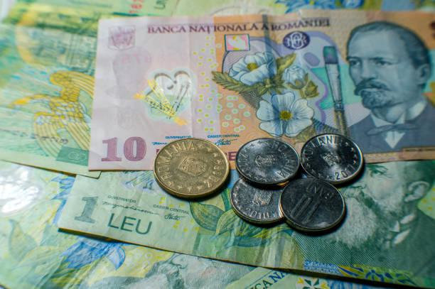

## Table of Contents

## What is the Romanian Leu?

The Romanian Leu is the official money used in Romania. It is written as "RON" and looks like this symbol: "lei" for plural and "leu" for singular. People in Romania use the Leu to buy things like food, clothes, and other stuff they need.

The Leu has been around for a long time, but it changed a lot over the years. It first started in 1864, but it has been changed and updated many times. Now, the newest version of the Leu started being used in 2005. Coins come in 1, 5, 10, and 50 bani, and banknotes come in 1, 5, 10, 50, 100, 200, and 500 lei.

## When was the Romanian Leu first introduced?

The Romanian Leu was first introduced in 1864. Back then, it was a new kind of money for Romania, which had just become a country on its own. The Leu helped people buy things and made trading easier.

Over the years, the Leu changed a lot. It was updated many times to keep up with the country's needs. The latest version of the Leu started being used in 2005. Today, it's still the money people in Romania use every day.

## What are the different denominations of the Romanian Leu?

The Romanian Leu comes in different sizes of money, which we call denominations. For coins, you can find 1 ban, 5 bani, 10 bani, and 50 bani. These are the small change that people use to buy little things or make up the difference when they pay.

For bigger amounts, there are banknotes. The banknotes come in 1 leu, 5 lei, 10 lei, 50 lei, 100 lei, 200 lei, and 500 lei. These are used for bigger purchases, like buying groceries, paying bills, or buying more expensive items. Each of these denominations helps people in Romania handle their money every day.

## How has the design of the Romanian Leu changed over time?

The design of the Romanian Leu has changed a lot since it first started in 1864. Back then, the Leu had different pictures and colors, and it was made of paper. Over the years, as the Leu was updated, the designs on the money changed to show important people, places, and events from Romania's history. For example, older versions of the Leu might have had pictures of kings or famous buildings. These designs helped people feel proud of their country and its history.

In 2005, Romania introduced a new series of the Leu, which is the one used today. This new design was made to be harder to copy and included more security features, like special inks and holograms. The new banknotes show important Romanian figures like writers, scientists, and historical leaders on the front, and on the back, you can see beautiful Romanian landscapes and landmarks. The coins also got a new look, with different sizes and metals, making them easier to use and recognize. These changes made the Leu more modern and secure, helping people trust and use it every day.

## What was the impact of historical events on the Romanian Leu?

Historical events have had a big impact on the Romanian Leu. When Romania became its own country in 1864, the Leu was first introduced to help the new country have its own money. Over the years, big events like wars and changes in government made the Leu change too. For example, during World War II, Romania's money was affected by the war and the country's economy. After the war, when Romania became a communist country, the Leu was changed again to fit the new government's rules.

In 1989, a big revolution happened in Romania, and the communist government was overthrown. This event led to another big change for the Leu. The new government wanted to make the money more stable and trustworthy, so they made new versions of the Leu. The biggest change came in 2005 when Romania joined the European Union. To get ready for this, Romania made the Leu even more secure and modern. These changes helped the Leu stay strong and useful for people in Romania, even as the country went through many big changes.

## How does the Romanian Leu compare to other currencies in Eastern Europe?

The Romanian Leu is the money used in Romania, and it's one of many currencies in Eastern Europe. When you compare it to other Eastern European currencies like the Hungarian Forint, the Polish Zloty, or the Bulgarian Lev, the Leu is pretty stable. It doesn't change a lot in value compared to some other currencies in the region, which makes it easier for people to plan their money and for businesses to trade with other countries.

Different countries in Eastern Europe have different ways of managing their money. Some, like Bulgaria, have their currency tied to the Euro to keep it stable. Others, like Hungary and Poland, let their currencies float more freely, which can make their value go up and down more. The Romanian Leu is somewhere in between. It's not tied to the Euro, but the Romanian government and the central bank work to keep it from changing too much. This helps keep the economy steady and makes the Leu a reliable currency in Eastern Europe.

## What role does the Romanian Leu play in Romania's economy?

The Romanian Leu is very important for Romania's economy. It is the money that people in Romania use every day to buy things like food, clothes, and other stuff they need. When people use the Leu, it helps the economy grow because it makes it easier for businesses to sell their products and for people to spend their money. The Leu also helps the government collect taxes and pay for things like schools and hospitals. This makes the Leu a big part of keeping the economy running smoothly.

The value of the Leu can affect how well the economy does. If the Leu is strong, it can make things from other countries more expensive, which might help Romanian businesses sell more at home. But if the Leu is weak, it can make things from Romania cheaper for other countries to buy, which can help Romanian businesses sell more abroad. The Romanian government and the central bank work hard to keep the Leu stable so that people can trust it and the economy can stay strong.

## How has the value of the Romanian Leu fluctuated in recent years?

In recent years, the value of the Romanian Leu has stayed pretty steady compared to other currencies. It hasn't gone up or down a lot, which is good for people and businesses in Romania. They can plan their money better because they know the Leu won't change a lot. For example, from 2020 to 2023, the Leu stayed around 4.98 to 5.00 against the Euro. This means that if you had 1 Euro, you could get about 5 Lei. This stability helps keep the economy strong.

Even though the Leu has been stable, it can still change a little bit. Sometimes, things like the world economy or big events can make the Leu go up or down a bit. But the Romanian government and the central bank work hard to keep these changes small. They want to make sure that people can trust the Leu and use it every day without worrying too much about its value changing. This helps everyone in Romania feel more secure about their money.

## What are the monetary policies that affect the Romanian Leu?

The Romanian Leu is affected by the monetary policies set by the National Bank of Romania. These policies are like rules that help control how much money is in the country and how it is used. One big policy is the interest rate, which is like the price of borrowing money. If the interest rate goes up, it can make people and businesses want to borrow less, which can slow down the economy a bit. But if the interest rate goes down, borrowing becomes cheaper, and people might spend more, helping the economy grow. The National Bank changes the interest rate to keep the economy balanced and the Leu stable.

Another important policy is the reserve requirement, which is how much money banks have to keep in their vaults and not lend out. If the reserve requirement goes up, banks have less money to lend, which can slow down spending. If it goes down, banks can lend more, which can help the economy grow. The National Bank also uses other tools like buying or selling government bonds to control how much money is in the economy. All these policies work together to keep the value of the Leu steady and help the economy stay strong.

## How does the National Bank of Romania manage the Leu?

The National Bank of Romania works hard to keep the Romanian Leu stable and strong. They do this by setting rules called monetary policies. One big rule is the interest rate, which is like the cost of borrowing money. If the interest rate goes up, borrowing money becomes more expensive, and people might spend less. This can slow down the economy a bit. But if the interest rate goes down, borrowing becomes cheaper, and people might spend more, helping the economy grow. The National Bank changes the interest rate to keep the economy balanced and the Leu steady.

Another way the National Bank manages the Leu is by setting the reserve requirement. This rule tells banks how much money they have to keep in their vaults and not lend out. If the reserve requirement goes up, banks have less money to lend, which can slow down spending. If it goes down, banks can lend more, which can help the economy grow. The National Bank also buys or sells government bonds to control how much money is in the economy. All these rules work together to keep the value of the Leu stable and help the economy stay strong.

## What are the future prospects for the Romanian Leu in the global market?

The future of the Romanian Leu in the global market looks good. Romania is working hard to make its economy stronger and more stable. This means the Leu could become even more trusted by people and businesses around the world. As Romania keeps growing and working with other countries, the Leu might become more important in international trade. If Romania joins the Eurozone one day, the Leu might be replaced by the Euro, which could make things easier for trading with other European countries.

But there are also challenges. The value of the Leu can be affected by big events in the world, like changes in the global economy or political problems. The National Bank of Romania will need to keep making smart choices to keep the Leu stable. If they do a good job, the Leu can stay strong and help Romania's economy grow. People in Romania and businesses will need to keep using the Leu wisely and work together to make sure it stays a good and reliable currency in the future.

## How does the Romanian Leu's performance influence Romania's trade and investment?

The performance of the Romanian Leu has a big impact on Romania's trade and investment. When the Leu is strong, it makes things from other countries more expensive for people in Romania. This can help Romanian businesses sell more at home because their products are cheaper compared to imports. But a strong Leu can also make Romanian products more expensive for other countries to buy, which might make it harder to sell things abroad. On the other hand, if the Leu is weak, Romanian products become cheaper for other countries, which can help boost exports. But then, imports become more expensive, which can affect what people in Romania can buy.

The stability of the Leu is also important for attracting investment. When the Leu stays steady, it makes investors feel more confident about putting their money into Romania. They know that their investments won't lose value because of big changes in the currency. This can bring more money into the country, helping businesses grow and create jobs. But if the Leu starts to go up and down a lot, it can scare investors away because they might worry about losing money. So, keeping the Leu stable is really important for making Romania a good place for trade and investment.

## References & Further Reading

[1]: BNR (National Bank of Romania) - ["History of Romanian currency"](https://en.wikipedia.org/wiki/National_Bank_of_Romania)

[2]: European Central Bank and National Bank of Romania. ["Romania: The Road to Euro Adoption"](https://www.ecb.europa.eu/press/pr/date/2020/html/ecb.pr200605~530c053484.en.html)

[3]: ["Algorithmic Trading and DMA: An Introduction to Direct Access Trading Strategies"](https://www.semanticscholar.org/paper/Algorithmic-trading-%26-DMA-%3A-an-introduction-to-Johnson/aa5de1ab883d5e23b6651faa7c1807586d688e4b) by Barry Johnson

[4]: National Institute of Statistics, Romania. ["Statistical Yearbook of Romania"](https://insse.ro/cms/en/content/statistical-yearbooks-romania)

[5]: John Hull. ["Options, Futures, and Other Derivatives"](https://www.pearson.com/en-us/subject-catalog/p/options-futures-and-other-derivatives/P200000005938/9780136939917)