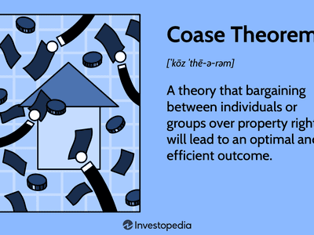

Ronald Harry Coase was a British economist whose pioneering work has profoundly influenced the field of economic theory. His research reshaped our understanding of how economic systems operate, particularly in relation to transaction costs and property rights. Coase is perhaps best known for the Coase Theorem, which posits that in the absence of transaction costs, parties will negotiate to correct any inefficiencies caused by externalities, leading to efficient outcomes regardless of the initial distribution of property rights. This theorem has been widely applied in various domains, including environmental economics, resource management, and legal frameworks, where it offers a foundational basis for understanding how private negotiations can resolve public issues.

The implications of the Coase Theorem extend far beyond traditional economic systems. Its principles have found resonance in modern economic practices, including algorithmic trading, an area where efficiency and cost considerations remain paramount. Coase's insights into transaction costs provide a crucial understanding of how such costs can influence market behavior and the overall efficiency of financial markets. In algorithmic trading, where the speed and cost of transactions are critical, Coase's work offers a lens to comprehend the impact of reduced transaction costs on market dynamics.

Moreover, Coase's exploration of economic efficiency has opened avenues for analyzing how institutions function within markets, influencing how modern economic systems are structured and operate. As algorithmic trading continues to evolve, Coase's foundational theories offer valuable perspectives on the interplay between technology, transaction costs, and market efficiency, underscoring their enduring relevance in contemporary economic discourse. His work bridges the gap between theoretical economics and practical application, highlighting the dynamic interchange between economic theory and modern technological advancements.

## Table of Contents

## Ronald H. Coase: A Brief Biography

Ronald H. Coase, a luminary in the field of economics, was born on December 29, 1910, in Willesden, a suburb of London, England. He embarked on his academic journey at the University of London, where he initially studied at the London School of Economics. Despite facing challenges, such as having a weak mathematical background, Coase made substantial efforts to overcome these obstacles and succeeded in obtaining a Bachelor of Commerce degree in 1932.

Coase’s academic career began as a faculty member at the Dundee School of Economics in Scotland. His tenure in academia took him to various institutions, including the University of Liverpool and the London School of Economics. In these formative years, Coase laid the groundwork for his future pioneering work, developing his ideas on the nature of the firm, which would later culminate in his groundbreaking 1937 paper, “The Nature of the Firm.”

After World War II, Coase moved to the United States, where he continued his work at the University at Buffalo, New York, before joining the University of Virginia. His exposure to American academia was pivotal, as it provided him with a platform to further explore and refine his theories.

Throughout his illustrious career, Coase's work expanded beyond theoretical contributions. In 1991, his seminal contributions to the study of transaction costs and property rights earned him the Nobel Prize in Economic Sciences. This recognition cemented his status as a transformative figure in economics. The Royal Swedish Academy of Sciences acknowledged his influence, noting his profound impact on economic understanding and policy-making.

Coase viewed himself as an “accidental economist.” This term reflects his unconventional path to success and his modest approach toward his achievements. Unlike many of his contemporaries, Coase did not heavily rely on complex mathematical models to express economic concepts; instead, he employed clear and straightforward reasoning to convey his ideas. His work emphasized the real-world applicability of economic theories, a perspective that continues to resonate in economic thought.

Despite his success, Coase remained grounded, often attributing his accomplishments to curiosity and a simple quest for understanding rather than a grand vision of economic theory. His humility and insightful approach have left an enduring legacy, inspiring economists and scholars to explore economics with an open mind and a willingness to challenge conventional wisdom.

## Key Contributions to Economics

Ronald Coase's contributions to economics are primarily encapsulated in two seminal works: "The Nature of the Firm" (1937) and "The Problem of Social Cost" (1960). These studies laid the groundwork for the fields of transaction cost economics and new institutional economics.

In "The Nature of the Firm", Coase explores why firms exist in a market economy characterized by price mechanisms. He articulates the concept of transaction costs, which are the costs of using the price mechanism, including the costs related to finding relevant prices, negotiating, and enforcing contracts. Coase argues that firms arise to mitigate these transaction costs, providing a more efficient means of production when market transactions are prohibitively costly. Thus, firms will continue to expand until the cost of organizing an additional transaction within the firm becomes equal to the cost of carrying out the same transaction in the open market. This insight fundamentally challenged the classical economic notion that markets naturally orchestrate economic activities efficiently.

"The Problem of Social Cost" further developed the idea of transaction costs in the context of externalities—costs or benefits incurred by third parties not directly involved in an economic transaction. Here, Coase introduced what later became known as the Coase Theorem. The theorem posits that if property rights are clearly defined and transaction costs are negligible, parties will bargain to correct externalities irrespective of the initial allocation of rights. This challenged the prevailing view that government intervention was necessary to address externalities, suggesting instead that private negotiations could lead to efficient outcomes under certain conditions.

Coase argued that many economic phenomena, previously treated as technical problems requiring government intervention, could be understood better in terms of property rights and transaction costs. His insights have profound implications for the study of public goods and externalities, questioning the efficiency of centralized solutions when transaction costs are significant.

The development of transaction cost economics by Coase shifted the focus from traditional price theory to the study of the institutions and costs involved in economic exchanges. New institutional economics, a field emerging from these ideas, examines how institutions and legal frameworks affect economic performance and the allocation of resources.

Coase's theories have advanced the understanding of the economic significance of legal frameworks and institutions, providing a basis for analyzing the complexities of real-world markets that traditional economics often glosses over. His work encourages an examination of how institutions evolve to reduce transaction costs and enhance economic efficiency, highlighting the dynamic relationship between law, economy, and society.

## The Coase Theorem: An Economic Breakthrough

The Coase Theorem, introduced by economist Ronald Coase in his seminal work "The Problem of Social Cost" (1960), represents a pivotal advancement in economic thought regarding how parties can efficiently resolve disputes over legal rights and resource allocations. The theorem fundamentally asserts that if property rights are well-defined and transaction costs are negligible, parties will negotiate to an efficient allocation of resources irrespective of the initial distribution of those rights.

### Implications on Economic Efficiency

The Coase Theorem underlines that the assignment of property rights itself does not affect economic efficiency; what matters is that those rights are clearly defined, allowing parties to negotiate an optimal allocation of resources. This idea revolutionized economic thought by shifting the focus from the allocation of resources by centralized control—usually government—to the capacity for private negotiation to achieve efficient outcomes.

For instance, consider two neighboring landowners: one considering the construction of a new building and the other owning a property that would suffer from the overshadowing effects of the construction. According to the theorem, if the rights, such as light or air access, are clearly allocated and both parties incur no transaction costs in negotiating, they can reach a mutually beneficial agreement on whether the construction should proceed or be modified.

### Application to Property Rights and Transaction Costs

Property rights serve as the core of the Coase Theorem, providing a framework within which parties can negotiate. The assignment of these rights affects who should pay whom to resolve rights infringements. However, the efficiency claim of the theorem holds only if transaction costs, such as costs of negotiation, enforcement, or information acquisition, are insignificant. In real-world scenarios, transaction costs can be substantial, thus influencing the final allocation outcome.

Consider the classic example of a polluting factory next to a residential area. If residents have the right to clean air, they could demand compensation from the factory for the pollution. Conversely, if the factory has been granted the right to operate without constraints, the residents could band together to offer compensation to the factory for pollution mitigation.

### Impact on Legal and Economic Policy Development

The Coase Theorem has profound implications for legal systems and policy-making. It suggests that the law's primary role should be the clear definition and enforcement of property rights to enable private deals that internalize externalities. This approach casts doubt on the necessity of governmental intervention through regulation or taxation to address externalities, arguing that private negotiation could lead to more efficient resolutions.

The theorem has been integral in the development of legislation regarding environmental policy, land use, torts, and contracts. Regulations and policies can be designed to minimize transaction costs or facilitate negotiation processes, improving the chances for Coasean bargaining solutions. For instance, cap-and-trade systems for pollution control embody the theorem by establishing a market for emission rights, thus enhancing the potential for efficient bargaining among firms.

In summary, the Coase Theorem posits that with clearly defined property rights and zero transaction costs, bargaining between parties will lead to efficient outcomes. Its impact on economic theory is evidenced by a shift toward considering property rights frameworks' role in resolving conflicts and shaping policies to harness private negotiations' efficient potential. This theorem remains a cornerstone in the intersection of economics and the law, advocating for the simplification and systematization of legal frameworks to promote economic efficiency.

## Coase's Influence on Modern Economics and Trading

Ronald Coase's contributions to economic theory have profoundly influenced modern economics and trading practices. His theories have reshaped how economists and policymakers view transaction costs and institutional structures, providing a foundation for numerous innovations, including [algorithmic trading](/wiki/algorithmic-trading).

Coase's seminal work on transaction costs has underscored the significance of these costs in economic systems, challenging the traditional assumption of zero transaction costs posited in classical economics. By highlighting the real-world implications of transaction costs, Coase's insights have advanced the understanding of how these costs affect market efficiency and the allocation of resources. In contemporary financial markets, where vast volumes of transactions occur daily, understanding and minimizing transaction costs is critical for market participants, including algorithmic traders who aim to maximize their trading efficiency and profits.

Algorithmic trading, which leverages complex algorithms and high-speed data processing to execute trades, has been significantly influenced by Coase's theories. These algorithms are designed to identify and exploit inefficiencies in financial markets, often linked to transaction costs and institutional barriers. By applying Coasian principles, algorithmic trading systems can better assess and optimize the trade-off between transaction costs and potential profits, thereby improving overall market efficiency. 

The development of algorithmic trading strategies often incorporates concepts derived from Coase's work, as these strategies are grounded in the understanding that reducing transaction costs leads to more fluid and efficient markets. For example, the use of limit orders and smart order routing can be seen as attempts to minimize implicit and explicit transaction costs, thereby enhancing trade execution quality.

Furthermore, Coase's insights into institutional economics have played a crucial role in shaping modern financial regulations and policies. By recognizing the impact of institutional structures on economic outcomes, Coase has inspired efforts to streamline regulatory frameworks, reduce bureaucratic inertia, and foster more competitive financial environments. This has led to policy reforms aimed at reducing the friction and inefficiencies that can arise from outdated or overly complex institutional arrangements.

In summary, Coase's theories have profoundly influenced modern economic practices by illuminating the importance of transaction costs and institutional frameworks. His work continues to inform the evolution of trading strategies and financial policies, driving efforts to enhance market efficiency and adaptability in the face of new technological and economic challenges.

## Application of Coase's Theories in Algorithmic Trading

Algorithmic trading involves the use of sophisticated computer algorithms to execute trading strategies based on predefined criteria and optimizations. This form of trading has gained significant traction in the financial markets due to its ability to process vast amounts of data and execute trades at high speed. Ronald Coase's contributions to economic theory, particularly his focus on transaction costs and market efficiency, offer valuable insights into understanding and refining these algorithmic strategies.

Transaction costs, a central theme in Coase's work, play a crucial role in algorithmic trading. In traditional economic models, transaction costs were often assumed to be negligible or ignored entirely. Coase challenged this assumption by demonstrating that transaction costs are integral to the structure and functioning of economic systems. In algorithmic trading, transaction costs include not only the direct costs, such as brokerage fees and taxes, but also indirect costs such as market impact and slippage. By minimizing these costs, algorithmic trading strategies can enhance profitability and market efficiency. 

For example, a typical algorithmic trading strategy may involve [arbitrage](/wiki/arbitrage), where the algorithm exploits price discrepancies of the same asset in different markets or forms. The effectiveness of such strategies heavily relies on the ability to minimize transaction costs, as profit margins in arbitrage can be small. Coase's insights emphasize the importance of considering these costs when developing algorithms, as they can significantly affect the overall success and efficiency of trading strategies.

Market efficiency, another aspect influenced by Coase, is crucial in algorithmic trading. According to the efficient market hypothesis, asset prices fully reflect available information. However, Coase's theories suggest that markets are not perfectly efficient due to transaction costs and information asymmetries, creating opportunities for algorithmic traders. These traders design strategies to exploit information lags and inefficiencies, which can be analyzed and predicted through advanced data analytics and [machine learning](/wiki/machine-learning) techniques. 

Traditional economic models often assume perfect competition and market equilibrium, which overlook the friction introduced by transaction costs and information imperfections. Coase's insights provide a more realistic framework for understanding market dynamics. Algorithmic trading leverages these insights by employing algorithms that adapt to changing market conditions and account for transaction costs and inefficiencies, optimizing trade execution and strategy robustness.

In summary, Coase's theories on transaction costs and market efficiency have a profound impact on algorithmic trading. They underscore the necessity of considering transaction costs in trading strategies and recognizing market inefficiencies as opportunities for profit. By integrating Coase's insights into algorithmic trading, financial markets can achieve greater efficiency and accuracy in pricing and execution.

## Critiques and Limitations of Coase's Ideas

### Critiques and Limitations of Coase's Ideas

The Coase Theorem, while revolutionary, has faced various criticisms and limitations that question its practicality and applicability in real-world trading and economic scenarios. At its core, the Coase Theorem suggests that if property rights are well-defined and transaction costs are negligible, parties will negotiate to reach the most economically efficient outcome, regardless of who initially holds the rights. However, several challenges arise when applying this theory to tangible economic environments.

First, the assumption of zero or negligible transaction costs is often unrealistic. Transaction costs include any costs associated with the exchange of goods or services, such as search and information costs, bargaining and decision-making costs, and policing and enforcement costs. In practice, these costs can be significant, thus hindering the effectiveness of the Coasean solution. For example, in high-frequency and algorithmic trading, even minimal transaction costs can accumulate, affecting optimal transaction execution and ultimately impacting profitability.

Second, the theorem presumes rational actors with perfect information. In many real-world scenarios, information asymmetry prevails, where one party may have more information than the other. This asymmetry can lead to suboptimal negotiations and outcomes that deviate from the theoretical predictions of Coase. Furthermore, cognitive biases and irrational behavior of economic [agents](/wiki/agents) can prevent the attainment of Coasean solutions.

Additionally, the distribution of wealth and power can influence the outcome of negotiations. The Coase Theorem assumes that participants will arrive at mutually beneficial agreements purely based on economic efficiency. However, unequal bargaining power can lead to agreements that reflect the interests of more powerful parties, sometimes at the expense of broader social welfare. This is particularly evident in markets with monopolistic or oligopolistic structures, where dominant players can exploit their positions.

Moreover, Coase's insights encounter challenges when applied to public goods and externalities, where the benefits or costs are dispersed among a large number of individuals. In such cases, the coordination required for achieving the Coasean bargain is impractical, as transaction costs increase with the number of parties involved. The classic example is environmental pollution, where negotiating agreements between polluters and a large group of affected parties becomes complex and costly.

In financial markets, where algorithmic trading flourishes, Coasean analysis is further challenged by the rapidity and complexity of trades. Algorithms operate within milliseconds, rendering traditional negotiation methods impractical and questioning the applicability of Coase's framework. These environments demand innovative approaches that accommodate transaction costs and asymmetries inherent in modern trading systems.

Despite these critiques, Coase's work provides a foundational perspective on addressing externalities and informing legal and economic policies. His emphasis on the importance of transaction costs has contributed to the development of new economic theories and institutions. However, the limitations highlighted suggest that while Coase's ideas offer substantial insights, they necessitate adaptation to address the complexities of contemporary economic systems. Further research and innovation are essential to refine these concepts for practical application, particularly in the fast-paced and intricately structured domains of modern economics and trading.

## Conclusion

Ronald Coase's contributions to the field of economics are both profound and enduring. Through his pioneering work, Coase reshaped the understanding of economic systems by highlighting the significance of transaction costs and property rights. His seminal articles, "The Nature of the Firm" and "The Problem of Social Cost," introduced concepts that have become integral to economic theory, particularly in the study of organizational efficiency and resource allocation. By challenging traditional assumptions about market operations and externalities, Coase laid the groundwork for transaction cost economics and new institutional economics, which continue to influence legal, economic, and policy studies.

Coase's ideas hold considerable promise for future innovations in economics and trading. As the complexity of markets continues to evolve, especially with the rise of digital platforms and algorithmic trading, the relevance of his theories on transaction costs and market efficiency persists. Coase's emphasis on the roles of institutions and contractual arrangements offers valuable insights for optimizing market operations and minimizing costs in these dynamic environments. By applying Coasean analysis, modern economists and traders can develop more robust models that account for the intricacies of real-world transactions, enabling more efficient trading strategies and potentially enhancing market stability.

The enduring impact of Coase's work encourages further research and application of his theories. Scholars and practitioners are called upon to explore how his insights can be integrated into emerging economic models and trading platforms. In particular, the challenges posed by digitalization and globalization present opportunities to expand upon Coase's foundational concepts, adapting them to address current and future economic dynamics. By continuing to study and apply Coase's theories, the economic community can contribute to more effective and adaptive market structures, thus ensuring that the legacy of Ronald Coase remains influential in shaping the economic landscape of the future.

## References & Further Reading

[1]: Coase, R. H. (1937). ["The Nature of the Firm."](https://onlinelibrary.wiley.com/doi/full/10.1111/j.1468-0335.1937.tb00002.x) Economica, 4(16), 386-405.

[2]: Coase, R. H. (1960). ["The Problem of Social Cost."](https://www.jstor.org/stable/10.1086/674872) Journal of Law and Economics, 3, 1-44.

[3]: Coase, R. H. (1998). ["The New Institutional Economics."](https://www.jstor.org/stable/116895) The American Economic Review, 88(2), 72-74.

[4]: Williamson, O. E. (1981). ["The Economics of Organization: The Transaction Cost Approach."](https://www.jstor.org/stable/2778934) American Journal of Sociology, 87(3), 548-577.

[5]: Demsetz, H. (1964). ["The Exchange and Enforcement of Property Rights."](https://www.sfu.ca/~wainwrig/Econ400/documents/demsetz64-JLE-propertyrights.pdf) Journal of Law and Economics, 7, 11-26.