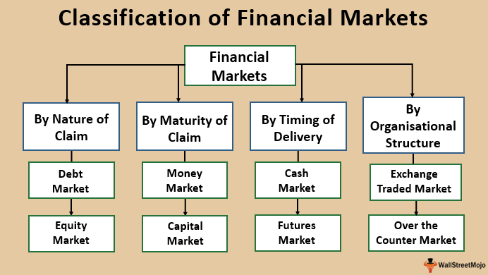

Financial markets have transformed significantly with the advent of technology, particularly through the advent of algorithmic trading. This form of trading automates the trading process using complex algorithms, enabling transactions to be carried out at unprecedented speed and scale. A crucial subset of algorithmic trading, high-frequency trading (HFT), has been a game-changer on stock exchanges globally. It enhances market liquidity by increasing the volume of trades executed within milliseconds. However, this rapid trading approach also raises concerns regarding market integrity, as it can potentially create and exploit unfair advantages.

In the evolving landscape of HFT and stock exchanges, Ronan Ryan stands out as a key figure advocating for fair trading practices. As the co-founder and Chief Operating Officer of IEX Group, Ryan’s contributions focus on ensuring equitable conditions within the markets. The IEX Group, under his leadership, aims to address issues stemming from imbalances created by high-frequency trading strategies. This article examines the developments in financial markets and stock exchanges, the impact of algorithmic trading, and how Ronan Ryan's work with IEX has influenced these dynamics, promoting fairness and transparency in trading.



## Table of Contents

## Understanding Financial Markets and Stock Exchanges

Financial markets are vital components of the global economic system, providing venues for the buying and selling of financial instruments such as stocks, bonds, and commodities. These markets play a crucial role in reallocating resources efficiently, setting prices for various financial assets, and providing liquidity to the economy. 

Stock exchanges are integral segments of financial markets, serving as centralized platforms where trading activities are conducted. Notable examples include the New York Stock Exchange (NYSE) and the National Association of Securities Dealers Automated Quotations (NASDAQ). These exchanges provide the infrastructure for market participants to execute trades in a structured and regulated environment. They facilitate the price discovery process, maintain order in the trading of securities, and ensure that trades are executed efficiently and transparently.

The evolution of technology has significantly reshaped the landscape of financial markets and stock exchanges. Technological advancements have led to the emergence of electronic trading platforms, transforming traditional trading floors into digital environments. This shift has enabled market participants to execute trades with greater speed and accuracy, leveraging high-speed internet connections and sophisticated software algorithms.

Algorithmic trading, a product of these technological advancements, represents a major innovation in financial markets. It involves the use of complex algorithms to automate trading decisions and execute trades at speeds much faster than human traders can achieve. These algorithms analyze market data, identify trading opportunities, and execute orders with minimal human intervention.

The adoption of electronic and [algorithmic trading](/wiki/algorithmic-trading) has introduced both opportunities and challenges in financial markets. On one hand, these advances have increased market [liquidity](/wiki/liquidity-risk-premium) and reduced transaction costs, making markets more accessible and efficient. On the other hand, they have added layers of complexity to trading activities, necessitating the implementation of robust regulatory frameworks to ensure market integrity and protect investor interests. The rise of these technologies underscores the need for continuous adaptation and innovation within financial markets and their regulatory environments.

## The Rise and Impact of Algorithmic Trading

Algorithmic trading has revolutionized the financial markets by employing sophisticated computer algorithms to execute a large [volume](/wiki/volume-trading-strategy) of trades at speeds unattainable in traditional trading methods. The primary motivation for adopting algorithmic trading is to leverage computational power and statistical techniques to execute trades efficiently, capitalize on market movements, and ultimately maximize returns.

High-Frequency Trading ([HFT](/wiki/high-frequency-trading-strategies)) represents a subset of algorithmic trading characterized by extremely high turnover rates and rapid order execution. HFT firms utilize advanced algorithms and trading platforms co-located with exchange servers to minimize latency, allowing them to react to market changes in microseconds. This rapid execution capability has drastically transformed the trading landscape, introducing both enhanced market efficiency and several contentious issues.

The benefits of algorithmic trading, particularly HFT, are substantial. One of the most significant advantages is the increase in market liquidity. By continuously buying and selling securities, HFT firms provide liquidity, making it easier for other market participants to enter and [exit](/wiki/exit-strategy) positions without causing significant price fluctuations. This, in turn, reduces the bid-ask spread, a measure of market liquidity, and minimizes transaction costs, thus benefiting all market participants. 

Moreover, algorithmic trading can improve market efficiency by arbitraging price discrepancies and contributing to price discovery. By rapidly analyzing market data and executing trades, algorithmic systems can exploit minute differences in asset prices across different exchanges or related financial instruments, which helps align prices more accurately with intrinsic values. For instance, an algorithm can be programmed in Python to evaluate and execute trades based on specified conditions, enhancing the speed and accuracy of trading decisions:

```python
def simple_moving_average(prices, window):
    return [sum(prices[i:i+window])/window for i in range(len(prices)-window+1)]

prices = [100, 101, 102, 103, 104, 105, 106]
window = 3
moving_averages = simple_moving_average(prices, window)
print(moving_averages)
```

Despite these advantages, HFT and algorithmic trading have sparked debates regarding market fairness and [volatility](/wiki/volatility-trading-strategies). Critics argue that the speed advantages conferred to HFT firms can lead to unequal playing fields, where slower participants are disadvantaged. Additionally, the reliance on algorithms can prompt market disruptions if these systems act on erroneous data or enter feedback loops during periods of uncertainty, potentially exacerbating market volatility.

Regulators and market participants continue to examine the implications of algorithmic trading, seeking a balance between fostering innovation and ensuring market integrity and fairness. This ongoing scrutiny suggests that while algorithmic trading has been a catalyst for change in financial markets, it also necessitates thoughtful oversight to mitigate associated risks.

 to Ronan Ryan and IEX Group

Ronan Ryan is recognized as a prominent figure in the financial technology landscape, notably as a co-founder and the chief operating officer of IEX Group. Ryan's career has been marked by his deep expertise in networking infrastructure and financial services, skills that have significantly contributed to his role at IEX. Before venturing into the establishment of IEX, Ryan garnered substantial experience in optimizing network speed and efficiency—a proficiency that would later prove crucial in addressing the disparities introduced by high-frequency trading (HFT).

IEX Group, officially launched in 2012, was founded with a mission to tackle the inherent unfairness in high-frequency trading practices that were prevalent in financial markets. High-frequency traders, often armed with ultra-fast trading algorithms, can exploit tiny time advantages, gaining profits at the expense of traditional traders. This phenomenon, where speed is leveraged to gain an advantage, raised questions about fairness and the integrity of market practices.

To counteract these issues, IEX introduced innovative solutions aimed at creating a more level playing field. The core premise of IEX's approach was to implement mechanisms that mitigated the speed advantage of high-frequency traders, thereby protecting ordinary investors from predatory trading activities. Ryan's expertise in networking and infrastructure played a pivotal role in the development and implementation of these mechanisms, positioning IEX as a leader in advocating for fair trading practices.

In essence, Ryan's contributions to IEX have been instrumental in redefining how trading fairness is perceived and enacted within financial markets. His work continues to influence ongoing discussions about market integrity and the need for more equitable trading environments, emphasizing the protection of investor interests against sophisticated, technology-driven trades.

## Ronan Ryan's Contribution to Algorithmic Trading

Ronan Ryan has been a pivotal figure in advancing algorithmic trading, particularly through his work at IEX Group. His contributions focus on mitigating the challenges posed by high-frequency trading (HFT) and promoting fairer trading practices. One of Ryan's significant innovations is the creation of the "speed bump," a technological mechanism designed to slow down the trading process slightly, thereby reducing the advantages that predatory traders might have through faster access to market data. By imposing this brief delay, typically 350 microseconds, the playing field is leveled, allowing more equitable access to market information for all traders.

Furthering this commitment to fairness, Ryan played a crucial role in developing the "magic shoebox," an innovative infrastructure solution designed to manage and normalize the flow of trading data. This system ensures that all market participants receive trade information at the same time, preventing any group from gaining an unfair advantage due to latency differentials. By standardizing the speed at which information is disseminated, the "magic shoebox" helps maintain market integrity and transparency.

Additionally, IEX introduced the D-Peg order type, another feature spearheaded by Ryan, aimed at protecting investors from adverse selection. D-Peg automatically adjusts its price relative to the nearest quote, thus enabling traders to place orders that are more responsive to market movements. This functionality helps safeguard traders from being negatively impacted by rapid price changes that are often exploited by high-frequency trading strategies.

Through these initiatives, Ronan Ryan has not only championed solutions that address the challenges posed by algorithmic trading but has also set a precedent for how technology can be harnessed to foster a more equitable trading environment. His work underscores the importance of balancing technological advancements with ethical trading practices, contributing significantly to the ongoing evolution of stock exchanges.

## Challenges and Criticisms of High-Frequency Trading

High-frequency trading (HFT) has undoubtedly revolutionized the landscape of modern financial markets, yet it remains a polarizing topic, primarily due to its potential to contribute to market volatility and establish unfair trading advantages. Critiques of HFT often highlight its propensity to exacerbate price fluctuations, which can lead to increased market instability. This occurs because HFT relies on algorithms capable of executing a tremendous number of trades in fractions of a second. When large volumes of these trades interact, they have the potential to create abrupt changes in security prices, thus contributing to increased market volatility.

Another major criticism of HFT revolves around its ability to create unfair advantages. Firms engaging in HFT can exploit minute differences in price feeds from different exchanges—a practice known as latency [arbitrage](/wiki/arbitrage)—thus capitalizing on their superior speed and technology to make profits before other market participants are able to act. This has led to accusations that HFT firms possess an undue edge over traditional investors, skewing the level playing field that is a cornerstone of fair trading practices.

The debate over the social utility of HFT continues to be a subject of intense scrutiny. Proponents argue that HFT increases market liquidity and reduces transaction costs, which are generally beneficial to all market participants. However, opponents contend that these benefits are overshadowed by the integrity concerns that HFT introduces, such as potential conflicts of interest and the significant risk of market manipulation.

Ronan Ryan, alongside the IEX Group, has been at the forefront of addressing these challenges. One of the core missions of IEX is to mitigate the negative impacts associated with high-frequency trading. IEX, known for its innovation like the "speed bump," a deliberate delay mechanism designed to counteract latency arbitrage, aims to level the playing field for all investors. This mechanism helps in reducing the advantages garnered by HFT strategies that rely on speed.

Through these initiatives, Ronan Ryan and IEX seek to enhance market integrity and ensure that the financial markets operate in a manner that is equitable for all participants. Their efforts represent a meaningful attempt to balance the liquidity benefits provided by HFT with the imperative of maintaining a fair and transparent market environment.

## The Future of Stock Exchanges and Algorithmic Trading

Future trends in stock exchanges and algorithmic trading suggest an era marked by increased scrutiny and regulatory interventions designed to ensure marketplace fairness. Regulatory bodies worldwide are expected to implement more stringent oversight to address the challenges posed by high-frequency trading (HFT) and similar practices. These measures aim to curb manipulative trading behaviors, mitigate systemic risks, and ensure a level playing field for all market participants. As these regulations evolve, they would likely emphasize greater transparency in trading practices, requiring firms to disclose more information about their algorithms and trading strategies.

Simultaneously, technological innovations are at the forefront of transformation within the trading landscape. Developments in [machine learning](/wiki/machine-learning), [artificial intelligence](/wiki/ai-artificial-intelligence) (AI), and blockchain are set to redefine how transactions are conducted and verified. For instance, AI-driven algorithms could enhance the predictive accuracy of trading decisions and risk assessments, automating complex processes while minimizing human error. Moreover, distributed ledger technologies like blockchain offer the potential for real-time transaction verification and settlement, reducing delays and increasing reliability in trading systems.

In alignment with these advancements, Ronan Ryan's contributions through the IEX Group have been pivotal in laying a robust foundation for more equitable and efficient market practices. IEX's introduction of the "speed bump," a delay mechanism designed to reduce the incidence of predatory trading, has been a significant innovation aimed at safeguarding investor interests and ensuring fairness. This initiative, alongside other tools such as the "magic shoebox" and D-Peg orders, highlights a commitment to mitigating the negative impacts associated with high-frequency trading by reducing adverse selection risks and promoting price stability.

The future of stock exchanges and algorithmic trading, therefore, seems geared towards integrating these technological advancements with regulatory frameworks that prioritize market integrity. As the industry continues to evolve, maintaining a balance between innovation and regulation will be crucial in fostering an environment that supports both market efficiencies and investor protection. This equilibrium will lay the groundwork for a trading ecosystem that is transparent, fair, and conducive to sustainable growth.

## Conclusion

Ronan Ryan has played a pivotal role in challenging the traditional landscape of high-frequency trading (HFT), advocating for a more equitable trading environment. As a primary figure behind the IEX Group, Ryan contributed to initiatives aimed at addressing imbalances caused by predatory trading strategies prevalent within HFT. IEX's approach, epitomized by its introduction of the "speed bump" designed to mitigate the advantages of faster traders, underscores a commitment to market fairness.

The efforts of IEX Group highlight an ongoing evolution in financial markets, where transparency and investor protection are increasingly prioritized. This shift is crucial as financial markets continue adapting to technological advancements and the complex demands they entail. Through understanding the mechanisms of stock exchanges and the nuanced dynamics of algorithmic trading, stakeholders, including regulators and market participants, can foster innovations that uphold market integrity and efficiency.

Furthermore, the dialogue initiated by figures like Ryan emphasizes the need for policy-making that balances technological progression with equitable trading practices. By addressing the challenges posed by HFT, such as market volatility and unfair trading advantages, IEX Group sets a precedent for the future of stock exchanges where fair trading conditions are not just aspirational but achievable. This nuanced comprehension will guide future strategies and regulations, fostering an environment where innovation serves the broader interests of the market and its participants.

## References & Further Reading

[1]: Harris, L. (2015). ["Trading and Electronic Markets: What Investment Professionals Need to Know."](https://www.cfainstitute.org/sites/default/files/-/media/documents/book/rf-publication/2015/rf-v2015-n4-1-pdf.pdf) CFA Institute Research Foundation.

[2]: Lewis, M. (2014). ["Flash Boys: A Wall Street Revolt."](https://en.wikipedia.org/wiki/Flash_Boys) W. W. Norton & Company.

[3]: Aldridge, I. (2013). ["High-Frequency Trading: A Practical Guide to Algorithmic Strategies and Trading Systems."](https://www.amazon.com/High-Frequency-Trading-Practical-Algorithmic-Strategies/dp/0470563761) Wiley.

[4]: Narang, R. K. (2013). ["Inside the Black Box: A Simple Guide to Quantitative and High Frequency Trading."](https://onlinelibrary.wiley.com/doi/book/10.1002/9781118662717) Wiley.

[5]: MacKenzie, D. (2018). ["Material Signals: A Historical Sociology of High-Frequency Trading."](https://www.sps.ed.ac.uk/sites/default/files/assets/pdf/material-signals.pdf) American Journal of Sociology, 124(1), 1-46.