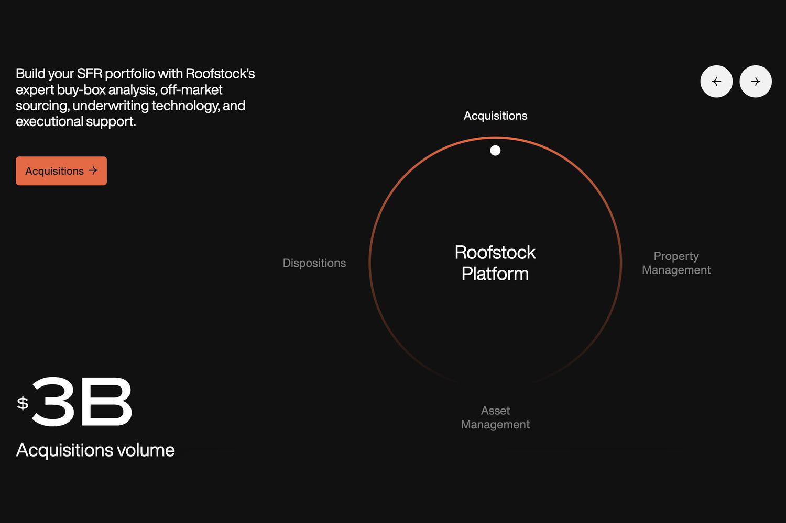

As of 2024, the real estate investment landscape is undergoing significant transformations driven by evolving market dynamics and technological advancements. Investors are increasingly leveraging digital platforms and data-driven strategies to optimize their portfolios. Numerous platforms have emerged, offering innovative solutions for real estate investments, greatly enhancing the accessibility and efficiency of market participation. These platforms utilize big data, machine learning, and artificial intelligence to provide data analytics and predictive modeling, helping investors make informed decisions.

One of the leading platforms revolutionizing real estate investment is Roofstock. Roofstock has become a prominent player by focusing on single-family rental homes, a market traditionally dominated by individual landlords and few institutional investors. Roofstock distinguishes itself by providing a seamless online marketplace where investors can buy, sell, and manage real estate assets with ease. The platform's comprehensive approach includes property analytics, inspection data, and tenant-occupied properties, allowing for a genuine turnkey investment experience.



The purpose of this article is to critically review Roofstock's offerings, exploring how the platform is setting new standards for real estate transactions and asset management. Additionally, the article examines the emerging role of algorithmic trading in real estate. Algorithmic trading, widely used in financial markets, applies complex algorithms to automate and optimize investment strategies, enabling investors to process large datasets and execute trades at unprecedented speed and accuracy. This approach is gaining traction in real estate, promising to redefine traditional investment strategies as it combines quantitative analysis, data science, and market understanding.

Understanding these dynamics is crucial for investors aiming to navigate the real estate market in 2024 effectively. As competition intensifies and market conditions fluctuate, leveraging platforms like Roofstock and incorporating algorithmic trading can offer a strategic advantage. By being informed about these advancements, investors can better position themselves to capitalize on emerging opportunities while mitigating potential risks.

## Table of Contents

## The Real Estate Investment Climate in 2024

In 2024, the real estate investment climate is shaped by several interrelated factors, including prevailing market trends, macroeconomic influences, and the transformative power of technology and data analytics. These elements collectively define the landscape for investors navigating this evolving sector.

**Market Trends and Influencing Factors**

Several market trends are crucial to understanding real estate investment dynamics in 2024. Urbanization continues to influence demand patterns, with a growing preference for properties in well-connected urban centers. However, there is also a notable interest in suburban and rural investments, driven by remote working trends and lifestyle preferences post-pandemic. This bifurcation in market demand creates unique opportunities for diverse investment strategies.

**Macroeconomic Factors: Interest Rates and Inflation**

Interest rates and inflation are pivotal macroeconomic factors affecting real estate investments. As of 2024, central banks are expected to modulate interest rates to balance economic growth and inflationary pressures. Lower interest rates typically make real estate investments more attractive due to reduced borrowing costs. Conversely, rising rates might introduce challenges, potentially cooling market activity.

Inflation impacts real estate through increased construction costs and property valuations. While inflation can erode purchasing power, real estate is often seen as a hedge against inflation. Investors should consider inflation-linked rental yields and property appreciation in their decision-making processes.

**Technology and Data Analytics' Role**

Technological advancements and data analytics are significantly transforming real estate investment strategies. Platforms equipped with robust data analytics capabilities enable investors to assess property values, rental trends, and market dynamics more accurately. Machine learning and predictive analytics provide critical insights into future market movements, assisting investors in making informed decisions.

The integration of blockchain technology is also notable, improving transaction transparency and efficiency. Smart contracts on blockchain platforms facilitate secure and streamlined property transactions, reducing the need for intermediaries. This technological integration enhances investor confidence and reduces operational costs.

**Emerging Investment Opportunities and Challenges**

In 2024, emerging investment opportunities arise from shifts in demographic patterns and economic policies. Sustainable and green buildings are gaining traction, driven by environmental considerations and regulatory encouragement. Investors are exploring these areas for potential growth and regulatory compliance benefits.

Challenges remain, including geopolitical uncertainties and the potential for economic slowdowns in key markets. Regulatory changes, particularly in tax and property laws, also pose risks that investors must navigate. Adapting to these challenges requires a flexible and informed investment approach, leveraging the latest technological tools and market insights.

In conclusion, the real estate investment climate in 2024 is characterized by evolving market dynamics, pivotal macroeconomic variables, and the ongoing impact of technology. Successful navigation of this environment requires investors to be proactive, tech-savvy, and adaptable to the constant changes shaping the real estate sector.

## Understanding Roofstock

Roofstock is an innovative real estate investment platform that facilitates the buying and selling of single-family rental (SFR) properties. Launched in 2015, it has become a leading marketplace in the real estate sector, offering a streamlined and efficient process for acquiring investment properties without the need for physical inspection or traditional real estate [agents](/wiki/agents).

Roofstock's role in the real estate market is significant, as it democratizes property investment by lowering barriers to entry and providing access to a diversified portfolio of income-generating properties across various locations. The platform connects investors with vetted properties and local property managers, simplifying the complexities often associated with traditional real estate transactions.

The key features and services offered by Roofstock include a comprehensive online marketplace where investors can browse properties that come with existing tenants, detailed property data, and projections of financial performance such as expected cash flow and potential appreciation. Roofstock also provides inspection reports and certifications to ensure transparency and trustworthiness in each investment opportunity.

One of the major differentiators of Roofstock is its certification process, which includes third-party inspections and evaluations that assure potential investors of the quality and habitability of properties listed on the platform. This feature contrasts with traditional real estate platforms that typically require prospective buyers to conduct their own due diligence, often involving time-consuming and costly inspections.

Another distinguishing aspect is Roofstock’s Investment Property Marketplace which offers fractional ownership, allowing investors to purchase shares of rental properties, thereby reducing the capital required for entry into the real estate market. This approach opens up real estate investments to a broader audience, including those who may not have the financial capability to purchase entire properties outright.

Roofstock caters to a wide range of investors, from individual first-time real estate investors seeking an additional income stream to seasoned investors looking to diversify their portfolios across different geographies. The platform is particularly attractive to those interested in out-of-state investments, as it provides local market knowledge and property management solutions that relieve investors from the challenges of managing properties from a distance.

Overall, Roofstock has positioned itself as a transformative force in real estate investment, offering a modern, technology-driven alternative to traditional real estate transactions while expanding access to real estate investment opportunities.

## Review of Roofstock's Offerings in 2024

Roofstock has solidified its position as a leading real estate investment platform in 2024 by enhancing its offerings with new tools and features tailored to meet the evolving needs of investors. This year, Roofstock introduced several advancements aimed at streamlining the investment process and increasing accessibility for different types of investors.

One of the noteworthy features launched by Roofstock is their enhanced analytics dashboard, which provides investors with comprehensive data insights powered by sophisticated algorithms. Investors can visualize market trends, property performance, and potential return on investment (ROI) scenarios, thus facilitating more informed decision-making. This tool is particularly beneficial for those seeking to optimize their investment strategies using data-driven insights.

Additionally, Roofstock has introduced automated property matching. This feature leverages [machine learning](/wiki/machine-learning) algorithms to analyze investor preferences and investment goals, subsequently recommending properties that align with these parameters. By automating this process, Roofstock significantly reduces the time investors spend searching for suitable properties, enhancing overall user experience.

Customer feedback on Roofstock's platform in 2024 has been overwhelmingly positive, with many users highlighting the platform's ease of use and the efficiency of the new tools. Investors appreciate how Roofstock simplifies property management by offering integrated services such as property inspection, tenant placement, and repair management. The platform's commitment to transparency and user support continues to be a differentiator in the industry.

Several case studies exemplify the success stories of investors using Roofstock in 2024. For example, an investor from Texas was able to diversify their portfolio across different states efficiently by leveraging the platform's new tools, achieving a 15% increase in annual returns. Another case involved a first-time investor who utilized Roofstock's educational resources and automated property matching to successfully acquire and manage their first rental property, subsequently generating consistent passive income.

Overall, Roofstock's offerings in 2024 are characterized by their innovative approach to utilizing technology to enhance the real estate investment experience. The platform's commitment to integrating cutting-edge tools and prioritizing user experience continues to drive its reputation as a preferred choice for investors seeking to navigate the complexities of the real estate market effectively.

## Algorithmic Trading in Real Estate Investment

Algorithmic trading, historically pervasive in financial markets like equities and [forex](/wiki/forex-system), is progressively permeating the real estate sector as of 2024. This approach employs advanced algorithms to automate and enhance investment strategies, leveraging large datasets and sophisticated computational models.

The application of [algorithmic trading](/wiki/algorithmic-trading) in real estate primarily hinges on data-driven decision-making. Algorithms process extensive data—ranging from property values and rental yields to macroeconomic indicators—to identify investment opportunities. This automated analysis can outperform traditional human analysis by simultaneously interacting with multiple data streams and executing transactions at optimal times. Consequently, algorithm-driven strategies provide three main benefits: increased efficiency, enhanced accuracy, and the potential for superior returns.

Key advantages of algorithmic trading include its capacity to eliminate emotional decision-making, minimize human error, and implement predefined strategies consistently. Algorithms can synthesize past and real-time data to make predictions and guide purchase or sale decisions. For instance, machine learning models can analyze historical price data to forecast future trends, enabling investors to anticipate market movements. 

However, several potential risks accompany algorithmic strategies in real estate. The reliance on historical data may not always account for unprecedented market changes, potentially leading to inaccurate predictions and financial losses. Algorithms might also [carry](/wiki/carry-trading) a "black box" risk, where the underlying decision-making process becomes opaque to users, complicating oversight and adjustment. Moreover, the requirement for extensive data sets necessitates robust cybersecurity measures to protect sensitive information.

Algorithms have significantly improved decision-making processes in real estate investment by providing deeper insights through the analysis of vast datasets. For example, predictive analytics can help investors project future cash flows from rental properties, calculate expected returns, and gauge the impact of [interest rate](/wiki/interest-rate-trading-strategies) changes on property values. Additionally, natural language processing (NLP) algorithms analyze textual data sources like news articles and economic reports to assess market sentiment and emerging trends.

There are notable examples of algorithmic trading strategies applied to real estate market data. For example, a mean reversion strategy might analyze property price trends to pinpoint when prices have deviated from historical averages, suggesting potential buy or sell signals. Additionally, [momentum](/wiki/momentum)-based algorithms could exploit patterns in price movements, signaling investment actions based on the continuation of established trends. These strategies, rooted in rigorous quantitative analysis, offer new perspectives and methodologies for investors seeking to optimize their portfolios effectively.

## Using Algorithmic Trading with Roofstock

Roofstock has embraced algorithmic trading to enhance real estate investment strategies, providing tools and features that leverage data analytics and automation. Algorithmic trading refers to the use of computer algorithms to automate market analysis and trade execution. Roofstock integrates these technologies to offer investors a data-driven approach to real estate investing.

The platform provides various tools designed for algorithmic trading. These tools analyze vast datasets, including property valuations, rental yields, and market trends, to generate insights that can inform investment decisions. Roofstock's algorithmic tools can, for example, identify undervalued properties based on historical pricing patterns and project future cash flow by analyzing rental market dynamics.

Investors benefit from combining Roofstock’s platform with algorithmic trading strategies through improved decision-making processes. Algorithms can quickly process and analyze large volumes of data, offering investors the ability to act swiftly on opportunities. This means investors can achieve optimized returns by exploiting inefficiencies in the market that might be invisible to the human eye.

One of the core benefits is the platform's ability to minimize emotional bias in investment decisions. By relying on data-driven insights, investors can make more rational decisions. The speed and accuracy of algorithmic strategies also allow for the quick execution of trades, which is crucial in a market where conditions can rapidly change.

Several investor success stories underscore the effectiveness of algorithmic trading through Roofstock. Testimonials highlight cases where investors, using the platform's tools, successfully identified and acquired properties with high rental returns in emerging markets. In one documented instance, an investor utilized Roofstock's algorithmic analytics to diversify their portfolio geographically, resulting in a significant increase in rental income and overall portfolio value.

To illustrate, a simplistic example of a Python algorithm that could be employed by investors might look like this:

```python
def calculate_property_score(price, rental_income, growth_rate):
    score = (rental_income / price) * growth_rate
    return score

# Example calculation with hypothetical data
property_price = 100000
annual_rental_income = 12000
expected_growth_rate = 1.05

score = calculate_property_score(property_price, annual_rental_income, expected_growth_rate)
print(f"Property investment score: {score}")
```

This script calculates a basic investment score for properties based on price, rental income, and expected growth rate, helping investors prioritize investment opportunities.

In summary, the integration of algorithmic trading within Roofstock’s platform equips investors with cutting-edge tools to navigate the real estate market effectively, enhance investment accuracy, and capitalize on new investment opportunities.

## Pros and Cons of Real Estate Investment with Roofstock and Algorithmic Trading

Investing in real estate through platforms like Roofstock that incorporate algorithmic trading strategies presents a unique set of advantages and challenges. Understanding these dynamics is crucial for making informed investment decisions.

### Advantages of Investing with Roofstock and Algorithmic Trading

1. **Enhanced Decision-Making**: Algorithms can process vast amounts of data, providing investors with insights that would be impossible to achieve manually. This includes analyzing market trends, property values, and potential rental income to identify lucrative investment opportunities.

2. **Efficiency and Speed**: Algorithmic trading allows for faster decision-making by automating the process of buying and selling properties based on pre-set criteria. This can lead to better timing in market entries and exits.

3. **Data-Driven Insights**: Roofstock leverages data analytics to offer investors detailed property reports and market analytics. This information is crucial for minimizing risks and enhancing returns. Algorithms can further refine these insights by identifying patterns and predicting future market movements.

4. **Diversification**: Algorithmic strategies can quickly analyze and recommend a diverse set of real estate assets, helping investors diversify their portfolios. This can reduce the risk associated with market volatility.

### Potential Drawbacks and Risks

1. **Model Risk**: The effectiveness of algorithmic trading relies heavily on the quality and design of the algorithms. Flawed models can lead to incorrect predictions and poor investment decisions.

2. **Market Volatility**: While algorithms can process data quickly, they may not always account for sudden market shifts. This could result in unexpected losses if the algorithm does not adapt swiftly.

3. **Overreliance on Technology**: Relying solely on algorithms without human oversight may ignore qualitative factors such as property condition and neighborhood dynamics, which are crucial for real estate investments.

### Comparative Analysis with Other Platforms

Roofstock distinguishes itself by integrating algorithmic solutions with a focus on single-family rental properties. Compared to traditional platforms, Roofstock's technology-centric approach offers a more streamlined process for investors, though it may not cater to those seeking hands-on investment strategies.

Other platforms may provide broader asset classes, such as REITs or commercial real estate, and cater to different investor preferences. However, they may not offer the same level of data-driven insights or algorithmic trading capabilities as Roofstock.

### Guidelines for Mitigating Risks and Maximizing Gains

1. **Diversification**: Investors should not rely on a single algorithmic strategy. Diversifying the strategies and assets can spread risk and improve returns.

2. **Regular Monitoring**: Investors should consistently review algorithmic performance and market conditions. Adjustments may be necessary to align with current market trends.

3. **Human Oversight**: Incorporate human expertise in decision-making processes to complement algorithmic insights. This includes evaluating qualitative factors that algorithms may miss.

4. **Risk Management Strategies**: Implement stop-loss orders and other risk management techniques to protect investments from significant losses during volatile periods.

By understanding and balancing the advantages and potential risks associated with investing through Roofstock and utilizing algorithmic trading, investors can better position themselves for success in the evolving real estate market.

## Conclusion

The review of Roofstock and its integration of algorithmic trading into real estate investment strategies reveals several important insights for investors in 2024. Roofstock continues to be a significant player in the real estate market by leveraging cutting-edge technology to offer diverse investment opportunities. The platform's reliance on data analytics and algorithmic strategies indicates a shift towards more precise and informed decision-making processes, enhancing the overall efficiency and potential profitability of real estate investments.

Looking ahead, Roofstock is poised to further capitalize on technological advancements and evolving market dynamics. As algorithmic trading becomes increasingly prevalent in the real estate sector, its potential to optimize investment outcomes will likely grow. Investors can expect Roofstock to continue refining its tools and features, providing a more sophisticated and user-friendly platform that integrates these strategies seamlessly.

For investors considering these tools in 2024, several recommendations stand out. First, it is essential to thoroughly understand the underlying algorithms and how they interact with market data to drive investment decisions. Engaging with educational resources provided by Roofstock or independent financial advisors can aid in building this understanding. Additionally, it is imperative to remain vigilant about potential risks associated with algorithmic trading, such as market [volatility](/wiki/volatility-trading-strategies) or technological malfunctions, and to implement strategies to mitigate these risks effectively.

Finally, staying informed about evolving market trends will be crucial for maintaining a competitive edge in real estate investment. As economic conditions and technological capabilities shift, investors should continuously adapt their strategies and leverage platforms like Roofstock to capitalize on emerging opportunities. Embracing innovation while maintaining a diligent approach to risk management will position investors well as they navigate the complexities of the 2024 real estate landscape.

## References & Further Reading

[1]: Bergstra, J., Bardenet, R., Bengio, Y., & Kégl, B. (2011). ["Algorithms for Hyper-Parameter Optimization."](https://papers.nips.cc/paper/4443-algorithms-for-hyper-parameter-optimization) Advances in Neural Information Processing Systems 24.

[2]: ["Advances in Financial Machine Learning"](https://www.amazon.com/Advances-Financial-Machine-Learning-Marcos/dp/1119482089) by Marcos Lopez de Prado

[3]: ["Evidence-Based Technical Analysis: Applying the Scientific Method and Statistical Inference to Trading Signals"](https://www.amazon.com/Evidence-Based-Technical-Analysis-Scientific-Statistical/dp/0470008741) by David Aronson

[4]: ["Machine Learning for Algorithmic Trading"](https://github.com/stefan-jansen/machine-learning-for-trading) by Stefan Jansen

[5]: ["Quantitative Trading: How to Build Your Own Algorithmic Trading Business"](https://www.amazon.com/Quantitative-Trading-Build-Algorithmic-Business/dp/1119800064) by Ernest P. Chan