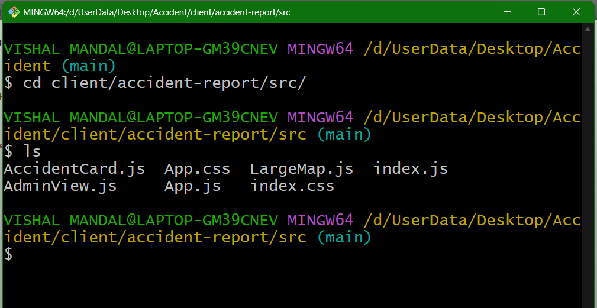

## Table of Contents

## What is the Root Directory in the context of machine learning?

In the context of machine learning, the term "Root Directory" doesn't refer to a specific concept within machine learning algorithms or models. Instead, it is a term borrowed from computer science and operating systems, where it represents the top-level directory of a file system. In machine learning projects, the root directory might be used to organize and store all related files such as datasets, scripts, model checkpoints, and configuration files. This organization helps in managing the project efficiently, ensuring that all team members can easily access and understand the project structure.

For instance, when setting up a machine learning project, you might have a root directory named 'ml_project'. Within this directory, you could have subdirectories like 'data' for storing datasets, 'scripts' for Python scripts, 'models' for saved model files, and 'configs' for configuration files. Proper organization of the root directory can streamline the development process, making it easier to run experiments, share work with collaborators, and maintain the project over time. While the root directory itself is not a machine learning concept, its effective use is crucial for the practical implementation of machine learning projects.

## How does the Root Directory relate to file systems in machine learning projects?

In machine learning projects, the root directory is the main folder that holds all the files and subfolders needed for the project. It's like the starting point of your project's file system. When you set up a machine learning project, you might create a root directory named something like 'my_ml_project'. Inside this root directory, you can organize different parts of your project, such as a 'data' folder for your datasets, a 'scripts' folder for your code, and a 'models' folder for saving your trained models. This organization helps you and your team find and use files easily.

Using a well-organized root directory is important because it makes managing a [machine learning](/wiki/machine-learning) project simpler. For example, if you need to run an experiment, you can quickly find the right data and scripts in their respective folders. Also, when working with others, a clear structure in the root directory helps everyone understand where to find and put files. This way, the root directory acts as the backbone of your project's file system, keeping everything tidy and accessible.

## What are the common contents found in the Root Directory of a machine learning project?

In a machine learning project, the root directory often contains a few key folders and files that help organize the work. You'll typically find a 'data' folder where all the datasets are stored. This folder might have subfolders for different types of data, like 'train', 'test', and 'validation'. There's usually a 'scripts' or 'src' folder that holds all the code files, including Python scripts for data preprocessing, model training, and evaluation. These scripts are essential for running and managing the machine learning tasks.

Another common folder in the root directory is 'models', which is used to save trained models. This can include model checkpoints and final model files that you can load later for predictions or further training. You might also see a 'configs' folder with configuration files that set up parameters for your experiments. These files help keep track of different settings used in your experiments. Finally, there might be some top-level files like 'README.md' for project documentation, 'requirements.txt' for listing dependencies, and 'main.py' or similar for the entry point of the project.

Overall, the root directory serves as the central hub for a machine learning project, making it easier to navigate and manage all the components. By keeping everything organized in this way, you can work more efficiently and collaborate with others more effectively. Whether you're running experiments, sharing your work, or maintaining the project over time, a well-structured root directory is crucial.

## How can the organization of a Root Directory impact the efficiency of a machine learning workflow?

The organization of a root directory can greatly affect how smoothly a machine learning project runs. When the root directory is well-organized, it's easier to find and use the files you need. For example, if you have a 'data' folder for your datasets, a 'scripts' folder for your code, and a 'models' folder for your trained models, you can quickly locate everything. This setup helps you and your team work faster because you don't waste time looking for files. It also makes it simpler to share your work with others, as they can understand the project structure easily.

A disorganized root directory can slow down your machine learning workflow. If files are scattered everywhere without clear folders, it can be hard to find what you need. This can lead to mistakes, like using the wrong dataset or an outdated model. It also makes it harder to keep track of different experiments and their results. By keeping your root directory tidy, you can run experiments more efficiently, manage your project better, and collaborate with others more effectively. A good organization helps you focus on the machine learning tasks rather than managing files.

## What best practices should be followed when setting up a Root Directory for machine learning?

When setting up a root directory for a machine learning project, it's important to keep things simple and organized. Start by creating clear and descriptive folder names like 'data', 'scripts', and 'models'. The 'data' folder should hold all your datasets, perhaps with subfolders for 'train', 'test', and 'validation' data. The 'scripts' folder should contain all your code files, such as Python scripts for data preprocessing, model training, and evaluation. The 'models' folder is where you'll save your trained models and checkpoints. This structure helps you and your team find files easily and keeps everything tidy.

It's also helpful to include some top-level files in your root directory. A 'README.md' file can explain the project and how to use it. A 'requirements.txt' file lists all the dependencies needed for the project, making it easier for others to set up their environment. A 'main.py' or similar file can serve as the entry point for your project. When organizing your root directory, think about how you'll run experiments and share your work. A well-organized root directory makes your machine learning workflow smoother and more efficient, allowing you to focus on the important tasks without getting bogged down by file management.

## How does the Root Directory structure vary between different machine learning frameworks?

The root directory structure can vary between different machine learning frameworks, but the general idea is to keep things organized in a way that makes sense for the project. For example, in a TensorFlow project, you might see a 'data' folder for datasets, a 'scripts' folder for Python code, and a 'models' folder for saved models. TensorFlow projects often use a 'saved_model' folder within 'models' to store model checkpoints. In contrast, a PyTorch project might have a similar 'data' and 'scripts' structure but could use a 'checkpoints' folder instead of 'saved_model' for storing model states. Both frameworks benefit from clear folder organization, but the specific names and subfolders might differ based on the tools and libraries used.

Despite these differences, the core purpose remains the same: to make it easy to find and use files. In a scikit-learn project, you might not see a 'models' folder because scikit-learn models are often saved as pickle files, which could be kept in the 'data' folder or directly in the root directory. On the other hand, a Keras project might follow a structure similar to TensorFlow since Keras is often used with TensorFlow. Regardless of the framework, having a 'README.md' file at the root level to explain the project and a 'requirements.txt' file to list dependencies is a good practice across all frameworks. This helps everyone on the team understand the project structure and set up their environment correctly.

## What are the security considerations for the Root Directory in a machine learning environment?

When setting up the root directory for a machine learning project, it's important to think about security. One key thing is to make sure that sensitive data, like personal information or private datasets, is kept safe. You can do this by using strong access controls and encryption. For example, you might want to set up permissions so only certain people can see or change files in the 'data' folder. Also, if you're storing model checkpoints or other important files in the 'models' folder, you should make sure those files are safe too. This means using secure methods to save and load them.

Another security consideration is protecting your code and scripts. If you have a 'scripts' folder with Python files, you want to make sure no one can mess with them without permission. This can be done by setting up proper user permissions and using version control systems like Git to track changes. Also, be careful about what information you put in the 'README.md' file or other documentation. You don't want to accidentally share sensitive details about your project. By keeping these security measures in mind, you can help keep your machine learning project safe and secure.

## How can version control systems be integrated with the Root Directory for machine learning projects?

Version control systems like Git can be easily integrated with the root directory of a machine learning project to keep track of changes and collaborate with others. You start by initializing a Git repository right in the root directory of your project. This means you can track changes to all the files in your 'data', 'scripts', and 'models' folders, as well as any top-level files like 'README.md' and 'requirements.txt'. When you make changes, you can commit them to the repository, which creates a history of your project's development. This helps you go back to earlier versions if something goes wrong or if you want to see how your project has evolved over time.

Using Git also makes it easy to work with others. You can push your changes to a remote repository on platforms like GitHub or GitLab, and your team members can pull those changes to their own copies of the project. This way, everyone stays up to date with the latest version of the project. If someone makes a mistake or wants to try something new, they can create a branch, work on it separately, and then merge it back into the main project if it's successful. By integrating version control into your root directory, you make your machine learning project more organized, collaborative, and easier to manage.

## What are the challenges in maintaining a Root Directory as a machine learning project scales?

As a machine learning project grows, keeping the root directory organized can get harder. When you start with a small project, it's easy to manage files in folders like 'data', 'scripts', and 'models'. But as more people join the project and you add more experiments, the number of files and folders can grow a lot. This can make it tough to find what you need quickly. Also, different team members might have different ways of organizing things, which can lead to a messy root directory. If you're not careful, important files might get lost or mixed up, making it hard to keep track of everything.

Another challenge is making sure everyone on the team knows how to use the root directory structure. As the project gets bigger, new team members might not understand where to put new files or how to find existing ones. This can slow down the project because people spend more time looking for things instead of working on machine learning tasks. Using version control systems like Git can help, but they also add more complexity. You need to make sure everyone knows how to use Git properly so they don't mess up the project's history or overwrite important changes. Keeping the root directory well-organized as the project scales requires clear rules and good communication among the team.

## How can the Root Directory be optimized for collaborative machine learning projects?

To optimize the root directory for collaborative machine learning projects, it's important to keep things simple and clear. Start by setting up a standard folder structure that everyone on the team understands. Use folders like 'data' for datasets, 'scripts' for code, and 'models' for saved models. Make sure to include a 'README.md' file in the root directory to explain the project and how to use it. Also, a 'requirements.txt' file should list all the dependencies needed for the project. This way, new team members can quickly understand where to find and put files, making it easier to work together.

Using version control systems like Git can also help a lot. Initialize a Git repository in the root directory so everyone can track changes and work on different parts of the project at the same time. Set up clear rules about how to use Git, like when to commit changes and how to handle branches. This helps prevent confusion and keeps the project organized. Regular communication and updates among team members are key to making sure everyone follows the same structure and understands any changes to the root directory. By keeping the root directory well-organized and using version control, collaborative machine learning projects can run more smoothly and efficiently.

## What advanced techniques can be used to automate the management of the Root Directory in machine learning?

To automate the management of the root directory in a machine learning project, you can use scripts to handle repetitive tasks. For example, you might write a Python script that automatically organizes new files into the right folders based on their type. This script could check if a file is a dataset and move it to the 'data' folder, or if it's a Python script, it would go into the 'scripts' folder. By setting up such automation, you save time and reduce the chance of making mistakes when organizing files. You can also use tools like cron jobs or task schedulers to run these scripts regularly, keeping your root directory tidy without much effort.

Another advanced technique is to use continuous integration and continuous deployment (CI/CD) pipelines. These pipelines can automatically test your code, build your project, and even deploy it to a server. When you push changes to your Git repository, the CI/CD system can run scripts that check if the root directory structure is correct and if all the necessary files are in place. This helps catch any issues early and keeps the project organized. By integrating these tools into your workflow, you can make sure your root directory stays well-managed even as your machine learning project grows and more people work on it.

## How does the Root Directory configuration affect the deployment and scalability of machine learning models?

The way you set up your root directory can really change how easy it is to deploy and scale your machine learning models. If your root directory is well-organized, with clear folders for data, scripts, and models, it's easier for everyone on the team to find what they need. This makes it simpler to set up the project on different machines or servers. When you're ready to deploy your model, having everything in the right place means you can quickly package up the model, the code that runs it, and the data it needs. This can make the whole deployment process smoother and faster.

As your project grows, a good root directory structure helps with scaling too. If you're using version control like Git, a well-organized root directory makes it easier to manage different branches and versions of your project. This is important when you're trying to scale your models to handle more data or to work on more powerful servers. With a clear structure, you can also set up automation tools like CI/CD pipelines more easily. These tools can help you test, build, and deploy your models automatically, making it simpler to scale your project without getting bogged down by file management issues.

## References & Further Reading

[1]: Kelleher, J. D., Mac Namee, B., & D'Arcy, A. (2015). ["Fundamentals of Machine Learning for Predictive Data Analytics: Algorithms, Worked Examples, and Case Studies"](https://mitpress.mit.edu/9780262029445/fundamentals-of-machine-learning-for-predictive-data-analytics/). MIT Press.

[2]: Gerardus Blokdyk (2018). ["Version Control A Complete Guide"](https://www.amazon.com/Version-control-Complete-Guide-2019-ebook/dp/B07T1SKD2N). 5STARCooks.

[3]: Goodfellow, I., Bengio, Y., & Courville, A. (2016). ["Deep Learning"](https://www.deeplearningbook.org/). MIT Press.

[4]: Google's Machine Learning Crash Course. ["Introduction to Machine Learning Problem Framing"](https://developers.google.com/machine-learning/crash-course).

[5]: Git Documentation. ["Pro Git Book"](https://git-scm.com/book/en/v2). Scott Chacon and Ben Straub. 

[6]: Marsland, S. (2015). ["Machine Learning: An Algorithmic Perspective"](https://api.pageplace.de/preview/DT0400.9781466583337_A36331526/preview-9781466583337_A36331526.pdf). Chapman and Hall/CRC.