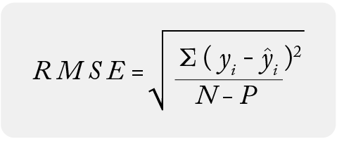

## Table of Contents

## What is Root Mean Squared Error (RMSE) in the context of machine learning?

Root Mean Squared Error, often called RMSE, is a way to measure how well a machine learning model predicts outcomes. It does this by calculating the average difference between the numbers the model predicts and the actual numbers. The smaller the RMSE, the better the model is at predicting. RMSE is especially useful when you want to know how far off the model's predictions are, on average, in the same units as the data.

To calculate RMSE, you first find the difference between each predicted value and the actual value, square these differences, and then find the average of these squared differences. After that, you take the square root of this average. This is shown in the formula $$ \text{RMSE} = \sqrt{\frac{1}{n} \sum_{i=1}^{n} (y_i - \hat{y}_i)^2} $$, where $y_i$ is the actual value, $\hat{y}_i$ is the predicted value, and $n$ is the number of observations. Squaring the differences makes sure that errors in both directions (too high or too low) are treated the same, and taking the square root at the end brings the error back to the original units of the data.

## How is RMSE calculated?

To calculate the Root Mean Squared Error (RMSE), you start by finding the difference between each prediction your model makes and the actual value. Then, you square each of these differences. Squaring the differences makes sure that both overestimates and underestimates are treated the same way, and it also makes the errors positive. After squaring, you add up all these squared differences and divide by the total number of predictions to find the average of the squared errors.

Once you have the average of the squared errors, you take the square root of this average. This step is important because it brings the error back to the same units as your original data. The formula for RMSE looks like this: $$ \text{RMSE} = \sqrt{\frac{1}{n} \sum_{i=1}^{n} (y_i - \hat{y}_i)^2} $$, where $y_i$ is the actual value, $\hat{y}_i$ is the predicted value, and $n$ is the number of observations. The smaller the RMSE, the better your model is at predicting the outcomes.

## Why is RMSE important in evaluating machine learning models?

RMSE, or Root Mean Squared Error, is a key measure for checking how good a [machine learning](/wiki/machine-learning) model is at predicting things. It tells you, on average, how far off the model's guesses are from the actual numbers. This is helpful because it gives you a single number that shows how well the model is doing overall. A smaller RMSE means the model's predictions are closer to the real values, which is what you want in a good model. 

In simple terms, RMSE helps you see if your model is making big mistakes or small ones. It's especially useful when the errors matter a lot, like in predicting house prices or medical outcomes. By using the formula $$ \text{RMSE} = \sqrt{\frac{1}{n} \sum_{i=1}^{n} (y_i - \hat{y}_i)^2} $$, you can easily compare different models to see which one is better at making accurate predictions. This makes RMSE a popular choice for people working on machine learning projects.

## Can you explain the difference between RMSE and other error metrics like MAE and MSE?

RMSE, MAE, and MSE are all ways to measure how well a model's guesses match the real numbers, but they do it a bit differently. RMSE stands for Root Mean Squared Error. It works by finding the difference between each guess and the real number, squaring those differences, averaging them, and then taking the square root of that average. The formula for RMSE is $$ \text{RMSE} = \sqrt{\frac{1}{n} \sum_{i=1}^{n} (y_i - \hat{y}_i)^2} $$. This means RMSE gives more weight to bigger mistakes because of the squaring part. It's useful when you want to know the average size of the errors in the same units as your data.

MAE, or Mean Absolute Error, is simpler. It just takes the absolute difference between each guess and the real number, then averages those differences. The formula for MAE is $$ \text{MAE} = \frac{1}{n} \sum_{i=1}^{n} |y_i - \hat{y}_i| $$. Since MAE doesn't square the errors, it treats all errors the same, no matter how big or small they are. This makes MAE a good choice when you want to know the average error without giving more importance to larger errors.

MSE, or Mean Squared Error, is similar to RMSE but doesn't take the square root at the end. The formula for MSE is $$ \text{MSE} = \frac{1}{n} \sum_{i=1}^{n} (y_i - \hat{y}_i)^2 $$. Like RMSE, MSE squares the errors, so it also gives more weight to bigger mistakes. But because it doesn't take the square root, MSE is in squared units, which can make it harder to understand in the context of your original data. RMSE and MSE are both useful when you want to penalize larger errors more, but RMSE is often preferred because it's in the same units as your data.

## What are the advantages of using RMSE over other metrics?

RMSE, or Root Mean Squared Error, is great because it gives you an idea of how big the errors are in the same units as your data. When you use the formula $$ \text{RMSE} = \sqrt{\frac{1}{n} \sum_{i=1}^{n} (y_i - \hat{y}_i)^2} $$, you see that RMSE squares the errors before averaging them and then takes the square root. This means bigger mistakes have a bigger effect on the final number, which can be helpful if you want to focus on avoiding large errors. Also, since RMSE is in the same units as your data, it's easy to understand and explain to others.

Another good thing about RMSE is that it's widely used and understood in many fields, making it easy to compare different models or studies. Unlike Mean Absolute Error (MAE), which treats all errors the same, RMSE highlights bigger errors more. And unlike Mean Squared Error (MSE), which stays in squared units, RMSE goes back to the original units, making it more straightforward to interpret. So, if you want a single number that shows how well your model is doing and puts more weight on bigger mistakes, RMSE is a solid choice.

## What are the limitations or disadvantages of RMSE?

One big downside of RMSE is that it can be heavily affected by big errors. Because RMSE uses the formula $$ \text{RMSE} = \sqrt{\frac{1}{n} \sum_{i=1}^{n} (y_i - \hat{y}_i)^2} $$, any really big mistake gets squared, making it even bigger. This can make RMSE a bit unfair if you have just a few very large errors, because those can make the whole RMSE number go up a lot, even if most of your predictions are pretty good. So, if your data has some big outliers, RMSE might make your model look worse than it really is.

Another problem with RMSE is that it can be hard to explain to people who aren't used to it. Even though RMSE is in the same units as your data, the way it's calculated can be confusing. People might not get why you square the errors and then take the square root. This can make it tough to communicate how good your model is to others, especially if they're not familiar with the math behind it. So, while RMSE is a powerful tool, it might not be the best choice if you need to explain your results to a wider audience.

## How does RMSE handle outliers compared to other metrics?

RMSE, or Root Mean Squared Error, can be heavily influenced by outliers. This is because RMSE uses the formula $$ \text{RMSE} = \sqrt{\frac{1}{n} \sum_{i=1}^{n} (y_i - \hat{y}_i)^2} $$. When there's a big error, it gets squared, making it even bigger. So, if your data has some really big outliers, those can make your RMSE go up a lot, even if most of your predictions are pretty good. This means RMSE might make your model look worse than it really is because it's so sensitive to those big errors.

On the other hand, other metrics like Mean Absolute Error (MAE) handle outliers differently. MAE uses the formula $$ \text{MAE} = \frac{1}{n} \sum_{i=1}^{n} |y_i - \hat{y}_i| $$. It doesn't square the errors, so it treats all errors the same, no matter how big or small they are. This means MAE is less affected by outliers because it doesn't give them extra weight like RMSE does. So, if your data has some big outliers, MAE might be a better choice because it won't be thrown off as much by those big errors.

## In what scenarios is RMSE particularly useful or preferred?

RMSE, or Root Mean Squared Error, is really helpful when you want to know how big the mistakes your model is making are. It's especially good when you want to pay more attention to bigger mistakes. If you're working on something where big errors can cause big problems, like predicting how much medicine someone needs or guessing how much a house will sell for, RMSE is a great choice. It uses the formula $$ \text{RMSE} = \sqrt{\frac{1}{n} \sum_{i=1}^{n} (y_i - \hat{y}_i)^2} $$ to make sure that big errors get more attention, which can help you make your model better by focusing on those big errors.

RMSE is also useful when you need to compare different models to see which one is better. Since RMSE is in the same units as your data, it's easy to understand and compare. If you're working in a field where RMSE is commonly used, like in weather forecasting or stock market predictions, it's a good choice because everyone will know what it means. So, if you want a single number that shows how well your model is doing and puts more weight on bigger mistakes, RMSE is a solid choice.

## How can RMSE be interpreted in terms of model performance?

RMSE, or Root Mean Squared Error, is a way to see how well your model is doing at guessing things. It tells you, on average, how far off your model's guesses are from the real numbers. The smaller the RMSE, the better your model is at making predictions. RMSE is calculated using the formula $$ \text{RMSE} = \sqrt{\frac{1}{n} \sum_{i=1}^{n} (y_i - \hat{y}_i)^2} $$. This means that if your RMSE is small, your model is pretty good at predicting things, but if it's big, your model might need some work.

When you're trying to understand how well your model is doing, RMSE can help you focus on the bigger mistakes. Because RMSE squares the errors before averaging them, big errors have a bigger effect on the final number. This is useful if you're working on something where big errors can cause big problems, like predicting how much medicine someone needs or guessing how much a house will sell for. So, RMSE not only tells you how well your model is doing overall but also helps you see where your model might be making the biggest mistakes.

## What steps can be taken to minimize RMSE in a machine learning model?

To minimize RMSE in a machine learning model, you first need to make sure you're using the right type of model for your data. If you're trying to predict house prices, for example, a model like a regression might work better than a classification model. Once you've picked a good model, you can start tweaking it. This means adjusting things like the model's settings or the features you're using to make predictions. You can also try using different algorithms or combining several models together to see if that helps lower the RMSE.

Another important step is to keep checking and improving your model. You can do this by using a technique called cross-validation, where you split your data into different parts and test your model on each part to see how it does. If your model is doing worse on some parts of the data, you might need to collect more data or find a way to handle those parts better. You can also use the formula $$ \text{RMSE} = \sqrt{\frac{1}{n} \sum_{i=1}^{n} (y_i - \hat{y}_i)^2} $$ to keep track of how your changes are affecting the RMSE. The smaller the RMSE gets, the better your model is at making predictions.

## How does the scale of the target variable affect RMSE?

The scale of the target variable has a big impact on RMSE. If your target variable is measured in big numbers, like house prices in thousands of dollars, the RMSE will also be a big number. This is because RMSE uses the formula $$ \text{RMSE} = \sqrt{\frac{1}{n} \sum_{i=1}^{n} (y_i - \hat{y}_i)^2} $$, which means it's sensitive to the size of the errors. So, if your target numbers are big, even small mistakes can make the RMSE look big.

On the other hand, if your target variable is measured in smaller numbers, like temperatures in degrees Celsius, the RMSE will be smaller too. This makes it easier to understand what a "good" RMSE looks like for your specific problem. When comparing RMSE across different models or datasets, it's important to keep in mind that the scale of the target variable can make the RMSE numbers look very different, even if the models are doing a similar job at predicting things.

## Can you discuss any advanced techniques or modifications to RMSE used in specific machine learning applications?

In some advanced machine learning applications, people tweak RMSE to fit their specific needs better. One common tweak is using a weighted RMSE, where some errors count more than others. This is useful if certain mistakes are more important in your problem. For example, if you're predicting how much medicine someone needs, being off by a little bit could be really bad, so you might want to weigh those errors more heavily. The formula for weighted RMSE could look like $$ \text{WRMSE} = \sqrt{\frac{\sum_{i=1}^{n} w_i (y_i - \hat{y}_i)^2}{\sum_{i=1}^{n} w_i}} $$, where $w_i$ are the weights you choose for each error.

Another advanced technique is using RMSE in combination with other metrics to get a fuller picture of how well your model is doing. For instance, you might use RMSE along with Mean Absolute Error (MAE) or R-squared to understand both the size of the errors and how well your model fits the data overall. This is especially helpful in fields like finance or healthcare, where understanding the model's performance from different angles is crucial. By looking at RMSE together with other metrics, you can make better decisions about how to improve your model and where it's doing well or not so well.