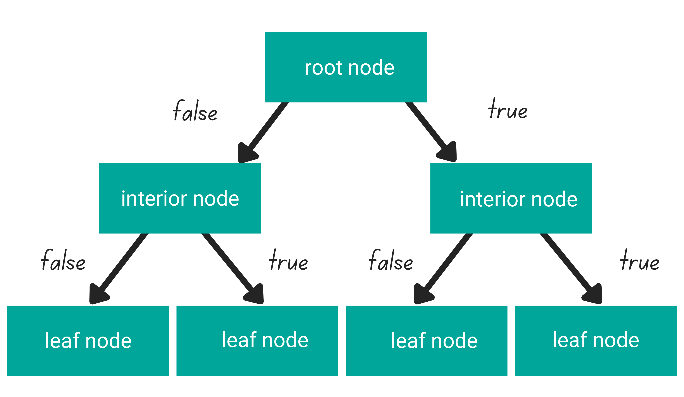

## Table of Contents

## What is Root in the context of machine learning?

In the context of machine learning, "Root" often refers to the starting point of a decision tree. A decision tree is a type of algorithm used in machine learning to make decisions based on data. The root of the tree is the first node, which represents the entire dataset before any splits are made. From the root, the data is divided into branches based on certain conditions, helping the algorithm to classify or predict outcomes. The root node is crucial because it sets the stage for how the data will be split and analyzed further down the tree.

Another use of "Root" in machine learning is in the context of error metrics, specifically the Root Mean Square Error (RMSE). RMSE is a commonly used measure to evaluate the performance of a model by calculating the average magnitude of the errors in a set of predictions. It does this by taking the square root of the average of the squared differences between predicted and actual values. This metric is useful because it gives a sense of the average error in the same units as the response variable, making it easier to interpret. The formula for RMSE is $$ \text{RMSE} = \sqrt{\frac{1}{n} \sum_{i=1}^{n} (y_i - \hat{y}_i)^2} $$, where $y_i$ are the observed values, $\hat{y}_i$ are the predicted values, and $n$ is the number of observations.

## How does Root differ from other machine learning platforms?

Root is not a machine learning platform like TensorFlow, PyTorch, or scikit-learn. Instead, Root is a data analysis framework primarily used in high-energy physics. It's designed to handle large datasets and perform complex statistical analyses, which can be useful in machine learning tasks but is not specifically built for machine learning. Root provides tools for data visualization, statistical analysis, and even some basic machine learning capabilities, but it lacks the extensive machine learning libraries and pre-built models that platforms like TensorFlow offer.

In contrast, [machine learning](/wiki/machine-learning) platforms like TensorFlow and PyTorch are designed with a focus on developing, training, and deploying machine learning models. These platforms come with a wide range of tools and libraries specifically tailored for tasks such as [neural network](/wiki/neural-network) construction, [deep learning](/wiki/deep-learning), and model optimization. For example, TensorFlow includes Keras, a high-level API that makes it easy to build and train models. PyTorch, on the other hand, is known for its dynamic computation graphs, which allow for more flexible model architectures. These platforms are more directly applicable to machine learning tasks than Root, which is more of a general-purpose data analysis tool.

## What are the basic components of Root's machine learning system?

Root's machine learning system includes a few basic components that help with data analysis and model building. The first component is TMVA, which stands for Toolkit for Multivariate Data Analysis. TMVA is a package within Root that provides tools for machine learning tasks like classification and regression. It includes methods like decision trees, neural networks, and support vector machines. Users can train these models on their data and then use them to make predictions.

Another important component is the ROOT framework itself, which offers functionalities for data handling and visualization. Root can read and write data in various formats, making it easier to manage large datasets. It also includes libraries for plotting and statistical analysis, which are useful when evaluating the performance of machine learning models. For example, you can use Root to create histograms and graphs to visualize how well your model is doing.

Overall, while Root is not a dedicated machine learning platform like TensorFlow or PyTorch, it does provide some basic tools for machine learning through TMVA and its data handling capabilities. These components together allow users to perform data analysis and machine learning tasks within the same environment, which can be convenient for certain applications, especially in fields like high-energy physics.

## Can you explain the process of setting up a simple machine learning model using Root?

To set up a simple machine learning model using Root, you first need to prepare your data. This means you should have your data ready in a format that Root can read, like a ROOT file or a CSV file. Once your data is ready, you can use Root's TMVA package to start building your model. TMVA stands for Toolkit for Multivariate Data Analysis, and it's the part of Root that helps with machine learning. You'll need to create a ROOT macro, which is a script that tells Root what to do. In this macro, you'll load your data, set up the variables you want to use for training, and decide which type of machine learning method you want to use, like a decision tree or a neural network.

After setting up your data and choosing your method, you can train your model. In your ROOT macro, you'll write commands to tell TMVA to train the model using your data. For example, if you're using a decision tree, you'll specify parameters like the maximum depth of the tree. Once the training is done, TMVA will give you a model that you can use to make predictions. You can then test your model on a different set of data to see how well it performs. Root provides tools to help you visualize the results, like plotting the accuracy of your model or showing how the decision tree splits the data. This way, you can see if your model is working well and make adjustments if needed.

## What types of algorithms does Root support for machine learning?

Root supports a variety of machine learning algorithms through its TMVA package. Some of the algorithms you can use include decision trees, which are like flowcharts that help the computer make decisions based on data. Another type is neural networks, which try to mimic how the human brain works to learn from data. Root also supports support vector machines, which are good at finding boundaries between different groups of data. You can also use methods like k-nearest neighbors, which look at the closest data points to make predictions, and boosting, which combines many weak models to make a strong one.

To use these algorithms in Root, you'll need to write a ROOT macro. This is a script that tells Root what to do. In your macro, you'll load your data, set up the variables you want to use for training, and choose the algorithm you want to use. For example, if you're using a decision tree, you might set parameters like the maximum depth of the tree. Once you've set everything up, you can train your model and then use it to make predictions. Root also has tools to help you see how well your model is doing, like plotting the accuracy or showing how the decision tree splits the data. This way, you can make adjustments to improve your model.

## How does Root handle data preprocessing and feature engineering?

Root helps with data preprocessing and feature engineering through its built-in functions and libraries. You can use Root to read data from different file formats like CSV or ROOT files. Once your data is loaded, Root has tools to clean it up. For example, you can remove missing values or outliers. Root also lets you transform your data, like scaling it so all your numbers are between 0 and 1. This is important because it helps different features contribute equally to your model. You can do this using simple commands in a ROOT macro.

Feature engineering in Root involves creating new variables from your existing data. For example, if you have the length and width of an object, you might want to create a new variable for the area by multiplying them together. Root makes this easy because you can write simple formulas in your ROOT macro to create these new features. Once you have your new features, you can use them in your machine learning models. Root's TMVA package can then use these preprocessed and engineered features to train and test your models, helping you get better results.

## What are the best practices for optimizing models in Root?

When optimizing models in Root, it's important to start by choosing the right algorithm for your data. Root's TMVA package offers many options like decision trees, neural networks, and support vector machines. Each has different strengths, so try a few to see which works best for your problem. Once you pick an algorithm, you can adjust its parameters to improve performance. For example, with a decision tree, you might change the maximum depth to control how complex the tree can get. You can do this by writing commands in your ROOT macro like `factory.BookMethod(dataloader, TMVA.Types.kBDT, "BDT", "!H:!V:NTrees=850:nEventsMin=150:MaxDepth=3:BoostType=AdaBoost:AdaBoostBeta=0.5:UseBaggedBoost:BaggedSampleFraction=0.5:SeparationType=GiniIndex:nCuts=20")`. This command sets up a boosted decision tree with specific parameters.

After setting up your model, you should use Root's tools to evaluate how well it's doing. You can split your data into training and testing sets to see if your model works well on new data it hasn't seen before. Root can create plots to show you the accuracy of your model or how well it separates different groups of data. If your model isn't performing well, you might need to go back and change your preprocessing steps, like scaling your data differently or creating new features. You can also try different ways of splitting your data or using different algorithms to see if you can get better results. Keep experimenting and adjusting until you find the best way to make your model work well.

## How can Root be integrated with existing data pipelines and systems?

Root can be integrated with existing data pipelines and systems by using its ability to read and write various file formats. For example, if your data pipeline produces CSV files, you can easily load these into Root using simple commands in a ROOT macro. Once the data is in Root, you can preprocess it, engineer new features, and train machine learning models using TMVA. After training, you can save your models and results back into formats like CSV or ROOT files, which can then be used by other parts of your data pipeline. This makes Root a flexible tool that can fit into many different data workflows.

To make integration smoother, you can also use Root's scripting capabilities to automate tasks. You can write ROOT macros that automatically load data from your pipeline, run the necessary preprocessing and machine learning steps, and then output the results in a format that your system can use. For example, you might have a script that runs every night to process new data and update your models. By using Root's command-line interface, you can even integrate these scripts into larger automation systems, making it easier to keep everything running smoothly and efficiently.

## What advanced features does Root offer for deep learning and neural networks?

Root offers advanced features for deep learning and neural networks through its TMVA package. TMVA includes a method called Deep Neural Network (DNN), which allows you to build and train neural networks. You can set up different types of layers, like fully connected layers, convolutional layers, and recurrent layers. This means you can create complex neural network architectures to solve your problems. Root also supports different training algorithms, like stochastic gradient descent, to help your neural network learn from the data. You can adjust many parameters to fine-tune how your network learns, making it more powerful and accurate.

To use these advanced features, you'll write a ROOT macro. In your macro, you'll load your data and set up your neural network using commands like `factory.BookMethod(dataloader, TMVA.Types.kDL, "DL_CPU", "!H:!V:Layout=TANH|128,TANH|128,TANH|128,LINEAR:ErrorStrategy=CROSSENTROPY:WeightInitialization=XAVIERUNIFORM:Architecture=CPU:Optimizer=ADAM:LearningRate=1e-3:Momentum=0.9:Regularization=L2:BatchSize=128:TestRepetitions=1:MaxEpochs=30"`. This command sets up a deep neural network with specific layers and training parameters. Once your network is trained, Root provides tools to evaluate its performance. You can create plots to see how well your network is doing and make changes to improve it. This way, Root helps you build and optimize advanced deep learning models within its environment.

## How does Root manage model versioning and deployment?

Root doesn't have built-in tools for model versioning and deployment like some other machine learning platforms. Instead, you can use Root to save your trained models and results in various file formats, like ROOT files or CSV files. This means you can keep different versions of your models by saving them with different names or in different folders. For example, after training a model, you can save it using a command like `factory.TrainAllMethods()`. Then, you can save the results and the model itself to a file using `outputFile = TFile.Open("myModel.root", "RECREATE"); factory.WriteOutputTrees(outputFile);`. By keeping track of these files, you can manage different versions of your models.

For deployment, Root doesn't have a direct way to deploy models to production environments. However, you can use the saved models to make predictions on new data. You can load your saved model into a ROOT macro and use it to predict outcomes. For example, if you want to use a model to classify new data, you can load the model and run `reader = TMVA::Reader("Color"); reader.AddSpectator("var1", &var1); reader.BookMVA("BDT method", "myModel.root");`. This way, you can integrate Root's models into your existing systems by writing scripts that load the models and use them for predictions.

## What are some common challenges faced when using Root for machine learning, and how can they be addressed?

One common challenge when using Root for machine learning is that it's not designed specifically for machine learning like platforms such as TensorFlow or PyTorch. Root is primarily a tool for high-energy physics and data analysis, so it might not have all the features you need for more advanced machine learning tasks. For example, if you want to use complex neural network architectures or need to deploy your models to production, you might find Root's capabilities limited. To address this, you can use Root for data preprocessing and initial model training, then export your data and models to other platforms for more advanced work. You can save your data and models in formats like CSV or ROOT files, then load them into other tools for further analysis and deployment.

Another challenge is managing model versioning and deployment. Root doesn't have built-in tools for these tasks, which can make it harder to keep track of different versions of your models or to use them in production environments. To overcome this, you can manually save different versions of your models by using different file names or folders. For deployment, you can write scripts in Root to load your saved models and use them to make predictions on new data. For example, after training a model, you can save it using ```outputFile = TFile.Open("myModel.root", "RECREATE"); factory.WriteOutputTrees(outputFile);```. Then, to use the model for predictions, you can load it with ```reader = TMVA::Reader("Color"); reader.AddSpectator("var1", &var1); reader.BookMVA("BDT method", "myModel.root");```. This way, you can integrate Root's models into your existing systems.

## Can you discuss any case studies or real-world applications where Root has been successfully implemented?

Root has been successfully used in the field of high-energy physics, particularly at the Large Hadron Collider (LHC) at CERN. Scientists use Root to analyze massive amounts of data from particle collisions. For example, the ATLAS and CMS experiments at the LHC used Root to help discover the Higgs boson in 2012. They processed billions of collision events, searching for patterns that would indicate the presence of the Higgs particle. Root's ability to handle large datasets and perform complex statistical analyses made it an essential tool for this groundbreaking discovery. Researchers could use Root to create histograms and other visualizations to understand the data better and make accurate predictions about the Higgs boson.

Another real-world application of Root is in medical imaging, specifically in the analysis of positron emission tomography (PET) scans. Researchers at the University of California, Los Angeles (UCLA) used Root to process and analyze PET scan data to study brain function. They used Root's TMVA package to build machine learning models that could identify patterns in brain activity associated with different diseases. By training these models on large datasets, the researchers were able to improve the accuracy of their diagnoses. Root's flexibility in handling different data formats and its powerful data analysis tools made it a valuable asset in this medical research.

## References & Further Reading

[1]: Brun, R., & Rademakers, F. (1997). ["ROOT - An Object-Oriented Data Analysis Framework."](https://www.sciencedirect.com/science/article/pii/S016890029700048X) Proceedings AIHENP'96 Workshop, Lausanne, Sep. 1996, Nuclear Instruments and Methods in Physics Research Section A: Accelerators, Spectrometers, Detectors and Associated Equipment.

[2]: Speckmayer, P., et al. (2010). ["The Toolkit for Multivariate Data Analysis (TMVA) 4."](https://s3.cern.ch/inspire-prod-files-3/3b3181e8e642676dff8b977db04c49ee) arXiv preprint arXiv:1009.6195.

[3]: Antcheva, I., et al. (2009). ["ROOT — A C++ framework for petabyte data storage, statistical analysis and visualization."](https://arxiv.org/abs/1508.07749) Computer Physics Communications.

[4]: CERN. ["Machine Learning with Root."](https://root.cern/manual/tmva/) Accessed from the official CERN ROOT framework website.

[5]: Adam-Bourdarios, C., Cowan, G., Germain, C., Guyon, I., Keeble, O., & Rousseau, D. (2015). ["The Higgs boson machine learning challenge."](https://dl.acm.org/doi/10.5555/2996850.2996852) Journal of Physics: Conference Series. 

[6]: Helbig, M. & Smith, A. (2012). ["Using ROOT in Medical Imaging."](https://onlinelibrary.wiley.com/doi/full/10.1111/epi.14193) IEEE Nuclear Science Symposium.

[7]: ["A Practical Guide to Data Analysis for Physical Science Students"](https://www.cambridge.org/core/books/practical-guide-to-data-analysis-for-physical-science-students/D9D915456E317B613E5256CABEBD4BC0) by Louis Lyons

[8]: Abazov, V. M., et al. (2012). ["Evidence for the Higgs boson in the context of the standard model with the use of 10 fb?1 of ppˉ collision data."](https://arxiv.org/html/2501.14021v2) Physical Review Letters.