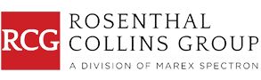

Rosenthal Collins Group LLC (RCG), established as a leading entity in the commodities trading industry, is renowned for its comprehensive array of financial services and state-of-the-art trading platforms. With its roots deeply embedded in the tradition of futures trading, RCG has evolved to meet the complex demands of modern markets, providing solutions that accommodate both institutional and individual traders. The company's services are meticulously tailored to enhance the trading experience by leveraging algorithmic tools, which ensure accuracy and efficiency in trade execution.

RCG plays a critical role in the commodities market by integrating cutting-edge technology with human expertise. This synthesis not only amplifies the effectiveness of trading strategies but also significantly elevates trading outcomes. The firm’s platforms support high-frequency trading and algorithmic enhancements, providing traders with opportunities to harness advanced data analytics and real-time market insights.

Operating on a global scale, RCG’s influence extends across various market segments, marking its significance in the global trading landscape. The company is synonymous with innovation, offering a dynamic environment that fosters operational excellence. As commodity markets become increasingly technologically driven, RCG's proactive approach and robust infrastructure continue to uphold its reputation as a reliable partner in trading. Constant innovation and a deep commitment to regulatory compliance underscore RCG's mission to advance the commodities trading ecosystem while maintaining the highest standards of integrity and security.

By combining innovative technological solutions with a strong foundation in traditional finance, Rosenthal Collins Group positions itself as a pivotal force in modern trading environments, furthering the evolution of commodities trading.

## Table of Contents

## Historical Background of Rosenthal Collins Group

Founded in 1923, Rosenthal Collins Group LLC (RCG) boasts a rich history that dates back to the formation of Greene and Collins. Its origins are steeped in the pioneering efforts of early 20th-century financial markets, setting the groundwork for what would become a prominent force in the commodities trading sector. The firm took a significant step forward in 1988 when Collins Commodities merged with Rosenthal & Co., a strategic collaboration that set the stage for future growth and innovation. This merger marked the inception of RCG as a combined entity, propelling it to greater heights in financial services and commodities trading.

Throughout its history, RCG has demonstrated remarkable adaptability, evolving with industry changes and technological advancements. The firm's journey reflects an ongoing commitment to leveraging new technologies and methodologies to meet the demands of a dynamic market environment. This evolution has etched RCG's legacy as a leader in futures trading, where it has consistently sought to innovate and participate actively in exchange markets.

A pivotal development in RCG's timeline occurred in 2019 when it was acquired by Marex Spectron, a global commodities brokerage firm. This acquisition provided RCG with enhanced resources and a broader platform to strengthen its market position and expand its service offerings. The integration into Marex Spectron's operations enabled RCG to access a wider range of global markets and leverage new technological capabilities, reinforcing its standing in the competitive landscape.

RCG's history is synonymous with a tradition of innovation in futures trading. The company has played an integral role in shaping market strategies and technologies that are now standard in the industry. Its active participation in exchanges has solidified its presence and influence, contributing significantly to the evolution of trading practices. By integrating its historical foundations with cutting-edge advancements, RCG continues to be a crucial player in commodities trading, guided by a legacy of excellence and forward-thinking strategies.

## Comprehensive Financial Services

Rosenthal Collins Group LLC (RCG) provides an extensive range of financial services, including trading execution, clearing, and brokerage, catering to diverse market participants. RCG's offerings encompass both futures and options on futures, available across prominent U.S. and global exchanges. This enables clients to participate in a variety of markets, enhancing trading opportunities and optimizing investment strategies.

RCG serves a wide array of customers, which include introducing brokers, commodity trading advisors, and hedge funds. This diverse clientele benefits from RCG's comprehensive service offerings and market reach, allowing them to effectively manage their trading and investment portfolios. By providing access to global markets, RCG equips institutional, commercial, and individual traders with the tools necessary for robust trading solutions. Their services are designed to meet the specific needs of each client, ensuring flexibility and precision in trade execution.

The firm's specialized managed futures services represent a significant component of their offerings. These services allow clients to engage in futures markets with professional management, thereby leveraging expert strategies to optimize returns while managing risk. Additionally, RCG's institutional foreign exchange ([FX](/wiki/fx-anomaly)) capabilities offer clients the option to trade in global currency markets. This feature enhances the firm's competitive edge, providing traders the means to diversify their portfolios and hedge against currency fluctuations.

RCG's financial services are built on a foundation of technological integration, ensuring efficient and seamless operations. Through their advanced platforms and strategic market access, RCG supports the effective implementation of complex trading strategies, maximizing the potential for profitability in increasingly competitive markets.

## Technological Innovations and Algo Trading

Rosenthal Collins Group (RCG) leads the futures industry with its technological innovations, offering an array of advanced trading platforms, including the renowned RCG Onyx Plus. These platforms embody cutting-edge technology designed to facilitate high-frequency trading ([HFT](/wiki/high-frequency-trading-strategies)), enabling traders to capitalize on market opportunities with speed and precision. At the core of RCG's technology strategy is the emphasis on [algorithmic trading](/wiki/algorithmic-trading), which significantly enhances the firm's service offerings. 

Algorithmic trading tools provided by RCG allow institutional clients to deploy customized strategies efficiently. This customization capability is crucial for institutions that require tailored solutions to meet specific trading objectives and market conditions. The platforms' ability to accommodate these demands empowers clients to execute trades with minimal latency, maximizing the potential for profit while minimizing risk.

RCG incorporates both proprietary and third-party platforms that offer essential features like real-time data feeds, one-click trading, and advanced charting options. Real-time data is vital for traders in making informed, timely decisions, while advanced charting provides visual analytics crucial for technical analysis. These features collectively enhance the decision-making process, affording traders deeper insights into market dynamics.

The robustness of RCG's IT infrastructure underscores its capacity to support high-speed trading. By co-locating their data center with exchanges, RCG ensures latency is minimized, providing traders with a competitive edge in rapidly changing markets. This strategic infrastructure positioning means trades can be executed with exceptional speed and reliability, a non-negotiable requirement for success in high-frequency trading environments.

Moreover, RCG's commitment to technological advancement extends to maintaining extensive collaboration with industry leaders and continuous updates to its systems. This proactive approach ensures the firm's technology remains cutting edge, sustaining its competitive advantage and delivering superior service to its clients worldwide.

## Regulation and Compliance

Rosenthal Collins Group (RCG) operates under stringent regulatory oversight from regulatory bodies such as the Commodity Futures Trading Commission (CFTC) and the National Futures Association (NFA). These organizations are pivotal in establishing standards and practices that ensure market integrity, protect stakeholders, and support transparency in trading operations. RCG's adherence to these regulations underlines their commitment to maintaining a high standard of conduct in the financial services industry, fostering a secure trading environment that enhances trust among traders.

The acquisition of RCG by Marex Spectron in 2019 necessitated a strategic review and enhancement of RCG’s compliance frameworks to meet Marex Spectron’s global standards. This augmentation of compliance measures reflects RCG's dedication to aligning with heightened regulatory expectations and international best practices, reinforcing their reputation for reliability and integrity in trading processes.

RCG's robust compliance structure extends beyond mere regulatory adherence to encompass comprehensive management of customer funds and transaction integrity. This includes meticulous monitoring and reporting mechanisms designed to protect client investments while ensuring fastidious execution and clearing procedures. By prioritizing these elements, RCG solidifies its role as a trustworthy intermediary in the complex landscape of commodities trading.

The firm's regulation credentials are a testament to their longstanding commitment to ethical trading practices, which not only sculpt regulatory compliance but significantly instill confidence in their clientele worldwide. Consequently, RCG safeguards its operational ecosystem, ensuring that traders operate within a secure and transparently monitored market.

## Rising Importance of Algorithmic Trading in Commodities

Algorithmic trading has significantly reshaped the commodities market by improving the speed, efficiency, and accuracy of trade executions. This transformation is largely attributed to the advanced algorithmic trading tools, such as those provided by Rosenthal Collins Group (RCG). RCG's suite of trading tools delivers substantial competitive advantages, enabling traders to perform comprehensive market analyses and execute trades with greater precision.

Traders using RCG platforms can craft and implement sophisticated trading strategies that minimize latency—a crucial [factor](/wiki/factor-investing) in fast-paced trading environments. This capability is particularly vital given the increasing complexity of commodity markets, which requires advanced technological solutions like RCG's platforms for effective navigation and decision-making.

RCG's strong emphasis on technology ensures that their platforms are continually adapted to support the evolving needs of traders, particularly those engaged in high-[volume](/wiki/volume-trading-strategy) trading activities. Through these platforms, RCG offers features that support complex algorithmic strategies by providing real-time market data, automated trade executions, and risk management tools.

The role of algorithmic trading in commodities is underscored by the necessity for tools that can handle the intricacies of dynamic and volatile markets. By continuously upgrading their offerings, RCG ensures that traders are equipped with the necessary resources to maintain a competitive edge. This commitment to technology not only enhances the trading experience but also supports the strategic objectives of traders by promoting more informed and timely trading decisions. Through algorithmic tools, traders can exploit market inefficiencies and optimize their trading performance, securing greater returns and managing risks effectively.

## Conclusion

Rosenthal Collins Group (RCG) distinguishes itself within the competitive commodities trading sector through a strategic blend of innovation and tradition. This fusion has solidified its reputation as a leader, driven by an unwavering commitment to delivering premier financial services. RCG's integration of advanced technological solutions, particularly in algorithmic trading, ensures its clients are equipped with the necessary tools to navigate and succeed in modern markets. They offer a comprehensive suite of trading platforms and services that meet the varied needs of institutional to individual traders.

The company's dedication to maintaining rigorous compliance standards underscores its commitment to transparency and security, fostering a trading environment that global participants trust. By operating under stringent regulatory frameworks, RCG affirms its role as a reliable partner in the financial world.

Looking to the future, RCG is well-positioned to continue its trajectory of growth and innovation. Its forward-thinking approach and adaptive strategies are expected to significantly influence and shape the evolving landscape of commodities trading. As the market dynamics shift, RCG's focus on technological advancement and enhanced service delivery keeps it at the forefront of the industry, continually setting new benchmarks for operational excellence and customer satisfaction.

## References & Further Reading

[1]: Bergstra, J., Bardenet, R., Bengio, Y., & Kégl, B. (2011). ["Algorithms for Hyper-Parameter Optimization."](https://dl.acm.org/doi/10.5555/2986459.2986743) Advances in Neural Information Processing Systems 24.

[2]: ["Advances in Financial Machine Learning"](https://www.amazon.com/Advances-Financial-Machine-Learning-Marcos/dp/1119482089) by Marcos Lopez de Prado

[3]: ["Evidence-Based Technical Analysis: Applying the Scientific Method and Statistical Inference to Trading Signals"](https://www.amazon.com/Evidence-Based-Technical-Analysis-Scientific-Statistical/dp/0470008741) by David Aronson

[4]: ["Machine Learning for Algorithmic Trading"](https://github.com/stefan-jansen/machine-learning-for-trading) by Stefan Jansen

[5]: ["Quantitative Trading: How to Build Your Own Algorithmic Trading Business"](https://www.amazon.com/Quantitative-Trading-Build-Algorithmic-Business/dp/1119800064) by Ernest P. Chan