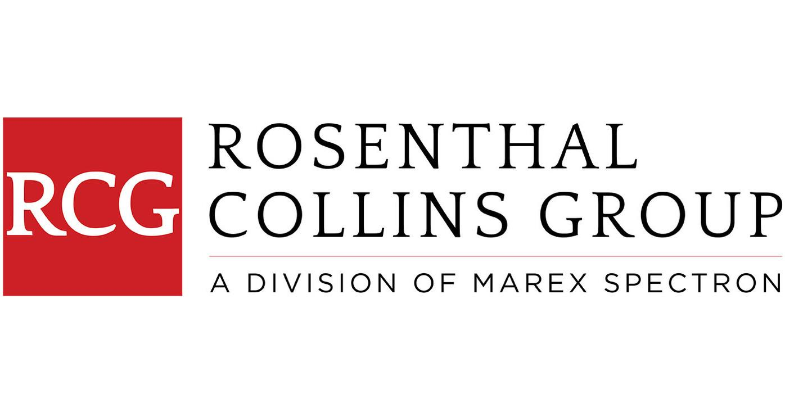

## Table of Contents

## What is Rosenthal Collins Group (RCG)?

Rosenthal Collins Group (RCG) is a company that helps people and businesses buy and sell things like stocks, futures, and other financial products. They are known for being a good place for people who want to trade in these markets. RCG works with clients all over the world and has been around for a long time, starting in 1923.

RCG is based in Chicago, but they have offices in many other places too. They offer different services to help their clients make smart choices about their money. This includes giving them information and tools to understand the markets better. RCG is also known for being trustworthy and following the rules that keep trading fair and safe.

## When was Rosenthal Collins Group founded?

Rosenthal Collins Group, or RCG, was founded in 1923. This means it started a long time ago, almost 100 years back. It was set up in Chicago, which is a big city in the United States.

Since then, RCG has grown a lot. It now helps people all over the world buy and sell things like stocks and futures. RCG is known for being a reliable place where people can trade safely and get good advice on their money choices.

## Who are the founders of Rosenthal Collins Group?

Rosenthal Collins Group, or RCG, was started by a man named Edwin Rosenthal and another man named William Collins. They began the company back in 1923. Both Edwin and William wanted to create a place where people could easily buy and sell things like stocks and futures.

Edwin Rosenthal and William Collins worked hard to make RCG successful. They believed in being honest and fair, which helped the company grow. Over time, their business became well-known and trusted by people all around the world who wanted to trade in financial markets.

## What types of services does RCG offer?

RCG helps people and businesses buy and sell things like stocks, futures, and other financial products. They provide a place where clients can trade easily and safely. RCG also gives advice to help clients make smart choices about their money. They have tools and information that can help people understand the markets better.

RCG works with clients all over the world. They have offices in many different places, but their main office is in Chicago. RCG is known for being trustworthy and following the rules that keep trading fair. They help people of all levels, from beginners to experts, to trade in the financial markets.

## In which countries does RCG operate?

RCG operates in many countries around the world. They have their main office in the United States, in the city of Chicago. RCG also has offices in other parts of the U.S., like New York and California. This helps them serve clients across the country easily.

Besides the U.S., RCG works in other countries too. They have offices in Canada, which is right next to the U.S. RCG also operates in Europe, with offices in places like the United Kingdom and Germany. This way, they can help clients in different time zones and regions.

RCG doesn't stop there; they also have a presence in Asia. They have offices in countries like Japan and Singapore. This helps them reach clients in the fast-growing markets of Asia. By being in so many places, RCG can offer their services to people all over the world.

## What are the key products provided by RCG?

RCG helps people trade in different financial products. They mainly focus on futures and options. Futures are agreements to buy or sell something at a set price in the future. Options give you the choice to buy or sell at a set price but you don't have to do it if you don't want to. RCG also deals with [forex](/wiki/forex-system), which is trading different currencies. They help clients buy and sell these products in a safe and easy way.

Besides trading, RCG offers tools and information to help clients make good choices. They have research reports and market analysis that can help people understand what's happening in the markets. RCG also gives advice on how to manage risk when trading. This can help clients protect their money and make smart decisions. By offering these services, RCG helps people of all levels, from beginners to experts, to trade in financial markets.

## How does RCG ensure the security of its clients' transactions?

RCG makes sure its clients' transactions are safe by following strict rules and using strong security measures. They use advanced technology to protect the information that clients share with them. This includes things like encryption, which keeps data safe when it's sent over the internet. RCG also has systems in place to watch for any strange activity that might be a sign of fraud or hacking. This helps them stop problems before they can hurt clients.

Another way RCG keeps transactions secure is by following the rules set by financial regulators. These rules are there to make sure trading is fair and safe for everyone. RCG works hard to meet these standards and often goes beyond what's required to keep clients' money and information safe. By doing this, RCG builds trust with its clients and helps them feel confident when they trade.

## What is the role of RCG in the futures and options market?

RCG plays a big role in the futures and options market by helping people buy and sell these products. They act like a middleman, making it easier for clients to trade. RCG gives clients a safe place to trade, where they can be sure their transactions are secure. They also offer tools and information that help clients understand the market better. This way, people can make smarter choices about when to buy or sell futures and options.

In addition to trading, RCG helps clients manage risk. They provide advice on how to protect money when trading in the futures and options market. This is important because these markets can be risky, and RCG wants to make sure clients know how to stay safe. By offering these services, RCG supports both new and experienced traders, helping them navigate the futures and options market with confidence.

## How has RCG adapted to technological advancements in trading?

RCG has kept up with new technology to make trading easier and safer for its clients. They use computers and the internet to let people trade from anywhere, not just in a special trading room. RCG has special software that helps clients see what's happening in the markets in real time. This means people can make quick decisions based on the latest information. They also use strong security measures like encryption to keep clients' information safe when they trade online.

Another way RCG has adapted is by using technology to give better advice and tools to clients. They have systems that can look at a lot of data very quickly and find patterns that might help people make better trading choices. RCG also uses technology to help clients manage risk better. This means they can suggest ways to protect money when trading. By using these new tools, RCG helps clients stay ahead in the fast-changing world of trading.

## What are some major milestones in the history of RCG?

RCG started in 1923 when Edwin Rosenthal and William Collins founded the company in Chicago. They wanted to create a place where people could easily trade stocks and futures. Over the years, RCG grew and became known for being honest and fair. They opened offices in other parts of the U.S., like New York and California, to serve more clients. RCG also started to work with people outside the U.S., opening offices in Canada, Europe, and Asia.

One big milestone for RCG was when they began using new technology to help clients trade. They created special software that let people see market changes in real time and trade from anywhere. This made trading easier and faster. Another important moment was when RCG started offering more services like risk management and market analysis. These tools helped clients make better decisions and protect their money. By adapting to new technology and offering more services, RCG has stayed a trusted name in trading for almost 100 years.

## Can you describe any significant partnerships or acquisitions involving RCG?

RCG has made some important partnerships and acquisitions over the years. One big partnership was with the Chicago Mercantile Exchange (CME). This helped RCG offer more trading options to their clients. RCG also worked with other big companies in the financial world to give better services. These partnerships helped RCG grow and serve more people around the world.

Another important move was when RCG bought other companies. For example, they acquired a company called FuturesOne in 2006. This helped RCG get more clients and offer more services. By buying other companies, RCG could become bigger and stronger in the trading world. These acquisitions showed that RCG was always looking for ways to improve and grow.

## What are the future growth strategies of RCG?

RCG plans to grow by using new technology to make trading easier for clients. They want to keep updating their software so people can trade from anywhere, even on their phones. RCG also wants to use new tools like [artificial intelligence](/wiki/ai-artificial-intelligence) to help clients make better trading decisions. By doing this, RCG hopes to attract more people who want to trade and help them do it in a safe and smart way.

Another part of RCG's growth plan is to open more offices around the world. They already have offices in many countries, but they want to be in even more places. This will help them serve clients in different time zones and regions better. RCG also wants to keep making new partnerships with other big companies in the financial world. These partnerships can help RCG offer more services and reach more people. By growing in these ways, RCG aims to stay a top choice for people who want to trade futures and options.

## References & Further Reading

[1]: Bergstra, J., Bardenet, R., Bengio, Y., & Kégl, B. (2011). ["Algorithms for Hyper-Parameter Optimization."](https://dl.acm.org/doi/10.5555/2986459.2986743) Advances in Neural Information Processing Systems 24.

[2]: ["Advances in Financial Machine Learning"](https://www.amazon.com/Advances-Financial-Machine-Learning-Marcos/dp/1119482089) by Marcos Lopez de Prado

[3]: ["Evidence-Based Technical Analysis: Applying the Scientific Method and Statistical Inference to Trading Signals"](https://www.amazon.com/Evidence-Based-Technical-Analysis-Scientific-Statistical/dp/0470008741) by David Aronson

[4]: ["Machine Learning for Algorithmic Trading"](https://github.com/stefan-jansen/machine-learning-for-trading) by Stefan Jansen

[5]: ["Quantitative Trading: How to Build Your Own Algorithmic Trading Business"](https://www.amazon.com/Quantitative-Trading-Build-Algorithmic-Business/dp/1119800064) by Ernest P. Chan