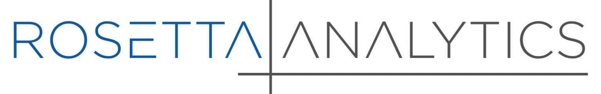

Algorithmic trading, often referred to as algo trading, represents a revolutionary approach in the financial markets, where computer systems execute trade orders at high velocities, empowered by mathematical models and complex algorithms. This method enhances the ability to manage large datasets, generate arbitrage opportunities, and apply quantitative strategies effectively, significantly contrasting with traditional manual trading. With its substantial impact, algorithmic trading now constitutes a major segment of trading activities across global exchanges, highlighting its importance in today's financial landscape.

Rosetta Analytics emerges as a key player in the algorithmic trading sector, offering state-of-the-art technology to facilitate sophisticated trading strategies. The company specializes in providing innovative solutions and leveraging cutting-edge technology to enhance trading precision and efficiency. By integrating advanced algorithms and real-time data analytics, Rosetta Analytics plays a crucial role in equipping traders with the tools necessary to stay competitive in rapidly evolving markets.

The benefits of adopting technology-driven solutions in trading are vast. They include improved speed and accuracy, reduced transaction costs, and minimized human errors. As the trading environment becomes increasingly complex, the utility of such solutions grows, enabling traders to operate more strategically and effectively.

This article aims to explore the services and features offered by Rosetta Analytics, emphasizing the advantages and capabilities their platform provides to both novice and experienced algo traders. An intriguing fact to note is that algorithmic trading accounted for about 60-73% of all U.S. equity trading by 2020, demonstrating its significant footprint in the market. This growth trajectory underscores the need for robust algorithmic solutions, such as those provided by Rosetta Analytics, to navigate the competitive trading landscape.

## Table of Contents

## What is Algorithmic Trading?

Algorithmic trading, often referred to as algo trading, involves the use of computer programs and algorithms to execute trade orders in financial markets. These algorithms can analyze a multitude of markets at once, allowing traders to make decisions in fractions of a second, far quicker than human capability.

The benefits of algorithmic trading are substantial compared to traditional trading methods. Firstly, speed is a major advantage. Algorithms can execute orders as soon as predefined conditions are met, often in milliseconds. This rapid execution is crucial in markets where opportunities can disappear just as quickly as they appear. Efficiency is another benefit, as algorithms can process and analyze large data sets much faster than humans, enabling more informed trading decisions. Accuracy is also enhanced because algorithms remove human error and emotional biases from the trading process.

Various strategies are utilized in [algorithmic trading](/wiki/algorithmic-trading), each with its unique approach to market dynamics. One common strategy is [arbitrage](/wiki/arbitrage), which takes advantage of price discrepancies between different markets. For example, if a stock is priced lower on one exchange than another, an algorithm can execute a simultaneous buy and sell order to profit from the difference. Trend following is another strategy, where algorithms identify and capitalize on market trends. This might include using moving averages to detect upward or downward trends and making trades based on that data.

Industry data highlights the growing prevalence and impact of algorithmic trading. Reports suggest that a significant majority of trades in the U.S. equity markets are executed using algorithms. According to marketsmedia.com, algo trading accounted for about 60-73% of all U.S. equity trading in recent years. The adoption of algorithmic trading continues to expand globally, driven by advancements in technology and increased competition among trading firms, underscoring its transformative effect on financial markets.

## An Introduction to Rosetta Analytics

Rosetta Analytics is a pivotal entity in the sophisticated world of algorithmic trading, known for its profound influence and innovative contributions. Established in the early 2000s by a group of financial technology enthusiasts, the company has consistently placed a strong emphasis on creating next-generation trading solutions. Their headquarters, located in a major financial hub, serves as a testament to their commitment to remaining at the forefront of financial innovation and technology.

Rosetta Analytics specializes in developing advanced algorithmic trading platforms that are designed to enhance trading efficiency and provide traders with a competitive edge. The company's expertise spans a wide range of trading strategies, with a particular focus on quantitative models that capitalize on market inefficiencies. By integrating [machine learning](/wiki/machine-learning) and [artificial intelligence](/wiki/ai-artificial-intelligence), Rosetta Analytics is able to offer predictive analytics tools that analyze vast amounts of market data in real time.

The vision of Rosetta Analytics is succinctly encapsulated in their mission statement: "To empower traders with cutting-edge technology that drives informed decision-making and maximizes market opportunities." This mission highlights their dedication to innovation and excellence in financial technology. They strive to be leaders in the algorithmic trading sector by continuously evolving their services to meet the changing needs of the financial markets.

Over the years, Rosetta Analytics has achieved several noteworthy milestones that underscore its credibility and reputation in the industry. One of their significant accomplishments includes the development of proprietary trading algorithms that have consistently delivered superior performance compared to traditional methods. These algorithms utilize advanced statistical techniques and machine learning models to optimize trading strategies, thereby reducing risks and increasing returns for their users.

The company's contributions to the financial technology landscape have not gone unnoticed. Rosetta Analytics has been recognized through various industry awards for its innovation and impact on the market. This recognition serves as validation of their relentless pursuit of excellence and their position as influencers in the field of algorithmic trading.

In summary, Rosetta Analytics stands as a central figure in the algorithmic trading domain, continuously pushing the envelope through technological advancements and strategic innovation. Their commitment to developing robust trading solutions and their track record of success position them as a trusted partner for traders seeking to leverage the power of algorithms in navigating the complexities of financial markets.

## Core Features of Rosetta Analytics

Rosetta Analytics offers a suite of sophisticated features and tools aimed at enhancing the efficacy of algorithmic trading. Central to its offerings are proprietary algorithms that leverage advanced data analytics and machine learning to optimize trading strategies. These algorithms are designed to process vast amounts of financial data in real-time, enabling traders to make informed decisions with increased accuracy and efficiency. This advanced technology distinguishes Rosetta Analytics from its competitors by continuously adapting to changing market conditions and refining trading strategies for optimal performance. 

The user experience with Rosetta Analytics is further enhanced by its intuitive interface, which is designed for both ease of use and customization. Traders can tailor the platform to suit their specific needs, adjusting parameters and settings to align with their trading strategies and objectives. This flexibility allows users to integrate personal trading methodologies seamlessly with Rosetta's robust analytical tools.

Case studies from satisfied users underline the platform's success in real-world trading scenarios. One notable example is a [hedge fund](/wiki/hedge-fund-trading-strategies) that reported a significant increase in its annual return on investment after switching to Rosetta Analytics. By employing the platform’s predictive analytics and automated trading capabilities, the hedge fund was able to capitalize on market trends more effectively, reducing manual intervention and minimizing human errors. Testimonials from other users corroborate these findings, highlighting improved risk management and enhanced trading performance as key benefits of using Rosetta Analytics.

Overall, the innovative features and user-centric design of Rosetta Analytics establish it as a powerful tool in the competitive landscape of algorithmic trading, enabling users to achieve superior results with precision and ease.

## Benefits of Using Rosetta Analytics for Algo Trading

Rosetta Analytics is distinguished in the field of algorithmic trading for enhancing trading efficiency and accuracy through a suite of advanced technological features. One of the primary benefits of using Rosetta Analytics is its real-time data analytics and decision-making capabilities. By harnessing high-frequency data and sophisticated machine learning algorithms, Rosetta Analytics enables traders to make informed decisions with remarkable precision and speed. This capability minimizes the latency often associated with traditional trading methods and ensures optimal execution of trades.

In addition to enhanced efficiency, Rosetta Analytics offers significant risk management features through automated strategies. The platform is designed to assess and mitigate risks by constantly analyzing market conditions and adjusting trading strategies accordingly. Automated risk management reduces human error and emotional decision-making, which are common pitfalls in trading. With Rosetta Analytics, traders can rely on algorithmic foresight to navigate volatile markets, thus protecting their investments.

Scalability and adaptability are also core advantages of Rosetta Analytics, allowing the platform to evolve with the user's trading requirements. As market dynamics shift and trading needs expand, Rosetta Analytics provides tools that are flexible and scalable. Whether a user is managing a small portfolio or deploying complex strategies across global markets, the platform adjusts to deliver performance optimizations. This adaptability ensures that both novice and seasoned traders can leverage the power of cutting-edge technology effectively.

Ultimately, the benefits provided by Rosetta Analytics, through increased trading accuracy, robust risk management, and scalable infrastructure, position it as a vital tool for traders seeking to maintain a competitive edge in the fast-paced financial markets.

## How to Get Started with Rosetta Analytics

To begin using Rosetta Analytics for algorithmic trading, users should follow a structured process to ensure effective adoption and utilization of the platform. Below is a step-by-step guide to help traders get started with Rosetta Analytics.

### Step-by-Step Guide:

1. **Access the Platform**: Visit the Rosetta Analytics official website and create an account. New users will need to provide the necessary personal and financial information for identity verification and regulatory compliance.

2. **Account Setup**: After registration, set up your trading profile by linking your brokerage account and configuring the basic settings according to your trading preferences. This includes selecting your preferred financial instruments and setting risk parameters.

3. **Platform Installation**: Download and install any necessary proprietary software or trading applications offered by Rosetta Analytics. Ensure that your hardware and operating system meet the specified system requirements for optimal performance.

4. **User Interface Familiarization**: Once set up, take time to familiarize yourself with the platform's user interface. Explore the dashboard, navigation menus, and features available to understand the available tools and customization options.

5. **Configuration of Trading Algorithms**: Begin configuring the trading algorithms by selecting from pre-defined strategies or customizing your own to suit your trading goals. Use the platform's backtesting tools to simulate trades and assess algorithm performance before going live.

6. **Practice with Demo Accounts**: Rosetta Analytics often provides demo accounts for practice trading, allowing users to test strategies in simulated market conditions without financial risk.

### Tips for Beginners:

- **Start Small**: Begin with simple strategies and gradually incorporate more complex algorithms as you gain confidence and understanding.

- **Continuous Monitoring**: Regularly monitor algorithm performance and market conditions, as even automated systems require oversight to ensure efficiency and effectiveness.

- **Seek Advice and Insights**: Engage with the trading community or seek expert insights available via the platform to learn from more experienced users.

### Resources and Customer Support:

Rosetta Analytics provides a comprehensive range of resources to support users, including:

- **Customer Support**: Access to a dedicated support team via email, phone, or live chat for technical assistance and troubleshooting.

- **User Documentation**: Detailed user manuals and technical papers are available to help users understand and utilize all features of the platform effectively.

- **Educational Resources**: The platform offers webinars, video tutorials, and a well-structured knowledge base to facilitate continuous learning. These resources are designed to help users stay updated with new features, market trends, and advances in trading strategies.

By following these steps and utilizing the available resources, traders can effectively integrate Rosetta Analytics into their trading practices, maximizing the potential benefits offered by this advanced algorithmic trading platform.

## Challenges and Considerations

Algorithmic trading, while offering numerous advantages such as speed, efficiency, and accuracy, also presents certain risks that need careful consideration. One of the primary risks is market [volatility](/wiki/volatility-trading-strategies). Algorithms can sometimes exacerbate market swings, leading to flash crashes as seen in past events. To mitigate this, traders should implement circuit breakers and limit orders to prevent excessive losses during extreme market movements.

Another risk involves system failures. Given that algorithmic trading relies on complex software, any bug or error in the code can lead to significant financial losses. Regular testing, robust error-checking, and having backup systems are crucial to minimize this risk. Moreover, users should regularly update their systems to ensure they are protected against security threats such as hacking.

When adopting a new trading platform like Rosetta Analytics, users may face challenges related to integration with existing systems and the learning curve associated with using new technology. It is essential to allocate sufficient time for training and leverage available resources such as tutorials and customer support to ease this transition.

Regulatory considerations are paramount in algorithmic trading. Various regions have specific rules to ensure market integrity and protect investors. Rosetta Analytics addresses compliance by incorporating regulatory frameworks into its systems, offering features that help traders adhere to industry standards. Users should stay informed about changes in regulations to ensure continued compliance.

Continuous learning and staying informed about advancements in algorithmic trading are crucial. The industry is rapidly evolving with new technologies and strategies emerging regularly. Engaging with educational resources, participating in webinars, and following industry news are effective ways to remain updated and enhance trading strategies over time.

By understanding these challenges and implementing appropriate strategies, traders can leverage the full potential of algorithmic trading while minimizing associated risks.

## The Future of Algo Trading with Rosetta Analytics

Algorithmic trading is poised to evolve in the coming years, driven significantly by advancements in artificial intelligence (AI) and machine learning (ML). These technologies promise to enhance the speed, precision, and efficiency with which trades are executed. Industry trends suggest a growing reliance on AI-driven strategies, predictive analytics, and real-time data processing to maintain competitiveness in financial markets.

Rosetta Analytics is at the forefront of these innovations with its continued investment in AI and ML technologies. The company is expected to introduce features that leverage advanced data analytics and predictive modeling, which will enable traders to generate insights from vast datasets with unprecedented speed and accuracy. These innovations are anticipated to empower traders to make more informed and timely decisions, optimizing their strategies to maximize returns.

One of the key roles of AI in algorithmic trading is its ability to process and analyze large volumes of data quickly. Machine learning algorithms can identify patterns that are not apparent to human traders, thereby uncovering opportunities and potential risks. The implementation of neural networks, for example, can facilitate the development of self-learning trading systems that improve over time without explicit human intervention.

Rosetta Analytics is likely to integrate these AI systems more deeply into its trading platforms, offering users customizable AI-driven tools for strategy development. The platform's adaptability will enable it to cater to a range of trading styles and objectives, from high-frequency trading to long-term investment strategies.

To maintain its leadership in algorithmic trading technology, Rosetta Analytics plans to focus on continuous research and development (R&D). This commitment includes hiring top-tier talent in AI and financial engineering and collaborating with academic institutions and industry partners. Furthermore, Rosetta Analytics is expected to enhance its platform's user interface, ensuring that even complex AI tools are accessible to traders of all expertise levels.

The combination of predictive analytics, AI, and machine learning not only promises to enhance the efficacy of algorithmic trading but also to increase its accessibility to a wider audience. As AI and ML technologies continue to evolve, Rosetta Analytics is well-positioned to lead the way, offering cutting-edge solutions that drive future trading success.

## Conclusion

Algorithmic trading has rapidly transformed the financial markets, bringing significant enhancements in efficiency, accuracy, and scalability. Rosetta Analytics stands out as a notable player in this field, capitalizing on advanced technology to offer a superior algo trading experience. The platform's unique algorithms, real-time data processing capabilities, and user-centric design make it an indispensable tool for traders seeking precision and agility.

The impact of algorithmic trading on the financial markets is profound. It facilitates the execution of trades at speeds and scales unreachable by human traders, thereby increasing market [liquidity](/wiki/liquidity-risk-premium) and reducing transaction costs. Algorithmic trading also aids in mitigating emotional biases typical in human-led trading, leading to more rational decision-making.

For those intrigued by the potential of algorithmic trading with Rosetta Analytics, exploring the platform’s diverse features and capabilities is a worthwhile endeavor. The comprehensive tools offered by Rosetta Analytics are designed to cater to both novice and experienced traders, providing them with the resources needed to refine their trading strategies and achieve their financial goals.

To begin, prospective users are encouraged to visit the official Rosetta Analytics website, where they can access detailed guides and tutorials to help set up their trading environment. Engaging with the platform’s educational resources, such as webinars and knowledge bases, can further enhance one’s proficiency in using algorithmic strategies effectively.

In conclusion, Rosetta Analytics exemplifies the transformative power of algorithmic trading, promising not only improved efficiency and accuracy but also fostering greater adaptability and risk management. Embracing this advancement can significantly bolster one's trading endeavors and offers an exciting glimpse into the future of financial trading.

## References & Further Reading

[1]: Narang, R. K. (2013). ["Inside the Black Box: The Simple Truth About Quantitative Trading"](https://onlinelibrary.wiley.com/doi/book/10.1002/9781118267738). Wiley Trading.

[2]: ["Algorithmic Trading and DMA: An Introduction to Direct Access Trading Strategies"](https://www.amazon.com/Algorithmic-Trading-DMA-introduction-strategies/dp/0956399207) by Barry Johnson

[3]: Lopez de Prado, M. (2018). ["Advances in Financial Machine Learning"](https://www.amazon.com/Advances-Financial-Machine-Learning-Marcos/dp/1119482089). Wiley.

[4]: Chan, E. P. (2009). ["Quantitative Trading: How to Build Your Own Algorithmic Trading Business"](https://github.com/ftvision/quant_trading_echan_book). Wiley.

[5]: Jansen, S. (2020). ["Machine Learning for Algorithmic Trading: Second Edition"](https://www.amazon.com/Machine-Learning-Algorithmic-Trading-alternative-ebook/dp/B08D9SP6MB). Packt Publishing.

[6]: Kissell, R. (2013). ["The Science of Algorithmic Trading and Portfolio Management"](https://www.sciencedirect.com/book/9780124016897/the-science-of-algorithmic-trading-and-portfolio-management). Academic Press.