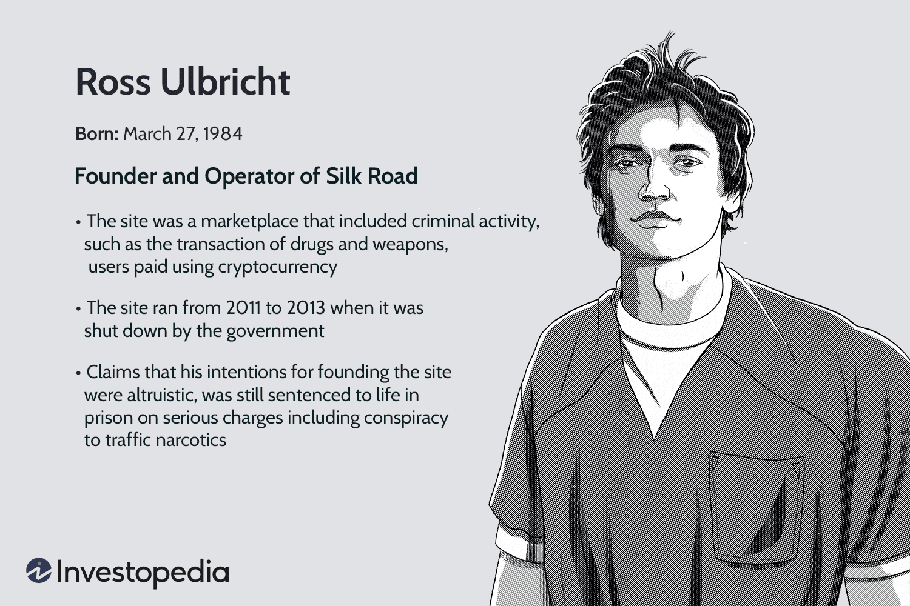

The digital realm has witnessed many groundbreaking and controversial events, but few have left a mark like the Silk Road saga. At the center of this narrative is Ross Ulbricht, a figure who simultaneously captivated and disturbed global audiences through the creation of an unprecedented digital marketplace. The Silk Road, launched in 2011, was a pioneering platform on the dark web that enabled anonymous transactions using Bitcoin, challenging traditional norms of commerce and regulation. This article explores the interconnected dimensions of the Silk Road, the clandestine web, and algorithmic trading. It examines the driving forces behind the establishment of the Silk Road, the legal consequences encountered by Ulbricht, and the relevance of this episode in the context of the ever-evolving digital commerce landscape.

The Silk Road case serves as a remarkable study of digital anonymity and the cryptocurrency revolution, spotlighting the broader implications for future online trading platforms. Ulbricht's ambitions, fueled by libertarian ideals, resulted in a marketplace that quickly rose to prominence as a hub for illicit goods, attracting the attention of law enforcement agencies worldwide. The story of the Silk Road is not merely about a digital marketplace; it signifies the broader conversation on online privacy, security, and the ethical implications of unregulated digital marketplaces.



Cryptocurrencies, particularly Bitcoin, played a fundamental role in the operations of Silk Road, providing a level of anonymity that traditional currencies could not offer. This anonymity, however, was double-edged, contributing to both the platform's rapid success and its ultimate downfall. As we navigate through this intricate narrative, we gain insight into the transformative power of cryptocurrencies in shaping modern commerce and the ongoing debates surrounding their use.

Furthermore, the Silk Road saga provides a lens through which we can understand the evolving field of algorithmic trading. Although not directly related, both Silk Road and algorithmic trading highlight the potential and challenges within unregulated digital environments. As digital currencies become more integrated into mainstream finance, they also draw attention to the need for balancing innovation with regulation.

Ultimately, the Silk Road narrative compels reflection on how societies should govern the complexities of digital innovation against ethical and legal standards. The lessons derived from this story will, undoubtedly, remain pertinent as we continue to shape the future boundaries of digital commerce and uphold the values of internet freedom.

## Table of Contents

## The Rise and Fall of Silk Road

Silk Road was an online black market that gained notoriety as the first modern darknet market, characterized by its use of Tor for anonymous browsing and Bitcoin for transaction anonymity. Conceptualized by Ross Ulbricht in 2011, it aimed to create a decentralized and encrypted platform for transactions devoid of government oversight. Ulbricht operated under the pseudonym 'Dread Pirate Roberts', inspired by the fictional character from the novel and film "The Princess Bride", signifying the platform's ethos of persistent identity insulated from real-world repercussions. His vision was a platform that facilitated free-market exchanges without the intervention of authoritative bodies, leveraging the emerging cryptocurrency Bitcoin to achieve this level of financial confidentiality. 

Silk Road rapidly gained attention, primarily becoming a marketplace for illicit goods, especially narcotics. Users worldwide could engage in buying and selling activities with a relative sense of security owing to the site's anonymity assurances. According to estimates, the site facilitated over $200 million in transactions, marking a significant moment in the intersection of digital currency and illicit trade. The rise of Silk Road coincided with the early adoption and proliferation of Bitcoin, a digital currency that promised decentralization and privacy. Its blockchain technology ensured transaction verification without revealing user identities, aligning perfectly with Silk Road's operational needs.

Nevertheless, the platform's perceived impenetrability drew the scrutiny of law enforcement agencies. In an extensive operation involving multiple agencies, including the FBI, DEA, and IRS, coupled with advanced cybersecurity tactics, Ross Ulbricht was apprehended in a public library in San Francisco in 2013. His capture was a significant milestone, resulting in the immediate shutdown of Silk Road. The event illuminated vulnerabilities in digital anonymity and spurred further advancements in blockchain technology and internet privacy standards.

The closure of Silk Road marked a pivotal juncture in understanding the implications of dark web operations on internet privacy, online trade, and digital currencies. It spurred dialogue about the balance between freedom and regulation in cyberspace and accelerated the development of legal and technological frameworks for combating cybercrime. The case exemplified the dual-edged nature of technological innovation—offering possibilities for both unprecedented freedom and unchecked malfeasance. As a result, the Silk Road saga remains a focal point in discussions around privacy, regulation, and the future of digital commerce.

## Ross Ulbricht: The Man Behind the Curtain

Ross Ulbricht emerged as a significant figure in the digital landscape due to his creation and operation of the Silk Road, an online platform that facilitated illegal trade. His journey began with a solid academic foundation; he graduated from the University of Texas at Dallas with a degree in physics and pursued graduate studies in material science at Pennsylvania State University. Ulbricht's transition from science to digital entrepreneurship was fueled by his deep-seated libertarian ideals. He envisioned an online marketplace where individuals could trade freely without governmental oversight, reflecting his belief in personal sovereignty over economic interactions.

Despite these visionary ideals, Ulbricht's involvement in Silk Road led to serious criminal charges. The platform, which operated anonymously on the dark web, quickly became notorious for enabling drug transactions and other illegal activities. Ulbricht, using the pseudonym 'Dread Pirate Roberts', was accused of and eventually convicted for several charges, including conspiracy to traffic narcotics and engaging in a continuing criminal enterprise. These legal battles unfolded in a high-profile court case where Ulbricht received two life sentences without the possibility of parole.

Ulbricht's conviction stirred significant debate over digital rights and the disparity between his crimes and the severity of his punishment. Advocates argue that while Ulbricht facilitated an illegal marketplace, the life sentence was disproportionate, given that it exceeds punishments for other non-violent crimes with similar operational models. This discourse emphasizes the growing concern around digital privacy, the impact of online anonymity on crime, and challenges in the legal interpretation of digital actions.

The ethical implications of Ulbricht's actions extend beyond the legal arena, touching upon broader discussions of personal responsibility in digital ventures. Operating within the complexity of the dark web, Ulbricht's case serves as a poignant example of the ethical boundaries entrepreneurs face when leveraging technology to create decentralized platforms. Consequently, this case has become a focal point for examining how digital entrepreneurs should balance innovation with ethical practices and compliance with existing laws.

## Dark Web and Algorithmic Trading

The dark web, often perceived as a haven for illicit activities, is also a breeding ground for technological innovation. It serves as an encrypted platform allowing a level of anonymity and privacy that is not achievable on the surface web. This space enables the exploration of various technologies, one of which is [algorithmic trading](/wiki/algorithmic-trading). Algorithmic trading, which involves the use of computer algorithms to expedite trading decisions, has transformed the digital finance sector by increasing trading efficiency and [liquidity](/wiki/liquidity-risk-premium) while reducing transaction costs.

While the Silk Road and algorithmic trading are not directly related, both highlight the challenges and opportunities associated with unregulated segments of the internet. Silk Road utilized the dark web to facilitate anonymous transactions primarily using Bitcoin, a revolutionary digital currency at the time. This method of payment aligned closely with the principles of algorithmic trading, which also benefits from the decentralized nature of cryptocurrencies.

Cryptocurrencies have become integral to both illicit and legitimate online economies. In the context of Silk Road, Bitcoin enabled secure and anonymous transactions, ensuring privacy for its users. By utilizing a peer-to-peer network, Bitcoin transactions did not require traditional banking institutions, which aided the Silk Road's mission to operate beyond regulatory oversight. Similarly, in algorithmic trading, cryptocurrencies are becoming increasingly important. They present new opportunities for high-frequency trading and complex algorithmic strategies due to their high [volatility](/wiki/volatility-trading-strategies) and 24/7 market operations.

To understand the broader implications of these technologies on traditional market systems, consider the following Python code snippet that simulates a simple moving average (SMA) algorithm to trade cryptocurrencies:

```python
import pandas as pd

def simple_moving_average(data, window):
    """Calculate the simple moving average for a given time window."""
    return data.rolling(window=window).mean()

# Simulated cryptocurrency price data
price_data = pd.Series([100, 105, 102, 110, 115, 120, 125, 130, 128, 135])

# Calculate the 3-day SMA
sma_3 = simple_moving_average(price_data, 3)

# Trading strategy: buy if the current price is above the 3-day SMA, sell if below
signals = price_data - sma_3
trading_decisions = ["Buy" if signal > 0 else "Sell" for signal in signals]

print("Price Data:", price_data.tolist())
print("3-Day SMA:", sma_3.tolist())
print("Trading Decisions:", trading_decisions)
```

Through this example, the reliance on algorithms becomes evident as they systematically analyze data and facilitate trading based on back-tested strategies. The intersection of cryptocurrencies and algorithmic trading suggests a future where digital currencies are used more extensively, challenging traditional regulatory frameworks.

Understanding the connection between dark web marketplaces and algorithmic trading systems sheds light on the evolving role of digital technology in disrupting conventional market structures. This evolution emphasizes the need for updated regulations that can accommodate the growing complexities of digital commerce. The narratives from Silk Road and algorithmic trading, although seemingly parallel, are instrumental in deciphering contemporary challenges facing digital market ecosystems.

## Legal Ramifications and Appeals

Ulbricht's conviction in the Silk Road case has become a defining moment in the judicial approach to cybercrime, particularly concerning illicit activities conducted through digital platforms. His case is pivotal in understanding how the legal system navigates the burgeoning field of online crime that intersects with the expanding digital landscape. With his arrest in 2013, Ulbricht faced several charges, including conspiracy to traffic narcotics and engage in a continuing criminal enterprise. His subsequent conviction and life sentence set a significant precedent for prosecuting crimes carried out on the internet, especially those involving the dark web and cryptocurrencies like Bitcoin.

Despite numerous appeals from Ulbricht's legal team, his sentence, which many argue was excessively severe for a non-violent offender, has been repeatedly upheld. The appeals focused on potential procedural errors and questioned whether the punishment was proportional to the crime, given that Ulbricht had no prior criminal record. The insistence on affirming his life sentence without the possibility of parole continues to spark debate regarding the justice system's handling of cybercrimes and the appropriateness of the penalties imposed.

The case raises critical issues surrounding privacy laws and digital surveillance. As Ulbricht's legal proceedings unfolded, broader concerns about individual privacy in an age of ubiquitous digital surveillance came to the forefront. The tension between safeguarding privacy and ensuring security in online spaces underscores the complexities involved in prosecuting digital crimes. The Silk Road case illustrates the delicate balance between promoting technological innovation and curtailing potential abuses that challenge existing legal norms.

Supporters of Ulbricht continue to advocate for a reevaluation of his case, suggesting clemency and calling for comprehensive reform in sentencing for non-violent digital crimes. This advocacy highlights a growing discourse on the need to reevaluate the proportionality of penalties in cybercrime cases, particularly when they involve first-time offenders and non-violent actions. The ongoing appellate efforts reflect broader societal discussions about criminal justice reform, emphasizing the need to align judicial responses with the evolving nature of digital technologies.

The protracted legal battle surrounding Ulbricht's case exemplifies the ongoing tension between the rapidly changing digital environment and the legal frameworks designed to govern it. As digital commerce and online anonymity continue to advance, the precedent set by the Silk Road case will likely influence future legal interpretations and enforcement strategies in cybercrime. Legal experts and policymakers are increasingly tasked with addressing these challenges, striving to adapt existing laws to effectively regulate new digital realities while maintaining ethical standards.

## The Future of Dark Web and Digital Commerce

The Silk Road's legacy is multifaceted, serving both as a cautionary tale and as an insightful case study into the future of digital commerce within secure, anonymous environments. Although the dark web has seen multiple iterations of marketplaces since Silk Road, few have matched its scale or impact. This phenomenon raises critical questions about the conditions necessary for the proliferation and success of such platforms.

The evolution of digital currencies like Bitcoin remains central to this discussion. Bitcoin's foundational technology, blockchain, facilitates secure, anonymous transactions that are hard to trace, making it a favored currency for both legal and illegal online activities. Despite cryptocurrencies' turbulent and volatile nature, their underlying technology shows resilience and continual adoption, suggesting a significant role in future digital economies. The charting of Bitcoin's value, indicated by rapid fluctuations and recoveries, typifies the volatile nature of digital assets but also illustrates investor confidence and increasing mainstream acceptance.

As technology continues to evolve, regulatory challenges persist. Policymakers, technologists, and privacy advocates often find themselves at crossroads. Innovations in digital commerce, while promising freedom and decentralization, simultaneously pose risks, necessitating robust regulatory frameworks. The complexities lie in balancing user privacy with the prevention of illicit activities which often use the cloak of anonymity as breeding grounds. Clear guidelines and international cooperation are crucial for addressing these challenges, alongside collaboration with tech companies to ensure privacy without compromising on ethics and legality.

Understanding the phenomenon of Silk Road provides valuable insights into digital trade’s future trajectories. It invites a nuanced perspective on the regulation of digital platforms, where the balance between innovation and control must be carefully managed. The key challenge remains how to foster technological growth and user freedom while ensuring compliance with existing legal and ethical standards.

This balancing act becomes more intricate as new technologies like decentralized finance (DeFi) and non-fungible tokens (NFTs) emerge, further diversifying the digital economy landscape. Stakeholders are prompted to rethink legislative practices while adapting to rapid technological advancement. As a result, society must reconsider how digital commerce integrates with traditional economic systems, ensuring security, fairness, and transparency for all users.

## Conclusion

Ross Ulbricht's Silk Road signified a transformative era in internet history by demonstrating both the vast potential and considerable risks inherent in unregulated digital spaces. The creation of Silk Road underscored the formidable power of [cryptocurrency](/wiki/cryptocurrency), particularly Bitcoin, which was utilized as a key medium of exchange on the platform, showcasing its potential for anonymity and decentralized financial transactions. This paved the way for an ongoing discourse on privacy and freedom in the digital age, sparking debates about the extent to which digital environments should be policed and the balance between privacy rights and security.

From the perspective of algorithmic trading, Ulbricht's venture into Silk Road illustrates the challenges and opportunities within modern internet economies. Algorithmic trading, which relies heavily on data and computational algorithms to execute trades, similarly benefits from advancements in digital technology and cybersecurity. The silk road's reliance on sophisticated encryption and anonymization techniques parallels the complex security measures employed in algorithmic trading to protect market data and transactional integrity.

The narrative of Silk Road compels reflection on how to effectively manage the intersection of digital innovation with ethical and legal frameworks. The platform's rise and subsequent shutdown raise critical questions about accountability and regulation in cyberspace, highlighting the necessity for adaptable legal structures that can keep pace with technological advancements. As digital commerce continues to evolve, the lessons drawn from Silk Road remain pertinent, urging society to contemplate the ethical boundaries of innovation while striving to safeguard internet freedom.

In conclusion, the Silk Road saga serves as a poignant reminder of the dual nature of technological progress: its ability to empower and connect, along with its potential to foster unlawful activities if left unchecked. These lessons are critical as stakeholders navigate the ongoing development of digital commerce and seek to establish a sustainable balance that promotes innovation while ensuring ethical standards are upheld.

## References & Further Reading

[1]: Greenberg, Andy. ["This Machine Kills Secrets: How WikiLeakers, Cypherpunks, and Hacktivists Aim to Free the World's Information"](https://www.amazon.com/This-Machine-Kills-Secrets-WikiLeakers/dp/0525953205). Dutton Adult.

[2]: Ulbricht, Ross. ["Silk Road: The Real Story"](https://en.wikipedia.org/wiki/Ross_Ulbricht). CreateSpace Independent Publishing.

[3]: Ormsby, Eric. ["Silk Road: A New History"](https://en.unesco.org/silkroad/publications/silk-road-new-history). Hill and Wang.

[4]: Zohar, Aviv. ["Bitcoin: Under the Hood"](https://dl.acm.org/doi/10.1145/2701411). Communications of the ACM, 2015.

[5]: Adrian, Tobias, and Hyun Song Shin. ["The Rise of Cryptocurrency and the Fall of Fiat Money"](https://www.nber.org/papers/w18335). International Monetary Fund, 2020.