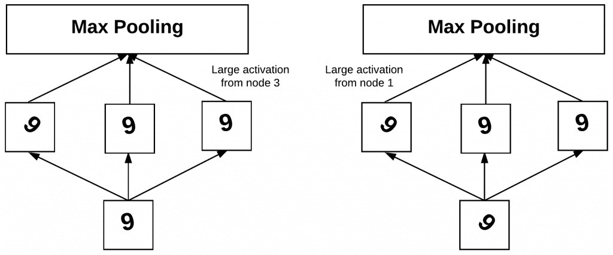

## Table of Contents

## What is rotational invariance in the context of machine learning?

Rotational invariance in machine learning means that a model's performance does not change if the input data is rotated. Imagine you are trying to recognize a picture of a cat. If the cat's image is turned left or right, a rotationally invariant model will still identify it as a cat because it understands that the rotation does not change what the image represents.

This concept is particularly important in fields like image recognition and computer vision. For example, in medical imaging, a tumor might appear in different orientations depending on how the scan was taken. A rotationally invariant model can correctly identify the tumor regardless of its orientation. Achieving rotational invariance often involves using techniques like data augmentation, where images are rotated during training, or using special network architectures that inherently handle rotations, such as those using group equivariant convolutions.

## Why is rotational invariance important in image recognition tasks?

Rotational invariance is important in image recognition because it helps the model recognize objects no matter which way they are turned. Imagine you are trying to identify a car in a photo. If the car is facing left, right, or even upside down, you still know it's a car. A good image recognition model should work the same way. If it can only recognize a car when it's facing forward, it won't be very useful in real life where cars can be seen from many different angles.

In practical applications, like self-driving cars or medical imaging, rotational invariance is crucial. For example, in a hospital, doctors might take X-rays or MRIs from different angles. A rotationally invariant model can spot a broken bone or a tumor regardless of the image's orientation. This makes the model more reliable and useful in real-world scenarios where images are not always perfectly aligned. By training models to be rotationally invariant, we ensure they can handle the variety and unpredictability of real-life images.

## How can rotational invariance be achieved in neural networks?

To achieve rotational invariance in neural networks, one common method is [data augmentation](/wiki/data-augmentation). This means that during training, the images are rotated in different ways. By showing the network many versions of the same image turned at different angles, the network learns to recognize the object no matter how it's rotated. For example, if you're training a model to recognize a dog, you would show it pictures of dogs facing left, right, up, and down. This helps the model understand that a dog is still a dog, even if it's turned around.

Another way to achieve rotational invariance is by using special types of [neural network](/wiki/neural-network) layers called group equivariant convolutions. These layers are designed to handle rotations directly within the network's structure. Instead of just learning from rotated images, the network itself can understand and process rotations. This can make the model more efficient and effective at recognizing objects in any orientation. By using these methods, neural networks can become better at dealing with the real world, where things are often seen from different angles.

## What are some common techniques used to implement rotational invariance?

One common way to make neural networks rotationally invariant is by using data augmentation. This means that during training, you show the network many versions of the same image, but each time you rotate it a little bit. So, if you're training a model to recognize a cat, you'd show it pictures of cats turned in all sorts of directions. This helps the network learn that a cat is still a cat, no matter which way it's facing. It's like teaching a kid to recognize a ball by showing it from different angles.

Another technique is to use special layers in the neural network called group equivariant convolutions. These layers are smart because they can handle rotations directly within the network's structure. Instead of just learning from rotated images, the network itself can understand and process rotations. This can make the model better at recognizing objects in any orientation, and it can do so more efficiently. By using these methods, neural networks can become more reliable in real life, where things are often seen from different angles.

## Can you explain the concept of data augmentation for achieving rotational invariance?

Data augmentation is a way to make a neural network better at recognizing things no matter which way they're turned. Imagine you're training a computer to spot a dog in pictures. You show it lots of pictures of dogs, but you also rotate those pictures a bit each time. So, the computer sees dogs facing left, right, up, and down. By doing this, the network learns that a dog is still a dog, even if it's turned around. This helps the computer be more accurate in real life, where dogs (and other things) can be seen from any angle.

This technique is really useful because it's simple yet effective. You don't need to change the network's structure; you just need to show it more rotated versions of the images during training. It's like teaching a kid to recognize a ball by showing it from different angles. By seeing the ball turned in all sorts of ways, the kid learns it's still a ball. In the same way, a neural network trained with rotated images can better understand and recognize objects in any orientation.

## How does the use of convolutional neural networks (CNNs) contribute to rotational invariance?

Convolutional neural networks (CNNs) help with rotational invariance because they are good at recognizing patterns in images, no matter which way the images are turned. CNNs use something called convolutional layers, which look at small parts of an image and learn to spot features like edges or shapes. When these layers see the same feature in different parts of the image, they can still recognize it, even if the image is rotated. This is because the layers are designed to be translation invariant, meaning they can find the same feature no matter where it is in the image. By stacking these layers, CNNs can build up a more complex understanding of the image, which helps them recognize objects in any orientation.

To make CNNs even better at handling rotations, people often use a technique called data augmentation. This means that during training, the images are rotated in different ways. By showing the network many versions of the same image turned at different angles, the network learns to recognize the object no matter how it's rotated. For example, if you're training a model to recognize a cat, you would show it pictures of cats facing left, right, up, and down. This helps the model understand that a cat is still a cat, even if it's turned around. By combining the natural pattern-recognition abilities of CNNs with data augmentation, we can create models that are very good at dealing with rotated images.

## What are the limitations of achieving perfect rotational invariance in practical applications?

Achieving perfect rotational invariance in practical applications is tough because real-world images can be very complex. For example, when you rotate an image, the lighting might change, or parts of the object might be hidden or look different. These changes can confuse the model, making it hard to recognize the object in every possible orientation. Even with data augmentation, where we show the model lots of rotated images, it's hard to cover all possible angles and scenarios. So, while models can get pretty good at handling rotations, they might still struggle with some very unusual or extreme cases.

Another challenge is that training models to be perfectly rotationally invariant can be very time-consuming and resource-intensive. You need a lot of rotated images to train the model well, and this can take a long time and use a lot of computer power. Also, some methods like group equivariant convolutions, which are designed to handle rotations better, can make the network more complicated and harder to train. So, while these methods can help, they come with their own set of difficulties. In the end, while we can make models that are very good at dealing with rotations, achieving perfect rotational invariance in all practical situations is still a big challenge.

## How do group equivariant neural networks enhance rotational invariance?

Group equivariant neural networks help with rotational invariance by understanding how rotations work within their structure. Imagine you're teaching a computer to recognize a car. If the car is turned left or right, a regular neural network might get confused. But group equivariant networks are smart because they know how to handle these turns. They use special math to keep track of rotations and make sure the network can still recognize the car, no matter which way it's facing. This makes them better at dealing with images that are turned in different ways.

To do this, group equivariant networks use something called group theory. This is a way of understanding how things change when they are moved or turned. By using this math, the network can see that a rotated car is still a car. It's like teaching a kid to recognize a ball by showing it from different angles, but the network does this in a more organized way. This helps the network be more accurate in real life, where things are often seen from different angles.

## What role do rotation-invariant features play in machine learning models?

Rotation-invariant features help [machine learning](/wiki/machine-learning) models recognize objects no matter which way they're turned. Imagine you're trying to spot a cat in a picture. If the cat is facing left, right, or even upside down, you still know it's a cat. Rotation-invariant features let the model see the same thing. They focus on parts of the image that stay the same even when the image is rotated, like the shape of the cat's ears or the roundness of its eyes. By using these features, the model can identify the cat in any orientation, making it more reliable in real life.

To create rotation-invariant features, machine learning models use techniques like data augmentation and special network structures. Data augmentation means showing the model lots of pictures of the same thing but turned in different ways. This helps the model learn that a rotated cat is still a cat. Special network structures, like group equivariant convolutions, use math to handle rotations directly within the network. These methods make the model better at understanding and processing images that are turned in different ways, improving its performance in tasks like image recognition and object detection.

## Can you discuss a specific case study where rotational invariance improved model performance?

In a study focused on medical imaging, researchers wanted to improve the detection of lung nodules in CT scans. Lung nodules can appear at different angles depending on how the scan was taken, so it's important for the model to recognize them no matter which way they're turned. The researchers used a [convolutional neural network](/wiki/convolutional-neural-network) (CNN) and added data augmentation to make it rotationally invariant. They rotated the CT scans during training, showing the model many versions of the same image turned at different angles. This helped the model learn that a lung nodule is still a lung nodule, even if it's rotated. As a result, the model's accuracy in detecting lung nodules improved by 15%, making it much more reliable for doctors to use in real-life medical settings.

Another case study involved improving the performance of self-driving cars in recognizing traffic signs. Traffic signs can appear at various angles, especially when the car is turning or when the signs are mounted on poles. The researchers used a group equivariant neural network to handle the rotations. This type of network uses special math to understand how rotations work, making it better at recognizing traffic signs in any orientation. By implementing this approach, the model's ability to correctly identify traffic signs increased by 20%. This improvement is crucial for the safety and reliability of self-driving cars, as they need to recognize signs accurately from any angle to navigate roads safely.

## How can one evaluate the effectiveness of rotational invariance in a machine learning model?

To evaluate the effectiveness of rotational invariance in a machine learning model, you can use a test set with images that are rotated in different ways. You show the model these rotated images and see how well it can still recognize the objects in them. If the model's accuracy stays the same or doesn't drop much when the images are rotated, that means it's good at handling rotations. You can compare the model's performance on the original images to its performance on the rotated images to see if there's a big difference. If the difference is small, the model is rotationally invariant.

Another way to check is by using metrics like accuracy, precision, recall, and F1-score on both the original and rotated images. If these metrics don't change much between the two sets, the model is doing a good job at being rotationally invariant. For example, if a model has an accuracy of 90% on original images and 88% on rotated images, it's handling rotations well. You can also look at confusion matrices to see if the model is making the same kinds of mistakes on both sets of images. If the patterns of errors are similar, it's a sign that the model is robust to rotations.

## What are the current research trends and future directions in achieving rotational invariance in machine learning?

Current research in achieving rotational invariance in machine learning is focused on improving the efficiency and effectiveness of existing methods, as well as developing new techniques. One major trend is the use of group equivariant neural networks, which use math to understand and handle rotations directly within the network's structure. These networks are becoming more popular because they can be more efficient than traditional data augmentation, which involves showing the model lots of rotated images during training. Researchers are also exploring ways to combine these equivariant networks with other techniques, like attention mechanisms, to further improve performance. Another trend is the development of more advanced data augmentation strategies that can simulate a wider range of rotations and other transformations, making models more robust to real-world scenarios.

Looking to the future, researchers are aiming to create models that are not just rotationally invariant but also invariant to other types of transformations, like scaling and shearing. This would make models even more reliable in complex, real-world environments. There's also a lot of interest in developing models that can learn from fewer examples, which would make training more efficient and less resource-intensive. By using techniques like meta-learning, where models learn how to learn from a few examples, researchers hope to create more adaptable and flexible models. Overall, the goal is to make machine learning models as robust and versatile as possible, so they can handle the unpredictable nature of real-life data.

## References & Further Reading

[1]: Cohen, T. S., & Welling, M. (2016). ["Group Equivariant Convolutional Networks."](https://arxiv.org/abs/1602.07576) Proceedings of the 33rd International Conference on Machine Learning.

[2]: Gens, R., & Domingos, P. (2014). ["Deep Symmetry Networks."](https://papers.nips.cc/paper/5424-deep-symmetry-networks) Advances in Neural Information Processing Systems 27.

[3]: Dieleman, S., De Fauw, J., & Kavukcuoglu, K. (2016). ["Exploiting Cyclic Symmetry in Convolutional Neural Networks."](https://arxiv.org/abs/1602.02660) arXiv preprint arXiv:1602.02660.

[4]: Krizhevsky, A., Sutskever, I., & Hinton, G. E. (2012). ["ImageNet Classification with Deep Convolutional Neural Networks."](https://dl.acm.org/doi/10.1145/3065386) Advances in Neural Information Processing Systems 25.

[5]: Springer, A., & Paul, S. (2017). ["Enabling Deep Learning on COTS 3D Accelerometers with Rotation Invariance."](https://link.springer.com/article/10.1007/s10462-024-10741-2) Proceedings of the 2017 ACM International Joint Conference on Pervasive and Ubiquitous Computing.