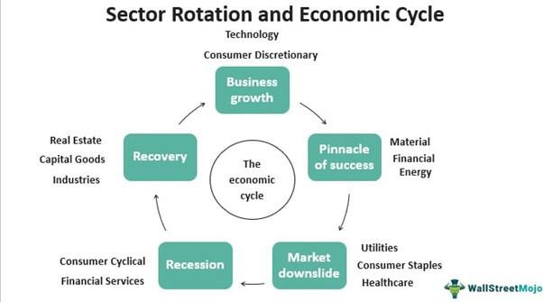

Algorithmic trading, often referred to as algo trading, represents the intersection of technology and finance, where complex algorithms execute trading orders at speeds and frequencies that humans cannot achieve manually. By leveraging computing power and sophisticated mathematical models, algo trading aims to optimize trading strategies and maximize returns while minimizing risks. It has gained significant traction in financial markets due to its ability to process vast datasets faster, execute trades with precision, and reduce transaction costs.

One intriguing strategy within algorithmic trading is the use of rotational systems. These systems involve dynamically rotating investments among different assets or asset classes according to predetermined criteria. Unlike traditional static investment strategies, rotational systems are designed to adapt to changing market conditions. This adaptability is a key feature that can potentially offer enhanced returns or better risk management. Essentially, rotational systems evaluate asset performance regularly and pivot towards those exhibiting strong momentum or other favorable indicators.

The purpose of this article is to delve into the intricacies of rotational systems within the sphere of algorithmic trading. It will discuss the vital components and principles behind rotational strategies, why they are beneficial, and what unique challenges they present. Furthermore, the article will examine the role of technology in supporting these systems and speculate on their future advancements in trading practices. By understanding these facets, traders and financial institutions can better appreciate the significant role rotational systems play in developing robust, adaptive trading portfolios.

## Table of Contents

## Understanding Rotational Systems

Algorithmic trading, often referred to as algo trading, utilizes computer programs to execute trades at speeds and frequencies that humans cannot match. Within this vast field, rotational systems offer a distinct approach to asset management by dynamically reallocating investments among a predefined universe of assets based on specific criteria. Unlike traditional methods that might focus on buy-and-hold strategies for selected stocks or assets, rotational systems prioritize the continual adjustment of holdings based on a systematic evaluation of market data.

**Principles of Rotational Systems**

The core principle of a rotational trading system is to rotate capital among different assets, sectors, or markets to capitalize on shifting trends. These systems operate by evaluating asset performance over a specified period, ranking them according to certain criteria like [momentum](/wiki/momentum), [volatility](/wiki/volatility-trading-strategies), or relative strength, and then reallocating investments accordingly. For instance, assets that have shown the best recent performance may be overweighted, while underperformers are reduced or eliminated from the portfolio.

**Contrasting with Traditional Methods**

Traditional trading often relies on [fundamental analysis](/wiki/fundamental-analysis) or insider knowledge, concentrating on the long-term prospects of individual stocks or bonds. In contrast, rotational systems embrace quantitative analysis and periodic reassessment to make systematic investment decisions. This method does not rely on emotional or subjective judgments but focuses on data-driven insights to guide market participation.

**Advantages of Rotational Systems**

Implementing rotational systems in trading strategies brings several notable benefits:

1. **Adaptability:** By continuously rotating assets based on objective criteria, these systems can quickly adapt to changing market conditions, potentially improving returns over static, long-term holdings.

2. **Risk Management:** Rotational systems inherently involve diversification across multiple asset classes, sectors, or indices. This diversification reduces the portfolio's exposure to the risk associated with any single asset.

3. **Enhanced Performance:** By systematically overweighting assets showing strong performance and reducing exposure to weaker ones, rotational systems aim to enhance overall portfolio returns.

4. **Systematic Decision-Making:** The reliance on quantitative metrics removes emotional biases from the trading process, promoting disciplined adherence to a predefined strategy.

In conclusion, rotational systems provide a compelling alternative to traditional trading methods, leveraging systematic and data-driven approaches to optimize asset allocation in ever-changing market environments. This adaptability, combined with their potential to enhance performance and manage risk, underscores their growing significance in the world of [algorithmic trading](/wiki/algorithmic-trading).

## Key Components of Rotational Systems

A rotational trading system is founded on the principle of periodically rebalancing a portfolio by rotating into and out of different assets based on specific criteria. This approach aims to capture returns from varying market conditions by systematically selecting assets that are expected to perform well in the upcoming period. 

**Essential Elements of a Rotational Trading System:**

1. **Asset Selection Criteria:** 
   The first step is determining a universe of assets to be considered for rotation. Assets can be selected based on several quantitative [factor](/wiki/factor-investing)s such as momentum, volatility, value indicators, or historical performance. The chosen criteria need to reflect the asset's potential to align with the investor’s risk appetite and return expectations. For instance, momentum-based selection might involve ranking assets based on recent performance and investing in the top performers.

2. **Rotation Strategies:**
   Rotation strategies involve deciding which assets to buy, hold, or sell at each rebalancing interval. A common approach is to rank all assets in the selection pool based on predefined metrics and rotate into the top-ranked assets. These strategies can be further refined using filters to exclude certain assets or include others based on additional criteria like sector exposure or [liquidity](/wiki/liquidity-risk-premium).

3. **Timing and Periodicity:**
   Timing is crucial in any rotational system. The periodicity of rotations—whether weekly, monthly, or quarterly—depends on the strategy's nature and market conditions. A monthly rebalance might suit a strategy based on medium-term trends, while a weekly approach might be more effective for short-term volatility exploitation. The key is to select a timeframe that balances transaction costs with the strategy's response to market movements.

By synchronizing asset selection criteria, rotation strategies, and timing, rotational trading systems can dynamically adapt a portfolio to changing market conditions, aiming to optimize returns while managing risk.

## Benefits of Using Rotational Systems in Algo Trading

Algorithmic trading, often referred to as algo trading, uses computer algorithms to execute trades at optimal speeds and efficiencies based on predetermined criteria. Within this framework, rotational systems present a compelling strategy that can substantially enhance the effectiveness of algo trading. By systematically rotating investments between different assets or sectors, these systems address both diversification and timing, inherently improving risk management and offering opportunities for superior trading outcomes.

One of the primary advantages of rotational systems is their ability to optimize the allocation of capital across various asset classes, sectors, or markets. This diversification strategy spreads risk by not concentrating the portfolio in a single asset or sector. For instance, rotational strategies can cycle between sectors such as technology, healthcare, and consumer goods based on market conditions. By rotating assets in response to market signals, traders can avoid prolonged exposure to any specific downturns, thus enhancing risk management.

Furthermore, rotational systems capitalize on regular monitoring and reevaluation of market positions, allowing for timely adjustments in rapidly changing markets. The essence of this strategy is in its periodic review and reallocation, which ensures that the portfolio is continuously realigned with the most promising investment opportunities. This dynamic approach can mitigate losses and possibly tap into new gains.

Real-world examples highlight the efficacy of rotational systems in achieving successful trading outcomes. For instance, during bull markets, rotating into high-growth sectors can capture substantial returns, while in bear markets, shifting towards defensive sectors like utilities or consumer staples can preserve capital. Quantitative [hedge fund](/wiki/hedge-fund-trading-strategies)s often employ such strategies to systematically enhance portfolio returns while managing risk. Research has shown that rotational strategies, when implemented with robust algorithms analyzing vast datasets and considering variables such as momentum and mean reversion, tend to outperform static investment approaches over time.

In summary, rotational systems in algo trading offer significant benefits by enhancing trading efficiency, improving risk management through diversification, and generating successful outcomes in various market conditions. As technology evolves, these systems are likely to become even more sophisticated, further integrating advanced analytics and machine learning to perfect the timing and selection of asset rotations.

## Challenges and Considerations

When implementing rotational systems in algorithmic trading, traders encounter several challenges that require careful consideration and management. One of the primary challenges is the selection of appropriate assets for rotation. This process demands rigorous analysis as it is vital to ensure the assets possess the necessary liquidity, volatility, and correlation characteristics suitable for a rotational strategy. Misjudgment in asset selection can lead to suboptimal portfolio performance or exposure to unanticipated risks. To mitigate this, traders can employ quantitative screening methods, utilizing historical data and statistical models to effectively evaluate and select assets.

Another significant challenge is determining the optimal periodicity and timing for executing rotations. The effectiveness of a rotational system largely hinges on timing the entry and [exit](/wiki/exit-strategy) points precisely to capitalize on asset movements. Erroneous timing can result in premature exits or delayed entries, compromising the strategy's efficacy. Implementing [machine learning](/wiki/machine-learning) algorithms can aid in better understanding market cycles and timing rotations with greater accuracy.

From a technical standpoint, the implementation of rotational systems requires robust computational infrastructure. This includes ensuring latency is minimized and data processing capabilities are sufficient to handle real-time market analysis and trading execution. Traders must invest in high-performance computing systems and utilize cloud-based solutions to overcome these technical limitations, particularly when dealing with large datasets and complex calculations.

Furthermore, [backtesting](/wiki/backtesting) and continuous monitoring are critical components that pose challenges in the practical application of rotational systems. Accurate backtesting requires access to vast amounts of historical data and the development of sophisticated simulation environments. It is also essential to account for transaction costs, slippage, and other real-world trading frictions in the backtesting process to achieve more reliable and realistic performance evaluations.

Finally, traders must consider the regulatory and compliance aspects of implementing rotational systems. These considerations include staying abreast of the latest financial regulations and ensuring that the trading systems comply with the legal standards to avoid potential fines and reputational damage. Partnering with legal experts and integrating compliance checks into the trading system can help in navigating the complex regulatory landscape.

In conclusion, the successful implementation of rotational systems in algo trading necessitates a multifaceted approach addressing asset selection, timing, technical infrastructure, backtesting, and regulatory compliance. By proactively mitigating these challenges with strategic planning and leveraging advanced technologies, traders can enhance the robustness and performance of their rotational strategies.

## Tools and Technologies Supporting Rotational Systems

In algorithmic trading, deploying and managing rotational trading systems requires the use of specialized tools and technologies. These systems benefit significantly from data-driven decision-making and technological advancements.

A variety of software platforms aid in implementing rotational trading systems. Tools like MetaTrader 5, TradingView, and QuantConnect offer environments where traders can develop, backtest, and deploy their strategies. MetaTrader 5, for instance, provides a robust platform for creating custom indicators and automated trading software with the MQL5 programming language. TradingView offers a visually intuitive interface and a community-driven marketplace for scripts and strategies. Meanwhile, QuantConnect leverages cloud technology and provides an open-source algorithmic trading platform primarily in Python, allowing for complex backtesting and live deployment.

Data and analytics form the core of optimizing rotational strategies. The ability to process and analyze large datasets swiftly is crucial for identifying the best times and assets for rotation. Analytical tools such as Python's Pandas and NumPy libraries enable the manipulation and analysis of data to uncover trends and patterns. Furthermore, integrating machine learning algorithms through libraries like TensorFlow and scikit-learn can enhance predictive modeling, offering deeper insights into market movements and refining the rules that govern asset rotations.

Emerging technologies are pushing the boundaries of what is possible with rotational systems. Artificial intelligence (AI) and machine learning algorithms can dynamically adjust rotational criteria based on real-time data inputs, leading to more adaptive strategies. Blockchain technology, with its decentralized and immutable nature, is being explored for creating transparent and secure trading mechanisms. Additionally, cloud computing offers scalable resources to handle extensive backtesting and live computations, enabling traders to execute strategies with minimal latency.

Implementing a successful rotational system is heavily reliant on the use of cutting-edge tools and technology. By leveraging the power of data analytics, machine learning, and cloud computing, traders can enhance the performance and reliability of their rotational strategies, staying ahead in the competitive landscape of algo trading.

## Conclusion

In wrapping up our exploration of rotational systems within algorithmic trading, it's essential to highlight the potential these systems offer in enhancing trading performance. Rotational systems focus on systematically selecting, holding, and rotating assets based on predetermined criteria. This method allows for dynamic asset allocation, which is pivotal in adapting to market changes, ultimately improving the robustness and efficiency of trading strategies.

A key takeaway is that rotational systems offer significant advantages, such as improved risk management through diversification and the ability to capitalize on market trends. Their systematic approach provides a framework that can lead to consistent performance by periodically evaluating assets to optimize portfolio composition.

Furthermore, the integration of data analytics and sophisticated algorithms can significantly boost the effectiveness of rotational strategies. By leveraging advanced tools and technologies, traders can refine their selection and timing processes, enabling more precise decision-making.

Therefore, traders and investors should consider further exploring and adopting rotational strategies within their portfolios. These systems' adaptability and potential for risk-adjusted returns make them an invaluable component of a modern, diversified trading strategy. As algorithmic trading continues to evolve, staying informed and open to innovative approaches such as rotational systems will be crucial in maintaining a competitive edge in the financial markets.

## Future Trends and Developments

As we look ahead, rotational systems in algorithmic trading are poised to undergo significant evolution driven by technological advancements and changing market dynamics. One of the most promising trends is the integration of [artificial intelligence](/wiki/ai-artificial-intelligence) and machine learning to enhance decision-making processes. These technologies can analyze vast amounts of data more efficiently than traditional methods, improving the timing and selection criteria of assets in rotational strategies. Incorporating AI algorithms that learn from historical performance can enable more adaptive and predictive systems, adjusting rotations in response to market conditions in real-time.

Another innovation on the horizon is the advanced use of [alternative data](/wiki/best-alternative-data) sources. These include non-traditional data inputs such as social media sentiment, satellite imagery, and environmental factors, which can provide insights not captured by conventional financial metrics. For instance, satellite data may help predict agricultural commodities' performance based on weather patterns, influencing rotational decisions.

Blockchain technology also presents opportunities for enhancing transparency and security in executing trades. Smart contracts facilitated by blockchain could automate the rebalancing and execution of trades in a rotational system, ensuring greater accuracy and reducing the risk of human error.

Moreover, the evolution of quantum computing could revolutionize algorithmic trading by enabling even faster processing speeds and more complex calculations. While still in its nascent stages, quantum computing might one day solve optimization problems within rotational systems more efficiently than currently possible.

Given these innovations, traders implementing rotational systems must stay informed about technological advancements and adapt their strategies accordingly. Continuous learning and adaptation will be crucial in leveraging these developments to maintain a competitive edge. Engaging with industry research, participating in trading forums, and utilizing educational resources can provide insights into new tools and techniques, ensuring traders are well-equipped to navigate the rapidly evolving landscape of algorithmic trading.

## References & Further Reading

[1]: Bergstra, J., Bardenet, R., Bengio, Y., & Kégl, B. (2011). ["Algorithms for Hyper-Parameter Optimization."](https://papers.nips.cc/paper_files/paper/2011/hash/86e8f7ab32cfd12577bc2619bc635690-Abstract.html) Advances in Neural Information Processing Systems 24.

[2]: ["Advances in Financial Machine Learning"](https://www.amazon.com/Advances-Financial-Machine-Learning-Marcos/dp/1119482089) by Marcos Lopez de Prado

[3]: ["Evidence-Based Technical Analysis: Applying the Scientific Method and Statistical Inference to Trading Signals"](https://www.wiley.com/en-gb/Evidence+Based+Technical+Analysis:+Applying+the+Scientific+Method+and+Statistical+Inference+to+Trading+Signals-p-9780470008744) by David Aronson

[4]: ["Machine Learning for Algorithmic Trading"](https://www.amazon.com/Machine-Learning-Algorithmic-Trading-intelligence/dp/9918608013) by Stefan Jansen

[5]: ["Quantitative Trading: How to Build Your Own Algorithmic Trading Business"](https://www.amazon.com/Quantitative-Trading-Build-Algorithmic-Business/dp/0470284889) by Ernest P. Chan