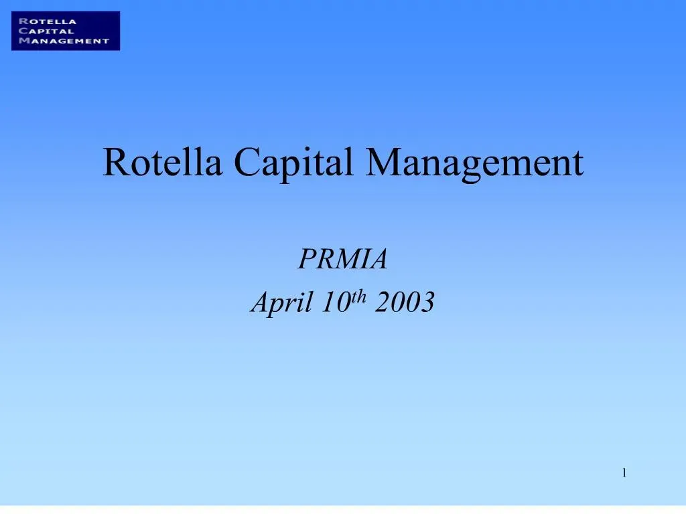

Rotella Capital Management is a prominent firm in the sphere of algorithmic trading, recognized for its innovative and efficient trading strategies. Established in the late 1980s, Rotella Capital emerged at a time when traditional trading methods dominated financial markets. Over the years, the firm's commitment to leveraging technology and data-driven strategies has solidified its status as a pioneer in algorithmic trading. 

The historical backdrop of algorithmic trading is intertwined with the advancements in computer technology and the exponential growth of available data. Initially, trading was largely conducted manually, with traders relying on physical presence and vocal exchanges to execute trades. As markets evolved, the need for faster and more precise execution encouraged the development of computerized trading systems. This shift enabled the integration of complex mathematical models and algorithms into the trading process, transforming how financial markets operate.

Algorithmic trading involves using automated systems to execute trades based on pre-defined criteria. This method offers significant advantages over traditional trading, including enhanced speed, accuracy, and the ability to process vast amounts of data in real time. The impact of algorithmic trading on modern financial markets is profound, contributing to increased liquidity, reduced transaction costs, and the minimization of human errors in trade execution.

Rotella Capital has adeptly positioned itself as a leader in the algorithmic trading domain by continually refining its proprietary trading models. The firm employs state-of-the-art technology and algorithms that analyze market conditions to optimize trading performance. This strategic approach not only strengthens its competitive edge but also builds trust with investors seeking reliable and transparent trading solutions.

The objective of this article is to explore the comprehensive strategies and unique offerings that Rotella Capital provides in the field of algorithmic trading. By examining the firm's innovative practices, technological advancements, and approach to market challenges, this article aims to highlight the critical contributions of Rotella Capital to the financial industry and its ongoing influence on investor outcomes.

## Table of Contents

## What is Algorithmic Trading?

Algorithmic trading refers to the use of computer algorithms to execute trading strategies in financial markets. These algorithms are programmed to conduct a rigorous analysis of market variables and execute trades based on predefined criteria without human intervention. Algorithmic trading is crucial for handling complex calculations and executing trades at speeds and frequencies that would be impossible for human traders.

Unlike traditional trading methods, where decisions are based on manual analysis and human intuition, [algorithmic trading](/wiki/algorithmic-trading) relies on technological infrastructure and quantitative models to make trading decisions. Traditional methods can be slower and more prone to biases, while algorithmic trading offers the advantage of executing trades with high speed and precision, drastically reducing the scope for human error.

One of the primary advantages of using algorithms in trading lies in their speed and accuracy. Algorithms can process vast amounts of data in milliseconds and execute orders at optimal prices. This high-frequency trading can capitalize on minute market inefficiencies that are not perceptible in longer timeframes. Algorithms also help in maintaining discipline in trading as they consistently apply a set of rules irrespective of the market conditions, thereby eliminating emotional impacts on trading decisions.

Data and technology play a critical role in algorithmic trading. High-frequency traders often rely on low-latency trading platforms and access to high-quality data to facilitate effective algorithmic strategies. Data points such as price levels, [volume](/wiki/volume-trading-strategy), timing, and market sentiment are analyzed using complex mathematical models to predict trends and execute trades. Emerging technologies, like [artificial intelligence](/wiki/ai-artificial-intelligence) and [machine learning](/wiki/machine-learning), are increasingly being integrated into trading algorithms to enhance predictive accuracy and adaptive strategies.

Several major players in the financial markets have recognized the potential of algorithmic trading and have adopted it extensively. Investment banks, hedge funds, and proprietary trading desks employ sophisticated algorithms to gain a competitive edge. Firms such as Goldman Sachs, Citadel, and Renaissance Technologies are well-known for utilizing algorithmic strategies to generate substantial trading volumes and achieve successful outcomes.

In conclusion, algorithmic trading represents a significant shift from traditional trading methods, driven by advancements in data processing and technology. It offers numerous advantages, including speed, accuracy, and the ability to manage large volumes of trades efficiently. With continuous advancements in technology, algorithmic trading is expected to further enhance its role in shaping the future of financial markets.

## About Rotella Capital Management

Rotella Capital Management was founded by Robert Rotella in 1995. The firm has grown over the years to establish itself as a leader in the field of algorithmic trading. Since its inception, Rotella Capital has focused on quantitative research and the development of trading strategies grounded in statistical and mathematical methods. This rigorous approach has enabled the firm to adapt to the evolving landscape of global financial markets.

One of the key milestones in the company's history was the development and implementation of its proprietary trading algorithms. These innovations have allowed Rotella Capital to execute trades with precision and efficiency, setting new standards in algorithmic trading. The firm's commitment to integrating advanced technologies with financial expertise has been a crucial [factor](/wiki/factor-investing) in its success.

The leadership team at Rotella Capital comprises experienced professionals with diverse backgrounds in finance, engineering, and technology. Key figures include Robert Rotella, the founder and a pivotal force in the company's strategic direction. His vision and leadership have guided the firm through various market cycles, ensuring robust risk management and consistent performance. Other notable members of the leadership team include the heads of quantitative research, technology, and operations, each bringing invaluable expertise and insight to the company's operations.

Rotella Capital operates with a clear ethos and mission: to deliver superior investment performance through the innovative use of technology and data. The firm's approach emphasizes research-driven strategies and a commitment to transparency and integrity in all interactions. This mission has enabled Rotella Capital to build strong, long-lasting relationships with its investors and partners.

Recognition within the industry has been significant, with Rotella Capital receiving multiple awards for its performance and innovation. These accolades underscore the firm’s contributions to the field of algorithmic trading and its role in shaping modern financial markets. The company’s dedication to excellence has established it as a benchmark for others in the industry, inspiring continued innovation and growth.

## Rotella Capital's Approach to Algo Trading

Rotella Capital Management has solidified its role as a frontrunner in the sphere of algorithmic trading. The firm employs sophisticated algorithmic strategies that leverage quantitative analysis, data-driven insights, and cutting-edge technology to optimize trading performance. 

The types of algorithms deployed by Rotella Capital are diverse, focusing on strategies such as [trend following](/wiki/trend-following), mean reversion, and statistical [arbitrage](/wiki/arbitrage). These algorithms are designed to identify and capitalize on price movements and inefficiencies in the market. For example, a trend-following algorithm might analyze historical price data to predict future movements, executing trades when a particular trend is detected. Mean reversion strategies, on the other hand, operate on the assumption that asset prices will revert to their historical mean over time, allowing the firm to exploit temporary price deviations.

Rotella Capital has pioneered proprietary technology to support its algorithmic trading operations. This includes the development of advanced trading platforms capable of processing vast amounts of data in real-time. These platforms are built with high-speed connectivity to ensure low-latency executions, which is crucial for taking advantage of fleeting market opportunities. Furthermore, machine learning and artificial intelligence are central to the firm's approach, enabling continuous improvement and adaptation of trading algorithms as market conditions evolve.

Risk management is a fundamental component of Rotella Capital's strategy. The firm employs robust risk assessment tools to evaluate potential exposures and employs algorithms that dynamically adjust the portfolio to mitigate risk. This is achieved through techniques such as diversification, leverage control, and stop-loss mechanisms, ensuring the portfolio remains aligned with predefined risk parameters while maximizing potential returns.

Over the years, Rotella Capital has demonstrated numerous successful algo trading scenarios. One notable instance involved exploiting [volatility](/wiki/volatility-trading-strategies) in currency markets using a combination of predictive analytics and high-frequency trading strategies, resulting in significant profit margins amidst turbulent market conditions. Such successes underscore the firm's ability to adapt and thrive in various market environments.

In conclusion, Rotella Capital's approach is characterized by its use of advanced algorithms, proprietary technology, and stringent risk management practices, positioning it as a leader in the algorithmic trading landscape. The firm's focus on innovation and data-driven decision-making continues to yield successful outcomes in the ever-evolving financial markets.

## The Benefits of Using Rotella Capital for Algo Trading

Rotella Capital Management offers a comprehensive suite of benefits for both institutional and individual investors seeking to leverage algorithmic trading. One of the primary advantages of choosing Rotella Capital is its robust and data-driven approach to trading strategies. By utilizing advanced algorithms, the firm ensures a high level of precision and speed, which is paramount in the fast-paced financial markets.

The firm harnesses proprietary technology that enables real-time data analysis and decision-making. This technology is supported by a strong infrastructure, allowing for seamless integration and execution of trades. The algorithms deployed by Rotella Capital are intricately designed to handle large volumes of transactions simultaneously, optimizing both entry and [exit](/wiki/exit-strategy) points to maximize returns while minimizing risks.

Rotella Capital's reputation in the algorithmic trading sector is further evidenced by case studies and testimonials from satisfied clients and partners. Many clients have highlighted the reliable performance outcomes and consistent returns as significant reasons for their long-term association with the company. These testimonials serve as a robust validation of Rotella's expertise and ability to address complex trading challenges effectively.

When compared to other firms in the algorithmic trading space, Rotella Capital distinguishes itself through its commitment to innovation and transparency. Unlike firms that may rely on black-box models with limited visibility, Rotella Capital ensures that its strategies are transparent and aligned with the clients' investment goals. This transparency fosters trust and confidence among investors, making Rotella a preferred choice.

Rotella Capital places a strong emphasis on addressing common challenges faced in algorithmic trading. One key challenge is managing the inherent risks associated with market volatility. To tackle this, the firm employs sophisticated risk management strategies, which include advanced statistical models and real-time monitoring systems. These measures enable dynamic adjustments to strategies, ensuring resilience against shifting market conditions.

The firm's commitment to innovation and continuous improvement is evidenced by its active investment in research and development. Rotella Capital continually explores emerging technologies, such as artificial intelligence and machine learning, to enhance its trading capabilities. The integration of such technologies not only refines existing strategies but also paves the way for new, more efficient methods of trading.

In conclusion, Rotella Capital Management provides substantial benefits for those looking to engage in algorithmic trading through its innovative technologies, strong risk management practices, and dedication to transparency. The firm's strategic approach to tackling trading challenges and its continuous evolution in using cutting-edge technology make it a formidable player in the algo trading industry.

## Future of Algorithmic Trading with Rotella Capital

Algorithmic trading continues to shape the future of financial markets with its capacity to leverage technology for enhanced trading efficiency. For Rotella Capital Management, the future hinges on adopting emerging technologies, optimizing current strategies, and preparing for upcoming industry challenges. 

The trends within algorithmic trading point towards an increasing reliance on artificial intelligence (AI) and machine learning, which are expected to revolutionize trading strategies. Rotella Capital is increasingly integrating these technologies into their algorithms to improve data analysis, prediction accuracy, and decision-making speed. AI allows for real-time analysis of extensive datasets, leading to more informed trading decisions, while machine learning algorithms enable the development of adaptive methods that learn and improve over time. This adaptability is crucial as markets evolve, developing new patterns that AI and machine learning models can detect more efficiently than traditional algorithms.

In preparing for these future opportunities, Rotella Capital is not only investing in AI but also seeking innovations in their trading models. This includes exploring quantum computing capabilities, which aim to process complex calculations faster than current computers, potentially unlocking new frontiers in trade execution and strategy optimization. By designing proprietary technology that builds upon these emerging fields, Rotella Capital aims to maintain its competitive edge.

Risk management continues to be a focal point for Rotella Capital, as they adapt their strategies to account for the intricacies introduced by these technologies. The firm implements comprehensive testing and rigorous validation of each model to ensure that the deployment occurs with minimized risk. Furthermore, their continuous monitoring and adjustment procedures help in mitigating risks associated with market volatility and unexpected events.

Moreover, Rotella Capital envisions a future where their trading strategies contribute significantly to more robust and resilient financial markets. By addressing challenges such as market [liquidity](/wiki/liquidity-risk-premium), through strategies that are adaptive and responsive, they aim to enhance market stability. Their commitment to continuous improvement is evidenced by regular updates to their systems incorporating the latest technological developments.

In summary, Rotella Capital Management is strategically positioned to lead the future of algorithmic trading through the embracement of AI, machine learning, and other transformative technologies. By innovating and refining their trading models, they prepare to confront future challenges with agility. This proactive approach not only underscores their influential role in financial markets but also promises to enhance investor outcomes.

## Conclusion

Rotella Capital has established itself as a pivotal entity in the algorithmic trading landscape, leveraging advanced strategies and proprietary technologies to impact financial markets significantly. This article discussed Rotella Capital's sophisticated approach to algorithmic trading, emphasizing its history, innovative strategies, and the robust risk management practices it employs. By utilizing cutting-edge algorithms, Rotella Capital not only enhances trading speed and accuracy but also mitigates risks, thereby providing a reliable platform for investors.

The potential impact of Rotella Capital on investor outcomes is profound. The firm's commitment to innovation ensures that it stays ahead of industry trends, offering clients a competitive edge. Whether catering to institutional or individual investors, Rotella Capital provides tailored solutions that adapt to various trading environments, ensuring that investments are managed with precision and foresight. This adaptability and anticipation of market changes allow investors to achieve better outcomes in terms of performance and risk-adjusted returns.

Investors seeking to optimize their trading strategies should consider Rotella Capital due to its proven track record and industry recognition. The firm's focus on continuous improvement and embracing emerging technologies such as artificial intelligence and machine learning positions it as a leader in preparing for future challenges and opportunities in algorithmic trading. By choosing Rotella Capital, investors can access a wealth of expertise and innovative trading models designed to maximize financial success.

Algorithmic trading continues to evolve, shaped by technological advancements and data-driven insights. Rotella Capital's strategic vision and commitment to excellence ensure its influential role in this dynamic landscape. As the industry advances, Rotella Capital's methodologies and insights will likely drive substantial developments in financial markets, underscoring the importance of sophisticated algorithmic trading practices.

## References & Further Reading

[1]: Aldridge, I. (2013). ["High-Frequency Trading: A Practical Guide to Algorithmic Strategies and Trading Systems."](https://www.amazon.com/High-Frequency-Trading-Practical-Algorithmic-Strategies/dp/1118343506) Wiley.

[2]: Lopez de Prado, M. (2018). ["Advances in Financial Machine Learning."](https://www.amazon.com/Advances-Financial-Machine-Learning-Marcos/dp/1119482089) Wiley.

[3]: Chan, E. (2008). ["Quantitative Trading: How to Build Your Own Algorithmic Trading Business."](https://github.com/ftvision/quant_trading_echan_book) Wiley.

[4]: Kissell, R. (2014). ["The Science of Algorithmic Trading and Portfolio Management."](https://www.sciencedirect.com/book/9780124016897/the-science-of-algorithmic-trading-and-portfolio-management) Academic Press.

[5]: MacKenzie, D. (2019). ["Trading at the Speed of Light: How Ultrafast Algorithms are Transforming Financial Markets."](https://pup-assets.imgix.net/onix/images/9780691217796/9780691217789.pdf) Princeton University Press.

[6]: Narang, R. (2013). ["Inside the Black Box: A Simple Guide to Quantitative and High-Frequency Trading."](https://onlinelibrary.wiley.com/doi/book/10.1002/9781118662717) Wiley.