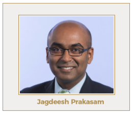

## Table of Contents

## What is Rotella Capital?

Rotella Capital is a financial company that helps people and businesses with their money. They focus on making investments that can grow over time. The company looks at different markets and tries to find the best opportunities to invest in. This can include things like stocks, bonds, and other financial products. Their goal is to help their clients make more money by choosing smart investments.

The people who work at Rotella Capital are experts in finance. They use their knowledge to make decisions about where to put money. They also keep an eye on how the investments are doing and make changes if needed. This way, they can try to get the best results for their clients. Rotella Capital works hard to build trust with their clients by being honest and clear about what they are doing with their money.

## Who founded Rotella Capital and when was it established?

Rotella Capital was founded by John Rotella. He started the company because he wanted to help people make smart choices with their money. John had a lot of experience in finance and he used that knowledge to build Rotella Capital.

The company was established in 2005. Since then, Rotella Capital has grown a lot. They now work with many different clients and help them invest in things like stocks and bonds. John and his team work hard to make sure their clients' money is safe and growing.

## What types of investment strategies does Rotella Capital employ?

Rotella Capital uses different ways to help people grow their money. They look at the big picture of the economy and try to guess where things are going. This helps them pick investments that might do well in the future. They might choose to invest in stocks, which are pieces of companies, or bonds, which are like loans to companies or governments. They also look at other things like real estate or special funds that mix different types of investments.

Another thing Rotella Capital does is called diversification. This means they spread out the money they invest so it's not all in one place. If one investment doesn't do well, the others might still be okay. They also change their plans based on what's happening in the world. If something big changes, like a new law or a problem in the economy, they might move money around to keep it safe. This way, they try to make sure their clients' money keeps growing no matter what happens.

## How does Rotella Capital select its investments?

Rotella Capital picks its investments by looking at a lot of information about the economy and different markets. They use this information to guess which investments might do well in the future. They look at things like how companies are doing, what's happening in the world, and what experts think will happen next. This helps them choose stocks, bonds, real estate, and other types of investments that they think will grow over time.

They also believe in spreading out the money they invest. This means they don't put all the money in one place. Instead, they put it into different types of investments. This way, if one investment doesn't do well, the others might still be okay. Rotella Capital also keeps an eye on what's happening around the world. If something big changes, like a new law or a problem in the economy, they might move money around to keep it safe. This helps them try to make sure their clients' money keeps growing no matter what happens.

## What are the key sectors that Rotella Capital focuses on?

Rotella Capital focuses on a few main sectors to help their clients make money. They look at technology a lot because it's always changing and growing. Companies that make software, hardware, or new inventions can be good investments. They also pay attention to healthcare, which includes hospitals, medicine, and companies that make health products. These areas can be good because people always need healthcare, no matter what's happening in the economy.

Another big sector for Rotella Capital is finance. This includes banks, insurance companies, and other businesses that deal with money. They think these can be good investments because they are important to the economy. Lastly, they also look at energy, which can include oil, gas, and new kinds of energy like solar or wind. They try to find companies in these sectors that are doing well and might keep growing in the future.

## What is the performance history of Rotella Capital's funds?

Rotella Capital's funds have done pretty well over the years. They started in 2005, and since then, their funds have grown a lot. They've had some years where they made a lot of money for their clients, especially in times when the economy was doing well. They try to pick investments that will grow over time, and this has helped their funds do better than many others.

But, like all investments, Rotella Capital's funds have had some ups and downs. There have been times when the economy was not doing so well, and their funds didn't grow as much. They try to keep the money safe by spreading it out into different types of investments. This helps them do better even when things are tough. Overall, their funds have been a good choice for people looking to grow their money over the long term.

## How does Rotella Capital manage risk in its investment portfolios?

Rotella Capital manages risk in its investment portfolios by spreading out the money they invest. They don't put all the money into one type of investment. Instead, they put it into different things like stocks, bonds, and real estate. This way, if one investment doesn't do well, the others might still be okay. It's like not putting all your eggs in one basket. By doing this, they try to make sure that their clients' money is safe even if something goes wrong with one part of their investments.

They also keep a close eye on what's happening in the world and the economy. If something big changes, like a new law or a problem in the economy, they might move money around to keep it safe. They use their knowledge to guess what might happen next and change their plans if they need to. This helps them try to make sure their clients' money keeps growing no matter what happens. By being careful and always watching, Rotella Capital tries to manage risk and protect their clients' investments.

## What are the fee structures associated with investing in Rotella Capital?

When you invest with Rotella Capital, they charge fees for managing your money. The main fee they charge is called a management fee. This is a percentage of the money you have invested with them. Usually, it's around 1% to 2% of your total investment each year. This fee pays for the work they do to pick and watch over your investments.

There might also be other fees, like performance fees. These are extra charges if your investments do really well. For example, if your investments grow more than a certain amount, Rotella Capital might take a small part of that extra growth as a fee. It's important to read all the details about these fees before you start investing with them so you know exactly what you'll be paying.

## Can you explain the unique aspects of Rotella Capital's investment philosophy?

Rotella Capital has a special way of thinking about investments. They believe in looking at the big picture of the economy and the world to pick the best investments. They don't just focus on one thing; they look at many different areas like technology, healthcare, finance, and energy. They try to find companies in these areas that are doing well and might keep growing. Rotella Capital also believes in spreading out the money they invest. This means they put money into different types of investments so if one doesn't do well, the others might still be okay. This helps them try to make sure their clients' money keeps growing no matter what happens.

Another important part of their philosophy is managing risk. Rotella Capital is always watching what's happening in the world and the economy. If something big changes, like a new law or a problem in the economy, they might move money around to keep it safe. They use their knowledge to guess what might happen next and change their plans if they need to. By being careful and always watching, Rotella Capital tries to manage risk and protect their clients' investments. They want to make sure their clients' money is safe and growing over time.

## How does Rotella Capital integrate ESG (Environmental, Social, and Governance) factors into its investment decisions?

Rotella Capital cares about the world and the people in it. They use something called [ESG](/wiki/esg-investing) factors, which stands for Environmental, Social, and Governance, when they pick investments. This means they look at how a company treats the environment, how it treats its workers and the community, and how it is run by its leaders. They believe that companies that do well in these areas can be good investments because they are more likely to do well over time.

They look at the environment part to see if a company is helping or hurting the planet. They want to invest in companies that are trying to make the world a better place by using less energy or making less pollution. The social part is about how a company treats its workers and the community. Rotella Capital likes companies that pay their workers fairly and help the people around them. The governance part is about how the company is run. They want to invest in companies that have good leaders who make honest decisions. By thinking about these things, Rotella Capital tries to pick investments that are good for their clients and good for the world.

## What are some notable successes or case studies from Rotella Capital's portfolio?

One of the big successes for Rotella Capital was when they invested in a tech company that made software for businesses. This company was growing fast and Rotella Capital saw that it could keep getting bigger. They put a lot of money into it, and over a few years, the value of the company went up a lot. This made a lot of money for Rotella Capital's clients. It showed how good they are at [picking](/wiki/asset-class-picking) companies that can grow over time.

Another great example is when Rotella Capital invested in a healthcare company that was working on new medicines. They believed that this company was doing important work that could help a lot of people. The company did well, and the value of their investment grew a lot. This showed that Rotella Capital not only thinks about making money but also about helping the world. It's a good example of how they use ESG factors to pick investments that are good for both their clients and society.

## What future trends or market conditions does Rotella Capital anticipate and how are they preparing for them?

Rotella Capital is always looking ahead to see what might happen in the future. They think that technology will keep growing and changing, so they are ready to invest in new tech companies. They also believe that more people will care about the environment, so they are looking for companies that help the planet. They think that healthcare will always be important, so they are watching for new medicines and treatments. They also see that the world is using more renewable energy, so they are ready to put money into solar and wind power companies.

To get ready for these future trends, Rotella Capital is spreading out their investments. They don't want to put all their money in one place, so they are investing in different kinds of companies. They are also keeping a close eye on what's happening in the world and the economy. If something big changes, they will move money around to keep it safe. They use their knowledge to guess what might happen next and change their plans if they need to. By doing this, Rotella Capital is trying to make sure their clients' money keeps growing no matter what happens in the future.

## References & Further Reading

[1]: Aldridge, I. (2013). ["High-Frequency Trading: A Practical Guide to Algorithmic Strategies and Trading Systems."](https://www.amazon.com/High-Frequency-Trading-Practical-Algorithmic-Strategies/dp/1118343506) Wiley.

[2]: Lopez de Prado, M. (2018). ["Advances in Financial Machine Learning."](https://www.amazon.com/Advances-Financial-Machine-Learning-Marcos/dp/1119482089) Wiley.

[3]: Chan, E. (2008). ["Quantitative Trading: How to Build Your Own Algorithmic Trading Business."](https://github.com/ftvision/quant_trading_echan_book) Wiley.

[4]: Kissell, R. (2014). ["The Science of Algorithmic Trading and Portfolio Management."](https://www.sciencedirect.com/book/9780124016897/the-science-of-algorithmic-trading-and-portfolio-management) Academic Press.

[5]: MacKenzie, D. (2019). ["Trading at the Speed of Light: How Ultrafast Algorithms are Transforming Financial Markets."](https://pup-assets.imgix.net/onix/images/9780691217796/9780691217789.pdf) Princeton University Press.

[6]: Narang, R. (2013). ["Inside the Black Box: A Simple Guide to Quantitative and High-Frequency Trading."](https://onlinelibrary.wiley.com/doi/book/10.1002/9781118662717) Wiley.