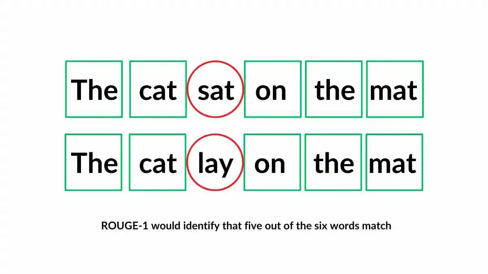

## Table of Contents

## What is Rouge-L and what does it measure in the context of machine learning?

Rouge-L, or Recall-Oriented Understudy for Gisting Evaluation - Longest Common Subsequence, is a metric used in machine learning to evaluate the quality of text generated by models, especially in tasks like text summarization and machine translation. It measures how well a generated summary or translation captures the key information from a reference text by comparing the longest common subsequence (LCS) between the two texts. The LCS is the longest string of words or characters that appear in the same order in both the generated and reference texts, but not necessarily consecutively.

In simple terms, Rouge-L looks at how many of the important parts of the reference text are included in the generated text, in the correct order. This makes it useful for understanding how well a model can produce coherent and relevant summaries or translations. The score is calculated using the formula $$Rouge-L = \frac{LCS(X,Y)}{m}$$ where $$X$$ is the generated text, $$Y$$ is the reference text, and $$m$$ is the length of the reference text. A higher Rouge-L score indicates better performance, meaning the generated text is more similar to the reference text in terms of content and order.

## How does Rouge-L differ from other Rouge metrics like Rouge-1 and Rouge-2?

Rouge-L, Rouge-1, and Rouge-2 are all metrics used to evaluate how well a machine learning model can summarize or translate text. The main difference between them is what they look at when comparing the generated text to the reference text. Rouge-1 and Rouge-2 focus on matching individual words or pairs of words, while Rouge-L looks at the longest common subsequence (LCS) between the texts.

Rouge-1 measures the overlap of unigrams, which are single words, between the generated and reference texts. It calculates how many of the single words in the reference text are also found in the generated text. Rouge-2, on the other hand, measures the overlap of bigrams, which are pairs of consecutive words. It checks how many pairs of words in the reference text appear in the same order in the generated text. Both Rouge-1 and Rouge-2 give a sense of how much of the exact wording is preserved, but they don't consider the order of words beyond pairs.

Rouge-L, by focusing on the LCS, takes into account the order of words across the entire text. This makes it more sensitive to the overall structure and coherence of the generated text compared to Rouge-1 and Rouge-2. The Rouge-L score is calculated using the formula $$Rouge-L = \frac{LCS(X,Y)}{m}$$ where $$X$$ is the generated text, $$Y$$ is the reference text, and $$m$$ is the length of the reference text. This metric is particularly useful for tasks where maintaining the correct sequence of information is important.

## Can you explain the basic formula used to calculate Rouge-L?

Rouge-L is a way to see how good a computer's summary or translation is by looking at the longest part of the text that matches the original in the same order. The basic formula for Rouge-L is $$Rouge-L = \frac{LCS(X,Y)}{m}$$ where $$X$$ is the computer's text, $$Y$$ is the original text, and $$m$$ is how long the original text is. This formula tells us how much of the original text's important parts are in the computer's text, in the right order.

To use this formula, you first find the longest common subsequence (LCS) between the computer's text and the original text. The LCS is the longest string of words or characters that appear in both texts in the same order, but they don't have to be next to each other. Once you have the LCS, you divide its length by the length of the original text. This gives you the Rouge-L score, which shows how well the computer's text matches the original text.

## What are the key components of the Rouge-L score?

The Rouge-L score has two main parts: the longest common subsequence (LCS) and the length of the reference text. The LCS is the longest string of words or characters that appear in the same order in both the computer's text and the original text, but they don't have to be right next to each other. This helps see how much of the important parts of the original text are in the computer's text and in the right order.

The length of the reference text is how long the original text is. To get the Rouge-L score, you take the length of the LCS and divide it by the length of the reference text. The formula for this is $$Rouge-L = \frac{LCS(X,Y)}{m}$$ where $$X$$ is the computer's text, $$Y$$ is the original text, and $$m$$ is the length of the original text. A higher Rouge-L score means the computer's text is more like the original text in terms of what it says and the order it says it in.

## How is Rouge-L used in evaluating the performance of natural language generation models?

Rouge-L is a tool used to see how well a computer can make summaries or translate text. It does this by looking at the longest part of the computer's text that matches the original text in the same order. This part is called the longest common subsequence (LCS). The formula for Rouge-L is $$Rouge-L = \frac{LCS(X,Y)}{m}$$ where $$X$$ is the computer's text, $$Y$$ is the original text, and $$m$$ is how long the original text is. By using Rouge-L, people can tell if the computer's text keeps the important parts of the original text in the right order.

When people want to check how good a natural language generation model is, they use Rouge-L to compare the computer's text to the original text. A higher Rouge-L score means the computer's text is more like the original text, which is good. This helps people understand if the model is doing a good job at making summaries or translations that are not only correct but also make sense and keep the original meaning.

## What are the advantages of using Rouge-L over other evaluation metrics in NLP tasks?

Rouge-L is good for checking how well a computer can summarize or translate text because it looks at the longest part of the computer's text that matches the original text in the right order. This part is called the longest common subsequence (LCS). The formula for Rouge-L is $$Rouge-L = \frac{LCS(X,Y)}{m}$$ where $$X$$ is the computer's text, $$Y$$ is the original text, and $$m$$ is how long the original text is. By using Rouge-L, people can see if the computer's text keeps the important parts of the original text in the right order, which is very important for making sure the text makes sense and keeps the original meaning.

Another advantage of Rouge-L is that it can be more helpful than other metrics like Rouge-1 and Rouge-2. These other metrics look at single words or pairs of words, but they don't care as much about the order of the words across the whole text. Rouge-L, on the other hand, pays attention to the order of words over the entire text. This makes it better at checking if the computer's text is not just correct but also well-structured and coherent. So, Rouge-L is a good choice for tasks where keeping the right order of information is important.

## What are some limitations or criticisms of Rouge-L as an evaluation metric?

Rouge-L is a useful tool for checking how good a computer's summary or translation is by looking at the longest part of the text that matches the original in the same order. But it has some problems. One big problem is that it only cares about the order of words and not about how well the text makes sense or sounds natural. So, a computer's text could have a high Rouge-L score but still be hard to read or understand because it doesn't sound like how people usually talk or write.

Another issue with Rouge-L is that it might not be the best for all types of texts. It works well for news articles or scientific papers where the order of information is very important. But for other kinds of texts, like stories or poems, Rouge-L might not be as helpful. These texts often need to capture feelings or style, which Rouge-L doesn't measure. So, while Rouge-L can tell us if a summary or translation keeps the main points in the right order, it might not be the best way to check the overall quality of the text in every situation.

## How can Rouge-L be implemented in a programming language like Python?

Rouge-L can be implemented in Python using libraries like `nltk` for natural language processing tasks. The key to implementing Rouge-L is to find the longest common subsequence (LCS) between the generated text and the reference text. The formula for Rouge-L is $$Rouge-L = \frac{LCS(X,Y)}{m}$$ where $$X$$ is the generated text, $$Y$$ is the reference text, and $$m$$ is the length of the reference text. To find the LCS, you can use dynamic programming, which involves creating a matrix to store the lengths of common subsequences and then backtracking to find the longest one.

Here's a simple Python implementation of Rouge-L:

```python
def lcs(X, Y):
    m = len(X)
    n = len(Y)
    L = [[0] * (n + 1) for _ in range(m + 1)]

    for i in range(1, m + 1):
        for j in range(1, n + 1):
            if X[i-1] == Y[j-1]:
                L[i][j] = L[i-1][j-1] + 1
            else:
                L[i][j] = max(L[i-1][j], L[i][j-1])

    index = L[m][n]
    lcs = [""] * (index + 1)
    lcs[index] = ""

    i = m
    j = n
    while i > 0 and j > 0:
        if X[i-1] == Y[j-1]:
            lcs[index-1] = X[i-1]
            i -= 1
            j -= 1
            index -= 1
        elif L[i-1][j] > L[i][j-1]:
            i -= 1
        else:
            j -= 1

    return "".join(lcs)

def rouge_l(generated, reference):
    lcs_length = len(lcs(generated.split(), reference.split()))
    reference_length = len(reference.split())
    return lcs_length / reference_length if reference_length != 0 else 0

# Example usage
generated_text = "the quick brown fox jumps over the lazy dog"
reference_text = "the quick brown fox jumps over the lazy dog"
score = rouge_l(generated_text, reference_text)
print(f"Rouge-L Score: {score}")
```

This code first defines a function `lcs` to find the longest common subsequence between two sequences of words. It then uses this function in the `rouge_l` function to calculate the Rouge-L score by dividing the length of the LCS by the length of the reference text. This implementation provides a straightforward way to compute the Rouge-L score in Python, useful for evaluating the performance of natural language generation models.

## What are some practical examples of machine learning models where Rouge-L has been applied?

Rouge-L is often used to check how well [machine learning](/wiki/machine-learning) models can summarize news articles. For example, researchers might use Rouge-L to see how good a model is at making short summaries of news stories. They compare the model's summary to the original article to see if the model keeps the main points in the right order. A high Rouge-L score means the model's summary is a lot like the original article, which is good. This helps people know if the model is useful for quickly understanding news without reading the whole article.

Another place where Rouge-L is used is in machine translation. When a model translates text from one language to another, Rouge-L can help see if the translation keeps the original meaning and order of the text. For example, if a model translates a sentence from English to Spanish, Rouge-L can compare the translated sentence to a reference translation to see how similar they are. A high Rouge-L score means the translation is good at keeping the original text's structure and key information. This is important for making sure translations are not just correct but also make sense and sound natural.

## How does Rouge-L handle issues like synonyms and paraphrasing in text evaluation?

Rouge-L looks at how well a computer's text matches the original text by finding the longest part that is the same in both texts and in the right order. This part is called the longest common subsequence (LCS). The formula for Rouge-L is $$Rouge-L = \frac{LCS(X,Y)}{m}$$ where $$X$$ is the computer's text, $$Y$$ is the original text, and $$m$$ is how long the original text is. But, Rouge-L does not handle synonyms or paraphrasing well. It only cares about exact matches of words, so if the computer's text uses different words that mean the same thing as the original text, Rouge-L might not give a high score even if the summary or translation is good.

This can be a problem because synonyms and paraphrasing are common in good summaries and translations. For example, if the original text says "the dog is happy," and the computer's text says "the dog is joyful," Rouge-L would not count "joyful" as a match for "happy" because they are different words. This means that even if the computer's text keeps the meaning of the original text, it might get a lower Rouge-L score than it should. To handle synonyms and paraphrasing better, people sometimes use other metrics or combine Rouge-L with other tools that can understand different ways of saying the same thing.

## What advanced techniques can be used to optimize Rouge-L scores in model training?

To optimize Rouge-L scores in model training, one effective technique is to use [reinforcement learning](/wiki/reinforcement-learning). In reinforcement learning, the model learns to generate text by getting rewards based on how well it does. You can set up the reward system to give higher rewards for higher Rouge-L scores. This means the model will try harder to create summaries or translations that match the original text in the right order. The formula for Rouge-L is $$Rouge-L = \frac{LCS(X,Y)}{m}$$ where $$X$$ is the computer's text, $$Y$$ is the original text, and $$m$$ is how long the original text is. By using reinforcement learning, the model can learn to make better summaries or translations that keep the main points in the right order, which will increase the Rouge-L score.

Another technique is to use fine-tuning with a large dataset of high-quality summaries or translations. Fine-tuning means you train the model a bit more on a specific task after it has already learned a lot from a bigger, general dataset. If you have a lot of good examples of summaries or translations, you can use them to fine-tune the model so it gets better at keeping the important parts of the original text in the right order. This can help improve the Rouge-L score because the model will be better at understanding and reproducing the structure and key information of the original text.

## How does Rouge-L compare to newer metrics like BERTScore in the field of NLP evaluation?

Rouge-L and BERTScore are both used to check how good a computer's summary or translation is, but they work in different ways. Rouge-L looks at the longest part of the computer's text that matches the original text in the same order. This part is called the longest common subsequence (LCS). The formula for Rouge-L is $$Rouge-L = \frac{LCS(X,Y)}{m}$$ where $$X$$ is the computer's text, $$Y$$ is the original text, and $$m$$ is how long the original text is. Rouge-L is good at seeing if the computer's text keeps the main points in the right order, but it doesn't care about synonyms or different ways of saying the same thing.

BERTScore, on the other hand, uses a model called BERT to understand the meaning of words and sentences. Instead of looking for exact matches like Rouge-L, BERTScore compares the meanings of the computer's text and the original text. This means it can handle synonyms and different ways of saying the same thing better than Rouge-L. BERTScore gives a score based on how similar the meanings are, which can be more helpful for tasks where understanding the meaning is more important than keeping the exact words in the right order. So, while Rouge-L is good for checking the structure and order of text, BERTScore is better at understanding the overall meaning and quality of the text.

## References & Further Reading

[1]: Lin, C.-Y. (2004). ["Rouge: A Package for Automatic Evaluation of Summaries"](https://aclanthology.org/W04-1013/) in the Proceedings of the Workshop on Text Summarization Branches Out.

[2]: Owczarzak, K., & Dang, H.T. (2011). ["Overview of the TAC 2011 Text Summarization Track: Guided Task and AESOP Task"](https://tac.nist.gov/publications/2011/presentations/Summarization2011_overview.presentation.pdf) in the Proceedings of the Text Analysis Conference.

[3]: Papineni, K., Roukos, S., Ward, T., & Zhu, W.-J. (2002). ["BLEU: a Method for Automatic Evaluation of Machine Translation"](https://aclanthology.org/P02-1040/) in the Proceedings of the 40th Annual Meeting of the Association for Computational Linguistics (ACL).

[4]: Zhang, T., Kishore, V., Wu, F., Weinberger, K. Q., & Artzi, Y. (2020). ["BERTScore: Evaluating Text Generation with BERT"](https://arxiv.org/abs/1904.09675) in the Proceedings of the 58th Annual Meeting of the Association for Computational Linguistics.

[5]: Manning, C. D., Raghavan, P., & Schütze, H. (2008). ["Introduction to Information Retrieval"](https://nlp.stanford.edu/IR-book/information-retrieval-book.html) by Cambridge University Press.