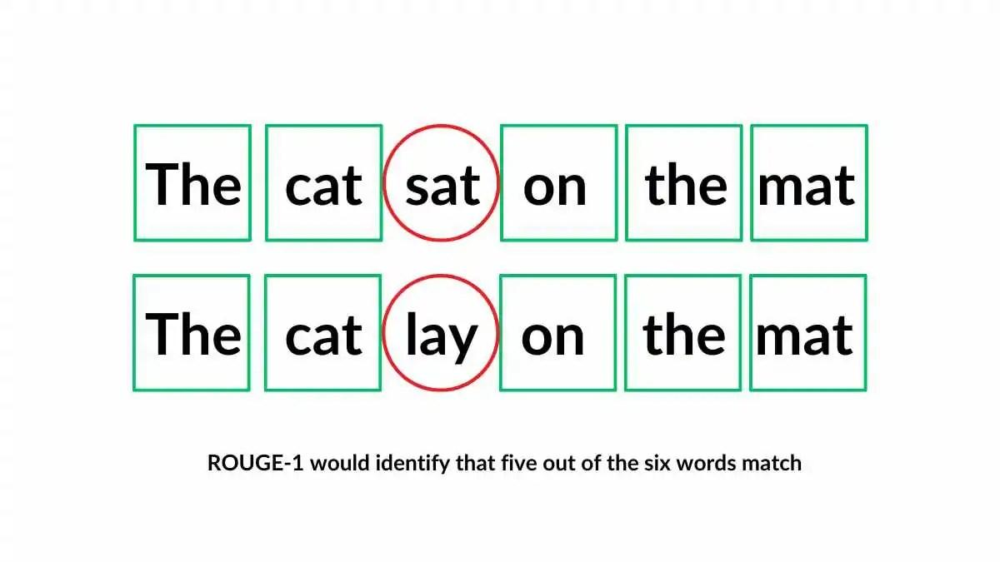

## Table of Contents

## What is Rouge-N and what does it measure in machine learning?

Rouge-N, or Recall-Oriented Understudy for Gisting Evaluation, is a metric used in machine learning to evaluate the quality of text summaries. It measures how well a generated summary captures the key information from a reference summary by comparing overlapping units of text, such as words or sequences of words. Specifically, Rouge-N focuses on N-grams, which are contiguous sequences of N items from a given text or speech. For example, if N is 2, it looks at pairs of words (bigrams). The metric calculates the overlap of these N-grams between the generated summary and the reference summary.

The formula for Rouge-N can be expressed as the number of overlapping N-grams between the generated and reference summaries, divided by the total number of N-grams in the reference summary. This can be written as $$ \text{Rouge-N} = \frac{\text{Number of overlapping N-grams}}{\text{Total N-grams in reference summary}} $$. A higher Rouge-N score indicates a better match between the generated summary and the reference summary, suggesting that the generated summary is more effective at capturing the essential content of the original text. This metric is particularly useful in tasks like automatic summarization and machine translation, where understanding the effectiveness of generated text is crucial.

## How does Rouge-N differ from other Rouge metrics like Rouge-L and Rouge-S?

Rouge-N measures how well a summary matches a reference summary by counting how many groups of N words (called N-grams) are the same in both. For example, if N is 2, it looks at pairs of words. The score is calculated by dividing the number of matching N-grams by the total number of N-grams in the reference summary. This helps to see if the summary captures the important parts of the original text. Rouge-N is useful because it can focus on different sizes of word groups, from single words (unigrams) to longer sequences.

Rouge-L, on the other hand, looks at the longest common subsequence (LCS) between the generated and reference summaries. This means it finds the longest string of words that appear in the same order in both texts, even if they are not next to each other. Rouge-L is good at capturing the overall structure and flow of the summary, not just specific word groups. The formula for Rouge-L can be expressed as $$ \text{Rouge-L} = \frac{\text{Length of LCS}}{\text{Total length of reference summary}} $$. This makes Rouge-L a good choice when you want to check if the summary keeps the original text's order and coherence.

Rouge-S is different because it focuses on skip-bigrams, which are pairs of words that can have other words in between them. This metric is useful for checking if the summary keeps important word pairs, even if they are not right next to each other in the text. Rouge-S can be more flexible than Rouge-N because it allows for some gaps between the words it compares. Each of these Rouge metrics - N, L, and S - has its own way of measuring how good a summary is, and they can be used together to get a full picture of a summary's quality.

## Can you explain the basic formula used to calculate Rouge-N?

Rouge-N is a way to see how good a summary is by looking at how many groups of N words (called N-grams) match between the summary and the original text. If N is 2, it checks pairs of words. The basic formula for Rouge-N counts the number of these matching N-grams and divides it by the total number of N-grams in the original text. This gives a score that shows how well the summary captures the important parts of the original text.

The formula for Rouge-N can be written as $$ \text{Rouge-N} = \frac{\text{Number of overlapping N-grams}}{\text{Total N-grams in reference summary}} $$. For example, if the original text has 10 pairs of words and the summary matches 6 of them, the Rouge-2 score would be $$ \frac{6}{10} = 0.6 $$. This score helps to understand if the summary is doing a good job at keeping the key information from the original text.

## What are the typical values of N used in Rouge-N and why?

The typical values of N used in Rouge-N are 1, 2, and sometimes 3. These values are chosen because they represent unigrams (single words), bigrams (pairs of words), and trigrams (three-word sequences). Using these values allows Rouge-N to measure different levels of text similarity, from individual words to short phrases. Unigrams (N=1) are useful for capturing the basic content of the text, while bigrams (N=2) and trigrams (N=3) help in understanding the structure and context of the text by looking at word sequences.

The reason these specific values of N are commonly used is that they strike a balance between detail and complexity. Unigrams provide a broad overview of the content, making them easy to compute and interpret. Bigrams add a layer of context, showing how words are typically used together, which can be important for understanding the meaning and flow of a text. Trigrams offer even more context but can be more computationally intensive and may not always add significant value over bigrams, depending on the specific application. Therefore, N=1, N=2, and N=3 are the most practical and widely used values in Rouge-N evaluations.

## How is Rouge-N applied in the evaluation of text summarization systems?

Rouge-N is used to check how good a summary is by comparing it to the original text. It looks at groups of N words, called N-grams, and sees how many of these groups match between the summary and the original text. If N is 1, it checks single words. If N is 2, it checks pairs of words. The score for Rouge-N is calculated by dividing the number of matching N-grams by the total number of N-grams in the original text. For example, the formula for Rouge-N is $$ \text{Rouge-N} = \frac{\text{Number of overlapping N-grams}}{\text{Total N-grams in reference summary}} $$. A higher score means the summary is better at capturing the important parts of the original text.

In text summarization systems, Rouge-N helps researchers and developers understand how well their system is working. They can use different values of N, like 1, 2, or 3, to get a full picture of the summary's quality. For example, using N=1 can show if the summary includes the right single words, while N=2 can show if it keeps the right pairs of words. By looking at these scores, people can make their summarization systems better by tweaking them to improve the Rouge-N scores. This way, they can create summaries that are more accurate and useful for readers.

## What are the advantages of using Rouge-N over other evaluation metrics?

Rouge-N is a helpful tool for checking how good a summary is because it looks at groups of words, called N-grams, to see how well the summary matches the original text. By using different values of N, like 1 for single words or 2 for pairs of words, Rouge-N can give a detailed view of the summary's quality. This makes it easy to see if the summary captures the important parts of the original text. The formula for Rouge-N, $$ \text{Rouge-N} = \frac{\text{Number of overlapping N-grams}}{\text{Total N-grams in reference summary}} $$, is simple to understand and calculate, making it a practical choice for many applications.

Another advantage of Rouge-N is that it can be used alongside other Rouge metrics, like Rouge-L and Rouge-S, to get a complete picture of a summary's effectiveness. While Rouge-L looks at the longest common sequence of words and Rouge-S checks for pairs of words with gaps, Rouge-N focuses on exact matches of N-grams. This combination allows for a thorough evaluation of different aspects of the summary, such as content accuracy, structure, and coherence. By using Rouge-N, researchers and developers can improve their text summarization systems to create summaries that are more accurate and useful for readers.

## What are the limitations or criticisms of Rouge-N as an evaluation metric?

Rouge-N is a helpful tool for checking how good a summary is by looking at how many groups of N words (called N-grams) match between the summary and the original text. However, it has some limitations. One big problem is that Rouge-N only looks at how many words or phrases match, not if the summary makes sense or is easy to read. This means a summary could get a high Rouge-N score but still be hard to understand or not tell the full story. Also, Rouge-N can miss important information if the summary uses different words to say the same thing as the original text. For example, if the original text says "the big dog," and the summary says "the large canine," Rouge-N might not count this as a match, even though they mean the same thing.

Another criticism of Rouge-N is that it can be influenced by the length of the summary and the original text. If the summary is very short, it might not include enough N-grams to get a good score, even if it captures the main ideas well. On the other hand, a longer summary might get a higher score just because it has more chances to match N-grams, even if it includes a lot of unimportant details. The formula for Rouge-N, $$ \text{Rouge-N} = \frac{\text{Number of overlapping N-grams}}{\text{Total N-grams in reference summary}} $$, shows that it only counts exact matches, which can sometimes miss the bigger picture of what makes a good summary. Because of these issues, it's often a good idea to use Rouge-N along with other metrics to get a full understanding of a summary's quality.

## How can Rouge-N scores be interpreted and what do different score ranges indicate?

Rouge-N scores help us see how good a summary is by checking how many groups of N words (called N-grams) match between the summary and the original text. The score is calculated using the formula $$ \text{Rouge-N} = \frac{\text{Number of overlapping N-grams}}{\text{Total N-grams in reference summary}} $$. A higher score means the summary is better at capturing the important parts of the original text. For example, if the Rouge-N score is close to 1, it means most of the N-grams in the original text are found in the summary, showing a strong match. On the other hand, a score close to 0 means very few N-grams match, indicating a poor summary.

Different score ranges can give us an idea of how well the summary is doing. If the Rouge-N score is between 0 and 0.3, it means the summary might not be very good at capturing the main ideas of the original text. A score between 0.3 and 0.6 suggests a moderate match, where the summary is doing an okay job but could be better. Scores above 0.6 show that the summary is doing well, with a strong overlap of N-grams, meaning it's capturing a lot of the original text's content effectively. Keep in mind that these ranges are general guidelines, and the best score can vary depending on the specific task and the length of the texts being compared.

## What preprocessing steps are necessary before applying Rouge-N?

Before using Rouge-N to check how good a summary is, you need to do some preparation work on the texts. This includes making all the letters lowercase so that words like "Dog" and "dog" are seen as the same. You also need to take out punctuation marks and numbers, because they can mess up the comparison. Another step is to remove common words like "the," "and," and "is," which are called stop words. These words don't usually add much to the meaning of the summary, so taking them out helps focus on the important content.

After these steps, you can split the texts into groups of N words, called N-grams, to use in the Rouge-N calculation. The formula for Rouge-N is $$ \text{Rouge-N} = \frac{\text{Number of overlapping N-grams}}{\text{Total N-grams in reference summary}} $$. This formula counts how many of these N-gram groups match between the summary and the original text. By preparing the texts this way, you make sure that the Rouge-N score gives a fair and accurate measure of how well the summary captures the main ideas of the original text.

## How does Rouge-N handle issues like synonymy and paraphrasing in text?

Rouge-N looks at how many groups of N words (called N-grams) match between a summary and the original text. It uses the formula $$ \text{Rouge-N} = \frac{\text{Number of overlapping N-grams}}{\text{Total N-grams in reference summary}} $$ to calculate the score. However, Rouge-N has a problem when it comes to synonyms and paraphrasing. If the summary uses different words to say the same thing as the original text, like "big" instead of "large," Rouge-N might not count it as a match. This means that even if the summary captures the same ideas in different words, it might get a lower score.

To deal with this issue, Rouge-N needs to be used with other tools that can understand the meaning of words and phrases. These tools can help see if the summary is good even if it uses different words. While Rouge-N is good at counting exact matches, it doesn't do well with synonyms and paraphrasing on its own. So, it's important to use Rouge-N along with other metrics to get a full picture of how good a summary is.

## Can Rouge-N be used for languages other than English, and if so, what considerations are needed?

Rouge-N can be used for languages other than English. It looks at how many groups of N words (called N-grams) match between a summary and the original text. The formula for Rouge-N is $$ \text{Rouge-N} = \frac{\text{Number of overlapping N-grams}}{\text{Total N-grams in reference summary}} $$. This method works the same way for any language, but you need to think about some things when using it for other languages.

One important thing to consider is how to handle different word forms and grammar rules in other languages. For example, some languages have more complex grammar or use different word orders. You might need to change the preprocessing steps, like how you handle punctuation or common words, to fit the language you are working with. Also, Rouge-N might not work as well for languages where synonyms and paraphrasing are common, because it only counts exact matches. So, it's a good idea to use Rouge-N with other tools that can understand the meaning of words and phrases in different languages.

## What advanced techniques or modifications have been proposed to enhance the effectiveness of Rouge-N?

To make Rouge-N better at checking how good a summary is, some people have come up with new ideas. One idea is to use something called word embeddings. These are ways to understand the meaning of words by turning them into numbers. By using word embeddings, Rouge-N can see if words in the summary mean the same thing as words in the original text, even if they are not the exact same words. This helps Rouge-N handle synonyms and paraphrasing better. Another idea is to use a technique called soft matching, where words that are similar but not exactly the same can still count as a match. This makes Rouge-N more flexible and able to give a better score to summaries that capture the main ideas in different words.

Another way to improve Rouge-N is to change how it counts the matches. Instead of just looking at how many N-grams match, some people suggest using a weighted score. This means that some N-grams could be more important than others, so they get a higher score when they match. The formula for this weighted Rouge-N could be something like $$ \text{Weighted Rouge-N} = \frac{\sum (\text{Weight of overlapping N-gram})}{\sum (\text{Weight of N-grams in reference summary})} $$. This can help focus on the most important parts of the text. Also, some researchers have tried combining Rouge-N with other metrics, like Rouge-L and Rouge-S, to get a fuller picture of how good a summary is. By using these advanced techniques, Rouge-N can become a more powerful tool for checking the quality of summaries.