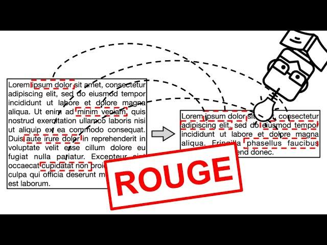

## Table of Contents

## What is ROUGE and what does it stand for?

ROUGE is a set of metrics used to evaluate the quality of text summaries. It stands for Recall-Oriented Understudy for Gisting Evaluation. ROUGE works by comparing a generated summary to a set of reference summaries and measuring how well the generated summary captures the content of the references. It's commonly used in natural language processing tasks, especially in automatic summarization, to see how good a computer-generated summary is compared to summaries written by humans.

There are several versions of ROUGE, like ROUGE-N, ROUGE-L, and ROUGE-S, each focusing on different aspects of the summary. ROUGE-N measures the overlap of n-grams between the generated and reference summaries. For example, ROUGE-1 looks at the overlap of single words, while ROUGE-2 looks at pairs of words. ROUGE-L measures the longest common subsequence, which helps understand the sentence-level structure similarity. ROUGE-S, on the other hand, focuses on skip-bigram co-occurrence. These different measures help researchers and developers understand various facets of summary quality.

## What are the main types of ROUGE metrics?

ROUGE metrics help measure how good a computer-generated summary is by comparing it to summaries written by humans. There are several types of ROUGE metrics, but the main ones are ROUGE-N, ROUGE-L, and ROUGE-S. Each type looks at different parts of the summary to see how well it matches the human-written ones.

ROUGE-N measures how many groups of words (called n-grams) in the computer summary match the human summaries. For example, ROUGE-1 looks at single words, while ROUGE-2 looks at pairs of words. If a computer summary has many of the same single words or word pairs as the human summaries, it gets a higher ROUGE-N score. 

ROUGE-L checks the longest series of words that are the same in both the computer and human summaries, no matter where they are in the text. This helps see if the summaries follow a similar order of ideas. ROUGE-S looks at pairs of words that might be next to each other or have other words in between. This can show if the computer summary captures the main ideas, even if it uses different words or structures.

## How is ROUGE used in the evaluation of text summarization?

ROUGE is a tool used to check how good a computer-made summary is by comparing it to summaries written by people. It does this by looking at how many words or groups of words from the human summaries are also in the computer summary. For example, if a computer summary has many of the same words or phrases as the human summaries, it gets a high ROUGE score. This helps people know if the computer summary is good or if it needs to be better.

There are different ways ROUGE can check summaries. ROUGE-N looks at groups of words, like single words or pairs of words. If the computer summary has a lot of these groups that match the human summaries, it gets a good score. ROUGE-L looks at the longest series of words that are the same in both summaries, which helps see if the summaries follow a similar order of ideas. ROUGE-S looks at pairs of words that might be next to each other or have other words in between, helping to see if the main ideas are captured even if the words are different.

## What are the differences between ROUGE-N, ROUGE-L, and ROUGE-S?

ROUGE-N, ROUGE-L, and ROUGE-S are different ways to check how good a computer-made summary is by comparing it to summaries written by people. ROUGE-N looks at groups of words, called n-grams. For example, ROUGE-1 checks for single words, while ROUGE-2 checks for pairs of words. If the computer summary has a lot of these groups that match the human summaries, it gets a good score. This helps see if the computer summary has the same important words or phrases as the human summaries.

ROUGE-L looks at the longest series of words that are the same in both the computer and human summaries. This helps understand if the summaries follow a similar order of ideas. For example, if the computer summary has "The cat sat on the mat" and the human summary has "The cat sat on a mat," ROUGE-L would see that "The cat sat on" is a long match, even if the last word is different. This shows that the summaries have a similar structure.

ROUGE-S focuses on pairs of words that might be next to each other or have other words in between. This is useful to see if the main ideas are captured, even if the words are different or the structure changes. For example, if the computer summary says "The cat sat on the mat" and the human summary says "The mat was sat on by the cat," ROUGE-S would find matches like "The cat" and "sat on" even though the order is different. This helps see if the computer summary captures the essence of the human summary, regardless of the exact wording.

## Can you explain how ROUGE-N is calculated?

ROUGE-N measures how many groups of words (n-grams) in the computer summary match the human summaries. For example, ROUGE-1 looks at single words, and ROUGE-2 looks at pairs of words. To calculate ROUGE-N, you count how many n-grams from the computer summary are also in the human summaries. Then, you find the recall, precision, and F-measure. Recall is the number of matching n-grams divided by the total number of n-grams in the human summaries. Precision is the number of matching n-grams divided by the total number of n-grams in the computer summary. The F-measure is a balance between recall and precision, calculated as the harmonic mean of the two.

To make it clearer, let's look at an example. If the computer summary is "The cat sat on the mat" and the human summary is "The cat sat on a mat," for ROUGE-1 (single words), the matching n-grams are "The," "cat," "sat," "on," and "mat." If we count these, we get 5 matching n-grams. The recall would be 5 divided by the total number of n-grams in the human summary, and the precision would be 5 divided by the total number of n-grams in the computer summary. The F-measure would then be calculated using these values. For ROUGE-2 (pairs of words), the matching n-grams might be "The cat," "cat sat," and "sat on," and you'd use these to calculate the scores similarly.

## How does ROUGE-L measure the longest common subsequence?

ROUGE-L measures how good a computer summary is by looking at the longest series of words that are the same in both the computer summary and the human summary. This is called the longest common subsequence (LCS). Imagine you have two sentences: "The cat sat on the mat" and "The cat sat on a mat." ROUGE-L would see that "The cat sat on" is a long series of words that are the same in both sentences, even if the last word is different. This helps understand if the computer summary follows a similar order of ideas as the human summary.

To calculate ROUGE-L, you first find the LCS between the computer summary and the human summary. Then, you use this to find the recall, precision, and F-measure. Recall is the length of the LCS divided by the length of the human summary. Precision is the length of the LCS divided by the length of the computer summary. The F-measure is a balance between recall and precision, calculated as the harmonic mean of the two. This gives a good overall score of how well the computer summary matches the human summary.

## What is the significance of ROUGE-S in evaluating summaries?

ROUGE-S helps check how good a computer summary is by looking at pairs of words that might be next to each other or have other words in between. This is important because it shows if the computer summary captures the main ideas, even if the words are different or the order changes. For example, if the computer summary says "The cat sat on the mat" and the human summary says "The mat was sat on by the cat," ROUGE-S would find matches like "The cat" and "sat on." This helps see if the computer summary gets the essence of the human summary, no matter the exact wording.

By using ROUGE-S, we can understand if the computer summary keeps the important parts of the human summary. This is useful because sometimes summaries can use different words or structures but still cover the same ideas. ROUGE-S helps us see this by focusing on these word pairs, making it a good way to check if the computer summary is good at capturing the main points of the human summary.

## How can ROUGE be applied to different languages?

ROUGE can be used for summaries in different languages by changing how it looks at words and phrases. Instead of using English words, ROUGE can use words from other languages. For example, if you want to check a summary in Spanish, you would tell ROUGE to look for Spanish words and phrases. This way, ROUGE can see if the computer summary in Spanish matches the human summaries in Spanish. The main idea is the same: ROUGE checks how many words or groups of words from the human summaries are also in the computer summary, but it uses the language of the summaries.

Using ROUGE for different languages might need some changes in how it counts words. Some languages have different rules for words and phrases, so ROUGE might need to be adjusted to fit these rules. For example, in Chinese, words might not be separated by spaces like in English, so ROUGE would need to know how to handle this. By making these adjustments, ROUGE can be a helpful tool for checking summaries in many languages, making sure the computer summaries are good no matter what language they are in.

## What are the limitations of using ROUGE for text summarization evaluation?

ROUGE is a helpful tool for checking how good a computer summary is by comparing it to summaries written by people. But it has some limits. One big limit is that ROUGE mostly looks at how many words or groups of words match between the computer summary and the human summary. This means it might not see if the computer summary makes sense or if it keeps the main ideas of the original text. For example, if a computer summary uses the same words as the human summary but in a different order that doesn't make sense, ROUGE might still give it a high score.

Another limit of ROUGE is that it can be hard to use with different languages. While you can change ROUGE to look at words in different languages, it might not work well with languages that have different rules for words and phrases. For example, in Chinese, words are not separated by spaces like in English, so ROUGE might need special changes to work right. This can make it tricky to use ROUGE for summaries in many languages without making a lot of adjustments.

## How can ROUGE scores be interpreted and what thresholds are considered good?

ROUGE scores help us understand how well a computer summary matches summaries written by people. The scores can range from 0 to 1, with 1 being a perfect match. For ROUGE-N, a higher score means more groups of words (n-grams) from the computer summary are found in the human summary. ROUGE-L looks at the longest series of words that match, and ROUGE-S checks pairs of words that might be next to each other or have other words in between. A good ROUGE score depends on what you're comparing it to, but generally, scores above 0.4 are often seen as pretty good, and scores above 0.5 are considered very good.

However, what counts as a good score can change based on the type of text and what you're trying to do. For example, in news articles, a ROUGE score of 0.3 might be okay, but for scientific papers, you might want a higher score like 0.5. It's also important to look at more than just the score. You should read the summaries to see if they make sense and keep the main ideas of the original text. ROUGE scores are just one part of checking how good a summary is, and they should be used with other ways of looking at summaries to get the full picture.

## What are some alternatives to ROUGE for evaluating text summarization?

Besides ROUGE, there are other ways to check how good a computer summary is. One common way is to use BLEU (Bilingual Evaluation Understudy), which is often used in machine translation to see how well a translated text matches a human translation. BLEU looks at how many groups of words (n-grams) from the computer summary are also in the human summary, similar to ROUGE-N. But BLEU also uses a special way to make sure longer matches are more important than shorter ones. Another tool is METEOR (Metric for Evaluation of Translation with Explicit ORdering), which not only looks at exact word matches but also at words that mean the same thing or are similar, which can be helpful for summaries that use different words to say the same thing.

Another alternative is BERTScore, which uses a smart model called BERT (Bidirectional Encoder Representations from Transformers) to understand the meaning of words and sentences. BERTScore looks at how similar the meanings of the computer summary and human summary are, not just the words. This can be really helpful because it checks if the summary keeps the main ideas, even if it uses different words. There are also human evaluations, where people read the summaries and rate them based on how well they understand the main points, how well they are written, and how useful they are. These human checks can give a more complete picture of how good a summary is, but they take more time and effort than using automatic tools like ROUGE or BLEU.

## How can ROUGE be integrated into a machine learning pipeline for automatic summarization?

ROUGE can be added to a [machine learning](/wiki/machine-learning) pipeline for automatic summarization by using it to check how good the summaries are. After the machine learning model makes a summary, ROUGE compares it to human-written summaries. This helps the model learn to make better summaries over time. To do this, you would need to write code that takes the model's summary and the human summaries, then uses ROUGE to find scores like ROUGE-N, ROUGE-L, and ROUGE-S. These scores can be used to see how well the model is doing and to make changes to improve it.

For example, you might use ROUGE scores as part of the model's training process. If the model's summaries get high ROUGE scores, it means they are similar to human summaries, so the model is doing well. If the scores are low, you might need to change the model or the way it learns. You can use these scores to adjust the model's settings or to try different ways of making summaries until you get better results. By using ROUGE in this way, you can keep improving the model to make summaries that are more like what a person would write.

## References & Further Reading

[1]: Lin, C.-Y. (2004). ["ROUGE: A Package for Automatic Evaluation of Summaries."](https://aclanthology.org/W04-1013/) In Text Summarization Branches Out: Proceedings of the ACL-04 Workshop.

[2]: Ganesan, K. (2018). ["ROUGE 2.0: Updated and Improved Measures for Evaluation of Summaries."](https://arxiv.org/abs/1803.01937) In Proceedings of the First Workshop on Evaluation of Human Performance of NLP Systems.

[3]: Zhang, T., Kishore, V., Wu, F., Weinberger, K. Q., & Artzi, Y. (2020). ["BERTScore: Evaluating Text Generation with BERT."](https://arxiv.org/abs/1904.09675) In International Conference on Learning Representations (ICLR).

[4]: Papineni, K., Roukos, S., Ward, T., & Zhu, W.-J. (2002). ["BLEU: a Method for Automatic Evaluation of Machine Translation."](https://aclanthology.org/P02-1040/) In Proceedings of the 40th Annual Meeting of the Association for Computational Linguistics (ACL).

[5]: Banerjee, S., & Lavie, A. (2005). ["METEOR: An Automatic Metric for MT Evaluation with Improved Correlation with Human Judgments."](https://aclanthology.org/W05-0909/) In Proceedings of the ACL Workshop on Intrinsic and Extrinsic Evaluation Measures for Machine Translation and/or Summarization.