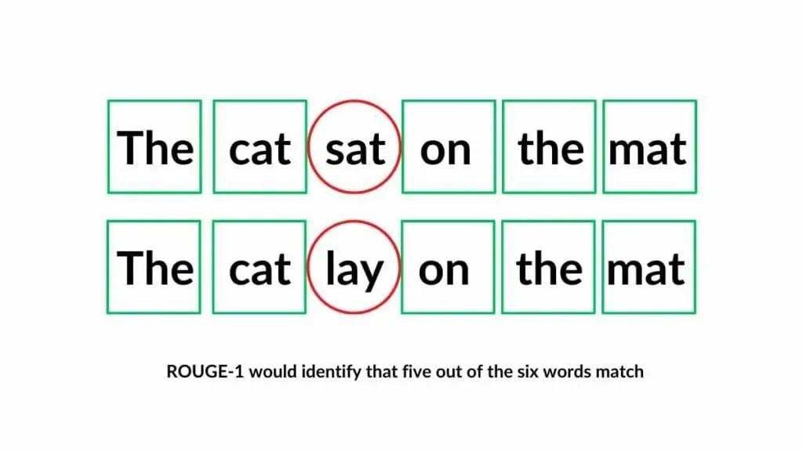

## Table of Contents

## What is Rouge-S in the context of machine learning?

Rouge-S, or Skip-Bigram Co-Occurrence Statistics, is a measure used in machine learning to evaluate the quality of text summaries. It looks at how well a generated summary matches a reference summary by considering pairs of words that appear in the text, even if they are not next to each other. This is different from other Rouge metrics that only consider consecutive word pairs. By allowing for "skips" between words, Rouge-S can better capture the meaning and structure of a summary, making it a useful tool for tasks like automatic summarization.

In simple terms, Rouge-S counts how many pairs of words from the generated summary also appear in the reference summary, regardless of the distance between the words. For example, if the reference summary has the phrase "the cat sat on the mat," and the generated summary says "the mat was where the cat sat," Rouge-S would still count "the cat," "cat sat," and "sat on" as matches, even though the words are in different orders. This flexibility helps Rouge-S to be more forgiving and realistic in assessing the quality of summaries, which is important for developing better machine learning models for text summarization.

## How does Rouge-S differ from other Rouge metrics?

Rouge-S, or Skip-Bigram Co-Occurrence Statistics, is different from other Rouge metrics because it looks at pairs of words that don't have to be next to each other. Most other Rouge metrics, like Rouge-1 and Rouge-2, only count words that are right next to each other. For example, Rouge-2 looks at pairs of consecutive words, or bigrams. But Rouge-S allows for "skips" between the words in a pair, which means it can match words that are further apart in the text.

This flexibility makes Rouge-S better at capturing the overall meaning and structure of a summary. Imagine you have a reference summary that says "the cat sat on the mat," and a generated summary that says "the mat was where the cat sat." Rouge-2 would only count "the cat" as a match because "cat" and "sat" are not next to each other in the generated summary. But Rouge-S would also count "cat sat" and "sat on" as matches, even though there are other words between them. This makes Rouge-S a more forgiving and realistic way to evaluate summaries, which is helpful for improving [machine learning](/wiki/machine-learning) models that create summaries.

## What are the basic components of Rouge-S?

Rouge-S, or Skip-Bigram Co-Occurrence Statistics, is a way to measure how good a summary is by looking at pairs of words that don't need to be right next to each other. It counts how many of these word pairs from a generated summary also appear in a reference summary. For example, if the reference summary says "the cat sat on the mat" and the generated summary says "the mat was where the cat sat," Rouge-S would count "the cat," "cat sat," and "sat on" as matches, even though the words are not in the same order.

The basic idea behind Rouge-S is to use a formula to calculate how many of these skip-bigrams match between the two summaries. The formula for Rouge-S can be written as $$ \text{Rouge-S} = \frac{\sum_{\text{skip-bigram} \in S} \text{Count}_{\text{match}}(\text{skip-bigram})}{\sum_{\text{skip-bigram} \in S} \text{Count}(\text{skip-bigram})} $$, where $$S$$ is the set of skip-bigrams in the generated summary, $$\text{Count}_{\text{match}}(\text{skip-bigram})$$ is the number of times a skip-bigram from the generated summary appears in the reference summary, and $$\text{Count}(\text{skip-bigram})$$ is the number of times a skip-bigram appears in the generated summary. This formula helps to see how well the generated summary captures the important parts of the reference summary, even if the words are arranged differently.

## How is Rouge-S calculated?

Rouge-S, or Skip-Bigram Co-Occurrence Statistics, is calculated by looking at pairs of words in a summary that don't have to be right next to each other. It counts how many of these word pairs from a generated summary also appear in a reference summary. For example, if the reference summary says "the cat sat on the mat" and the generated summary says "the mat was where the cat sat," Rouge-S would count "the cat," "cat sat," and "sat on" as matches, even if the words are not in the same order.

The formula for calculating Rouge-S is $$ \text{Rouge-S} = \frac{\sum_{\text{skip-bigram} \in S} \text{Count}_{\text{match}}(\text{skip-bigram})}{\sum_{\text{skip-bigram} \in S} \text{Count}(\text{skip-bigram})} $$. In this formula, $$S$$ is the set of skip-bigrams in the generated summary, $$\text{Count}_{\text{match}}(\text{skip-bigram})$$ is the number of times a skip-bigram from the generated summary appears in the reference summary, and $$\text{Count}(\text{skip-bigram})$$ is the number of times a skip-bigram appears in the generated summary. This formula helps to see how well the generated summary captures the important parts of the reference summary, even if the words are arranged differently.

## What are the typical applications of Rouge-S in machine learning?

Rouge-S, or Skip-Bigram Co-Occurrence Statistics, is commonly used in machine learning to check how good a summary is. It looks at pairs of words that don't need to be next to each other, which is helpful for tasks like automatic text summarization. For example, if you have a long article and want a computer to make a short summary, Rouge-S can tell you how well the short summary matches the important parts of the original article. It's especially useful because it can catch the meaning of the summary even if the words are not in the same order as in the original text.

In machine learning, Rouge-S is often used to compare different ways of making summaries to see which one works best. Researchers might try different methods and use Rouge-S to see which method creates summaries that are closest to the reference summaries. The formula for Rouge-S is $$ \text{Rouge-S} = \frac{\sum_{\text{skip-bigram} \in S} \text{Count}_{\text{match}}(\text{skip-bigram})}{\sum_{\text{skip-bigram} \in S} \text{Count}(\text{skip-bigram})} $$. This helps them improve their models to make better summaries over time.

## Can you explain the significance of skip-bigram in Rouge-S?

Skip-bigrams are really important in Rouge-S because they let the measure look at pairs of words that don't have to be right next to each other. This is different from other Rouge measures that only count words that are next to each other. By allowing for "skips" between words, Rouge-S can better understand the meaning of a summary even if the words are in a different order. For example, if the reference summary says "the cat sat on the mat" and the generated summary says "the mat was where the cat sat," Rouge-S can still count "the cat," "cat sat," and "sat on" as matches. This makes Rouge-S more flexible and realistic when checking how good a summary is.

The formula for Rouge-S is $$ \text{Rouge-S} = \frac{\sum_{\text{skip-bigram} \in S} \text{Count}_{\text{match}}(\text{skip-bigram})}{\sum_{\text{skip-bigram} \in S} \text{Count}(\text{skip-bigram})} $$. In this formula, $$S$$ is the set of skip-bigrams in the generated summary, $$\text{Count}_{\text{match}}(\text{skip-bigram})$$ is how many times a skip-bigram from the generated summary appears in the reference summary, and $$\text{Count}(\text{skip-bigram})$$ is how many times a skip-bigram appears in the generated summary. This way, Rouge-S helps machine learning models get better at making summaries that capture the main points of a text, even if the words are arranged differently.

## How does Rouge-S help in evaluating the quality of text summarization?

Rouge-S helps in evaluating the quality of text summarization by looking at pairs of words that don't have to be next to each other. This is called skip-bigrams. When a computer makes a summary, Rouge-S checks how many of these skip-bigrams from the summary also appear in the original text. For example, if the original text says "the cat sat on the mat" and the summary says "the mat was where the cat sat," Rouge-S can still count "the cat," "cat sat," and "sat on" as matches. This makes Rouge-S a good way to see if the summary captures the main ideas of the original text, even if the words are in a different order.

The formula for Rouge-S is $$ \text{Rouge-S} = \frac{\sum_{\text{skip-bigram} \in S} \text{Count}_{\text{match}}(\text{skip-bigram})}{\sum_{\text{skip-bigram} \in S} \text{Count}(\text{skip-bigram})} $$. In this formula, $$S$$ is the set of skip-bigrams in the summary, $$\text{Count}_{\text{match}}(\text{skip-bigram})$$ is how many times a skip-bigram from the summary appears in the original text, and $$\text{Count}(\text{skip-bigram})$$ is how many times a skip-bigram appears in the summary. By using this formula, Rouge-S helps researchers and developers see how well their methods of making summaries work. This way, they can improve their machine learning models to create better summaries that are more like the original texts.

## What are the limitations of using Rouge-S for evaluation?

Rouge-S is a helpful tool for checking how good a summary is, but it has some problems. One big issue is that it only looks at pairs of words, not the whole meaning of the summary. So, if the summary misses important ideas or gets them wrong, Rouge-S might still say it's good if it has the right pairs of words. Also, Rouge-S can be tricked by summaries that just repeat the same words over and over, because it will count those word pairs many times.

Another problem with Rouge-S is that it can be hard to use with different languages or types of writing. It works best with English and simple texts, but might not work as well with other languages or more complex writing styles. This means it might not be the best choice for every situation. Even though Rouge-S is good at catching the main ideas of a summary, these limitations mean it's not perfect and should be used with other ways of checking summary quality.

## How can Rouge-S be implemented in a machine learning project?

To implement Rouge-S in a machine learning project, you first need to understand how it works. Rouge-S looks at pairs of words that don't have to be next to each other, called skip-bigrams. You can use a programming language like Python to calculate Rouge-S. Start by breaking down the reference summary and the generated summary into skip-bigrams. Then, count how many of these skip-bigrams from the generated summary also appear in the reference summary. The formula for Rouge-S is $$ \text{Rouge-S} = \frac{\sum_{\text{skip-bigram} \in S} \text{Count}_{\text{match}}(\text{skip-bigram})}{\sum_{\text{skip-bigram} \in S} \text{Count}(\text{skip-bigram})} $$, where $$S$$ is the set of skip-bigrams in the generated summary, $$\text{Count}_{\text{match}}(\text{skip-bigram})$$ is the number of times a skip-bigram from the generated summary appears in the reference summary, and $$\text{Count}(\text{skip-bigram})$$ is the number of times a skip-bigram appears in the generated summary. You can use this formula to see how well your summary matches the original text.

Once you have the Rouge-S score, you can use it to compare different ways of making summaries in your machine learning project. If you're trying different methods to create summaries, you can use Rouge-S to see which method works best. For example, you might write a Python script to automatically calculate the Rouge-S score for each summary your model generates. This helps you improve your model over time by choosing the method that gives the highest Rouge-S score. Remember that while Rouge-S is a useful tool, it's not perfect, so it's a good idea to use it along with other ways to check the quality of your summaries.

## What are some advanced techniques to improve the performance of Rouge-S?

To improve the performance of Rouge-S, one technique is to use more reference summaries. Instead of comparing your generated summary to just one reference summary, you can compare it to several different ones. This can give you a better idea of how good your summary is because it looks at different ways to summarize the same text. Another technique is to combine Rouge-S with other measures of summary quality. For example, you can use Rouge-1, which looks at single words, or Rouge-2, which looks at pairs of words that are next to each other. By using these together, you get a fuller picture of how well your summary captures the main ideas of the original text.

Another advanced technique is to tweak the skip distance in Rouge-S. The skip distance is how far apart the words in a skip-bigram can be. By changing this distance, you can make Rouge-S more or less strict. For example, if you set a larger skip distance, Rouge-S will be more forgiving and might give higher scores to summaries that capture the overall meaning but have words in different places. You can also use machine learning to fine-tune the parameters of Rouge-S. For instance, you might train a model to find the best skip distance or the best way to combine Rouge-S with other measures. The formula for Rouge-S is $$ \text{Rouge-S} = \frac{\sum_{\text{skip-bigram} \in S} \text{Count}_{\text{match}}(\text{skip-bigram})}{\sum_{\text{skip-bigram} \in S} \text{Count}(\text{skip-bigram})} $$, where $$S$$ is the set of skip-bigrams in the generated summary, $$\text{Count}_{\text{match}}(\text{skip-bigram})$$ is how many times a skip-bigram from the generated summary appears in the reference summary, and $$\text{Count}(\text{skip-bigram})$$ is how many times a skip-bigram appears in the generated summary. By tweaking these elements, you can make Rouge-S work better for your specific project.

## How does Rouge-S compare with other evaluation metrics in natural language processing?

Rouge-S is different from other evaluation metrics in natural language processing because it looks at pairs of words that don't have to be next to each other. This makes it good for checking how well a summary captures the main ideas of a text, even if the words are in a different order. Other common metrics like Rouge-1 and Rouge-2 only look at single words or pairs of words that are right next to each other. For example, if the reference summary says "the cat sat on the mat" and the generated summary says "the mat was where the cat sat," Rouge-S can still count "the cat," "cat sat," and "sat on" as matches. The formula for Rouge-S is $$ \text{Rouge-S} = \frac{\sum_{\text{skip-bigram} \in S} \text{Count}_{\text{match}}(\text{skip-bigram})}{\sum_{\text{skip-bigram} \in S} \text{Count}(\text{skip-bigram})} $$, where $$S$$ is the set of skip-bigrams in the generated summary, $$\text{Count}_{\text{match}}(\text{skip-bigram})$$ is how many times a skip-bigram from the generated summary appears in the reference summary, and $$\text{Count}(\text{skip-bigram})$$ is how many times a skip-bigram appears in the generated summary.

Another metric, BLEU (Bilingual Evaluation Understudy), is often used to check how good machine translations are. BLEU looks at how many words in the translated text match the reference text, and it also considers how the words are arranged. Unlike Rouge-S, BLEU doesn't use skip-bigrams, so it's more strict about the order of words. METEOR is another metric that tries to understand the meaning of the text by looking at synonyms and how words are arranged. METEOR is more flexible than BLEU but still not as flexible as Rouge-S because it doesn't use skip-bigrams. Each of these metrics has its own strengths and weaknesses, so they are often used together to get a better overall picture of how good a summary or translation is.

## What future developments can we expect in the application of Rouge-S?

In the future, we might see Rouge-S being used in more languages and types of writing. Right now, it works best with English and simple texts, but researchers are working on ways to make it work better with other languages and more complex writing styles. This could help people use Rouge-S to check summaries in different situations, like news articles in different languages or scientific papers. Also, we might see new ways to combine Rouge-S with other measures of summary quality. By using Rouge-S along with other metrics like Rouge-1 and Rouge-2, we can get a better overall picture of how good a summary is. This could help make machine learning models for summarizing text even better.

Another future development could be using machine learning to fine-tune Rouge-S. For example, researchers might use machine learning to find the best skip distance or the best way to combine Rouge-S with other measures. The formula for Rouge-S is $$ \text{Rouge-S} = \frac{\sum_{\text{skip-bigram} \in S} \text{Count}_{\text{match}}(\text{skip-bigram})}{\sum_{\text{skip-bigram} \in S} \text{Count}(\text{skip-bigram})} $$, where $$S$$ is the set of skip-bigrams in the generated summary, $$\text{Count}_{\text{match}}(\text{skip-bigram})$$ is how many times a skip-bigram from the generated summary appears in the reference summary, and $$\text{Count}(\text{skip-bigram})$$ is how many times a skip-bigram appears in the generated summary. By tweaking these elements, we can make Rouge-S work better for specific projects. This could lead to more accurate and useful ways to check the quality of summaries, helping to improve how we use machine learning for text summarization.

## References & Further Reading

[1]: Lin, C.-Y. (2004). "[ROUGE: A Package for Automatic Evaluation of Summaries](https://aclanthology.org/W04-1013/)." In Text Summarization Branches Out: Proceedings of the ACL-04 Workshop.

[2]: Lin, C.-Y., & Hovy, E. (2003). "[Automatic Evaluation of Summaries Using N-gram Co-occurrence Statistics](https://aclanthology.org/N03-1020/)." In Proceedings of the 2003 Conference of the North American Chapter of the Association for Computational Linguistics on Human Language Technology.

[3]: Papineni, K., Roukos, S., Ward, T., & Zhu, W.-J. (2002). "[BLEU: a Method for Automatic Evaluation of Machine Translation](https://aclanthology.org/P02-1040/)." In Proceedings of the 40th Annual Meeting of the Association for Computational Linguistics.

[4]: Banerjee, S., & Lavie, A. (2005). "[METEOR: An Automatic Metric for MT Evaluation with Improved Correlation with Human Judgments](https://aclanthology.org/W05-0909/)." In Proceedings of the ACL Workshop on Intrinsic and Extrinsic Evaluation Measures for Machine Translation and/or Summarization.

[5]: Mani, I. (2001). "[Automatic Summarization](https://books.google.com/books/about/Automatic_Summarization.html?id=CSHxUOfb5bwC)." Springer US.