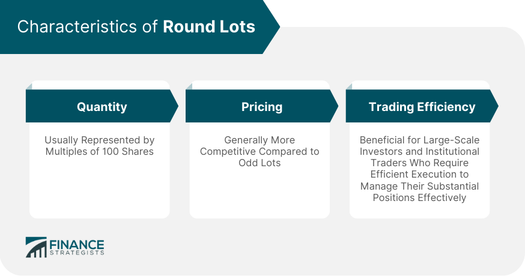

## Table of Contents

## What is a round lot in the context of stock trading?

A round lot in stock trading is a standard number of shares that are traded together. For most stocks, a round lot is 100 shares. This makes it easier for traders and brokers to handle transactions because it's a round, even number. When people buy or sell stocks in round lots, it helps keep the trading process smooth and organized.

Sometimes, people might want to buy or sell fewer than 100 shares. This is called an odd lot. Odd lots can be more complicated to trade because they don't fit into the standard round lot size. However, with the rise of online trading platforms, it has become easier for people to trade odd lots as well. Still, round lots remain the most common way to trade stocks because they are simpler to manage.

## How does a round lot differ from an odd lot?

A round lot is a standard number of shares that people usually trade together. For most stocks, this is 100 shares. Trading in round lots makes things easier for everyone because it's a round, even number. It's like buying things in packs; it's simpler to handle and keep track of.

An odd lot, on the other hand, is when someone wants to buy or sell fewer than 100 shares. This can make trading a bit trickier because it doesn't fit the standard size. It's like trying to buy just one item from a pack that's meant to be sold together. Nowadays, with online trading, it's easier to trade odd lots, but round lots are still the most common way to trade because they're simpler to manage.

## Why is trading in round lots significant for investors?

Trading in round lots is important for investors because it makes buying and selling stocks easier. When you trade in round lots, which is usually 100 shares, it fits the standard size that brokers and markets expect. This makes the process smoother and can sometimes even save on costs because brokers might charge less for handling round lots.

Another reason round lots matter is that they can help investors get better prices. Since round lots are the most common way to trade, there are usually more buyers and sellers looking for them. This can make it easier to find someone to trade with at a good price. Plus, trading in round lots can be seen as more professional and can help investors feel more confident in their trades.

## What is the standard size of a round lot for most stocks?

The standard size of a round lot for most stocks is 100 shares. This means when people buy or sell stocks, they often do it in groups of 100. This makes it easier for everyone because it's a round number that fits well with how the stock market works.

Using round lots helps keep things simple. Brokers and markets like round lots because they can handle these trades more easily. It's like buying things in packs; it's easier to manage and keep track of when everything is in even numbers.

## How do round lots affect the pricing and liquidity of stocks?

Round lots can make a big difference in how easy it is to buy and sell stocks, which we call [liquidity](/wiki/liquidity-risk-premium). When people trade in round lots, which is usually 100 shares, there are often more buyers and sellers looking to trade these exact amounts. This means it's easier to find someone to trade with, which can make the market more liquid. When a market is liquid, it means you can buy or sell your stocks quickly without changing the price too much.

Round lots can also affect the price of stocks. Because round lots are the standard way to trade, they can help keep prices stable. When lots of people are trading in round lots, it can balance out the supply and demand for a stock, which helps keep the price from jumping around too much. If there are more people trading in round lots, it can make the stock's price more predictable and easier to work with for investors.

## Can the size of a round lot change, and if so, under what circumstances?

Yes, the size of a round lot can change, but it doesn't happen very often. For most stocks, a round lot is 100 shares, but some stocks, especially those that are very expensive, might have a different round lot size. For example, if a stock costs a lot of money per share, the round lot might be smaller, like 10 shares, to make it easier for people to buy and sell.

The stock exchange or the company itself can decide to change the round lot size. They might do this if they think it will help more people trade the stock or if the stock's price changes a lot. Changing the round lot size can make trading easier and more fair for everyone, but it's not something that happens all the time.

## What are the advantages of trading in round lots compared to odd lots?

Trading in round lots, which is usually 100 shares, makes things easier for everyone. When you buy or sell stocks in round lots, it fits the standard size that brokers and markets expect. This means the process is smoother and can sometimes save you money because brokers might charge less for handling round lots. It's like buying things in packs; it's simpler to manage and keep track of when everything is in even numbers.

Round lots also help with the price and how easy it is to trade stocks. Because round lots are the most common way to trade, there are usually more people looking to buy and sell them. This makes it easier to find someone to trade with, which can make the market more liquid. When a market is liquid, you can buy or sell your stocks quickly without changing the price too much. Plus, trading in round lots can help keep prices stable because it balances out the supply and demand for a stock.

## How do electronic trading platforms handle round lot transactions?

Electronic trading platforms make it easy to trade stocks in round lots, which is usually 100 shares. When you place an order for a round lot, the platform's system recognizes it as the standard size and can match it with other orders more easily. This makes the whole process smoother and quicker because the platform is designed to handle these common sizes well.

These platforms also show the current prices and how many shares are available in round lots. This helps you see if there are enough round lots to buy or sell at the price you want. Because round lots are the most common way to trade, electronic platforms are set up to handle them efficiently, making it easier for you to get the best price and complete your trade quickly.

## What role do round lots play in the overall market efficiency?

Round lots help make the stock market work better. When people buy or sell stocks in round lots, which is usually 100 shares, it's easier for everyone. Brokers and markets like round lots because they can handle these trades more easily. This makes the whole process smoother and can help keep costs down because brokers might charge less for handling round lots. It's like buying things in packs; it's simpler to manage and keep track of when everything is in even numbers.

Round lots also help with how quickly and easily stocks can be traded, which we call liquidity. When lots of people are trading in round lots, it's easier to find someone to trade with. This means you can buy or sell your stocks quickly without changing the price too much. Plus, trading in round lots can help keep prices stable because it balances out the supply and demand for a stock. This makes the market more efficient because it's easier for everyone to trade and the prices don't jump around as much.

## How have recent market trends influenced the use of round lots?

Recent market trends have made it easier for people to trade in smaller amounts, which we call odd lots. This is because more people are using online trading platforms that let them buy and sell just a few shares at a time. Even though odd lots are more common now, round lots, which are usually 100 shares, are still very important. They make trading easier for everyone because they are the standard size that brokers and markets expect.

Even with these changes, round lots help keep the market running smoothly. When people trade in round lots, it's easier to find someone to trade with, which makes the market more liquid. This means you can buy or sell your stocks quickly without changing the price too much. Round lots also help keep prices stable because they balance out the supply and demand for a stock. So, even though odd lots are more common, round lots are still a big part of how the market works well.

## What are the current regulatory considerations regarding round lots?

Regulators are always looking at how to make the stock market work better for everyone. One thing they think about is round lots, which are usually 100 shares. They want to make sure that using round lots helps keep trading easy and fair. Sometimes, they talk about changing the size of a round lot for certain stocks, especially if those stocks are very expensive. This can make it easier for people to buy and sell them.

Another thing regulators think about is how to handle odd lots, which are smaller than round lots. With more people using online trading platforms, odd lots are becoming more common. Regulators want to make sure that trading in odd lots doesn't make things harder for people who still use round lots. They want to keep the market liquid and fair for everyone, no matter how many shares they are trading.

## How might future technological advancements impact the concept of round lots?

Future technology might change how we think about round lots. Right now, a round lot is usually 100 shares, but new tech could make it easier to trade any number of shares. With better computers and trading systems, it might not matter as much if you're buying 100 shares or just 1. This could make the idea of round lots less important because the market could handle all sizes of trades just as well.

Even with these changes, round lots might still be useful. They help keep trading smooth and can make it easier to find someone to trade with. But if technology keeps getting better, the market might become so good at handling all kinds of trades that round lots become just one way to trade among many. This could make the market more fair and easier for everyone to use, no matter how many shares they want to buy or sell.

## References & Further Reading

[1]: Bergstra, J., Bardenet, R., Bengio, Y., & Kégl, B. (2011). ["Algorithms for Hyper-Parameter Optimization."](https://papers.nips.cc/paper/4443-algorithms-for-hyper-parameter-optimization) Advances in Neural Information Processing Systems 24.

[2]: ["Advances in Financial Machine Learning"](https://www.amazon.com/Advances-Financial-Machine-Learning-Marcos/dp/1119482089) by Marcos Lopez de Prado

[3]: ["Evidence-Based Technical Analysis: Applying the Scientific Method and Statistical Inference to Trading Signals"](https://www.amazon.com/Evidence-Based-Technical-Analysis-Scientific-Statistical/dp/0470008741) by David Aronson

[4]: ["Machine Learning for Algorithmic Trading"](https://github.com/stefan-jansen/machine-learning-for-trading) by Stefan Jansen

[5]: ["Quantitative Trading: How to Build Your Own Algorithmic Trading Business"](https://www.amazon.com/Quantitative-Trading-Build-Algorithmic-Business/dp/1119800064) by Ernest P. Chan