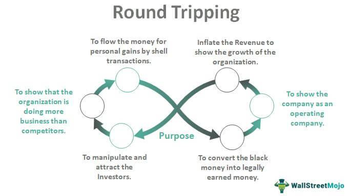

The financial world operates as a complex network of transactions, where ethical behavior underpins trust and stability. This intricate environment has birthed numerous practices, one of which is round-trip trading. This practice involves the cyclical buying and selling of the same security, sparking questions about its ethical and legal implications. Such transactions can be used to artificially boost trading volumes or misrepresent a security's demand, raising ethical concerns.

Round-trip trading does not exist in isolation; it intersects with the technological advancements seen in algorithmic trading. Algorithms can execute trades at speeds unattainable by human traders, potentially magnifying the effects and risks of round-trip trading. Within this context, the ethical concerns are heightened, as rapid, automated trades may unintentionally cross from legitimate to manipulative activities. The dual edge of technology offers both efficiency and a challenge to ethical standards in financial markets.

For investors, regulators, and traders, understanding these concepts is not merely academic; it is essential for informed participation in the markets. Clear demarcation between ethical trading practices and manipulative tactics is crucial. This awareness is vital for the integrity and stability of financial systems, where trust can easily erode in the face of unethical practices. Therefore, exploring round-trip trading within the broader theme of financial ethics offers valuable insights into the challenges and responsibilities faced by all market participants.

## Table of Contents

## What is Round-Trip Trading?

Round-trip trading, often referred to as 'round-tripping,' is a practice involving the repeated buying and selling of the same security. This strategy can be used to create an artificial appearance of increased trading volume or demand for a particular security. While the concept of buying and selling a security multiple times is not inherently illegal, the intent behind such transactions distinguishes legitimate trading from manipulative practices.

In legitimate scenarios, round-trip trading is part of common trading strategies. For example, day traders or institutional investors might engage in frequent trades of the same security as a means of capitalizing on small price fluctuations throughout the trading day. These transactions are generally executed within the legal framework and are a function of a dynamic market environment.

However, when round-trip trading is employed with the intent to deceive, it crosses into unethical and potentially illegal territory. This manipulative form of trading seeks to create false signals of market activity, misleading other investors and potentially inflating the price of a security unjustly. An example of unethical round-trip trading is executing trades merely to inflate the trading volume, thereby giving an illusion of liquidity or interest in a security that does not genuinely exist. Such activities can mislead investors into believing that a security has a stronger market presence than it does, influencing their investment decisions under false pretenses.

The differentiation between legitimate and illegitimate round-trip trading hinges primarily on the trader’s intent and the outcome of the trades. Regulatory bodies closely monitor trading activities to ensure that the [volume](/wiki/volume-trading-strategy) generated by round-tripping reflects genuine market interest rather than artificial manipulation, maintaining the overall integrity and trust in financial markets.

## Legitimate Vs. Unethical Round-Trip Trading

Round-trip trading can often be misunderstood as inherently deceptive, yet not all such trades fall into unethical territory. Legitimate round-trip trading is a common strategy employed by day traders and institutional investors who execute quick buying and selling actions to capitalize on small price movements or to manage risk. This type of trading operates within the confines of legal trading practices and aims to enhance [liquidity](/wiki/liquidity-risk-premium) without the intention to deceive or manipulate market perceptions.

However, the ethical waters of round-trip trading become murky when trades are designed to manipulate markets. Unethical round-trip trading typically involves creating artificial trading volumes that mislead investors, analysts, and market observers. A common unethical tactic is to execute transactions simply to inflate the perceived market demand or financial health of an entity, often without any change in ownership or genuine market interest.

For example, a trader might repeatedly buy and sell a stock with an accomplice to create the illusion of high volume interest. This can artificially raise the stock's price, misleading investors into believing that there is substantial market demand. This practice can also distort financial statements in corporate settings, where companies might engage in similar tactics to report inflated revenue figures.

The challenge lies in discerning between lawful trading activities and those that cross the line into manipulation. Regulators and market participants must understand these distinctions to enforce ethical standards and maintain market integrity. Typical indications of manipulative round-trip trading include disproportional volume leadership, lack of true risk transfer, and anomalies in trading patterns.

Technological advancements in trading algorithms further complicate the landscape, as they can execute trades at speeds and volumes that render traditional oversight difficult. Understanding how algorithms can inadvertently support manipulative artifacts in trading is essential for fostering an environment that prioritizes fairness and transparency in financial markets. Thus, it is crucial for stakeholders to work collaboratively to define and regulate the limits of ethical trading practices in an ever-evolving market environment.

## Examples of Unethical Round-Trip Trading

The Enron scandal remains one of the most egregious examples of unethical round-trip trading, illustrating the destructive potential of this practice. Enron, once a leading energy company, engaged in round-trip trading to artificially inflate its revenue and disguise its deteriorating financial condition. By selling securities or commodities to another company with the agreement to buy them back at a similar price, Enron created the illusion of increased trading activity and revenue without any real economic benefit. This deceitful practice was one of the many tricks Enron used to mislead investors and maintain stock prices, ultimately leading to its downfall and the loss of billions of dollars for shareholders [1].

Beyond Enron, other companies have employed similar tactics to manipulate their financial statements and mislead investors. For instance, in the early 2000s, telecommunications companies like Qwest Communications were found to have engaged in round-trip trading to inflate their revenue figures [2]. These companies reported both the sale and the subsequent repurchase of bandwidth and capacity rights as separate transactions, falsely boosting their revenue numbers. Such practices not only misrepresent a firm's financial health but also undermine the integrity of financial markets by distorting the actual supply and demand for securities.

The implications of these unethical activities are severe, carrying legal repercussions and damaging investor confidence. They highlight the necessity for stringent regulatory oversight and transparent financial reporting to ensure the honesty and integrity of market participants.

References:
1. McLean, B., & Elkind, P. (2003). "The Smartest Guys in the Room: The Amazing Rise and Scandalous Fall of Enron." Portfolio Trade.
2. Morgenson, G. (2002). "Telecom’s Big Debts: A Crisis Foretold." The New York Times.

## Algorithmic Trading and Round-Trip Trading

Algorithmic trading has revolutionized financial markets by significantly increasing the speed and efficiency of trading processes. This technology-driven approach allows traders to utilize complex algorithms to execute orders at superhuman speeds, often within milliseconds. The inherent advantage of [algorithmic trading](/wiki/algorithmic-trading) is its ability to process a vast amount of data rapidly, identify [arbitrage](/wiki/arbitrage) opportunities, and respond to market conditions with precision that manual trading cannot achieve.

However, the rapid execution capabilities of algorithmic bots present notable ethical challenges, particularly concerning round-trip trading. This technique, which involves the repetitive buying and selling of the same security, can be performed at such high speeds that distinguishing between legitimate trading activities and manipulative practices becomes difficult. When algorithms inadvertently execute round-trip trades at these speeds, the increased trading volumes may inaccurately reflect actual market demand. This misrepresentation poses a risk of unintentional market manipulation, where the artificially inflated activity influences other traders' perceptions and decisions.

The utilization of algorithms in executing trades brings us to a critical discussion on the ethical standards that must guide these practices. Ethical algorithmic trading should adhere to principles like transparency, fairness, and accountability to ensure market integrity. Algorithms should be designed with built-in safeguards to detect and prevent patterns that could lead to unethical trading behaviors, such as round-trip trading. For instance, traders can implement monitoring mechanisms that identify and flag unusual trading patterns for further review.

From a regulatory standpoint, the challenge lies in creating frameworks that adequately address the complexities introduced by algorithmic trading. Regulators must develop advanced surveillance systems capable of distinguishing between benign trading strategies and those that resemble manipulative patterns. Collaboration between regulators, industry practitioners, and technology experts is essential to develop guidelines that balance innovative trading capabilities with robust ethical standards.

Ultimately, the goal is to harness the benefits of algorithmic trading while minimizing its potential to unintentionally distort financial markets. By fostering an environment where algorithms operate within ethical boundaries, we can uphold the trust essential for the healthy functioning of financial markets.

## Detecting and Preventing Unethical Round-Trip Trading

Advanced surveillance techniques and robust regulatory frameworks are crucial in detecting and preventing unethical round-trip trading. Such practices, often involving repetitive buying and selling of the same securities, can distort market perceptions and undermine the integrity of financial markets. 

To effectively monitor trading activities, financial institutions and regulatory bodies employ sophisticated technological tools capable of analyzing large volumes of transaction data. One key method involves pattern recognition algorithms, which are designed to identify unusual trading activities that may indicate manipulative practices. For instance, these algorithms can flag trades that repeatedly target the same securities within short timeframes without legitimate economic rationale, suggesting possible round-tripping.

Implementing [machine learning](/wiki/machine-learning) models can further enhance detection capabilities. These models are trained on historical data to recognize typical market behaviors and can adapt to new patterns indicative of unethical trading. The integration of natural language processing (NLP) for analyzing communication between traders adds another layer of surveillance, potentially identifying collusive actions before they result in market manipulation.

Regulatory frameworks are also indispensable in mitigating unethical round-trip trading. Clear guidelines and well-communicated standards help traders understand permissible behaviors, reducing inadvertent breaches of ethical conduct. Regulatory bodies are tasked with enforcing these standards through regular audits and real-time monitoring systems, which can quickly identify and address violations.

Penalties for engaging in or facilitating unethical trading practices further deter such activities. Sanctions may include fines, suspension of trading licenses, or even criminal charges in severe cases. These consequences underscore the seriousness of maintaining ethical standards and act as significant deterrents against unethical practices.

Education plays a fundamental role in prevention. Offering comprehensive training programs focused on ethical trading ensures that all market participants are aware of the legal boundaries and understand the implications of crossing them. Continuous education, reinforced by updates on compliance requirements, helps mitigate the risk of unethical round-tripping as the market evolves. 

Together, these measures form a comprehensive approach, combining advanced technology, regulatory oversight, and education to sustain the integrity of financial markets and protect investors from the adverse effects of manipulative trading practices.

## The Ethical Implications of Round-Trip Trading

At the heart of the debate on round-trip trading lies the critical issue of trust within financial markets. Trust is fundamental for their efficient functioning, where investors rely on the belief that the market operates fairly and transparently. When this trust is compromised by unethical trading practices, such as manipulative round-trip trading, the consequences can destabilize the broader financial system.

Unethical trading practices, such as creating an illusion of heightened trading volumes or falsely inflating a company's financial health through round-trip trading, significantly undermine investor confidence. When investors or stakeholders perceive that the market is subject to manipulation or fraudulent practices, they are less likely to engage, fearing losses due to unfair advantages held by perpetrators of such trades. This erosion of confidence can lead to reduced market participation, thus adversely affecting liquidity and increasing [volatility](/wiki/volatility-trading-strategies). A critical aspect of market stability is investor perception. If the overall sentiment becomes that markets are not being surveilled or that such manipulative practices go undetected or unpunished, it can lead to capital flight as investors seek more stable and reliable environments for their investments.

Transparency and accountability in trading practices are integral to the sustainability of financial markets. Ensuring that trading activities are transparent involves implementing stringent disclosure requirements and regulatory checks to ensure that all market participants have access to accurate information regarding trades and market conditions. This transparency is crucial to prevent misinformation from affecting market decisions. Accountability mechanisms, such as regulatory oversight and penalty frameworks, ensure that those engaging in manipulative practices face consequences, thus deterring potential violators and reassuring investors. By upholding ethical conduct, market integrity is preserved, fostering an environment where financial markets can function effectively and sustainably. Regulatory bodies, industry stakeholders, and policymakers must work collaboratively to develop and enforce frameworks that reinforce these ethical principles, thus safeguarding the trust that is pivotal to market vitality.

## Conclusion

Round-trip trading encapsulates the ongoing challenges in financial markets that sit at the intersection of ethics and legality. This practice, depending on its application, can blur the lines between strategic trading and market manipulation. As trading methodologies evolve, particularly through technological advances such as algorithmic trading, maintaining ethical standards becomes even more essential.

Algorithmic trading offers significant benefits, including liquidity, efficiency, and the reduction of human error. However, these advancements bring about a need for increased oversight. The speed and complexity at which these algorithms operate can unintentionally contribute to unethical trading practices, such as manipulative round-trip trading. This requires stringent ethical guidelines and continuous monitoring to ensure that these tools are not used to deceive or mislead the market.

The balance between innovation and ethical trading practices is crucial to the future of financial markets. While innovation drives progress and enhances market dynamics, it must not come at the expense of ethical integrity. Establishing and adhering to robust ethical standards is pivotal to ensuring that the benefits of new trading strategies are realized without compromising market fairness or investor trust.

Stakeholders, including regulatory bodies, financial institutions, and traders, must collaborate to develop and enforce frameworks that secure market integrity. This collaboration involves continuous education, the implementation of advanced surveillance technologies, and strict regulatory measures to detect and prevent unethical trading practices. By doing so, the financial markets can sustain their trustworthiness and stability, which are paramount for long-term growth and investor confidence.

## References & Further Reading

[1]: McLean, B., & Elkind, P. (2003). ["The Smartest Guys in the Room: The Amazing Rise and Scandalous Fall of Enron."](https://books.google.com/books/about/The_Smartest_Guys_in_the_Room.html?id=MVt5AAAAQBAJ) Portfolio Trade.

[2]: Morgenson, G. (2002). ["Telecom’s Big Debts: A Crisis Foretold."](https://en.wikipedia.org/wiki/Amaranth_Advisors) The New York Times.

[3]: Malkiel, B. G. (2016). ["A Random Walk Down Wall Street: The Time-Tested Strategy for Successful Investing."](https://www.amazon.com/Random-Walk-Down-Wall-Street/dp/0393358380) W. W. Norton & Company.

[4]: Harris, L. (2003). ["Trading and Exchanges: Market Microstructure for Practitioners."](https://www.amazon.com/Trading-Exchanges-Market-Microstructure-Practitioners/dp/0195144708) Oxford University Press.

[5]: Foucault, T., Pagano, M., & Röell, A. (2013). ["Market Liquidity: Theory, Evidence, and Policy."](https://academic.oup.com/book/55158) Oxford University Press.

[6]: De Prado, M. L. (2018). ["Advances in Financial Machine Learning."](https://www.amazon.com/Advances-Financial-Machine-Learning-Marcos/dp/1119482089) Wiley.

[7]: Jones, C. M. (2013). ["What Do We Know About High-Frequency Trading?"](https://papers.ssrn.com/sol3/papers.cfm?abstract_id=2236201) Columbia Business School Research Paper No. 13-11.