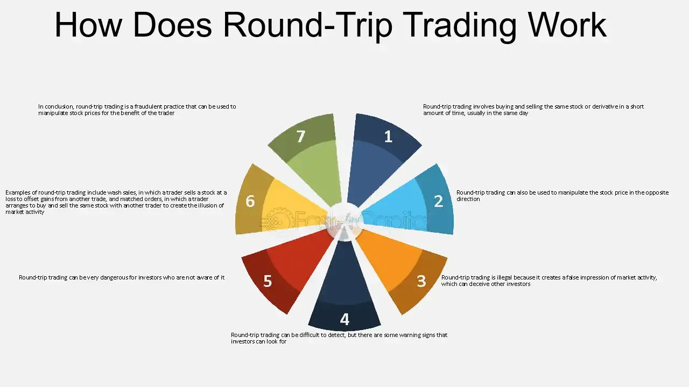

## Table of Contents

## What is round-trip trading?

Round-trip trading is when a company buys something and then sells it back to the same person or company, but at a different price. This can be done to make the company's finances look better than they really are. For example, a company might buy something for a high price and then sell it back for a lower price, making it look like they made money when they didn't.

This kind of trading is often used to trick people into thinking a company is doing well. It can be hard to spot because the trades can be hidden in the company's financial reports. It's important for people to be careful and check a company's records carefully to make sure they are not being tricked.

## How does round-trip trading differ from other types of trading?

Round-trip trading is different from other types of trading because it involves a company buying and then selling the same thing back to the same person or company, often at different prices. This is usually done to make the company's financial situation look better than it really is. For example, if a company buys something for a high price and then sells it back for a lower price, it can make it look like they made money when they actually didn't. This is different from normal trading where the goal is to buy something at a low price and sell it to someone else at a higher price to make a profit.

In contrast, other types of trading, like stock trading or commodity trading, involve buying and selling different items or stocks to different people or companies. The main goal in these types of trading is to make a profit by buying low and selling high. Round-trip trading, on the other hand, is often used to manipulate financial statements and can be seen as a form of fraud. It's important for investors and regulators to be aware of round-trip trading because it can hide the true financial health of a company.

## What are the basic steps involved in round-trip trading?

Round-trip trading starts when a company buys something from another company or person. This could be anything, like a product or a service. The price they pay is usually high, and this makes the company's income look bigger on paper. The company might do this to make it seem like they are doing well financially, even if they are not.

After buying the item, the company then sells it back to the same person or company they bought it from. But this time, they sell it for a lower price. This makes it look like the company made money from the sale, even though they actually lost money because they sold it for less than they paid. This trick can fool people into thinking the company is making profits when it's not.

## Can you provide a simple example of round-trip trading?

Imagine there are two companies, Company A and Company B. Company A buys a machine from Company B for $100,000. This makes Company A's income look bigger because they spent a lot of money, which can make it seem like they are doing well.

Then, Company A sells the same machine back to Company B, but this time for $80,000. On paper, it looks like Company A made $20,000 from the sale because they sold it for less than they bought it. But really, they lost $20,000. This trick can make people think Company A is making money when they are actually losing it.

## What are the potential benefits of round-trip trading for beginners?

Round-trip trading might seem like it could help beginners by making a company's financial reports look better. When a company shows bigger numbers on their reports, it can make people think the company is doing well. This can make the company's stock price go up, which might attract more investors. Beginners might think this is a good way to make their investments look more successful.

But, round-trip trading is risky and can get a company into big trouble. It's not a real way to make money because the company is just moving money around without actually making a profit. If people find out about the round-trip trading, it can hurt the company's reputation and the stock price could drop a lot. Beginners should be careful and learn about the dangers of this kind of trading before trying it.

## What are the risks associated with round-trip trading?

Round-trip trading is risky because it can get a company in big trouble. If people find out that a company is using round-trip trading to make their financial reports look better, it can hurt the company's reputation. This can make the stock price drop a lot, and investors might lose money. Also, round-trip trading is often seen as a kind of fraud, which means the company could get in trouble with the law. This could lead to fines or even jail time for the people running the company.

Another risk is that round-trip trading doesn't actually make money for the company. It just makes the financial reports look better for a short time. This can fool people into thinking the company is doing well when it's not. If the truth comes out, the company might have a hard time getting loans or attracting new investors. This can make it even harder for the company to survive in the long run.

## How can one identify round-trip trading opportunities in the market?

Identifying round-trip trading opportunities in the market is tricky because this practice is often hidden to deceive people. You need to look closely at a company's financial reports to spot it. If you see a company buying something at a high price and then selling it back to the same person or company at a lower price, that could be a sign of round-trip trading. It's important to check if the same items or services are being traded back and forth between the same parties, as this can make the company's income look bigger than it really is.

To really find these opportunities, you need to be careful and do a lot of research. You can look at the company's financial statements to see if there are any strange patterns in their buying and selling. Also, talking to other investors or financial experts can help you learn more about what to look for. Remember, round-trip trading is often used to trick people, so it's not something you want to get involved in. It's better to focus on companies that are making real profits and growing in a honest way.

## What are some advanced strategies used in round-trip trading?

In round-trip trading, companies sometimes use more advanced strategies to make their financial reports look even better. One way they do this is by using multiple companies to make the trades look more real. For example, Company A might buy something from Company B, then sell it to Company C, and finally, Company C sells it back to Company A. This makes it harder for people to see that it's just a round-trip trade because it looks like the item is moving between different companies.

Another advanced strategy is to use different types of items or services in the trades. Instead of just trading one thing back and forth, a company might buy different things from the same company and then sell them back at different times. This can make the financial reports look more varied and less suspicious. But, it's still just a trick to make the company's income look bigger than it really is. These advanced strategies can make round-trip trading harder to spot, but they are still risky and can get a company in big trouble if they get caught.

## How does round-trip trading impact market liquidity?

Round-trip trading can make it seem like there is more trading happening in the market than there really is. When companies do round-trip trades, they buy and sell the same thing back and forth, making it look like there are more trades. This can trick people into thinking the market is more active and liquid than it really is. If a lot of companies are doing this, it can make the whole market seem busier, but it's not real activity.

This kind of trading can also hurt real market [liquidity](/wiki/liquidity-risk-premium) in the long run. If people find out that companies are using round-trip trading to make their financial reports look better, they might lose trust in the market. When trust goes down, fewer people want to buy and sell, which can make the market less liquid. So, while round-trip trading might make the market seem more active for a short time, it can cause bigger problems later.

## What are the regulatory considerations for round-trip trading?

Round-trip trading is often seen as a kind of fraud, so there are strict rules about it. In many countries, financial regulators like the Securities and Exchange Commission (SEC) in the United States watch closely for this kind of trading. If a company is caught doing round-trip trading, they can face big fines and the people running the company might even go to jail. The rules are there to make sure companies are honest about their financial health and don't trick investors.

To stop round-trip trading, regulators look at a company's financial reports very carefully. They check for strange patterns in buying and selling, especially if the same items or services are being traded back and forth between the same companies. If they find anything suspicious, they can start an investigation. This helps keep the market fair and makes sure that investors can trust the financial information they see.

## Can you discuss a case study where round-trip trading significantly influenced a company's stock price?

One famous case of round-trip trading that affected a company's stock price was with Enron, a big energy company in the United States. In the late 1990s and early 2000s, Enron used round-trip trading to make their financial reports look much better than they really were. They would buy and sell energy contracts with other companies at different prices, making it seem like they were making a lot of money. This trick helped Enron's stock price go up because investors thought the company was doing well.

But in 2001, people found out about Enron's round-trip trading. When the truth came out, Enron's stock price crashed. Investors lost a lot of money because they had been tricked into thinking Enron was a good investment. The company went bankrupt, and many people who worked there lost their jobs. This case showed how dangerous round-trip trading can be and led to stricter rules to stop it from happening again.

## How might future market trends affect the viability of round-trip trading strategies?

As markets become more transparent and regulated, it might get harder for companies to use round-trip trading. New rules and better technology can help people spot this kind of trading more easily. If regulators keep a closer eye on financial reports, companies might find it too risky to try round-trip trading because they could get caught and face big fines or even jail time. Also, as investors get smarter and learn more about these tricks, they might be less likely to fall for them, making round-trip trading less effective.

On the other hand, if markets become more complex and harder to understand, some companies might still try to use round-trip trading. In a fast-changing market with new types of financial products, it can be easier to hide these trades. But even if some companies try to use round-trip trading, the overall trend is towards more honesty and openness in the market. This means that in the future, round-trip trading might become less common and less successful as a strategy.

## References & Further Reading

[1]: McLean, B., & Elkind, P. (2003). ["The Smartest Guys in the Room: The Amazing Rise and Scandalous Fall of Enron."](https://books.google.com/books/about/The_Smartest_Guys_in_the_Room.html?id=MVt5AAAAQBAJ) Portfolio Trade.

[2]: Morgenson, G. (2002). ["Telecom’s Big Debts: A Crisis Foretold."](https://en.wikipedia.org/wiki/Amaranth_Advisors) The New York Times.

[3]: Malkiel, B. G. (2016). ["A Random Walk Down Wall Street: The Time-Tested Strategy for Successful Investing."](https://www.amazon.com/Random-Walk-Down-Wall-Street/dp/0393358380) W. W. Norton & Company.

[4]: Harris, L. (2003). ["Trading and Exchanges: Market Microstructure for Practitioners."](https://www.amazon.com/Trading-Exchanges-Market-Microstructure-Practitioners/dp/0195144708) Oxford University Press.

[5]: Foucault, T., Pagano, M., & Röell, A. (2013). ["Market Liquidity: Theory, Evidence, and Policy."](https://academic.oup.com/book/55158) Oxford University Press.

[6]: De Prado, M. L. (2018). ["Advances in Financial Machine Learning."](https://www.amazon.com/Advances-Financial-Machine-Learning-Marcos/dp/1119482089) Wiley.

[7]: Jones, C. M. (2013). ["What Do We Know About High-Frequency Trading?"](https://papers.ssrn.com/sol3/papers.cfm?abstract_id=2236201) Columbia Business School Research Paper No. 13-11.