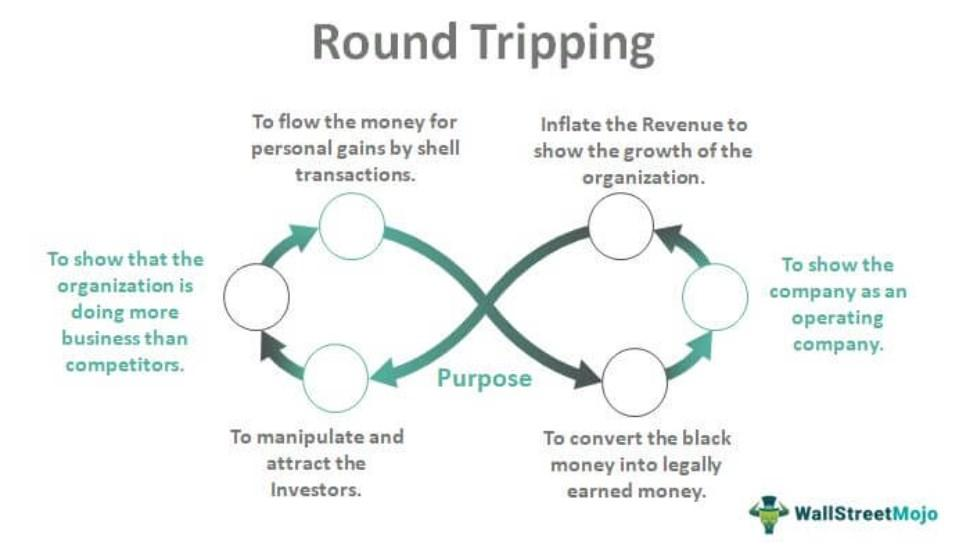

Algorithmic trading, often referred to as algo trading, is the use of computer systems and software to enter and execute trades automatically based on predetermined criteria. This approach leverages complex algorithms, which evaluate multiple market variables, to facilitate rapid decision-making and execution of trade orders. Over recent decades, algorithmic trading has witnessed substantial growth and transformation, largely driven by advances in computing power, increased availability of real-time data, and the expansion of electronic trading platforms in financial markets.

A critical factor influencing the success of algorithmic trading strategies is transaction costs. These costs encompass a broad spectrum of expenses incurred when executing trades, including broker commissions, exchange fees, bid-ask spreads, and market impact costs. Transaction costs can significantly erode gains, particularly in high-frequency trading environments where the volume of transactions is substantial. Understanding and minimizing these expenses are fundamental to enhancing the overall profitability of any trading strategy.



In evaluating trading performance, round-trip transactions hold essential importance. A round-trip transaction refers to a completed trade cycle involving both the purchase and subsequent sale of a security. The overall cost and outcome of a round-trip transaction provide a clear picture of the trading strategy's effectiveness, as they incorporate all associated transaction costs and are directly tied to net profits. Optimizing these transactions is key to achieving desired financial outcomes.

The objective of this article is to explore how transaction costs impact profitability within the context of algorithmic trading. By examining the elements of round-trip transaction costs and their significance in algo trading, we aim to provide insights into optimizing trading strategies to sustain profitability. This exploration emphasizes the ongoing need to adapt and refine trading strategies in response to dynamic market conditions, ensuring the sustained competitive advantage of algorithmic trading practices.

## Table of Contents

## Understanding Round-Trip Transaction Costs

Round-trip transaction costs represent the total expenses incurred when executing a buy and sell order for a security. These costs are critical in assessing the profitability and efficiency of trading strategies, particularly in algorithmic trading, where high-frequency trading intensifies their impact. The main components of round-trip transaction costs include commissions, fees, bid/ask spreads, and market impact costs.

Commissions and fees are the charges levied by brokers or exchanges for facilitating the transactions. These costs can vary significantly depending on the brokerage firm, the type of trading account, and the trading volume. Although they constitute a direct cost to the trader, they are typically predictable and can be included in the cost analysis beforehand.

The bid/ask spread represents the difference between the highest price a buyer is willing to pay (bid) and the lowest price a seller is willing to accept (ask). This spread is a fundamental [factor](/wiki/factor-investing) in trading, reflecting the [liquidity](/wiki/liquidity-risk-premium) and [volatility](/wiki/volatility-trading-strategies) of the market for a particular security. In [algorithmic trading](/wiki/algorithmic-trading), where transactions are frequent, the cumulative effect of paying this spread can significantly impact the overall cost.

Market impact costs refer to the adverse price movement caused by a large order entering the market. When a large buy order is placed, it can push the price up, while a large sell order can drive it down, leading to unfavorable execution prices. These costs are often more complex to estimate and require sophisticated models to predict accurately.

These components of round-trip transaction costs can erode trading profits, underscoring the importance of minimizing them. In the context of algorithmic trading, even marginal cost reductions per transaction can translate into substantial savings and improved profitability due to the high [volume](/wiki/volume-trading-strategy) of trades.

The concept of 'all-in cost' is akin to round-trip costs and plays a critical role in comprehensive cost analysis. The all-in cost approach integrates all potential expenses related to a trade, offering a holistic view of the transaction's financial impact. This methodology ensures that traders consider commissions, fees, bid/ask spreads, and market impact costs, enabling more informed decision-making and strategy development.

In conclusion, understanding the components of round-trip transaction costs and their effect on trading outcomes is essential for optimizing strategies in algorithmic trading. Efficient cost management can enhance net profits and ensure that trading algorithms remain competitive and effective in dynamic market environments.

## The Significance of Round-Trip Transactions in Algo Trading

Tracking round-trip transactions is crucial for evaluating the efficiency of trading algorithms, as it provides a holistic view of the costs and returns associated with executing a trading strategy. A round-trip transaction involves both the purchase and sale of a security, with the total cost including all fees incurred during these trades. These costs can significantly affect the net profitability of trading efforts, underscoring the importance of meticulous tracking.

Latency and market impact are two critical factors that can significantly influence trading outcomes, particularly in algorithmic trading. Latency refers to the delay between the initiation of a trade and its execution. In high-frequency trading, even millisecond-level delays can result in substantial differences in execution prices due to rapid market fluctuations, thereby affecting profitability. Algorithms must be optimized to minimize latency to ensure that trade execution aligns closely with the intended strategy.

Market impact, on the other hand, refers to the effect that executing large orders has on the market price of the security being traded. A large buy order can increase prices, while a large sell order can decrease them, potentially leading to less favorable execution prices. This impact can erode the profitability of trades, particularly when algorithmic strategies involve large trade volumes. 

Transaction costs, encompassing commissions, fees, and the bid/ask spread, directly influence net profits. Consider the formula for determining net profit from a single round-trip transaction:

$$
\text{Net Profit} = (\text{Sell Price} - \text{Buy Price}) \times \text{Quantity} - \text{Total Transaction Costs}
$$

Where:

- $\text{Sell Price}$ and $\text{Buy Price}$ are the prices at which the security is sold and purchased.
- $\text{Quantity}$ is the number of shares involved in the transaction.
- $\text{Total Transaction Costs}$ includes commissions, fees, and any market impact costs.

To illustrate the role transaction costs play in profitability, consider a scenario where a trading algorithm anticipates a modest price increase. If the transaction costs per round-trip are significant, any potential profit from price appreciation might be entirely offset, reducing the net gain to zero or resulting in a loss. This scenario highlights the need to optimize cost structures and maintain tight control over expenses to enhance the net profitability of trading strategies.

Accurate tracking and analysis of round-trip transactions empower traders to evaluate the true performance of their algorithms beyond gross returns. By minimizing latency, mitigating market impacts, and accounting for transaction costs, traders can refine their strategies to maximize net profits, ensuring that algorithmic trading operations remain efficient and profitable.

## Challenges and Considerations in Optimizing Round-Trip Transactions

Managing execution costs is a significant challenge in optimizing round-trip transactions in algorithmic trading. These costs can be broadly categorized into brokerage fees and slippage, which collectively influence the profitability of trading strategies.

Brokerage fees vary based on the broker and the financial instruments traded. Negotiating favorable rates or choosing brokers with competitive pricing structures is crucial for reducing these costs. Slippage, on the other hand, occurs when the execution price of a trade differs from the intended price due to market movements. Slippage is particularly prevalent in volatile markets and can significantly affect trading outcomes.

Latency, the delay between the initiation of a trade and its execution, is another critical factor affecting transaction costs. High latency can lead to substantial slippage, as market conditions may change during the delay. Therefore, minimizing latency is essential to achieving favorable execution prices.

Market volatility also plays a vital role in determining transaction costs and shaping trading strategies. During volatile periods, bid-ask spreads may widen, increasing the cost of entering or exiting positions. Volatility necessitates the use of dynamic strategies that can adapt to sudden market changes.

To mitigate these risks, several techniques and strategies can be employed. Co-location is a technique where trading systems are placed in proximity to the exchange servers, reducing latency and enabling faster execution. This strategy allows traders to capitalize on fleeting market opportunities and minimize adverse price movements.

Using limit orders is another effective approach. Unlike market orders, which execute at the prevailing market price, limit orders specify a price threshold for execution. This control helps in managing slippage by ensuring that trades are executed only at desirable price levels.

Algorithm designers can also benefit from incorporating [machine learning](/wiki/machine-learning) for predicting market trends and optimizing execution strategies. Analyzing historical data to identify patterns and predict future price movements can significantly enhance decision-making. Additionally, machine learning algorithms can adapt to changing market conditions, adjusting strategies in real-time to optimize transaction costs.

Overall, understanding and managing the various components of transaction costs—brokerage fees, slippage, latency, and market volatility—are crucial for optimizing round-trip transactions. Employing risk mitigation strategies, such as co-location and limit orders, along with advanced predictive techniques, can significantly enhance the efficiency and profitability of algorithmic trading strategies.

## Strategies for Optimizing Round-Trip Transactions

To effectively optimize round-trip transactions in algorithmic trading, it is essential to adopt strategies that minimize transaction costs and enhance overall execution efficiency. Here are several methods to achieve these objectives:

### Limit Orders and Trading Venue Selection

Using limit orders is one of the primary strategies to minimize transaction costs. Unlike market orders, which execute immediately at the best available price, limit orders allow traders to specify the maximum buying price or minimum selling price. This precision helps avoid the unfavorable price fluctuations often encountered with market orders, thereby reducing slippage—a common source of increased costs.

Selecting appropriate trading venues also plays a crucial role. Different venues may offer varying fee structures, liquidity levels, and order execution speeds. By analyzing these factors, traders can choose venues that align with their cost minimization goals. High-frequency trading firms often leverage their understanding of venue characteristics to select those that optimize cost-efficiency and execution quality.

### Historical Data Analysis

Historical data analysis is instrumental in identifying cost-saving opportunities. By examining past transaction data, traders can assess patterns in market behavior and transaction costs, thereby tailoring strategies that capitalize on these observations. For instance, understanding peak liquidity periods or common slippage levels can inform decision-making processes, leading to more efficient trade execution strategies.

Python, a versatile programming language, facilitates this analysis with libraries like `pandas` and `NumPy`. For example, the following code snippet demonstrates a basic approach to analyzing historical trade data to identify optimal trading times:

```python
import pandas as pd

# Load historical trade data
data = pd.read_csv('trade_data.csv')

# Convert time column to datetime
data['time'] = pd.to_datetime(data['time'])

# Group data by hour to find average slippage
slippage_by_hour = data.groupby(data['time'].dt.hour)['slippage'].mean()

# Identify hour with lowest average slippage
optimal_hour = slippage_by_hour.idxmin()
```

### Machine Learning for Enhanced Execution

Machine learning (ML) offers advanced techniques for improving prediction accuracy and optimizing trade execution. Algorithms can process vast amounts of data to identify complex patterns and trends invisible to traditional analysis methods. Supervised learning models such as regression and neural networks can predict price movements, while [reinforcement learning](/wiki/reinforcement-learning) can optimize trade execution strategies by learning from market interactions.

For example, ML models can forecast the probability of slippage based on historical and current market conditions, enabling traders to adjust their strategies accordingly. Implementing these models requires careful data preprocessing and model training. Here’s a simple Python example utilizing `scikit-learn` for slippage prediction:

```python
from sklearn.model_selection import train_test_split
from sklearn.ensemble import RandomForestRegressor
from sklearn.metrics import mean_squared_error
import numpy as np

# Assume features and target are pre-defined arrays
X_train, X_test, y_train, y_test = train_test_split(features, target, test_size=0.2, random_state=42)

# Initialize and train a RandomForest model
model = RandomForestRegressor(n_estimators=100, random_state=42)
model.fit(X_train, y_train)

# Make predictions
predictions = model.predict(X_test)

# Evaluate model performance
mse = mean_squared_error(y_test, predictions)
print(f'Mean Squared Error: {mse}')
```

Combining these strategies allows traders to construct a comprehensive approach to optimize round-trip transactions by minimizing transaction costs and enhancing execution quality. Continuous refinement and adaptation are necessary to remain responsive to changing market conditions, ensuring sustainable competitive advantages in algorithmic trading.

## Conclusion

Algorithmic trading has revolutionized the landscape of financial markets, offering unprecedented speed and efficiency in executing trades. However, the success of any algorithmic trading strategy is significantly determined by its ability to understand and optimize round-trip transaction costs. These costs, encapsulating commissions, bid/ask spreads, fees, and market impact, can substantially erode the profitability of even the most sophisticated algorithms. Therefore, a comprehensive awareness and ongoing management of these costs are pivotal for the sustained profitability and efficiency of trading strategies.

Given the dynamic nature of financial markets, continuous adaptation and refinement of trading strategies are integral. Market conditions are perpetually changing, influenced by factors such as economic news, geopolitical events, and technological advancements. As such, trading algorithms must evolve in tandem with the market to maintain their effectiveness. This necessitates a robust framework for regularly assessing and updating algorithms to ensure they are well-optimized for prevailing market conditions. 

Moreover, ongoing research and innovation in trading strategies are critical to sustaining competitive advantages. The application of machine learning techniques, for instance, has opened new frontiers in enhancing prediction accuracy and optimizing trade execution. By leveraging historical data and real-time analytics, traders can potentially identify subtle patterns and anomalies that were previously undetectable. Thus, investing in research and development not only aids in cost optimization but also drives innovation that could lead to more refined and intelligent trading strategies.

In conclusion, mastering the intricacies of round-trip transaction costs is not merely about reducing expenses but also about strategically positioning algorithms to thrive in an ever-evolving marketplace. It underscores the necessity for traders and firms to remain agile, proactively adapting their strategies to maximize profitability while fostering innovations that push the boundaries of algorithmic trading forward.

## References & Further Reading

1. Aldridge, I. (2013). *High-Frequency Trading: A Practical Guide to Algorithmic Strategies and Trading Systems*. Wiley. This comprehensive book provides insights into high-frequency trading strategies, focusing on algorithmic systems and their practical applications in financial markets.

2. Kissell, R. (2013). *The Science of Algorithmic Trading and Portfolio Management*. Academic Press. This work outlines the fundamental concepts of algorithmic trading and offers a deep dive into execution strategies, including transaction cost analysis.

3. Narang, R. K. (2013). *Inside the Black Box: A Simple Guide to Quantitative and High-Frequency Trading*. Wiley. This text demystifies quantitative trading and provides an overview of the strategies employed by high-frequency traders, emphasizing the importance of transaction cost management.

4. Harris, L. (2003). *Trading and Exchanges: Market Microstructure for Practitioners*. Oxford University Press. Harris explores the complex nature of trading markets and addresses various microstructure issues, including the critical role of transaction costs.

5. Latency in Financial Markets — https://www.investopedia.com/terms/l/latency.asp. This article on Investopedia explains the concept of latency, its impact on financial markets, and why it is an essential factor in high-frequency and algorithmic trading.

6. Almgren, R., & Chriss, N. (2000). *Optimal Execution of Portfolio Transactions*. Journal of Risk. This paper introduces a framework for understanding and optimizing the execution of portfolio transactions while minimizing market impact costs.

7. Lo, A. W., & MacKinlay, A. C. (1999). *A Non-Random Walk Down Wall Street*. Princeton University Press. This book critiques the efficient market hypothesis and investigates stock market predictability through statistical analysis, providing insights relevant to algorithmic trading strategies.

8. Biais, B., & Woolley, P. (2011). *High Frequency Trading*. Oxford Review of Economic Policy, 27(3), 525-540. This journal article evaluates the role and implications of high-frequency trading in modern financial markets, offering perspectives on transaction cost impacts.

9. Credit Suisse. *Transaction Cost Analysis in Algorithmic Trading: A Comprehensive Study*. This resource offers a detailed examination of transaction cost analysis in the context of algorithmic trading, presenting various methodologies to enhance cost efficiency.

10. Hasbrouck, J. (2009). *Trading Costs and Returns for U.S. Equities: Estimating Effective Costs from Daily Data*. This study discusses the estimation of trading costs using daily data, highlighting their influence on trading returns and profitability.

