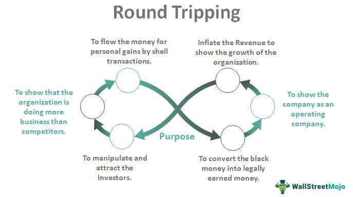

In the world of algorithmic trading, understanding round-trip transactions is crucial for optimizing strategies. A round-trip transaction entails the complete process of buying and subsequently selling an asset, thereby completing a trade cycle. This concept is foundational in the evaluation and assessment of trading strategies, particularly in terms of their efficiency and cost implications. By analyzing round-trip transactions, traders can scrutinize the various aspects of their strategies, identifying areas for improvement. The interplay between buying and selling not only influences the individual trade outcomes but also the overall performance of the algorithmic strategy.

Round-trip transactions carry significant weight in algorithmic trading due to their direct impact on determining transaction costs and assessing the profitability of a trade strategy. These transactions can also shed light on other critical aspects, such as execution speed and market liquidity. In algorithmic trading environments, which often rely on executing large volumes of trades in rapid succession, understanding and optimizing these metrics are key for enhancing trade performance.

This article will explore the components of round-trip transactions, emphasizing their significance in algorithmic trading. It will analyze how traders can harness this concept to refine and boost their strategies. By examining the mechanics involved, traders can gain insights into the cost structures and timing considerations that influence trading performance, ultimately fostering more efficient and effective trading methodologies.

## Table of Contents

## Understanding Round-Trip Transactions in Algo Trading

A round-trip transaction in [algorithmic trading](/wiki/algorithmic-trading) encompasses the full cycle of both purchasing and subsequently selling an asset. This cycle is pivotal for traders as it relates directly to transaction costs, the timing of trades, and the potential for profit generation. Understanding and optimizing this cycle are important to the overall efficacy of a trading strategy.

Firstly, transaction costs play a crucial role. These costs are incurred twice in a round-trip transaction, once when buying the asset and again when selling it. The primary components of these costs include brokerage commissions and bid-ask spreads. For a profitable strategy, minimizing these costs is necessary because they can significantly erode potential profits.

Secondly, timing within these transactions is essential, especially within the context of high-frequency trading ([HFT](/wiki/high-frequency-trading-strategies)). In HFT, dozens, if not hundreds, of trades occur within very short time frames, sometimes in fractions of a second. Consequently, monitoring round-trip times can uncover efficiencies or inefficiencies in the trading algorithm. Even the slightest delays in execution can result in missed opportunities or unfavorable entry and [exit](/wiki/exit-strategy) points that can impact profits negatively.

Another critical aspect of managing round-trip transactions is understanding how they influence a strategy’s success. By monitoring these transactions, traders can gain insights into the efficiency of their trading algorithms. For example, achieving a lower average round-trip time suggests a more efficient execution process, potentially leading to higher success rates for trades.

A practical approach to managing these transactions involves leveraging historical data. By analyzing past trades, traders can identify patterns that might indicate periods of suboptimal performance, thus providing clues on where improvements are needed. This data-centric approach is vital to enhancing the profitability of trading strategies over time.

Understanding round-trip transactions involves recognizing the critical cost components and their timing. In doing so, traders can better manage and optimize their strategies, ultimately enhancing their profitability. The focus on transaction costs and timing efficiencies is fundamental to the success of trading algorithms.

## Significance of Round-Trip Transactions in Algorithmic Trading

Round-trip transactions are pivotal in evaluating the effectiveness of trading algorithms. These transactions offer essential insights into aspects such as latency, which refers to the delay between order initiation and execution. Minimizing latency can drastically improve the efficiency of a trading algorithm, as delays can impact the ability of the algorithm to capitalize on fleeting market opportunities.

The market impact of round-trip transactions is another critical [factor](/wiki/factor-investing). This pertains to the effect a trade has on the market price of the asset being traded. Larger transactions or frequent trading can influence asset prices, potentially moving them against the trader’s position. Analyzing the market impact can guide algorithm adjustments to limit adverse effects, thus safeguarding potential profits.

Transaction costs inherent in round-trip transactions—comprising both commission fees and the bid-ask spread—substantially affect net profits from trading activities. For instance, if the total transaction cost for a round-trip is denoted as $TC$, the net profit $P$ can be represented as:

$$

P = (Selling \, Price - Buying \, Price) \times Quantity - TC 
$$

Here, reducing $TC$ by employing more efficient transaction methods can lead to improved profitability.

By scrutinizing round-trip transactions, traders can refine their strategies to minimize costs and enhance returns. This involves leveraging data analytics to identify patterns and inefficiencies that inflate transaction costs. These analyses inform the algorithm's design to optimize execution efficiency, ultimately boosting profitability.

Additionally, round-trip transactions serve as indicators of an algorithm's market activity and trading frequency. High-frequency trading algorithms, characterized by numerous rapid trades, require precise tracking of these transactions to ensure robust performance evaluation. Frequent trading demands an algorithm capable of managing a vast [volume](/wiki/volume-trading-strategy) of transactions efficiently while maintaining cost-effectiveness.

In summary, round-trip transactions are essential in appraising the performance of trading algorithms, influencing both strategic refinement and execution. As such, they are integral to developing and assessing algorithmic trading strategies that aim to minimize costs, limit market impacts, and optimize latency.

## Challenges and Considerations

One primary challenge in optimizing round-trip transactions is managing execution costs. Execution costs encompass various fees associated with executing a trade, including brokerage fees, exchange fees, and slippage costs. These costs can accumulate rapidly, especially in high-frequency trading environments. A critical aspect of managing execution costs is the careful selection of order types. Tradability and market [liquidity](/wiki/liquidity-risk-premium) play a significant role in determining whether to use limit orders to minimize costs or market orders for execution certainty.

Latency also significantly impacts the profitability of round-trip transactions. Latency refers to the time delay between the initiation of a trade and its execution. In algorithmic trading, where time efficiency is paramount, even slight delays can lead to missed opportunities or less favorable prices. Techniques such as co-location, where trading servers are placed close to exchange servers, and low-latency networking solutions can help mitigate this issue.

Market [volatility](/wiki/volatility-trading-strategies) introduces additional complexity in round-trip cost calculations by causing larger spreads between bid and ask prices. Volatile markets can result in increased slippage and execution uncertainty, making it difficult to predict final transaction costs. Algorithmic traders must develop advanced predictive models to adjust to changing market conditions dynamically, ensuring that their trading algorithms remain profitable despite volatility.

Another consideration is the risk of slippage, which occurs when the actual execution price of a trade differs from the intended entry or exit price. Slippage is often caused by rapid price movements and market illiquidity. To minimize slippage, traders can employ strategies such as dividing large orders into smaller chunks or using VWAP (Volume Weighted Average Price) algorithms to distribute trades throughout the day.

Developing strategies to mitigate these challenges is essential for efficient algorithmic trading. This involves a continuous process of testing and refining algorithms to adapt to market conditions. Machine learning techniques are increasingly used to model market behavior and improve transaction efficiency. By leveraging historical data and market analysis, algorithms can become more adept at predicting market movements and thus more effective in executing profitable round-trip transactions.

In summary, managing execution costs, addressing latency, accounting for market volatility, and minimizing slippage are key challenges faced in optimizing round-trip transactions. By developing robust strategies and continuously adapting to market changes, algorithmic traders can enhance the efficiency and profitability of their trading strategies.

## Strategies for Optimizing Round-Trip Transactions

Implementing strategies that minimize transaction costs is essential for optimizing round-trip transactions in algorithmic trading. One effective approach is the use of limit orders instead of market orders. Limit orders allow traders to set the maximum or minimum price at which they are willing to buy or sell, thus offering better control over execution prices. This can significantly reduce the impact of market volatility on transaction costs and enhance the precision of trade executions.

Analyzing historical trade data is another vital strategy in optimizing round-trip transactions. By examining past trading patterns, traders can identify trends and inefficiencies that may affect transaction times and costs. This analysis can uncover opportunities to streamline trading processes and improve overall efficiency. For example, calculating the average round-trip time and cost across various trading conditions helps in identifying optimal trading windows and cost-saving opportunities.

The integration of [machine learning](/wiki/machine-learning) into trading algorithms represents a key advancement in the optimization of round-trip transactions. Machine learning models can analyze vast amounts of market data to predict future price movements more accurately. These predictions enable algorithms to make more informed trading decisions, potentially improving the timing and effectiveness of round-trip transactions. In practice, machine learning can be used to develop predictive models that optimize entry and exit points based on real-time data analysis.

Continuous monitoring and adjustment of algorithms based on current market conditions further ensure ongoing optimization. As markets are dynamic and constantly evolving, algorithms must adapt to these changes to remain effective. This involves regular assessments of algorithm performance and modifications in response to shifts in market behavior. For instance, a feedback loop can be established where the algorithm learns from each round-trip transaction to enhance future performance, thus reducing latency and improving cost efficiency. 

By incorporating these strategies—using limit orders, analyzing historical data, leveraging machine learning, and maintaining continuous optimization—traders can refine their approach to round-trip transactions, leading to reduced transaction costs and improved trading performance.

## Conclusion

Round-trip transactions are a pivotal component of algorithmic trading, influencing overall strategy performance. Understanding and optimizing these transactions can lead to significant cost savings and improved trading outcomes. This requires a comprehensive approach that considers all elements affecting a trade cycle, including transaction costs, execution efficiency, and latency. 

Focusing on transaction costs is essential, as these expenses can substantially affect profitability. Traders can employ strategies that minimize these costs, such as using limit orders and optimizing order routing. Execution efficiency is equally important, as it ensures that trades are executed at the desired prices in a timely manner. Reducing latency, the time delay from order initiation to execution, is critical in high-frequency trading environments where rapid decision-making is a competitive advantage.

Incorporating best practices and adjusting to market dynamics ensures a competitive edge in the fast-paced world of algorithmic trading. Given the volatile nature of financial markets, traders must continuously adapt their algorithms to changing conditions to maintain efficiency and effectiveness. This involves regularly analyzing trading data, updating algorithms to reflect market trends, and employing advanced technologies such as machine learning to anticipate market movements.

Continuous research and development are key to staying ahead in the evolving landscape of algorithmic trading. By investing in innovation and being responsive to new developments, traders can refine their strategies for better performance. Emphasizing the optimization of round-trip transactions not only enhances algorithmic trading strategies but also positions traders for long-term success in a highly competitive field.

## References & Further Reading

[1]: Bergstra, J., Bardenet, R., Bengio, Y., & Kégl, B. (2011). ["Algorithms for Hyper-Parameter Optimization."](https://papers.nips.cc/paper/4443-algorithms-for-hyper-parameter-optimization) Advances in Neural Information Processing Systems 24.

[2]: ["Advances in Financial Machine Learning"](https://www.amazon.com/Advances-Financial-Machine-Learning-Marcos/dp/1119482089) by Marcos Lopez de Prado

[3]: ["Evidence-Based Technical Analysis: Applying the Scientific Method and Statistical Inference to Trading Signals"](https://www.amazon.com/Evidence-Based-Technical-Analysis-Scientific-Statistical/dp/0470008741) by David Aronson

[4]: ["Machine Learning for Algorithmic Trading"](https://github.com/PacktPublishing/Machine-Learning-for-Algorithmic-Trading-Second-Edition) by Stefan Jansen

[5]: ["Quantitative Trading: How to Build Your Own Algorithmic Trading Business"](https://books.google.com/books/about/Quantitative_Trading.html?id=j70yEAAAQBAJ) by Ernest P. Chan