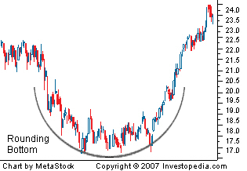

## Table of Contents

## What is a Rounding Bottom pattern in trading?

A Rounding Bottom pattern in trading is a chart pattern that looks like a big "U" shape. It shows that a stock's price has been going down for a while, but then it starts to slowly go up again. This pattern can take a long time to form, sometimes even months. Traders see this as a sign that the stock might start going up more in the future.

When traders see a Rounding Bottom, they think the stock is changing from a downward trend to an upward trend. The bottom of the "U" is where the price stops going down and starts to go up. Traders often wait for the price to break above a certain level, called the resistance, before they decide to buy the stock. This pattern is important because it can help traders make decisions about when to buy or sell a stock.

## How can you identify a Rounding Bottom pattern on a chart?

To spot a Rounding Bottom pattern on a chart, you need to look for a big "U" shape. This shape shows that the price of the stock went down for a while and then slowly started to go back up. The bottom of the "U" is where the price stops going down and starts to turn around. It can take a long time for this pattern to form, sometimes even months.

Once you see the "U" shape, you should look for a few more things to make sure it's a Rounding Bottom. The volume, or how many people are buying and selling the stock, should be low at the bottom of the "U" and start to go up as the price goes up. Also, watch for the price to break above a certain level called the resistance. When the price goes above this level, it's a good sign that the stock might keep going up.

## What are the key characteristics of a Rounding Bottom pattern?

A Rounding Bottom pattern looks like a big "U" on a chart. It shows that the price of a stock was going down for a while, but then it slowly started to go back up. This pattern can take a long time to form, sometimes even months. The bottom of the "U" is where the price stops going down and starts to turn around. Traders see this as a sign that the stock might start going up more in the future.

Another important thing to look for in a Rounding Bottom pattern is the volume. At the bottom of the "U," the volume, or how many people are buying and selling the stock, is usually low. As the price starts to go up, the volume should start to increase too. This shows that more people are interested in the stock again. Traders also watch for the price to break above a certain level called the resistance. When the price goes above this level, it's a good sign that the stock might keep going up.

## What does a Rounding Bottom pattern indicate about market sentiment?

A Rounding Bottom pattern on a chart shows that the market sentiment is changing from negative to positive. When you see this big "U" shape, it means that the price of the stock was going down for a while, and people were not feeling good about it. But then, slowly, the price starts to go up again. This change shows that people are starting to feel better about the stock and think it might be a good time to buy it.

The bottom part of the "U" is really important. It's where the price stops going down and starts to turn around. At this point, the number of people buying and selling the stock, called the volume, is usually low. But as the price starts to go up, the volume starts to go up too. This means more people are getting interested in the stock again. When the price breaks above a certain level, called the resistance, it's a strong sign that the market sentiment has turned positive and more people believe the stock will keep going up.

## How long does it typically take for a Rounding Bottom pattern to form?

A Rounding Bottom pattern can take a long time to form. It usually takes several months for this big "U" shape to show up on a chart. The reason it takes so long is because the price of the stock has to go down for a while before it slowly starts to go back up.

The exact time can change a lot depending on the stock and what's happening in the market. But if you see a Rounding Bottom, it's a good idea to be patient because it might take a while for the pattern to finish forming. Once it does, it can be a strong sign that the stock might start going up more in the future.

## What are the entry points for trading a Rounding Bottom pattern?

When trading a Rounding Bottom pattern, a good entry point is when the price breaks above the resistance level. The resistance level is the highest point the price reached before it started going down to form the "U" shape. When the price goes above this level, it's a sign that the stock might keep going up. Traders often wait for this break to happen before they buy the stock, because it shows that the market sentiment has turned positive.

Another entry point to consider is when the price is still moving up within the "U" shape, but before it breaks the resistance. Some traders might buy the stock at this point if they believe the price will keep going up. However, this is riskier because the pattern might not finish forming, and the price could go back down. It's important to be careful and watch the volume, which should start to increase as the price goes up, to make sure the pattern is still developing correctly.

## What are the common exit strategies when trading a Rounding Bottom pattern?

When trading a Rounding Bottom pattern, one common exit strategy is to sell the stock when it reaches a certain price target. This target is usually calculated by measuring the height of the "U" shape from the bottom to the resistance level and then adding that height to the point where the price breaks above the resistance. When the price hits this target, it's a good time to sell and take your profits because the stock might not keep going up much more.

Another exit strategy is to use a trailing stop-loss. A trailing stop-loss moves up as the price goes up, so it helps you keep some of your profits if the price starts to go down. You set the stop-loss at a certain percentage below the current price, and if the price drops to that level, the stop-loss will trigger and you'll sell the stock. This way, you can keep making money as the price goes up, but also protect your gains if the price starts to fall.

A third exit strategy is to sell when you see signs that the upward trend might be ending. This could be when the volume starts to go down even though the price is still going up, or when the price starts to make lower highs and lower lows. These signs can show that the stock might not keep going up, so it's a good time to sell and take your profits before the price goes down too much.

## Can you explain the volume profile during the formation of a Rounding Bottom pattern?

During the formation of a Rounding Bottom pattern, the volume usually follows a specific pattern. At the beginning, when the price is going down to form the left side of the "U," the volume is often high. This is because a lot of people are selling the stock, which pushes the price down. As the price reaches the bottom of the "U," the volume starts to get lower. This shows that fewer people are trading the stock, and the market is starting to calm down.

Then, as the price starts to go up on the right side of the "U," the volume begins to increase again. This increase in volume shows that more people are starting to buy the stock, which helps push the price up. The rising volume is a good sign that the market sentiment is turning positive and that the stock might keep going up. By watching the volume, traders can get a better idea of whether the Rounding Bottom pattern is forming correctly and if it's a good time to buy the stock.

## How does a Rounding Bottom pattern differ from other reversal patterns like the Cup and Handle?

A Rounding Bottom pattern and a Cup and Handle pattern are both reversal patterns that show a stock might start going up after going down for a while. The main difference is their shape. A Rounding Bottom looks like a big "U" and takes a long time to form, sometimes even months. On the other hand, a Cup and Handle looks like a "U" with a small handle on the right side. The handle is a small dip in the price after the cup part, and it usually takes less time to form than the whole Rounding Bottom.

Another difference is how traders use these patterns. For a Rounding Bottom, traders often wait for the price to break above the resistance level before they buy the stock. The resistance level is the highest point the price reached before it started going down. For a Cup and Handle, traders might buy the stock when the price breaks above the handle's resistance, which is usually a bit lower than the resistance of the whole cup. Both patterns show that the stock might start going up, but the way traders use them to make decisions can be different.

## What are the potential risks and challenges when trading based on a Rounding Bottom pattern?

Trading based on a Rounding Bottom pattern can be risky because the pattern might not finish forming correctly. Sometimes, the price might start to go up but then go back down before it breaks above the resistance level. This can happen if the market sentiment changes or if something unexpected happens with the stock. Traders need to be patient and watch the pattern carefully to make sure it's still developing the way they expect. If the pattern doesn't finish forming, traders could lose money if they buy the stock too early.

Another challenge is that the Rounding Bottom pattern can take a long time to form, sometimes even months. This means traders need to wait a while before they can be sure the pattern is complete and the price will keep going up. During this time, the market can change a lot, and other things can affect the stock's price. Traders also need to be careful about setting their entry and exit points. If they set them wrong, they might miss out on profits or lose money if the price doesn't go up as expected.

## How can technical indicators be used to confirm a Rounding Bottom pattern?

Technical indicators can help traders make sure a Rounding Bottom pattern is real and not just a random shape on the chart. One useful indicator is the Moving Average Convergence Divergence (MACD). When the MACD line crosses above the signal line, it can show that the stock's price is starting to go up. This can happen around the time the price is at the bottom of the "U" and starting to turn around. Another good indicator is the Relative Strength Index (RSI). If the RSI is below 30 and then starts to go up, it means the stock was oversold and is now getting stronger. This can confirm that the Rounding Bottom pattern is working.

Volume is also a key indicator to watch. As the price starts to go up on the right side of the "U," the volume should start to increase too. This shows that more people are buying the stock, which can help push the price up. Traders can use a volume indicator like the On-Balance Volume (OBV) to see if the volume is going up along with the price. If the OBV line is going up, it's a good sign that the Rounding Bottom pattern is real and the stock might keep going up. By using these indicators, traders can feel more confident about their decisions when trading based on a Rounding Bottom pattern.

## What are some real-world examples of successful trades using the Rounding Bottom pattern?

One real-world example of a successful trade using the Rounding Bottom pattern happened with Apple Inc. (AAPL) in 2016. The stock had been going down for a while, forming the left side of the "U" shape. By early 2016, the price hit the bottom of the "U" and started to slowly go up again. Traders who noticed this pattern waited for the price to break above the resistance level, which it did in May 2016. Those who bought the stock at that point made good profits as Apple's price continued to rise over the next few months.

Another example is with Netflix Inc. (NFLX) in 2012. The stock had been dropping for most of the year, creating the left side of the "U." By late 2012, the price reached the bottom and started to turn around. Traders who saw the Rounding Bottom pattern forming waited for the price to break above the resistance in early 2013. Those who bought the stock at that time saw it go up significantly over the next year, making it a successful trade based on the Rounding Bottom pattern.

## References & Further Reading

[1]: Bergstra, J., Bardenet, R., Bengio, Y., & Kégl, B. (2011). ["Algorithms for Hyper-Parameter Optimization."](https://papers.nips.cc/paper/4443-algorithms-for-hyper-parameter-optimization) Advances in Neural Information Processing Systems 24.

[2]: ["Advances in Financial Machine Learning"](https://www.amazon.com/Advances-Financial-Machine-Learning-Marcos/dp/1119482089) by Marcos Lopez de Prado

[3]: ["Evidence-Based Technical Analysis: Applying the Scientific Method and Statistical Inference to Trading Signals"](https://www.amazon.com/Evidence-Based-Technical-Analysis-Scientific-Statistical/dp/0470008741) by David Aronson

[4]: ["Machine Learning for Algorithmic Trading"](https://github.com/stefan-jansen/machine-learning-for-trading) by Stefan Jansen

[5]: ["Quantitative Trading: How to Build Your Own Algorithmic Trading Business"](https://www.amazon.com/Quantitative-Trading-Build-Algorithmic-Business/dp/1119800064) by Ernest P. Chan