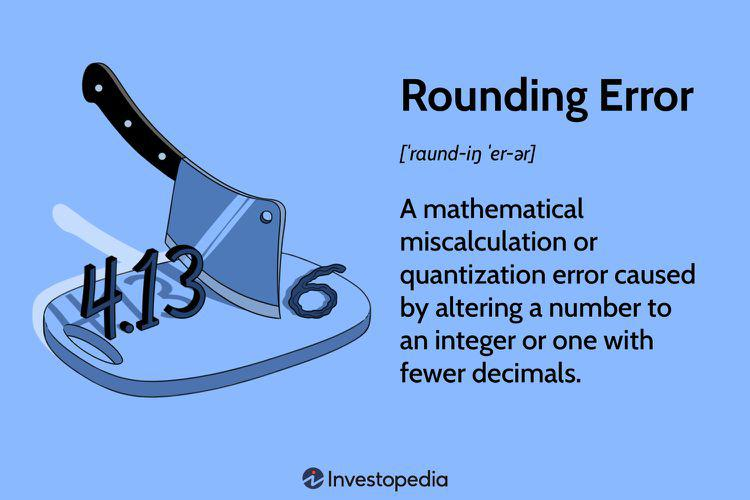

In the intricate world of algorithmic trading, precision and accuracy are the bedrock of successful operations. Algorithmic trading, also referred to as algo trading, leverages advanced computational techniques that enable rapid decision-making and trade execution. This methodology has revolutionized financial markets by allowing traders to capitalize on market inefficiencies at speeds and scales beyond human capability.

A critical component of this technological advancement is the role of computational precision and numerical accuracy. Computational precision pertains to the exactness with which calculations are performed, crucial in handling large data volumes inherent in algo trading systems. Numerical accuracy ensures that the computed values closely approximate their true values, safeguarding the reliability of trading outcomes. However, these systems are not without pitfalls; rounding errors can introduce discrepancies that, if unaddressed, can accumulate to significant financial inconsistencies.



High-frequency trading (HFT) exemplifies the importance of these principles as it intensively utilizes automated strategies that execute trades in fractions of a second. In such environments, even minor rounding errors can lead to aggregate losses, potentially wiping out profits. As algorithmic trading increasingly relies on AI-driven systems, understanding and managing these precision errors are more crucial than ever.

This article explores the profound impact that computational precision and numerical accuracy have on trading outcomes. It highlights the potential financial risks posed by rounding errors and presents strategies to mitigate these risks effectively. By fostering a thorough understanding of these concepts, traders can enhance the reliability and profitability of their algorithmic trading operations.

## Table of Contents

## Understanding Computational Precision and Numerical Accuracy

Computational precision is fundamental in algorithmic trading, where the exactness of numbers used in calculations directly influences trading outcomes. In this context, precision refers to the number of significant digits with which values are represented and calculated. Computers use finite precision arithmetic, where a certain number of bits are allocated to represent numbers. This limitation can introduce small discrepancies due to truncation or rounding, especially when handling a massive volume of data rapidly.

Numerical accuracy, on the other hand, measures how close a computed value is to its true value. It is critical in ensuring that the results of algorithmic computations are dependable and reflect the market's actual state. When algorithms execute thousands of trades per second, even minor inaccuracies can lead to cumulative effects, impacting financial returns.

Rounding errors occur during the process of aproximation, where numbers are trimmed or rounded to fit within the constraints of computational resources. These errors usually arise in floating-point arithmetic due to the limitations of binary representation of decimal numbers. For example, numbers like 1/3 or π cannot be precisely represented in a binary system, leading to errors. Over multiple operations, especially in complex mathematical computations inherent in trading algorithms, these small discrepancies can cumulate into significant variances.

In high-frequency trading, where algorithms might execute trades in microseconds, even the smallest rounding errors can multiply rapidly. For instance, consider a trading strategy that executes 1,000,000 trades, where each trade incurs a rounding error of $0.0001. While each individual rounding error may seem negligible, the total error could amount to $100—an amount that can influence pricing strategies, risk assessments, and profitability over time.

To illustrate, consider a simple Python example of floating-point precision issues:

```python
# Example to show floating-point precision issue
a = 0.1
b = 0.2
c = 0.3

# Check if a + b equals c
print(a + b == c)  # Outputs: False

# Show the actual result of a + b
print(a + b)  # Outputs: 0.30000000000000004
```

This example highlights how binary floating-point arithmetic can introduce precision errors, a concept essential for developers to consider in trading algorithms' design.

Understanding how computational precision and numerical accuracy affect trading systems is crucial for professionals in the domain. By addressing issues related to rounding and representation errors, traders can develop more robust strategies, thereby mitigating potential financial risks associated with these computational nuances.

## Impact of Rounding Errors in Algo Trading

Rounding errors in [algorithmic trading](/wiki/algorithmic-trading), while often individually minor, can accumulate across numerous trades, leading to considerable financial inaccuracies. In high-frequency trading ([HFT](/wiki/high-frequency-trading-strategies)), where vast numbers of transactions occur within fractions of a second, even minimal numerical discrepancies can quickly scale to significant financial impacts. For instance, a minor rounding error in a single trade might seem negligible, but when this error is magnified over thousands or millions of transactions, the result can be a loss amounting to hundreds of thousands, or even millions, of dollars in a single day. 

The financial industry has observed that such errors, despite their small size in isolation, have occasionally contributed to losses reaching up to $1 million within a remarkably short timeframe. This issue is not only disruptive in terms of immediate financial performance but also poses long-term challenges. The reliability and trustworthiness of AI-driven systems are crucial for maintaining investor confidence and ensuring smooth operational efficiency. Persistent rounding inaccuracies can erode trust in these systems, prompting concerns about their viability and accuracy in managing large-scale financial operations.

Understanding how and when these rounding errors occur is crucial in formulating effective strategies to mitigate them. Typically, these issues arise during numerical operations involving floating-point arithmetic. The nature of binary representation of numbers in computing can lead to minute deviations when performing arithmetic operations. For example, converting decimal numbers to binary often involves approximations that, when compounded over extensive calculations, result in rounding errors. 

To illustrate, consider a simple Python code example demonstrating how floating-point arithmetic can lead to unexpected rounding discrepancies:

```python
# Simple demonstration of floating-point arithmetic leading to rounding error
a = 0.1
b = 0.2
c = 0.3

# Check for equality
result = (a + b) == c
print("Does 0.1 + 0.2 equal 0.3?", result)
```
Running this code might unexpectedly print `False` due to the inherent rounding errors associated with floating-point arithmetic in binary systems. This subtle rounding issue underscores the need for strategies aimed at minimizing its impact in financial computations.

Overall, a deep understanding of where and why rounding errors occur allows traders and system developers to craft mitigation tactics, such as employing higher precision data types or implementing algorithms explicitly designed to handle precision-related issues efficiently. Addressing these errors not only secures immediate financial interests but also sustains the credibility and sustainability of algorithmic trading systems.

## Mitigating Rounding Errors in Algorithmic Trading

In algorithmic trading, minimizing rounding errors is crucial for maintaining precision and reliability. One effective strategy is the use of higher-precision data types. For instance, floating-point numbers are commonly used in trading algorithms, but they can introduce errors due to their limited precision. Opting for higher-precision types like `Decimal` in Python can reduce these errors significantly. For example:

```python
from decimal import Decimal

# Using Decimal for higher precision
price1 = Decimal('12.3456789123456789')
price2 = Decimal('0.1234567891234567')
result = price1 + price2
```

This approach ensures the accuracy of calculations, particularly when handling large volumes of trading data where minor errors can accumulate.

Rigorous testing and validation of AI models are essential to preemptively identify and correct potential errors. Techniques such as [backtesting](/wiki/backtesting), where historical data is used to simulate trading scenarios, can be employed to understand how rounding errors might affect performance. By simulating a range of scenarios, including edge cases with extreme values, traders can assess model robustness and adjust accordingly.

Regular audits and error-checking protocols serve as additional safeguards in algotrading environments. These protocols involve routine checks of algorithmic outputs and system performance metrics to detect anomalies potentially caused by rounding errors. Implementing a feedback loop can ensure that any inaccuracies are quickly identified and corrected, maintaining operational integrity.

Lastly, integrating error-correction mechanisms within trading systems can drastically reduce numerical inaccuracies' risks. Such mechanisms may include redundancy checks, where multiple algorithms independently verify calculations to catch and correct discrepancies, and adopting fail-safes that automatically halt or alert if certain error thresholds are surpassed.

In summary, these strategies—using higher-precision data types, conducting rigorous model testing, establishing regular error-checking protocols, and integrating error-correction schemes—collectively safeguard algorithmic trading operations against the adverse effects of rounding errors. These measures not only enhance system reliability but also optimize financial outcomes.

## Conclusion

In conclusion, computational precision and numerical accuracy are foundational to the integrity of algorithmic trading systems. As these systems execute trades with incredible speed, even the slightest numerical inaccuracies can propagate, leading to unintended financial outcomes. Rounding errors, while seemingly minor, can significantly impact financial transactions, emphasizing the need for vigilant risk management practices. For instance, when executing vast volumes of trades, repeated rounding inaccuracies can accumulate, causing material discrepancies in transaction outcomes.

As the financial industry continues to embrace AI and automation, prioritizing precision is essential. Algorithmic systems must be rigorously designed to handle large datasets and perform calculations with high fidelity. Awareness and understanding of the computational challenges posed by rounding errors are vital tasks that cannot be overlooked by traders and developers. 

By adopting robust strategies to mitigate these risks, traders can enhance both the reliability and profitability of their algorithmic trading operations. Developing systems using higher precision data types, ensuring thorough testing and validation of algorithms, and instituting regular audits and error-checking protocols are all practical means to safeguard against numerical inaccuracies. Through these efforts, traders can foster systems that are both efficient and accurate, reinforcing trust in algorithmic methodologies and ultimately contributing to more stable and profitable trading environments.

## References & Further Reading

[1]: Higham, N. J. (2002). ["Accuracy and Stability of Numerical Algorithms"](https://epubs.siam.org/doi/book/10.1137/1.9780898718027). Society for Industrial and Applied Mathematics.

[2]: Hull, J. C. (2018). ["Options, Futures, and Other Derivatives"](https://www.semanticscholar.org/paper/Options%2C-Futures%2C-and-Other-Derivatives-Hull/89bdee500c8623864fc9eb7a471546aa713acc44) (10th Edition). Pearson.

[3]: ["Numerical Computing with IEEE Floating Point Arithmetic"](https://epubs.siam.org/doi/book/10.1137/1.9780898718072) by Michael L. Overton

[4]: Kester, W. (1999). ["Understand SINAD, ENOB, SNR, THD, THD + N, and SFDR so you don't get lost in the noise floor."](https://www.researchgate.net/profile/Walt-Kester/publication/242519692_Understand_SINAD_ENOB_SNR_THD_THD_N_and_SFDR_so_You_Don%27t_Get_Lost_in_the_Noise_Floor/links/56a7749f08ae997e22bbe020/Understand-SINAD-ENOB-SNR-THD-THD-N-and-SFDR-so-You-Dont-Get-Lost-in-the-Noise-Floor.pdf) Analog Devices.

[5]: Peters, E. E. (1994). ["Fractal Market Analysis: Applying Chaos Theory to Investment and Economics"](https://archive.org/details/fractalmarketana0000pete) by Edgar E. Peters