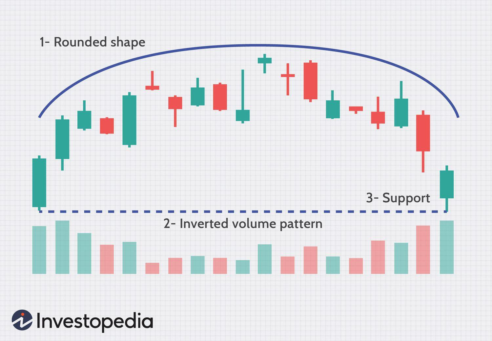

## Table of Contents

## What is a Rounding Top pattern in technical analysis?

A Rounding Top pattern in technical analysis is a chart pattern that looks like an upside-down bowl. It shows that the price of a stock or other asset is slowly changing from going up to going down. This pattern can take a long time to form, sometimes several months. Traders watch for this pattern because it can signal that the price might start to fall soon.

When you see a Rounding Top, the price starts at a high point, then gradually curves down to a low point, and then curves back up but doesn't reach the original high. The pattern is complete when the price breaks below the low point of the curve. This break is a sign for traders to possibly sell their holdings or take other actions to protect their investments.

## How does a Rounding Top differ from other chart patterns?

A Rounding Top is different from other chart patterns because it shows a slow and smooth change in the price trend. Unlike patterns like the Head and Shoulders or Double Top, which have sharp peaks and clear turning points, the Rounding Top looks like a gentle curve. It takes a longer time to form, often over several months, while other patterns might form in weeks or even days. This slow formation makes it unique because it shows a gradual shift in market sentiment from bullish to bearish.

Another difference is in how traders use the Rounding Top compared to other patterns. For instance, with a Head and Shoulders pattern, traders look for a [breakout](/wiki/breakout-trading) below the neckline to confirm a reversal. With a Rounding Top, the key signal is when the price breaks below the lowest point of the curve. This break suggests that the price might continue to fall, prompting traders to sell or take protective measures. Other patterns like the Double Top might signal a reversal with a similar break below a support level, but the Rounding Top's long formation and smooth curve make it stand out.

## What are the key characteristics of a Rounding Top pattern?

A Rounding Top pattern looks like an upside-down bowl on a chart. It shows that the price of a stock or asset is slowly changing from going up to going down. The pattern starts with the price reaching a high point, then it curves down to a lower point over time, and finally, it curves back up but doesn't reach the original high. This slow and smooth curve can take months to form, showing a gradual shift in what people think about the stock.

The key thing to watch for in a Rounding Top is when the price breaks below the lowest point of the curve. This break is a big sign that the price might keep going down. Traders use this signal to decide if they should sell their stock or take other steps to protect their investments. Unlike other patterns that might have sharp turns or quick changes, the Rounding Top's slow formation and smooth curve make it unique and important to recognize.

## How can a beginner identify a Rounding Top on a price chart?

A beginner can identify a Rounding Top on a price chart by looking for a shape that looks like an upside-down bowl. This pattern starts when the price reaches a high point, then slowly curves down to a lower point over time, and finally curves back up but doesn't reach the original high. The whole process can take several months, so it's important to look at longer time frames on the chart.

The key sign that a Rounding Top is complete is when the price breaks below the lowest point of the curve. This break suggests that the price might keep going down. To spot this, a beginner should draw a line across the lowest points of the curve and watch for the price to fall below this line. Recognizing this pattern can help beginners understand when the market might be shifting from a bullish to a bearish trend.

## What does a Rounding Top indicate about market sentiment?

A Rounding Top on a price chart tells us that people's feelings about a stock or asset are slowly changing. At first, everyone is excited and buying, pushing the price up to a high point. But then, over time, fewer people want to buy, and more start selling. This slow change makes the price curve down like an upside-down bowl. It shows that the market is moving from feeling good about the stock to feeling less sure about it.

The Rounding Top is important because it gives us a warning. When the price finally drops below the lowest part of the curve, it's a sign that the market might keep going down. This tells traders and investors that it might be a good time to sell or be careful with their money. So, the Rounding Top shows a shift from a happy, buying mood to a more worried, selling mood in the market.

## What are the common time frames for observing a Rounding Top?

A Rounding Top usually takes a long time to show up on a chart. It can take several months, sometimes even half a year or more, for the whole pattern to form. This is because it shows a slow change in how people feel about a stock or asset, moving from happy and buying to worried and selling.

Because it takes so long to form, you won't see a Rounding Top on short time frames like daily or hourly charts. Instead, you need to look at longer time frames, like weekly or monthly charts, to spot this pattern. This helps traders and investors see the big picture and understand the slow shift in market sentiment.

## How reliable is the Rounding Top as a predictor of future price movements?

The Rounding Top can be a good hint about what might happen to the price of a stock or asset in the future, but it's not perfect. It shows that people are slowly changing their minds from wanting to buy to wanting to sell. When you see the price break below the lowest part of the curve, it's a sign that the price might keep going down. This can help traders decide if it's time to sell or be careful with their money.

However, like all chart patterns, the Rounding Top doesn't always work. Sometimes, the price might not keep going down after breaking the curve's low point. Other things like news, big events, or changes in the economy can affect the price too. So, while the Rounding Top can be useful, it's best to use it along with other tools and information to make better guesses about what the price will do next.

## What are the entry and exit strategies when trading based on a Rounding Top?

When trading based on a Rounding Top, the entry point usually comes when the price breaks below the lowest point of the curve. This break signals that the price might keep going down, so traders often decide to sell their stocks or short-sell at this point. They might also set a stop-loss just above the lowest point of the curve to protect themselves in case the price goes back up instead of down. This way, they can limit their losses if the pattern doesn't work out as expected.

The [exit](/wiki/exit-strategy) strategy for a Rounding Top trade depends on what the trader wants to do. If they're selling or short-selling, they might choose to exit their position when the price reaches a certain target. This target could be based on how far the price fell from the high point to the low point of the curve. Some traders might also decide to exit if they see signs that the price might start going up again, like if it breaks above a certain resistance level. Using these strategies can help traders make the most of the Rounding Top pattern while also being ready for different outcomes.

## Can a Rounding Top be confirmed with other technical indicators, and if so, which ones?

Yes, a Rounding Top can be confirmed with other technical indicators to make sure the pattern is more reliable. One good indicator to use is the [volume](/wiki/volume-trading-strategy). When the price is curving down in the Rounding Top, you might see the volume getting lower. This means fewer people are trading, which can confirm that the market is losing interest. Another useful indicator is the moving average. If a shorter-term moving average, like the 50-day, crosses below a longer-term moving average, like the 200-day, it can signal that a bearish trend is starting, which matches what the Rounding Top is showing.

Also, the Relative Strength Index (RSI) can help confirm a Rounding Top. If the RSI starts to fall below 50 while the price is curving down, it can show that the stock is losing its strength, which fits with the Rounding Top's bearish signal. By using these indicators together with the Rounding Top pattern, traders can get a better idea of whether the price is really going to go down. This can help them make smarter decisions about when to sell or short-sell the stock.

## How does volume play a role in confirming a Rounding Top pattern?

Volume plays an important role in confirming a Rounding Top pattern. When the price starts curving down in the Rounding Top, you might see the volume getting lower. This means fewer people are trading the stock. When volume goes down as the price goes down, it shows that the market is losing interest in the stock. This can make the Rounding Top pattern more reliable because it matches what the pattern is telling us about the market's feelings.

When the price finally breaks below the lowest point of the curve, it's a good sign if the volume goes up at the same time. Higher volume at the breakout means more people are selling, which confirms that the price might keep going down. So, by watching the volume, traders can get a better idea if the Rounding Top pattern is really showing a shift from a bullish to a bearish market, helping them decide when to sell or take other actions.

## What are the potential pitfalls or false signals associated with Rounding Top patterns?

One big problem with Rounding Top patterns is that they can trick you. Sometimes, the price might break below the lowest part of the curve, but then it goes back up instead of going down more. This can happen because of news or other things that change what people think about the stock. If you sell or short-sell based on the Rounding Top and it turns out to be a false signal, you could lose money.

Another issue is that the Rounding Top can take a long time to form, sometimes months. During this time, other things in the market can change, making the pattern less useful. It's also hard to tell when the pattern is really finished because the curve can be smooth and hard to spot exactly. So, it's important to use other tools and information along with the Rounding Top to make better guesses about what the price will do next.

## How can advanced traders incorporate Rounding Top patterns into a broader trading strategy?

Advanced traders can use Rounding Top patterns as part of a bigger plan for trading. They might look at the Rounding Top along with other signs like volume, moving averages, and the RSI to make sure their guesses about the price are more likely to be right. For example, if they see the price breaking below the lowest part of the Rounding Top's curve and the volume going up at the same time, it can make them feel more sure about selling or short-selling the stock. They might also use the Rounding Top to help them decide when to get out of a trade, like if the price reaches a certain target based on how far it fell from the high to the low of the curve.

Besides using the Rounding Top with other tools, advanced traders might also think about what's happening in the market and the economy. They know that news and big events can change how people feel about a stock, so they might wait for other signs to confirm the Rounding Top before making a move. They could also use the Rounding Top to help them manage risk, like setting stop-loss orders just above the lowest part of the curve to limit losses if the pattern turns out to be wrong. By putting the Rounding Top into a bigger plan that looks at many things, advanced traders can make smarter choices about when to buy, sell, or hold onto their stocks.

## References & Further Reading

[1]: Bergstra, J., Bardenet, R., Bengio, Y., & Kégl, B. (2011). ["Algorithms for Hyper-Parameter Optimization."](https://papers.nips.cc/paper/4443-algorithms-for-hyper-parameter-optimization) Advances in Neural Information Processing Systems 24.

[2]: ["Advances in Financial Machine Learning"](https://www.amazon.com/Advances-Financial-Machine-Learning-Marcos/dp/1119482089) by Marcos Lopez de Prado

[3]: ["Evidence-Based Technical Analysis: Applying the Scientific Method and Statistical Inference to Trading Signals"](https://www.amazon.com/Evidence-Based-Technical-Analysis-Scientific-Statistical/dp/0470008741) by David Aronson

[4]: ["Machine Learning for Algorithmic Trading"](https://github.com/stefan-jansen/machine-learning-for-trading) by Stefan Jansen

[5]: ["Quantitative Trading: How to Build Your Own Algorithmic Trading Business"](https://www.amazon.com/Quantitative-Trading-Build-Algorithmic-Business/dp/1119800064) by Ernest P. Chan