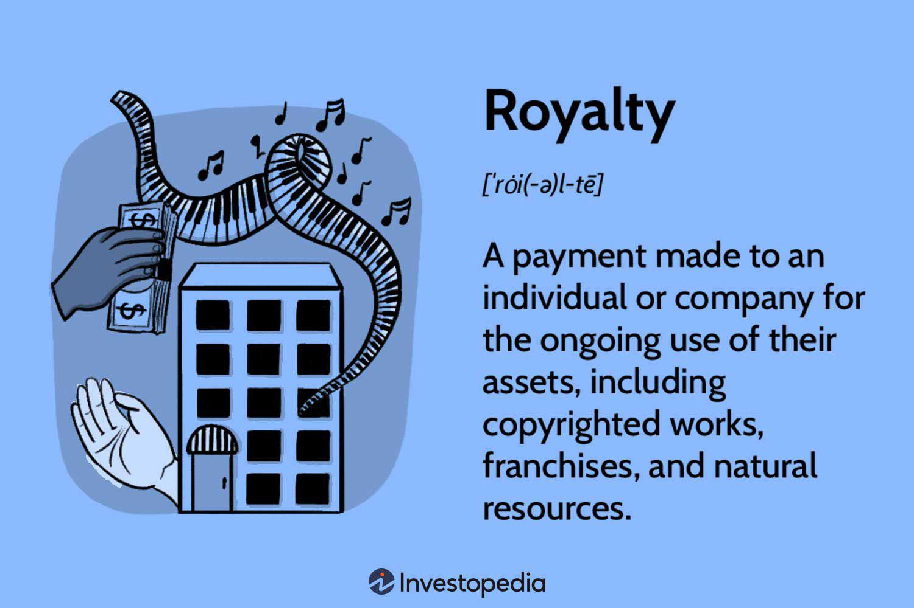

The oil and gas industry has witnessed remarkable technological advancements that continue to transform its operational and strategic frameworks. Among these innovations, the integration of algorithmic trading has significantly altered the management and optimization of mineral rights and royalties. This shift is part of a broader trend wherein technology drives efficiency, transparency, and financial performance in traditionally manual and complex industries. By employing sophisticated algorithms, stakeholders in the oil and gas sector are now able to make informed decisions faster and more accurately, enhancing both profitability and risk management.

Algorithmic trading, characterized by the use of complex software to execute trading operations based on pre-programmed criteria, has introduced a new dimension to the management of mineral rights and royalties. Traditionally, these aspects were governed by contractual agreements and manually intensive processes. However, with the advent of algorithmic solutions, there has been a noticeable shift towards more automated and precise methods of handling these valuable assets. This has enabled companies and investors to better navigate fluctuating market conditions and access real-time data analysis, leading to optimized asset management strategies.

This article will explore the intersection of mineral rights, royalty interests, and the transformative role of algorithmic trading within the oil and gas sector. By comprehending how these elements interact, stakeholders can better understand the emerging trends and potential opportunities that lie ahead. Through the lens of technology-driven trading methodologies, this article will provide insights into maximizing asset value and improving overall industry practices.

## Table of Contents

## Understanding Oil and Gas Mineral Rights

Mineral rights represent the legal ownership of underground resources, which often include oil, natural gas, metals, and other valuable minerals. Typically granted separately from surface rights, mineral rights provide individuals or entities the authority to explore and extract these subsurface assets. The ownership of mineral rights is of significant influence within the oil and gas industry, as it dictates who benefits financially from the extraction of these resources. 

The acquisition and management of mineral rights play a pivotal role in structuring oil and gas deals. Essentially, the holding of these rights determines who receives payment from the development and production of the resources. Therefore, negotiating these rights is a key component of any oil and gas agreement. Mineral rights owners receive compensation through mechanisms like lease bonuses, delay rentals, and royalties, ensuring they benefit financially from the activities conducted on their land.

Mineral rights can be either leased or sold, and these decisions affect how profits from oil and gas production are distributed. When mineral rights are leased, the owner grants an oil or gas company the right to explore and produce from their land in exchange for lease payments and a share of the production revenue, known as royalties. This arrangement allows the rights holder to maintain ownership while benefiting from the resource's extraction. The leasing agreement generally specifies the duration, the number of resources that can be extracted, and the financial terms involved, including the royalty rate. A typical royalty rate frequently encountered in the United States ranges from 12.5% to 25% of the revenue accrued from resource extraction.

Conversely, if mineral rights are sold, the ownership is transferred permanently to the buyer. This transaction offers immediate financial gain to the seller but relinquishes any future profits from the resources extracted. The sale price is often determined by the potential value of the resources, current market conditions, and the geological prospects of the area.

The process of determining mineral rights ownership can be complex, often requiring thorough title searches and property records reviews, given that ownership can be fragmented among multiple parties over time. Stakeholders must engage with legal, geological, and financial experts to navigate these intricacies effectively and optimize their investments in the oil and gas industry.

## Exploring Royalty Interests in the Oil and Gas Sector

Royalty interests in the oil and gas sector represent an enduring financial mechanism that is widely favored due to its inherent structure, which separates revenue generation from production liabilities. These interests entitle the holder to a predetermined percentage of revenue derived from the sale of oil and gas produced from a specific property, without the burden of production-related costs. This unique attribute makes royalty interests particularly attractive to investors seeking passive income with reduced operational risk.

The financial appeal of royalty interests stems from their ability to provide a steady income stream. The revenue received by royalty interest owners is calculated as a percentage of the gross production revenue. Mathematically, if $R$ denotes the royalty [interest rate](/wiki/interest-rate-trading-strategies) and $G$ the gross revenue from production, the income $I$ for the royalty holder is given by:
$$
I = R \times G
$$

Investors in the oil and gas market find royalty interests appealing because they eliminate direct exposure to operational challenges and expenses such as drilling, extraction, and maintenance. This separation from operational liabilities not only reduces financial risk but also simplifies the investment process for stakeholders who may not have expertise in operational management.

Understanding the nuances of royalty interests is crucial for investors aiming to optimize their investment portfolios within the oil and gas sector. Key factors include the legal framework governing the royalty agreements, typically determined by jurisdictional regulations, and the terms outlined in individual contracts, such as lease duration, royalty rates, and property-specific stipulations.

Investment in royalty interests also requires a thorough assessment of production potential and market conditions, which can impact the profitability of the investment. This involves evaluating geological data, production forecasts, and commodity price trends—a process often enhanced by leveraging advanced data analytics and financial models.

As an investment vehicle, royalty interests present a low-risk, potentially high-reward opportunity, making them a preferred choice for diversified portfolios interested in stable cash flows unaffected by direct production costs.

## The Role of Algo Trading in Oil and Gas Investments

Algorithmic trading, often referred to as algo trading, leverages complex mathematical models and electronic platforms to make decision-based trades with minimal human intervention. This approach utilizes pre-set rules based on timing, price, and quantity to optimize trading performance in various markets, including oil and gas.

In the oil and gas sector, [algorithmic trading](/wiki/algorithmic-trading) plays a critical role by enhancing efficiency in transactions related to royalty interests and mineral rights. These interests, which allow owners to receive revenue from oil and gas production without direct involvement in the production process, benefit substantially from the precision and speed that algo trading provides. Algorithms can quickly analyze large volumes of financial data, market trends, and geopolitical events to make profitable trading decisions or adjust investment strategies in real-time.

Efficiency is a key advantage of algo trading. Traditional trading methods are often manual and time-consuming, requiring traders to scour data, perform analyses, and execute trades. In contrast, algorithms process data faster and reduce the lag time between market developments and trading execution, minimizing the potential for human error. This efficiency translates into reduced transaction costs, as algorithms can execute large volumes of trades quickly at optimal prices, minimizing the bid-ask spread.

Moreover, algorithmic trading can increase potential returns by identifying patterns and market inefficiencies that may not be visible to human traders. For instance, algorithms can pick up on subtle shifts in oil prices or supply chain disruptions, allowing traders to capitalize on pricing anomalies. By continuously learning and adapting from new data inputs, these systems can refine their strategies to stay ahead of market changes.

Despite these benefits, the successful implementation of algorithmic trading requires careful design and testing of algorithms to ensure robustness in the volatile oil and gas markets. Algorithms must be designed to handle fluctuations in market [liquidity](/wiki/liquidity-risk-premium) and regulatory changes, which can significantly impact trading outcomes. Additionally, algorithms should incorporate risk management protocols to mitigate potential losses due to unforeseen market movements. 

In conclusion, as algorithmic trading becomes increasingly integral to oil and gas investments, stakeholders must recognize its potential to streamline trading operations and increase profitability. By harnessing the power of sophisticated algorithms, investors can better navigate the complexities of the market, optimize their investment strategies, and capitalize on emerging opportunities in the industry.

## Impact and Challenges of Algorithmic Trading in Oil and Gas

Algorithmic trading has emerged as a powerful tool in the oil and gas industry, offering distinct advantages such as enhanced efficiency and reduced transaction costs. However, it also brings with it a set of challenges that stakeholders must navigate carefully. One of the primary concerns associated with algorithmic trading is market [volatility](/wiki/volatility-trading-strategies). The high-speed nature of algorithmic trading can exacerbate price swings, leading to increased uncertainty in market prices. This is particularly relevant in the oil and gas sector, where prices are already subject to fluctuations due to geopolitical events, supply and demand imbalances, and other external factors.

Liquidity issues also pose significant challenges. While algorithmic trading can increase market liquidity by facilitating a higher [volume](/wiki/volume-trading-strategy) of trades, it can also lead to liquidity imbalances. Algorithmic strategies often involve executing large orders divided into smaller ones to minimize market impact. However, if multiple algorithms operate simultaneously with similar strategies, they could inadvertently drain liquidity, making it difficult to execute trades at desired prices. This issue is compounded in less liquid markets, such as niche areas of mineral rights trading, where fewer buyers and sellers exist.

Regulatory constraints represent another critical [factor](/wiki/factor-investing) that impacts the efficacy of algorithmic trading. Different jurisdictions impose various regulations that traders must adhere to, which can hinder the agility and flexibility of trading strategies. For example, laws designed to prevent market manipulation and ensure fair trading can impose limitations on algorithm design and execution. Compliance with these regulations requires algorithms to be robustly tested and validated to prevent inadvertent violations that could result in penalties.

Furthermore, stakeholders must consider the risks associated with algorithmic errors, also known as "algo failures." These errors can stem from incorrect coding, data feed issues, or unexpected market conditions, leading to substantial financial losses. To mitigate these risks, continuous monitoring and optimization of algorithms are crucial, ensuring that they can adapt to changing market landscapes effectively.

It is imperative for stakeholders in the oil and gas industry to understand these challenges thoroughly. By acknowledging the potential risks and regulatory requirements, they can devise strategies to harness the benefits of algorithmic trading while mitigating its downsides. This includes collaborating with experts in both trading and compliance, investing in advanced risk management systems, and staying abreast of evolving market and regulatory developments.

## Future Outlook – Opportunities and Innovations

The evolving landscape of algorithmic trading creates significant opportunities for investors within the oil and gas sector. Continued advancements in [artificial intelligence](/wiki/ai-artificial-intelligence) (AI) and [machine learning](/wiki/machine-learning) are poised to revolutionize the management of mineral rights and royalty interests, ushering in an era of increased efficiency and precision.

AI and machine learning offer the potential to streamline the evaluation and management of mineral rights, enabling stakeholders to make more informed decisions. Through the use of sophisticated algorithms, vast datasets comprising geological surveys, historical production data, and market trends can be analyzed rapidly. These insights aid in identifying optimal investment opportunities and predicting future production outputs with greater accuracy.

Machine learning models, particularly those employing [deep learning](/wiki/deep-learning) techniques, can enhance the valuation process of mineral rights by recognizing patterns and anomalies that traditional methods might overlook. As these models improve, they reduce the likelihood of underestimating or overestimating the potential value of oil and gas reserves.

For royalty interests, algorithmic solutions can automate the complex calculations of payments owed to rights holders, accounting for fluctuating production levels and commodity prices. This not only ensures accurate and timely distribution of revenues but also minimizes the administrative burden on companies.

Investors and industry stakeholders must remain proactive in assimilating these technological advancements. By doing so, they can position themselves to leverage new tools that optimize resource allocation and risk management strategies. Establishing a framework for continuous learning and adaptation allows stakeholders to capitalize on innovations as they emerge.

In summary, as AI and machine learning continue to integrate into the oil and gas industry, stakeholders who embrace these technologies will likely gain a competitive edge. Staying informed about technological advancements ensures that investors can seize new opportunities, ultimately leading to enhanced profitability and sustainability within the sector.

## Conclusion

The convergence of oil and gas mineral rights, royalty interests, and algorithmic trading is poised to significantly transform the industry. This transformation is driven by the integration of technology, specifically through algorithmic trading, which has introduced unprecedented efficiencies in managing these complex financial and operational components.

For stakeholders, understanding mineral rights and royalty interests remains fundamental. Mineral rights provide the legal framework for accessing and utilizing subsurface resources, such as oil and gas, while royalty interests determine the distribution of revenue generated from resource extraction. By integrating algorithmic trading, stakeholders can optimize these financial structures, enhancing profitability and reducing transactional complexities.

Algorithmic trading, employing sophisticated algorithms and data analytics, enables stakeholders to make more informed investment decisions, minimizing risks and maximizing returns. This technology streamlines the trading processes involved in oil and gas investments, ensuring precise execution and reducing human error.

Keeping abreast of technological advancements in algorithmic trading is essential for maintaining a competitive edge. The proliferation of artificial intelligence and machine learning is anticipated to further revolutionize mineral rights and royalty management. These technologies offer predictive insights and automate decision-making processes, allowing for real-time adjustments to market conditions. 

As the industry evolves, stakeholders who actively engage with emerging technologies will be better positioned to navigate the complexities of the oil and gas sector. Continuous monitoring and adaptation to these advancements will not only secure competitiveness but also ensure robust financial outcomes. The future landscape of oil and gas investments hinges on the ability of stakeholders to integrate these dynamic elements effectively, fostering an industry marked by innovation and sustained growth.

## References & Further Reading

[1]: Bergstra, J., Bardenet, R., Bengio, Y., & Kégl, B. (2011). ["Algorithms for Hyper-Parameter Optimization."](https://dl.acm.org/doi/10.5555/2986459.2986743) Advances in Neural Information Processing Systems 24.

[2]: ["Advances in Financial Machine Learning"](https://www.amazon.com/Advances-Financial-Machine-Learning-Marcos/dp/1119482089) by Marcos Lopez de Prado

[3]: ["Evidence-Based Technical Analysis: Applying the Scientific Method and Statistical Inference to Trading Signals"](https://www.amazon.com/Evidence-Based-Technical-Analysis-Scientific-Statistical/dp/0470008741) by David Aronson

[4]: ["Machine Learning for Algorithmic Trading"](https://github.com/stefan-jansen/machine-learning-for-trading) by Stefan Jansen

[5]: ["Quantitative Trading: How to Build Your Own Algorithmic Trading Business"](https://www.amazon.com/Quantitative-Trading-Build-Algorithmic-Business/dp/1119800064) by Ernest P. Chan