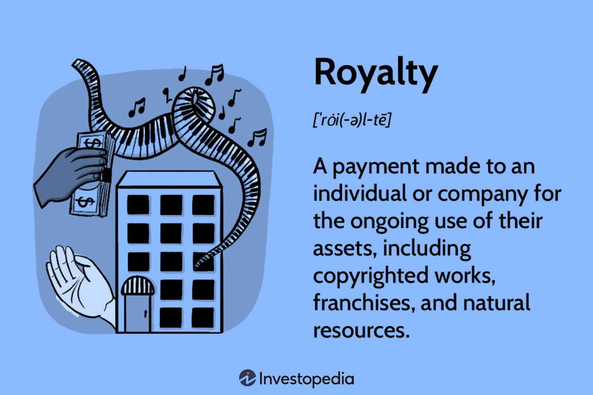

## Table of Contents

## What is a royalty payment?

A royalty payment is money that someone pays to use something that someone else owns. This can be for things like books, music, or inventions. The person who owns the thing gets money every time someone else uses it or sells it.

For example, if a writer writes a book, they might get money every time someone buys their book. The same goes for a musician who gets paid every time their song is played on the radio or used in a movie. Royalties help make sure that creators get paid for their work, even if someone else is using it to make money.

## How do royalty payments work?

Royalty payments are like sharing money. When someone uses something that someone else made or owns, they pay a part of their earnings to the owner. This can happen with books, songs, or even special inventions. For example, if a company sells a toy that someone invented, the inventor gets some money from each toy sold. The amount of money shared is usually a percentage, like 5% or 10%, and it's written in a contract.

The way royalties are paid can be different depending on what is being used. For books, the author might get money every time someone buys their book. For music, the artist might get paid every time their song is played on the radio or used in a movie. Sometimes, the payments come every month or every few months. It's important for the owner to keep track of how their work is being used so they can make sure they get all the money they should.

## What are the common types of royalties?

Royalties can come in different forms, but some of the most common types are for books, music, and inventions. When someone writes a book, they get money every time someone buys it. This is called a book royalty. For music, artists get paid when their songs are played on the radio, used in movies, or sold. These are music royalties. If someone invents something new, like a special toy or machine, they can get money every time someone makes or sells it. This is called a patent royalty.

Another type of royalty is for things like minerals and natural resources. If someone owns the rights to oil, gas, or minerals in the ground, they get paid when companies take them out and sell them. These are called mineral royalties. There are also royalties for using someone's image or likeness, like when a famous person's picture is used on a product. These are called image royalties. Each type of royalty has its own way of figuring out how much money should be paid, but they all help make sure the owner gets a fair share.

## Who typically receives royalty payments?

People who create things like books, music, or inventions usually get royalty payments. For example, if a writer writes a book, they get money every time someone buys it. The same goes for musicians who get paid when their songs are played on the radio or used in movies. Inventors also get royalties when someone makes or sells their inventions, like a new toy or machine.

Sometimes, people who own rights to things like oil, gas, or minerals in the ground get royalty payments too. Companies pay them for taking these resources out of the ground and selling them. Also, famous people can get royalties when their image or likeness is used on products. All these royalties help make sure that the creators and owners get money for their work or resources, even if someone else is using them to make money.

## How are royalty rates determined?

Royalty rates are decided based on agreements between the person who owns something and the person who wants to use it. This agreement is usually written in a contract. The rate can be a certain percentage of the money made from selling or using the thing, like 5% or 10%. Sometimes, the rate is a fixed amount of money for each item sold or each time something is used. The rate can change depending on what is being used, like a book, a song, or an invention.

Different things can affect the royalty rate. For books, the rate might be higher if the book is expected to sell a lot. For music, the rate can depend on how the song is used, like on the radio or in a movie. For inventions, the rate might be based on how much it costs to make the invention or how much money it can make. It's important for both sides to agree on a fair rate so that the owner gets paid enough for their work, but the user can still make money too.

## What is the difference between royalties and licensing fees?

Royalties and licensing fees are both ways for someone to make money from something they own, but they work a bit differently. Royalties are like sharing money. When someone uses your book, song, or invention to make money, you get a part of that money. The amount you get is usually a percentage, like 5% or 10%, and it's paid over time, maybe every month or every few months. So, if your book keeps selling or your song keeps playing, you keep getting money.

Licensing fees, on the other hand, are like renting out your thing for a set amount of time. You get a one-time payment or a set amount of money for letting someone use your book, song, or invention. The fee is usually decided before the person starts using it, and it doesn't change based on how much money they make from it. So, if someone wants to use your song in a movie, they might pay you a licensing fee to use it for that one movie, but you won't get more money if the movie makes a lot of money.

## How do you calculate royalty payments?

To calculate royalty payments, you need to know the royalty rate and how much money was made from selling or using the thing. The royalty rate is usually a percentage, like 5% or 10%, that was agreed upon in a contract. If you know the total money made, you can find the royalty payment by multiplying that total by the royalty rate. For example, if a book sold for $20 and the royalty rate is 10%, the author would get $2 for each book sold.

Sometimes, the royalty payment is based on the number of items sold or the number of times something was used. In this case, you would multiply the number of items or uses by a fixed amount of money per item or use. For example, if an inventor gets $1 for each toy sold and 100 toys were sold, the royalty payment would be $100. It's important to keep good records so you can figure out the right amount of money to pay or receive.

## What legal agreements govern royalty payments?

Royalty payments are usually governed by contracts between the person who owns something and the person who wants to use it. These contracts spell out the details, like how much money the owner will get, how often they will get it, and what happens if someone doesn't follow the rules. The contract might say that the owner gets a certain percentage of the money made from selling or using the thing, or it might say they get a fixed amount for each item sold or each time it's used.

Sometimes, other legal agreements can also affect royalty payments. For example, if someone writes a book, there might be laws about copyrights that say how the book can be used and how the author should be paid. If someone invents something, there might be patent laws that protect their invention and help them get royalties. These laws and contracts work together to make sure that the owner gets paid fairly for their work or resources.

## What are the tax implications of receiving royalty payments?

When you get royalty payments, you have to pay taxes on that money. The money you get from royalties is usually counted as income, just like money you earn from a job. So, you have to report it on your tax return and pay income tax on it. The amount of tax you pay can depend on how much money you make in total, including your royalties and any other income.

Sometimes, the person or company paying you the royalties will take out some money for taxes before they give you the rest. This is called withholding tax. They do this to make sure the government gets some tax money right away. But you might still owe more tax when you file your tax return, or you might get some money back if too much was taken out. It's a good idea to keep good records of your royalty payments and talk to a tax professional to make sure you're doing everything right.

## How can technology assist in managing royalty payments?

Technology can make managing royalty payments a lot easier. Special software can keep track of how many books are sold, how often a song is played, or how many times an invention is used. This helps make sure that the right amount of money is paid to the person who owns the thing. The software can also send out the payments automatically, so the owner doesn't have to wait or keep asking for their money. It can even make reports and keep records, which is helpful when it's time to do taxes or check if everything is correct.

Using technology also helps with keeping everything fair and clear. For example, if there's a disagreement about how much money should be paid, the software can show exactly how the numbers were figured out. This can stop arguments and make sure everyone trusts the system. Plus, technology can connect with other systems, like online stores or music streaming services, to get the latest information quickly. This means the owner can see their royalty payments in real-time and know exactly how their work is doing.

## What challenges are associated with royalty payment administration?

Managing royalty payments can be tricky. One big challenge is keeping track of everything. When books, songs, or inventions are sold or used all over the world, it can be hard to know exactly how much money should be paid to the owner. Sometimes, the information comes in late or is wrong, which can cause disagreements and delays. It's important to have good records and clear contracts, but even then, mistakes can happen.

Another challenge is making sure everyone follows the rules. Sometimes, people or companies might try to pay less than they should or not pay at all. This can lead to legal fights, which take time and money to solve. Also, different countries have different laws about royalties, so it can be hard to manage payments across borders. Using technology can help, but it still needs people to check everything and make sure it's working right.

## How do international laws affect royalty payments?

International laws can make royalty payments more complicated. Different countries have different rules about how much money should be paid and how it should be reported. For example, one country might say that the person paying the royalties has to take out some money for taxes before sending it to the owner. Another country might have different rules about what counts as a royalty and how it should be shared. This can make it hard to figure out the right amount of money to pay, especially if the book, song, or invention is used in many different places.

To deal with these challenges, people often use special agreements called treaties. These treaties help make the rules more clear and fair between countries. They can say things like how much tax should be taken out or how to solve disagreements about payments. Even with treaties, managing international royalty payments can still be tricky. It's important to work with lawyers and accountants who know the laws in different countries to make sure everything is done right.

## What are the benefits of royalty agreements in algo trading?

Royalty agreements in algorithmic trading offer significant advantages by providing a consistent and sustainable income stream derived from intellectual property (IP) assets, thereby encouraging the innovation of advanced trading algorithms. Such agreements effectively align the strategic interests of licensors, who own the algorithms, and licensees, who utilize these algorithms in trading operations. This alignment ensures that both parties can share in the algorithm's success, creating a symbiotic relationship where improved algorithm performance translates directly into mutual financial benefits.

The structure of royalty agreements can be highly flexible, catering to diverse financial strategies and preferences. Royalties can be structured as fixed payments, which offer predictable revenue streams for IP holders, providing a stable financial base that supports further research and development. Conversely, percentage-based royalties tied to trading profits are performance-oriented, incentivizing both parties to maximize algorithm effectiveness and trading outcomes. This structure not only motivates continuous innovation but also allows licensees to manage costs more effectively, as payments will correlate directly with trading performance.

Mathematically, the calculation of royalties can be expressed as:

$$
\text{Royalty Payment} = \text{Fixed Fee} + (\text{Trading Profits} \times \text{Royalty Rate})
$$

This formula highlights the dual-path revenue mechanism. When fixed fees are involved, the licensor receives a predetermined amount irrespective of trading outcomes, whereas profits-based royalties adjust according to the performance, ensuring dynamic adaptability to market conditions.

Moreover, these royalty arrangements foster an environment that supports sustainable development of trading technologies. By lowering entry barriers for smaller firms, they allow access to sophisticated algorithms without incurring the high costs of developing such technologies internally. Consequently, a wider range of market participants can engage actively with cutting-edge algorithmic solutions, fostering a more competitive and innovative trading ecosystem.

In addition, equity-based arrangements can also be explored, where licensors may receive equity stakes in the licensee's firm. This approach provides long-term value potential, aligning interests even more closely and providing an additional financial incentive for licensors to contribute towards enhancing the algorithm's performance.

In conclusion, the strategic use of royalty agreements in algorithmic trading establishes a mutually beneficial framework, dovetailing innovation with financial reward, thereby powering the advancement of trading technologies and enabling broader participation and enhanced competition in financial markets.

## References & Further Reading

[1]: Bergstra, J., Bardenet, R., Bengio, Y., & Kégl, B. (2011). ["Algorithms for Hyper-Parameter Optimization."](https://papers.nips.cc/paper/4443-algorithms-for-hyper-parameter-optimization) Advances in Neural Information Processing Systems 24.

[2]: ["Advances in Financial Machine Learning"](https://www.amazon.com/Advances-Financial-Machine-Learning-Marcos/dp/1119482089) by Marcos Lopez de Prado

[3]: ["Evidence-Based Technical Analysis: Applying the Scientific Method and Statistical Inference to Trading Signals"](https://www.amazon.com/Evidence-Based-Technical-Analysis-Scientific-Statistical/dp/0470008741) by David Aronson

[4]: ["Machine Learning for Algorithmic Trading"](https://github.com/stefan-jansen/machine-learning-for-trading) by Stefan Jansen

[5]: ["Quantitative Trading: How to Build Your Own Algorithmic Trading Business"](https://www.amazon.com/Quantitative-Trading-Build-Algorithmic-Business/dp/0470284889) by Ernest P. Chan