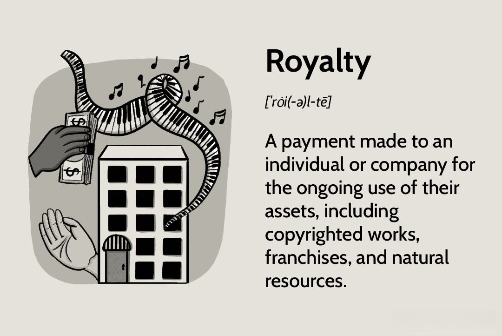

This article examines the intersection of royalty intellectual property (IP) licensing and algorithmic trading, highlighting a significant evolution within the financial industry. Intellectual property is essential in the trading sphere, where proprietary algorithms and systems provide traders a competitive edge. Protecting these innovations through IP laws ensures that creators maintain control over their works, essential for upholding trade secrets and proprietary systems. Licensing agreements facilitate the monetization of these algorithmic creations, providing developers with a revenue stream by granting usage rights in exchange for royalties. Such arrangements allow firms to access cutting-edge technology without the necessity of in-house development, thereby democratizing technological advancements.

This alliance between IP licensing and trading significantly benefits both creators and licensees, offering a structured framework for sharing and implementing innovative algorithms. These agreements not only incentivize the development of sophisticated trading methods but also ensure continuous income through royalties. As algorithmic trading progresses, exploiting IP through strategic licensing creates promising prospects for market participants. With the introduction of decentralized finance (DeFi) and the tokenization of IP assets, the potential for streamlined, accessible IP management and licensing further expands, signaling robust growth and transformation within this domain.

## Table of Contents

## Understanding Intellectual Property in Algorithmic Trading

Intellectual Property (IP) in algorithmic trading represents the core technological assets that provide a competitive edge in financial markets. This IP typically comprises proprietary algorithms, trading methods, and systems that are developed to efficiently execute trades with minimal human intervention. Algorithmic trading relies heavily on these sophisticated tools to analyze large sets of financial data at high speeds and execute orders that can capitalize on market opportunities faster than a human trader could.

These algorithms, often designed to identify patterns or exploit inefficiencies in markets, are protected under intellectual property laws, ensuring that the creators of such technology maintain control over their valuable innovations. There are several forms of IP protection applicable in the context of algorithmic trading, including patents, copyrights, and trade secrets. Each offers unique benefits:

1. **Patents**: These are granted to inventors of new and useful processes, machines, or compositions of matter. In algorithmic trading, patents can protect the specific methods by which an algorithm operates or the unique systems created for trade execution. By patenting an algorithm, a firm legally restricts others from using or replicating their proprietary technology without permission.

2. **Copyrights**: Typically used to protect the expression of ideas, copyrights can safeguard the code used in developing trading algorithms. Given that algorithms are often complex computer programs, securing copyrights ensures no unauthorized use or duplication of the trader's unique coding.

3. **Trade Secrets**: Perhaps the most relevant form of IP in algorithmic trading, trade secrets protect formulas, practices, processes, designs, or compilations of information. These are not generally known or reasonably ascertainable by others who can exploit its value. To qualify as a trade secret, entities must take reasonable steps to keep the information confidential. Since many firms consider their trading algorithms as trade secrets, they often employ strict security measures and legal protections to maintain secrecy.

The significance of IP protection lies in its ability to safeguard these trade secrets and proprietary systems, thereby ensuring market competitiveness. Without such legal frameworks, competitors could easily replicate successful algorithms, negating years of research and development efforts. Moreover, IP protection not only serves as a defense mechanism but also enables firms to monetize their innovations through licensing agreements, thereby fostering an environment that encourages continuous innovation.

In summary, IP in [algorithmic trading](/wiki/algorithmic-trading) is a pivotal [factor](/wiki/factor-investing) that dictates competitiveness and success. Firms must diligently protect their algorithms to maintain their market position and capitalize on their innovations' commercial potential. Robust IP protection serves as both a defensive shield against imitation and a vehicle for revenue generation through strategic licensing arrangements.

## The Role of Licensing in Algorithmic Trading

Licensing in algorithmic trading serves as a pivotal mechanism through which developers of proprietary algorithms can monetize their intellectual property. By granting rights for the usage of these algorithms in exchange for royalties, developers create a revenue stream while retaining essential control over their innovations. 

Licensing agreements are meticulously crafted to define the scope and limitations of algorithm utilization. These documents safeguard the interests of IP holders by specifying parameters such as the duration of use, permissible modifications, and the extent of disclosure to third parties. For licensees, these agreements provide transparency and assurance concerning the operational capabilities and restrictions associated with the licensed algorithms.

The advantages of licensing extend beyond financial gains for developers. They play a crucial role in democratizing access to sophisticated trading technologies. Firms—both large and small—are afforded the opportunity to harness advanced algorithms without investing significant resources into their own development. This access is particularly beneficial for smaller players who may lack the capital or technical expertise to develop competitive algorithms independently. Consequently, licensing facilitates a more equitable playing field in the financial markets.

Furthermore, licensing agreements can accommodate various business models, ranging from exclusive to non-exclusive licenses, thereby allowing developers to tailor the level of access granted to different licensees. This flexibility ensures that licensing strategies can be aligned with broader business objectives, such as market expansion or strategic partnerships.

In summary, licensing not only provides a framework for monetizing intellectual property in algorithmic trading but also enhances technological dissemination and collaboration across the trading industry. By balancing protection for developers and accessibility for firms, licensing agreements contribute to the dynamic growth and innovation in this sector.

## Benefits of Royalty Agreements in Algo Trading

Royalty agreements in algorithmic trading offer significant advantages by providing a consistent and sustainable income stream derived from intellectual property (IP) assets, thereby encouraging the innovation of advanced trading algorithms. Such agreements effectively align the strategic interests of licensors, who own the algorithms, and licensees, who utilize these algorithms in trading operations. This alignment ensures that both parties can share in the algorithm's success, creating a symbiotic relationship where improved algorithm performance translates directly into mutual financial benefits.

The structure of royalty agreements can be highly flexible, catering to diverse financial strategies and preferences. Royalties can be structured as fixed payments, which offer predictable revenue streams for IP holders, providing a stable financial base that supports further research and development. Conversely, percentage-based royalties tied to trading profits are performance-oriented, incentivizing both parties to maximize algorithm effectiveness and trading outcomes. This structure not only motivates continuous innovation but also allows licensees to manage costs more effectively, as payments will correlate directly with trading performance.

Mathematically, the calculation of royalties can be expressed as:

$$
\text{Royalty Payment} = \text{Fixed Fee} + (\text{Trading Profits} \times \text{Royalty Rate})
$$

This formula highlights the dual-path revenue mechanism. When fixed fees are involved, the licensor receives a predetermined amount irrespective of trading outcomes, whereas profits-based royalties adjust according to the performance, ensuring dynamic adaptability to market conditions.

Moreover, these royalty arrangements foster an environment that supports sustainable development of trading technologies. By lowering entry barriers for smaller firms, they allow access to sophisticated algorithms without incurring the high costs of developing such technologies internally. Consequently, a wider range of market participants can engage actively with cutting-edge algorithmic solutions, fostering a more competitive and innovative trading ecosystem.

In addition, equity-based arrangements can also be explored, where licensors may receive equity stakes in the licensee's firm. This approach provides long-term value potential, aligning interests even more closely and providing an additional financial incentive for licensors to contribute towards enhancing the algorithm's performance.

In conclusion, the strategic use of royalty agreements in algorithmic trading establishes a mutually beneficial framework, dovetailing innovation with financial reward, thereby powering the advancement of trading technologies and enabling broader participation and enhanced competition in financial markets.

## Emerging Trends: DeFi and Tokenization of IP

Decentralized finance (DeFi) is reshaping the landscape of intellectual property (IP) management by integrating blockchain technology to tokenize IP assets. Tokenization refers to the digitization of IP rights into blockchain tokens, which allows for the representation of ownership and usage rights in a digital ledger. This innovative approach enhances the transparency of licensing agreements and automates royalty payments, reducing the need for intermediaries and lowering transaction costs.

Tokenizing IP introduces the possibility of fractional ownership, allowing creators to divide their IP assets into portions. This provides creators with increased [liquidity](/wiki/liquidity-risk-premium) options, enabling them to sell or lease parts of their IP rights without relinquishing complete control. Token holders can trade these fractions on decentralized platforms, broadening the investment opportunities for individuals and firms interested in acquiring IP rights.

The adoption of DeFi principles in IP management notably streamlines licensing processes. By using smart contracts on blockchain networks, creators and licensees can automate the enforcement of licensing terms and the execution of royalty payments. Smart contracts autonomously execute predefined terms of an agreement upon meeting specific conditions, ensuring timely and precise distributions. This technology fosters increased accessibility to IP resources, especially benefiting smaller creators who may lack the resources to engage in traditional complex licensing negotiations.

The integration of DeFi and tokenization facilitates a more open and inclusive IP market. By reducing barriers to entry and democratizing access to IP investment and ownership, creators, licensees, and investors can engage in more collaborative and efficient IP utilization. These advancements highlight the growing potential of blockchain and DeFi strategies to revolutionize traditional IP licensing and management.

## Challenges in Royalty IP Licensing for Algorithmic Trading

Determining fair royalty rates and structuring mutually beneficial deals within algorithmic trading's intellectual property (IP) landscape presents intricate challenges. Fair royalty valuation is inherently complex due to the dynamic and competitive nature of the financial markets. Unlike traditional sectors, algorithmic trading requires robust methods for assessing the worth of intellectual assets, which are often subject to rapid technological advancements.

The primary challenge in setting royalty rates lies in accurately appraising the algorithms' market value. Algorithms vary significantly in terms of complexity, effectiveness, and application scope. This variability necessitates comprehensive evaluation metrics, which encompass historical performance data, predictive accuracy, and risk management capabilities.

In addition to valuation challenges, the absence of universally accepted frameworks for royalty agreements complicates deal structuring. Parties must negotiate terms encompassing duration, exclusivity, and territorial rights, often requiring bespoke agreements tailored to specific use cases. The intricacies of these negotiations are further heightened by the potential misalignment of interests between licensors and licensees.

Furthermore, resolving disputes and ensuring IP protection necessitates robust legal frameworks, which are presently lacking in many jurisdictions. Traditional legal systems often struggle to keep pace with the rapid advancements in algorithmic technologies and financial models. As a result, IP holders and licensees may face uncertainties regarding enforcement and protection of proprietary assets.

The integration of decentralized finance (DeFi) models poses additional legal and operational challenges. DeFi platforms, which facilitate the tokenization and automated execution of royalty agreements, are primarily built on blockchain technology that operates independently of traditional financial institutions. This decentralization introduces novel legal ambiguities and regulatory hurdles, particularly in jurisdictions with stringent financial oversight.

Adaptation to technological advancements is crucial for maintaining relevance in the IP licensing domain. As new financial models and technologies emerge, stakeholders must continuously update their strategies to manage IP effectively. This evolution necessitates investment in legal expertise, technological infrastructure, and strategic partnerships to navigate the shifting regulatory and market landscapes.

Finally, the convergence of digital asset tokenization and algorithmic trading represents a potential paradigm shift. Tokenized IP assets can streamline royalty distribution and provide fractional ownership opportunities, thus enhancing liquidity and accessibility. However, transitioning to such models requires overcoming significant technological and regulatory barriers to ensure secure, transparent, and compliant operations.

In conclusion, the landscape of royalty IP licensing in algorithmic trading is fraught with challenges that stem from valuation complexities, legal inadequacies, and technological disruptions. Stakeholders are compelled to adapt to evolving financial models and regulatory contexts to effectively capitalize on IP assets within this dynamic environment.

## Conclusion

As algorithmic trading evolves, the strategic use of intellectual property (IP) through licensing and royalty agreements offers substantial financial incentives. These agreements play a pivotal role in fostering innovation within the trading industry by enabling creators to monetize their IP assets effectively. Developers of proprietary algorithms can benefit from a steady income stream while simultaneously contributing to the advancement of trading technologies.

The rise of decentralized finance (DeFi) and the tokenization of IP assets are enhancing these opportunities by providing more streamlined and accessible solutions. DeFi offers transparent and automated processes for licensing and royalty payments, reducing traditional barriers and facilitating fractional ownership. This innovation not only democratizes access to advanced trading technologies but also opens up revenue streams for a broader range of investors and firms, irrespective of their size.

However, to maximize the benefits of IP in algorithmic trading, stakeholders must remain vigilant about emerging trends and potential challenges. The complexity of determining fair royalty rates and establishing robust legal frameworks to protect IP rights and resolve disputes remains significant. Additionally, as technological advancements continue to reshape the trading landscape, adapting to new financial models such as DeFi and tokenization is essential for sustaining competitive advantages.

In conclusion, leveraging IP through strategic agreements and adopting innovative financial technologies holds immense potential in the trading industry. By staying informed and adaptable, stakeholders can effectively harness the benefits and navigate the challenges of IP management in this rapidly evolving sector.

## References & Further Reading

[1]: Bergstra, J., Bardenet, R., Bengio, Y., & Kégl, B. (2011). ["Algorithms for Hyper-Parameter Optimization."](https://papers.nips.cc/paper/4443-algorithms-for-hyper-parameter-optimization) Advances in Neural Information Processing Systems 24.

[2]: ["Advances in Financial Machine Learning"](https://www.amazon.com/Advances-Financial-Machine-Learning-Marcos/dp/1119482089) by Marcos Lopez de Prado

[3]: ["Evidence-Based Technical Analysis: Applying the Scientific Method and Statistical Inference to Trading Signals"](https://www.amazon.com/Evidence-Based-Technical-Analysis-Scientific-Statistical/dp/0470008741) by David Aronson

[4]: ["Machine Learning for Algorithmic Trading"](https://github.com/stefan-jansen/machine-learning-for-trading) by Stefan Jansen

[5]: ["Quantitative Trading: How to Build Your Own Algorithmic Trading Business"](https://www.amazon.com/Quantitative-Trading-Build-Algorithmic-Business/dp/0470284889) by Ernest P. Chan