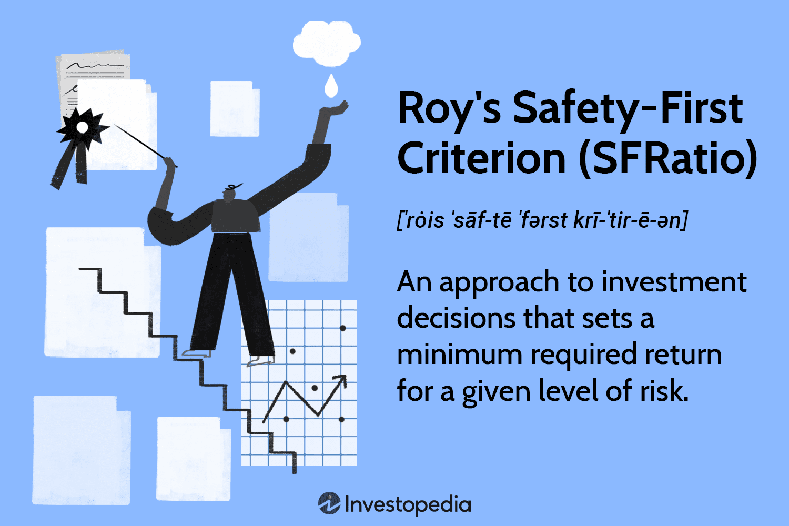

In the complex world of investment and trading, effective risk management is crucial for achieving stable and sustainable returns. A pivotal strategy in managing investment risk is Roy's Safety-First Criterion, commonly known as the Safety-First Ratio (SFRatio). This criterion offers a structured approach to risk management by focusing on maintaining a minimum return threshold for investments, an aspect that is particularly beneficial in algorithmic trading environments where precision and reliability are paramount.

Roy's Safety-First Criterion hinges on the notion of prioritizing safety and capital preservation, thus appealing to risk-averse investors. The criterion helps investors minimize the probability of their portfolio returns falling below a specified level, known as the "disaster level." By setting a minimum required return, the SFRatio ensures that investment decisions align with the investor's risk tolerance and return expectations.



Algorithmic trading, which is characterized by the use of complex mathematical models and algorithms to make trading decisions, can greatly benefit from integrating the SFRatio into its risk management strategies. This integration enables algorithms to focus on interventions that protect portfolio returns against unfavorable market movements while pursuing designated benchmarks or desired return targets.

The significance of Roy's Safety-First Criterion extends beyond theoretical finance, offering practical applications in constructing and optimizing investment portfolios. Its emphasis on setting a minimal return benchmark resonates with investors aiming to navigate volatile markets without compromising their risk limits. In today's dynamic financial landscape, Roy's Safety-First Criterion remains a vital tool for revolutionizing risk management approaches in algorithmic trading and broader investment strategies.

## Table of Contents

## Understanding Roy's Safety-First Criterion (SFRatio)

Roy's Safety-First Criterion, commonly referred to as the SFRatio, is a key strategy within investment risk management that enables investors to prioritize safety by establishing a minimum required return for an associated level of risk. This approach is rooted in the principle of capital preservation, which is particularly appealing to risk-averse investors.

The essence of the SFRatio lies in its focus on reducing the chances that portfolio returns will dip below a pre-established 'disaster level.' This 'disaster level' is essentially a threshold of returns that an investor deems unacceptable or perilous. By prioritizing this safety measure, the SFRatio assists investors in constructing portfolios that are better aligned with their risk tolerance levels. The methodology ensures that the probability of returns falling below this critical level is kept to a minimum, which is a crucial standpoint for those looking to safeguard their assets in volatile or uncertain market environments.

The SFRatio is particularly beneficial for investors who value the preservation of their initial capital over achieving high returns. It emphasizes a strategy where the risk of generating returns below the predetermined disaster level is mitigated, thus aligning investment decisions with a more cautious and conservative outlook. This makes the SFRatio an attractive option for individuals and institutions seeking stability and a lower likelihood of significant financial losses.

## The Mathematical Framework of the SFRatio

The mathematical framework of Roy's Safety-First Criterion (SFRatio) is centered on quantifying the trade-off between expected returns and risk within a portfolio. The SFRatio is computed using the following formula:

$$
\text{SFRatio} = \frac{E(R) - R_f}{\sigma}
$$

Where:
- $E(R)$ is the expected return of the portfolio.
- $R_f$ is the investor's minimum required return, often aligned with a risk-free rate.
- $\sigma$ is the standard deviation of the portfolio returns, representing the risk or volatility.

The calculation of the SFRatio allows investors to assess how well an investment meets their return expectations relative to its risk. A higher SFRatio indicates a more desirable investment, as it suggests a greater buffer between expected returns and the minimum required return, per unit of risk. This form of analysis is crucial in discerning which investment opportunities offer superior safety features, aligning them with the investor's financial objectives and risk tolerance.

For practical implementation, consider a scenario where an investor is evaluating two different portfolios with the following characteristics:

- Portfolio A: $E(R) = 8\%$, $R_f = 3\%$, $\sigma = 10\%$
- Portfolio B: $E(R) = 7\%$, $R_f = 3\%$, $\sigma = 5\%$

The SFRatio for each portfolio can be calculated as follows:

For Portfolio A:
$$
\text{SFRatio}_A = \frac{8\% - 3\%}{10\%} = 0.5
$$

For Portfolio B:
$$
\text{SFRatio}_B = \frac{7\% - 3\%}{5\%} = 0.8
$$

In this example, Portfolio B, with a higher SFRatio of 0.8, is considered safer and better meets the safety-first criterion, despite having a slightly lower expected return compared to Portfolio A. This highlights the effectiveness of the SFRatio in guiding investors towards decisions that prioritize safety while still aiming for satisfactory returns.

## Application of SFRatio in Portfolio Selection

For practical implementation in portfolio selection, maximizing the SFRatio involves choosing investment portfolios that provide a safety margin above a predetermined return threshold. This approach is particularly beneficial for investors aiming to ensure their portfolio returns do not fall below a critical level, especially in volatile or uncertain market conditions. The emphasis on a minimum acceptable return acts as a safeguard, offering investors a sense of security in their investment choices.

Mathematically, the SFRatio is calculated as $\text{SFRatio} = \frac{E(R) - R_f}{\sigma}$, where $E(R)$ is the expected return of the portfolio, $R_f$ is the minimum required return, and $\sigma$ is the standard deviation of the portfolio returns. By rearranging the equation, investors can solve for the expected return that meets or exceeds their safety-first criterion, effectively allowing them to screen potential investments.

In practical application, investment portfolios are evaluated based on their SFRatio scores. Portfolios with higher scores indicate a greater probability of achieving returns above the minimum threshold, making them preferable options for risk-averse investors. For example, consider the following Python code to calculate the SFRatio for multiple portfolios:

```python
import numpy as np

# Expected returns and standard deviations for each portfolio
expected_returns = np.array([0.08, 0.12, 0.10])
standard_deviations = np.array([0.07, 0.15, 0.09])
required_return = 0.03

# Calculate SFRatio for each portfolio
sf_ratios = (expected_returns - required_return) / standard_deviations

# Identify the portfolio with the highest SFRatio
optimal_portfolio = np.argmax(sf_ratios)

print(f"Optimal Portfolio Index: {optimal_portfolio}")
print(f"SFRatio: {sf_ratios[optimal_portfolio]:.2f}")
```

This script computes the SFRatio for each portfolio and identifies the one with the highest SFRatio, indicating the optimal choice for investors prioritizing safety. Such a data-driven approach allows for efficient portfolio analysis and selection, ensuring alignment with investors' risk management strategies. Field application further involves continuous monitoring and adjusting of portfolios to maintain a favorable SFRatio amidst shifting market dynamics.

## Comparison with Other Risk Measures

While the Sharpe ratio is a widely recognized measure that assesses an investment's return relative to its risk, it considers both the upside and downside fluctuations in returns. In contrast, Roy's Safety-First Criterion (SFRatio) is specifically centered on downside risk. This particular focus makes the SFRatio particularly appealing to risk-averse investors who wish to minimize the probability of their portfolio returns dipping below a certain disaster threshold.

The SFRatio is calculated by comparing the expected return of a portfolio with the minimum acceptable return, usually aligned with the risk-free rate in cases of normally distributed returns. The formula for SFRatio is:

$$
\text{SFRatio} = \frac{E(R_p) - R_f}{\sigma_p}
$$

Where:
- $E(R_p)$ is the expected return of the portfolio.
- $R_f$ is the minimum acceptable return.
- $\sigma_p$ is the standard deviation of the portfolio returns.

The choice of the risk-free rate as the minimum return differentiates the SFRatio from the Sharpe ratio, which does not explicitly focus on downside risk. The emphasis on aligning expected returns with a minimum threshold aligned with the risk-free rate caters to an investment strategy that prioritizes capital preservation over aggressive growth.

For portfolios with normally distributed returns, both the SFRatio and the Sharpe ratio effectively measure the risk-adjusted return, but their interpretation differs. The Sharpe ratio aims to reward portfolios that achieve higher returns for a given level of total risk, whereas the SFRatio penalizes any potential for loss below the chosen threshold, making it valuable for conservative investment approaches.

In conclusion, the SFRatio provides investors with a tool that aligns with a 'safety-first' investment philosophy, while the Sharpe ratio remains suitable for those willing to balance upside potential with downside risk. This distinction makes the SFRatio a unique addition to the array of financial metrics available to investors, particularly those who are highly adverse to experiencing losses below the risk-free return.

## Limitations and Criticisms of the SFRatio

One limitation of Roy's Safety-First Criterion (SFRatio) is its reliance on the assumption that portfolio returns are normally distributed. This assumption often does not align with actual market conditions, where financial returns can exhibit skewness (asymmetry) and kurtosis (heavy tails). Such characteristics of returns may lead to an underestimation of the extreme risks that lie beyond the expected range, ultimately impacting the accuracy of the risk assessment provided by the SFRatio.

Furthermore, by concentrating primarily on downside risk, the SFRatio might encourage overly conservative portfolio selections. The criterion is designed to prioritize safety and minimize the likelihood of returns falling below a specified disaster level. While ideal for risk-averse investors, this focus can result in a conservative bias that undervalues potentially lucrative investments. Such an approach may limit exposure to high-return opportunities, thus potentially compromising overall portfolio growth. This conservative stance might not suit investors who are willing to accept moderated risk levels for higher potential returns.

In mathematical terms, the SFRatio is expressed as:

$$
\text{SFRatio} = \frac{\text{Expected Return} - \text{Minimum Required Return}}{\text{Standard Deviation of Portfolio Returns}}
$$

This formula highlights how the measure leans towards safer investments by weighing potential returns against the variability of returns. Investors seeking balanced risk and reward might find dynamic risk-return evaluations more suitable for their portfolios than the SFRatio's downside-centric perspective.

## Conclusion

Roy's Safety-First Criterion (SFRatio) emerges as a valuable framework for investors who prioritize pragmatic risk management. The methodology offers a structured approach to ensure that investments do not fall below a critical return threshold, emphasizing capital preservation over the pursuit of high returns. By setting a minimum required return, the SFRatio directs focus toward safeguarding portfolios against market fluctuations and unforeseen downturns.

This approach serves as an influential tool within risk management, notably benefiting risk-averse investors. It provides a mechanism to account for downside risks, fostering a mindset of caution and precision within trading and investment strategies. The emphasis on a minimum guaranteed return supports the reinforcement of a safety-first strategy, allowing investors to navigate uncertainty with a clear risk-reward profile.

Although SFRatio's reliance on assumptions like normally distributed returns may not perfectly match real-world conditions, its core principles remain applicable and beneficial. The focus on ensuring a baseline return before considering potential gains demonstrates its practical utility in structuring resilient portfolios.

Overall, adopting Roy's Safety-First Criterion allows for a disciplined approach toward preserving capital, positioning it as a strategic choice for those seeking a balanced, cautious investment path.

## References & Further Reading

[1]: Roy, A. D. (1952). ["Safety First and the Holding of Assets."](https://www.jstor.org/stable/1907413) Econometrica, 20(3), 431–449.

[2]: Nawrocki, D. (1999). ["A Brief History of Downside Risk Measures."](https://www.researchgate.net/publication/2382526_A_Brief_History_of_Downside_Risk_Measures) Journal of Investing, 8(3), 9-25.

[3]: Ang, A. (2014). ["Asset Management: A Systematic Approach to Factor Investing."](https://archive.org/details/assetmanagements0000anga) Oxford University Press.

[4]: Elton, E. J., Gruber, M. J., Brown, S. J., & Goetzmann, W. N. (2014). ["Modern Portfolio Theory and Investment Analysis."](https://books.google.com/books/about/Modern_Portfolio_Theory_and_Investment_A.html?id=181CEAAAQBAJ) John Wiley & Sons.

[5]: Fabozzi, F. J., & Markowitz, H. M. (2011). ["The Theory and Practice of Investment Management."](https://onlinelibrary.wiley.com/doi/book/10.1002/9781118267028) John Wiley & Sons.

[6]: Lhabitant, F. S. (2004). ["Hedge Funds: Quantitative Insights."](https://www.wiley.com/en-us/Hedge+Funds%3A+Quantitative+Insights-p-9780470687772) John Wiley & Sons.