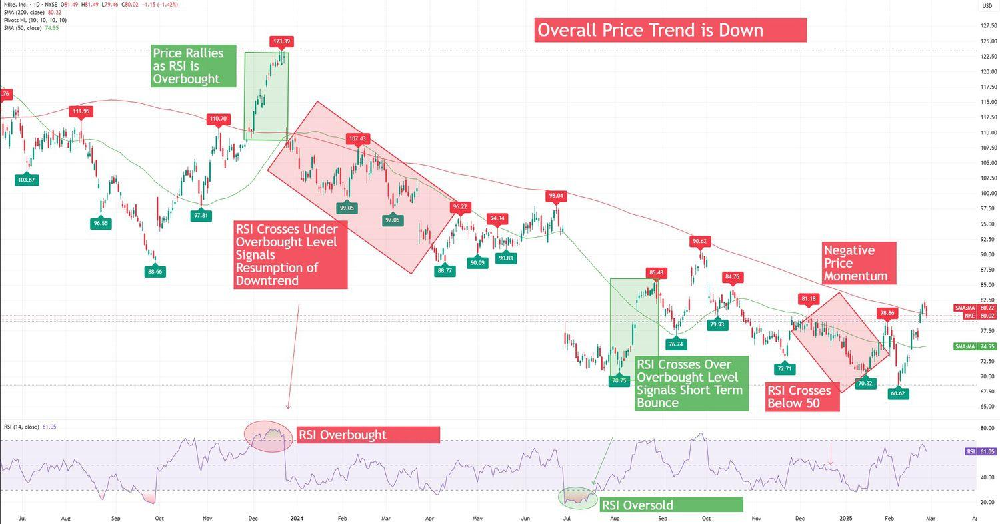

## Table of Contents

## What is the RSI indicator?

The RSI, or Relative Strength Index, is a tool used in trading to measure how fast and how much a price of a stock or other asset is changing. It helps traders see if a stock is being overbought or oversold. The RSI is shown as a number between 0 and 100. If the RSI is above 70, it might mean the stock is overbought and could soon go down in price. If it's below 30, it might mean the stock is oversold and could soon go up in price.

Traders use the RSI to make decisions about buying or selling. For example, if the RSI shows a stock is oversold, a trader might decide to buy it, hoping the price will go up soon. On the other hand, if the RSI shows a stock is overbought, a trader might sell it, expecting the price to drop. The RSI can also show when the market might be about to change direction, which is called a divergence. This happens when the stock price is going one way, but the RSI is going the other way.

## How is the RSI calculated?

The RSI is calculated using the average gain and the average loss of a stock's price over a certain period, usually 14 days. First, you find the difference between the closing prices from one day to the next. If the price went up, that's a gain. If it went down, that's a loss. You then add up all the gains and all the losses separately over the 14 days. After that, you find the average gain by dividing the total gains by 14, and the average loss by dividing the total losses by 14.

Next, you use these averages to find the relative strength, which is the average gain divided by the average loss. Then, you plug this number into a formula to get the RSI. The formula is: RSI = 100 - (100 / (1 + Relative Strength)). This gives you a number between 0 and 100. If the RSI is high, it means the stock has been going up a lot and might be overbought. If it's low, it means the stock has been going down a lot and might be oversold.

## What are the standard settings for the RSI?

The standard setting for the RSI is usually 14 periods. This means that the RSI looks at the last 14 days of a stock's price to figure out if it's overbought or oversold. Traders can change this number if they want to look at a shorter or longer time, but 14 days is what most people use.

The levels that show if a stock is overbought or oversold are also standard. If the RSI goes above 70, it means the stock might be overbought and could go down soon. If it goes below 30, it means the stock might be oversold and could go up soon. These numbers, 70 and 30, are what most traders use, but some might change them a bit depending on what they're looking for.

## What does an RSI value above 70 indicate?

An RSI value above 70 means that a stock might be overbought. This happens when a lot of people have been buying the stock, pushing its price up quickly. When the RSI goes over 70, it's a signal to traders that the stock's price might be too high and could drop soon. It's like a warning that the buying might have gone too far and a price correction could be coming.

Traders use this information to decide what to do next. If they see the RSI above 70, they might think about selling the stock to avoid losing money if the price goes down. Or, they might wait to see if the price keeps going up, but they'll be ready to sell if it starts to fall. Watching the RSI helps traders make smarter choices about when to buy or sell.

## What does an RSI value below 30 indicate?

An RSI value below 30 means that a stock might be oversold. This happens when a lot of people have been selling the stock, making its price go down quickly. When the RSI goes below 30, it's a signal to traders that the stock's price might be too low and could go up soon. It's like a warning that the selling might have gone too far and a price bounce back could be coming.

Traders use this information to decide what to do next. If they see the RSI below 30, they might think about buying the stock to make money if the price goes up. Or, they might wait to see if the price keeps going down, but they'll be ready to buy if it starts to go up. Watching the RSI helps traders make smarter choices about when to buy or sell.

## How can traders use RSI to identify overbought and oversold conditions?

Traders use the RSI to figure out if a stock is overbought or oversold by looking at its value. If the RSI goes above 70, it means the stock might be overbought. This happens when a lot of people have been buying the stock and pushing its price up too fast. Traders see this as a sign that the price might be too high and could drop soon. So, if they see the RSI above 70, they might decide to sell the stock to avoid losing money if the price goes down.

On the other hand, if the RSI goes below 30, it means the stock might be oversold. This happens when a lot of people have been selling the stock and making its price go down too fast. Traders see this as a sign that the price might be too low and could go up soon. So, if they see the RSI below 30, they might decide to buy the stock to make money if the price goes up. By watching the RSI, traders can make better choices about when to buy or sell.

## What are RSI divergence signals and how can they be used?

RSI divergence signals happen when the price of a stock and its RSI are moving in different ways. For example, if the stock price is going up but the RSI is going down, that's called a bearish divergence. It means the stock might soon go down in price even though it's been going up. On the other hand, if the stock price is going down but the RSI is going up, that's called a bullish divergence. It means the stock might soon go up in price even though it's been going down.

Traders use RSI divergence signals to make decisions about buying or selling. If they see a bearish divergence, they might decide to sell the stock because they think the price will go down soon. If they see a bullish divergence, they might decide to buy the stock because they think the price will go up soon. By looking at these signals, traders can try to predict what the stock price might do next and make smarter choices about when to buy or sell.

## How can RSI be used to confirm trend strength?

Traders can use the RSI to see how strong a trend is by looking at how the RSI moves with the stock price. If the stock price is going up and the RSI is also going up and staying above 50, it means the upward trend is strong. The RSI being above 50 shows that the stock is gaining more than it's losing, which is a good sign for a strong trend. On the other hand, if the stock price is going down and the RSI is also going down and staying below 50, it means the downward trend is strong. The RSI being below 50 shows that the stock is losing more than it's gaining, which is a good sign for a strong downward trend.

Traders can also look at how far the RSI moves away from 50 to see how strong the trend is. If the RSI is moving far above 50 during an upward trend, it means the trend is very strong. If the RSI is moving far below 50 during a downward trend, it also means the trend is very strong. By watching how the RSI moves with the stock price and how far it goes from 50, traders can get a good idea of how strong the trend is and make better decisions about buying or selling.

## What are the limitations of using RSI as a standalone indicator?

Using the RSI by itself can sometimes lead to false signals. For example, just because the RSI goes above 70 and says a stock is overbought, it doesn't always mean the stock price will go down right away. The stock might keep going up for a while, making traders who sold too early miss out on more gains. The same thing can happen when the RSI goes below 30 and says a stock is oversold. The stock might keep going down, so traders who bought too early could lose money. This is why it's important not to rely only on the RSI for making trading decisions.

Another problem with using the RSI alone is that it doesn't tell you everything about the market. The RSI only looks at how fast and how much the stock price is changing, but it doesn't take into account other important things like news, big events, or what other people are doing in the market. Traders who only look at the RSI might miss out on these other factors that can also affect the stock price. That's why it's usually a good idea to use the RSI along with other tools and information to get a better picture of what's going on and make smarter trading choices.

## How can RSI be combined with other indicators for better trading signals?

Traders can make better decisions by using the RSI along with other tools like moving averages. A moving average shows the average price of a stock over a certain time, like 50 days or 200 days. If the RSI shows a stock is oversold and the price is also below the moving average, it might be a good time to buy. On the other hand, if the RSI shows a stock is overbought and the price is above the moving average, it might be a good time to sell. By looking at both the RSI and the moving average, traders can get a clearer picture of what's happening with the stock.

Another helpful tool to use with the RSI is the MACD, which stands for Moving Average Convergence Divergence. The MACD looks at the difference between two moving averages to see if the stock's trend is getting stronger or weaker. If the RSI shows a bearish divergence and the MACD also shows that the trend is getting weaker, it might be a good time to sell. If the RSI shows a bullish divergence and the MACD shows that the trend is getting stronger, it might be a good time to buy. By using the RSI and the MACD together, traders can make more informed choices about when to buy or sell a stock.

## What are some advanced RSI strategies for experienced traders?

Experienced traders might use something called the RSI swing rejection strategy. This strategy looks for times when the RSI goes above 70 or below 30 and then comes back to the middle. For example, if the RSI goes above 70, comes back down below 70, and then goes back up again without going below 50, it's called a bullish swing rejection. This could be a good time to buy because it means the upward trend might be getting stronger. On the other hand, if the RSI goes below 30, goes back up above 30, and then goes back down again without going above 50, it's called a bearish swing rejection. This could be a good time to sell because it means the downward trend might be getting stronger.

Another advanced RSI strategy is to use different time frames to make better decisions. Traders might look at the RSI on a daily chart and a weekly chart at the same time. If the RSI on the daily chart shows a stock is oversold and the RSI on the weekly chart also shows it's oversold, it could be a strong sign to buy. This is because the stock is oversold on both short-term and long-term time frames, making it more likely that the price will go up soon. By using the RSI on different time frames, experienced traders can get a better idea of what's happening with the stock and make smarter choices about when to buy or sell.

## How does the timeframe affect the effectiveness of RSI signals?

The timeframe you use can really change how well the RSI works for you. If you use a short timeframe, like 5 or 10 minutes, the RSI can give you quick signals about when to buy or sell. But these signals might not last long, and the stock price might change a lot in a short time. So, if you're looking at a short timeframe, you need to be ready to act fast and keep an eye on the market all the time.

On the other hand, if you use a longer timeframe, like a day or a week, the RSI signals can be more reliable but slower. These signals can help you see bigger trends and make decisions that you can stick with for a while. But it also means you might miss out on quick changes in the stock price. So, choosing the right timeframe depends on what you want to do with your trades and how much time you can spend watching the market.

## What is the RSI Indicator and how do you understand it?

The Relative Strength Index (RSI), developed by J. Welles Wilder, is a widely-used [momentum](/wiki/momentum) oscillator in technical analysis that evaluates the speed and change of price movements. It is designed to quantify the strength of a stock or asset over a certain period, which is instrumental in determining potential overbought or oversold conditions. Operating on a scale from 0 to 100, RSI values above 70 typically suggest an overbought condition, indicating that the asset may be overvalued and a price correction or downward trend could be imminent. Conversely, RSI values below 30 indicate an oversold condition, suggesting the asset might be undervalued, and a price increase could be forthcoming.

The RSI calculation involves assessments of average gains and losses over a specified period, usually set at 14 days. The core idea is to compare the magnitude of recent gains to recent losses in an attempt to ascertain whether a particular asset is in a state of overbought or oversold. The formula for the RSI is as follows:

$$
RSI = 100 - \frac{100}{1 + RS}
$$

where $RS$ (Relative Strength) is the average of $n$ days' up closes divided by the average of $n$ days' down closes. This can be expressed as:

$$
RS = \frac{\text{Average Gain}}{\text{Average Loss}}
$$

For calculation, the initial components of the average gain and average loss are simple means over a standard period, often 14 days. Subsequent values for these averages involve a smoothing technique:

For the first day, use straightforward averages:

$$
\text{Average Gain} = \frac{\sum \text{Gains over 14 days}}{14}
$$

$$
\text{Average Loss} = \frac{\sum \text{Losses over 14 days}}{14}
$$

For the subsequent days, apply:

$$
\text{Average Gain}_{\text{next}} = \frac{(\text{Previous Average Gain} \times 13) + \text{Current Gain}}{14}
$$

$$
\text{Average Loss}_{\text{next}} = \frac{(\text{Previous Average Loss} \times 13) + \text{Current Loss}}{14}
$$

Through these calculations, the RSI delivers insights into the asset's performance by gauging momentum and aiding traders in identifying potential reversal points, complementing other technical analysis tools to refine trading strategies.

## References & Further Reading

[1]: Wilder, J. W. (1978). ["New Concepts in Technical Trading Systems."](https://archive.org/details/newconceptsintec00wild) Trend Research.

[2]: Aronson, D. (2006). ["Evidence-Based Technical Analysis: Applying the Scientific Method and Statistical Inference to Trading Signals."](https://www.amazon.com/Evidence-Based-Technical-Analysis-Scientific-Statistical/dp/0470008741) Wiley.

[3]: Murphy, J. J. (1999). ["Technical Analysis of the Financial Markets: A Comprehensive Guide to Trading Methods and Applications."](https://archive.org/details/technicalanalysi0000murp) New York Institute of Finance.

[4]: Chan, E. P. (2009). ["Quantitative Trading: How to Build Your Own Algorithmic Trading Business."](https://github.com/ftvision/quant_trading_echan_book) Wiley.

[5]: Pring, M. J. (2002). ["Technical Analysis Explained: The Successful Investor's Guide to Spotting Investment Trends and Turning Points."](https://www.amazon.com/Technical-Analysis-Explained-Fifth-Successful/dp/0071825177) McGraw-Hill.

[6]: Scholz, C. (2017). ["Algorithmic Trading and DMA: An Introduction to Direct Access Trading Strategies."](https://archive.org/details/algorithmictradi0000john) Harriman House.