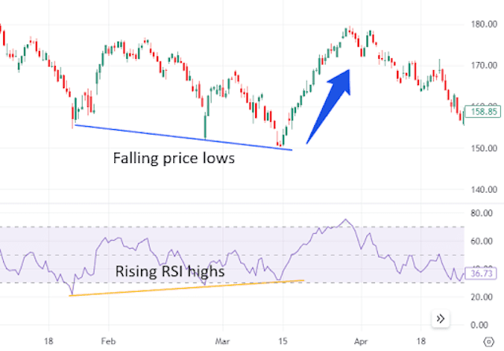

## Table of Contents

## What is the RSI Indicator?

The RSI, or Relative Strength Index, is a tool used in trading to measure how fast and how much a stock or other asset is moving. It helps traders see if a stock is being bought a lot (overbought) or sold a lot (oversold). The RSI is shown as a number between 0 and 100. If the RSI is above 70, it might mean the stock is overbought and could go down soon. If it's below 30, it might mean the stock is oversold and could go up soon.

Traders use the RSI to help them decide when to buy or sell. For example, if the RSI goes from below 30 to above 30, it might be a good time to buy because the stock could be starting to go up. If the RSI goes from above 70 to below 70, it might be a good time to sell because the stock could be starting to go down. The RSI can also show if a trend is getting weaker or stronger, which helps traders make better choices.

## How is the RSI Indicator calculated?

The RSI Indicator is calculated using a stock's price changes over a certain period, usually 14 days. To find the RSI, you first need to calculate the average gain and the average loss over those 14 days. The average gain is the total of all the positive price changes divided by 14, and the average loss is the total of all the negative price changes divided by 14. Once you have these averages, you use them to find the Relative Strength (RS), which is the average gain divided by the average loss.

After finding the RS, you can calculate the RSI using a simple formula: RSI = 100 - (100 / (1 + RS)). This formula turns the RS into a number between 0 and 100, which is easier to understand and use. Each new day, you update the average gain and average loss by using the price change from that day and the previous averages. This way, the RSI keeps changing and can help traders see if a stock is overbought or oversold.

## What is the typical time period used for the RSI?

The typical time period used for the RSI is 14 days. This means that the RSI looks at the price changes over the last 14 days to figure out if a stock is overbought or oversold. Traders like using 14 days because it gives a good balance between seeing short-term changes and longer-term trends.

Some traders might use different time periods, like 7 days or 21 days, depending on what they are trying to see. A shorter time period, like 7 days, can show quicker changes in the stock's price, which might be good for short-term trading. A longer time period, like 21 days, can show more stable trends, which might be better for longer-term investing. But 14 days is the most common because it works well for many different kinds of trading.

## How can beginners use the RSI to identify overbought and oversold conditions?

Beginners can use the RSI to identify overbought and oversold conditions by looking at the RSI value on a chart. The RSI is a number between 0 and 100. If the RSI goes above 70, it means the stock might be overbought. This means a lot of people have been buying the stock, and it might be time to sell because the price could go down soon. On the other hand, if the RSI goes below 30, it means the stock might be oversold. This means a lot of people have been selling the stock, and it might be time to buy because the price could go up soon.

To use the RSI, beginners should watch for when the RSI crosses these levels. For example, if the RSI was below 30 and then moves above 30, it might be a good sign to buy the stock because it could be starting to go up. If the RSI was above 70 and then moves below 70, it might be a good sign to sell the stock because it could be starting to go down. By keeping an eye on these levels, beginners can start to understand when a stock might be a good buy or sell.

## What are the common RSI levels that indicate overbought or oversold conditions?

The common RSI levels that indicate overbought or oversold conditions are 70 and 30. When the RSI goes above 70, it means the stock might be overbought. This happens when a lot of people are buying the stock, and it might be time to sell because the price could go down soon. On the other hand, when the RSI goes below 30, it means the stock might be oversold. This happens when a lot of people are selling the stock, and it might be time to buy because the price could go up soon.

Beginners can use these levels to make decisions about buying or selling stocks. If the RSI was below 30 and then moves above 30, it might be a good sign to buy the stock because it could be starting to go up. If the RSI was above 70 and then moves below 70, it might be a good sign to sell the stock because it could be starting to go down. By watching these levels, beginners can get a better idea of when to buy or sell a stock.

## Can the RSI be used to confirm price trends?

Yes, the RSI can be used to confirm price trends. When the price of a stock is going up, and the RSI is also going up and staying above 50, it can mean that the upward trend is strong. This is because the RSI is showing that the stock is not overbought yet, and there is still buying interest. On the other hand, if the price is going down and the RSI is also going down and staying below 50, it can mean that the downward trend is strong. The RSI confirms that the stock is not oversold yet, and there is still selling pressure.

Traders can also look for something called "divergence" to confirm or question a price trend. Divergence happens when the price of the stock is moving one way, but the RSI is moving the other way. For example, if the stock price is making higher highs but the RSI is making lower highs, it could mean that the upward trend is losing strength. This is called bearish divergence. If the stock price is making lower lows but the RSI is making higher lows, it could mean that the downward trend is losing strength. This is called bullish divergence. By watching for these signs, traders can use the RSI to help confirm or predict changes in price trends.

## How does the RSI help in spotting potential trend reversals?

The RSI helps in spotting potential trend reversals by showing when a stock might be overbought or oversold. When the RSI goes above 70, it means the stock is overbought and might start to go down soon. When the RSI goes below 30, it means the stock is oversold and might start to go up soon. By watching these levels, traders can see when a trend might be about to change direction. For example, if the stock price keeps going up but the RSI starts to go down, it could mean the upward trend is getting weak and might reverse.

Another way the RSI helps spot trend reversals is by showing divergence. Divergence happens when the stock price and the RSI are moving in different directions. If the stock price is making new highs but the RSI is not, this is called bearish divergence and can mean the upward trend is losing strength and might reverse. If the stock price is making new lows but the RSI is not, this is called bullish divergence and can mean the downward trend is losing strength and might reverse. By looking for these signs, traders can use the RSI to predict when a trend might change.

## What are the limitations of using the RSI as a standalone indicator?

The RSI can be a helpful tool, but it has some limitations when used by itself. One big problem is that it can give false signals. For example, just because the RSI goes above 70 doesn't always mean the stock will go down right away. Sometimes, the stock can stay overbought for a long time, which can trick traders into selling too soon. The same thing can happen when the RSI goes below 30. The stock might stay oversold for a while, making traders buy too early. This means that relying only on the RSI might lead to bad trading choices.

Another limitation is that the RSI doesn't work well in all market conditions. It's best at spotting short-term changes, but it can struggle during strong trends. If a stock is in a strong upward or downward trend, the RSI might stay overbought or oversold for a long time without the trend changing. This can make it hard to use the RSI to make decisions. To get around these problems, many traders use the RSI along with other tools, like looking at the stock's price or using other indicators, to get a better picture of what's happening with the stock.

## How can the RSI be combined with other technical indicators for better analysis?

Combining the RSI with other technical indicators can help traders get a better idea of what's happening with a stock. One common way to do this is by using the RSI along with moving averages. Moving averages show the average price of a stock over a certain time, like 50 days or 200 days. If the RSI shows a stock is overbought and the price is also above the moving average, it might mean the stock is likely to go down soon. On the other hand, if the RSI shows a stock is oversold and the price is below the moving average, it might mean the stock is likely to go up soon. By looking at both the RSI and the moving average, traders can make better decisions about when to buy or sell.

Another way to use the RSI with other indicators is by looking at the MACD, which stands for Moving Average Convergence Divergence. The MACD helps traders see the strength and direction of a trend. If the RSI shows a stock is overbought or oversold and the MACD also shows a change in the trend, it can give a stronger signal about what might happen next. For example, if the RSI is overbought and the MACD shows the trend is starting to weaken, it might be a good time to sell. If the RSI is oversold and the MACD shows the trend is starting to get stronger, it might be a good time to buy. By using both the RSI and the MACD, traders can get a clearer picture of the stock's movement and make smarter trading choices.

## What are some advanced RSI trading strategies?

One advanced RSI trading strategy is called the RSI Divergence strategy. This strategy looks for times when the stock price and the RSI are moving in different directions. If the stock price keeps going up but the RSI starts to go down, it's called bearish divergence. This can mean the upward trend is getting weak and might reverse soon. Traders can use this signal to sell the stock before the price goes down. On the other hand, if the stock price keeps going down but the RSI starts to go up, it's called bullish divergence. This can mean the downward trend is getting weak and might reverse soon. Traders can use this signal to buy the stock before the price goes up. By watching for these divergences, traders can spot potential trend reversals and make better trading decisions.

Another advanced strategy is the RSI Overbought/Oversold with Trend Confirmation. This strategy combines the RSI with other indicators like moving averages to confirm the trend before making a trade. For example, if the RSI goes above 70 and shows the stock is overbought, traders will also look at the stock's price compared to its moving average. If the price is also above the moving average, it means the upward trend is strong. In this case, traders might wait for the RSI to drop below 70 before selling, to make sure they are not selling too early. If the RSI goes below 30 and shows the stock is oversold, and the price is also below the moving average, it means the downward trend is strong. Traders might wait for the RSI to go above 30 before buying, to make sure they are not buying too early. By using the RSI with other indicators, traders can get a better idea of when to buy or sell.

## How does the RSI perform in different market conditions, such as trending vs. ranging markets?

The RSI works differently in trending and ranging markets. In a trending market, where the stock price is going up or down in a clear direction, the RSI can stay overbought or oversold for a long time. For example, in a strong upward trend, the RSI might stay above 70 for a while without the price going down. This can make it hard for traders to use the RSI to decide when to sell, because the stock might keep going up even when it's overbought. The same thing can happen in a strong downward trend, where the RSI might stay below 30 without the price going up. Traders need to be careful in these situations and might need to use other indicators to confirm the trend before making a trade.

In a ranging market, where the stock price is moving sideways without a clear trend, the RSI can be more useful. In these markets, the RSI often moves between 30 and 70, showing when the stock is oversold or overbought. When the RSI goes below 30, it can be a good time to buy because the price might go up soon. When the RSI goes above 70, it can be a good time to sell because the price might go down soon. Because the price is not moving in a strong trend, the RSI can give clearer signals about when to buy or sell. Traders can use these signals to make better trading decisions in ranging markets.

## What are some common pitfalls and misconceptions about using the RSI?

One common pitfall when using the RSI is thinking it always gives the right signals. The RSI can sometimes show that a stock is overbought or oversold, but the stock's price might not change right away. For example, a stock can stay overbought for a long time in a strong upward trend, which can trick traders into selling too soon. The same can happen when a stock is oversold in a strong downward trend. Traders need to know that the RSI is just one tool and should be used with other indicators to get a better picture of what's happening with the stock.

Another misconception is that the RSI works the same in all market conditions. In a trending market, the RSI might stay overbought or oversold for a long time without the trend changing. This can make it hard to use the RSI to make good trading decisions. But in a ranging market, where the stock price moves sideways, the RSI can be more helpful. It can show good times to buy or sell when the stock is oversold or overbought. Traders need to understand the market conditions to use the RSI effectively and avoid making bad trades based on its signals.

## What is RSI and How is it Calculated?

The Relative Strength Index (RSI) is a momentum oscillator utilized extensively by traders to evaluate the speed and change of price movements in securities. The computation of RSI involves the formula:

$$
\text{RSI} = 100 - \left(\frac{100}{1 + \text{RS}}\right)
$$

where RS stands for the relative strength, which is the ratio of the average gain to the average loss over a specified period (N). Traditionally, a 14-period timeframe is deployed, as it provides a balanced responsiveness to price fluctuations, allowing traders to effectively monitor overbought and oversold conditions.

To compute RSI, the following steps are undertaken:

1. **Determine Average Gain and Loss**: Initially, calculate the average gains and losses separately by summing up the gains and losses over the N-period and then dividing each by N.

2. **Compute Relative Strength (RS)**: RS is calculated by dividing the average gain by the average loss:

   \[ \text{RS} = \frac{\text{Average Gain}}{\text{Average Loss}}
$$

3. **Calculate RSI**: Substitute RS in the RSI formula to obtain the Relative Strength Index.

The RSI values oscillate between 0 and 100. Generally, a reading above 70 suggests that the asset may be overbought, while a reading below 30 might indicate oversold conditions. These thresholds are critical for traders in evaluating potential reversal points or changes in trend [momentum](/wiki/momentum).

The initial RSI computation establishes a foundational baseline using simple averages, which are subsequently refined using techniques such as exponential smoothing. This refinement ensures greater accuracy and reliability in capturing trends and anomalies within the securities market. By analyzing RSI values, traders can discern whether a security's pricing is navigating typical market ranges or if it is approaching atypical levels, thereby facilitating more informed trading decisions.

## References & Further Reading

[1]: Wilder, J. W. (1978). ["New Concepts in Technical Trading Systems."](https://books.google.com/books/about/New_Concepts_in_Technical_Trading_System.html?id=WesJAQAAMAAJ) Trend Research.

[2]: ["Technical Analysis of the Financial Markets: A Comprehensive Guide to Trading Methods and Applications"](https://www.amazon.com/Technical-Analysis-Financial-Markets-Comprehensive/dp/0735200661) by John J. Murphy

[3]: ["Algorithmic Trading: Winning Strategies and Their Rationale"](https://www.wiley.com/en-us/Algorithmic+Trading%3A+Winning+Strategies+and+Their+Rationale-p-9781118460146) by Ernest P. Chan  

[4]: Bloomberg Education. ["Relative Strength Index (RSI): A Practical Trading Guide."](https://chartschool.stockcharts.com/table-of-contents/technical-indicators-and-overlays/technical-indicators/relative-strength-index-rsi)

[5]: Kaufman, P. J. (2005). ["The New Trading Systems and Methods, 4th Edition."](https://www.wiley.com/en-us/New+Trading+Systems+and+Methods%2C+4th+Edition-p-9780471268475) Wiley Trading.