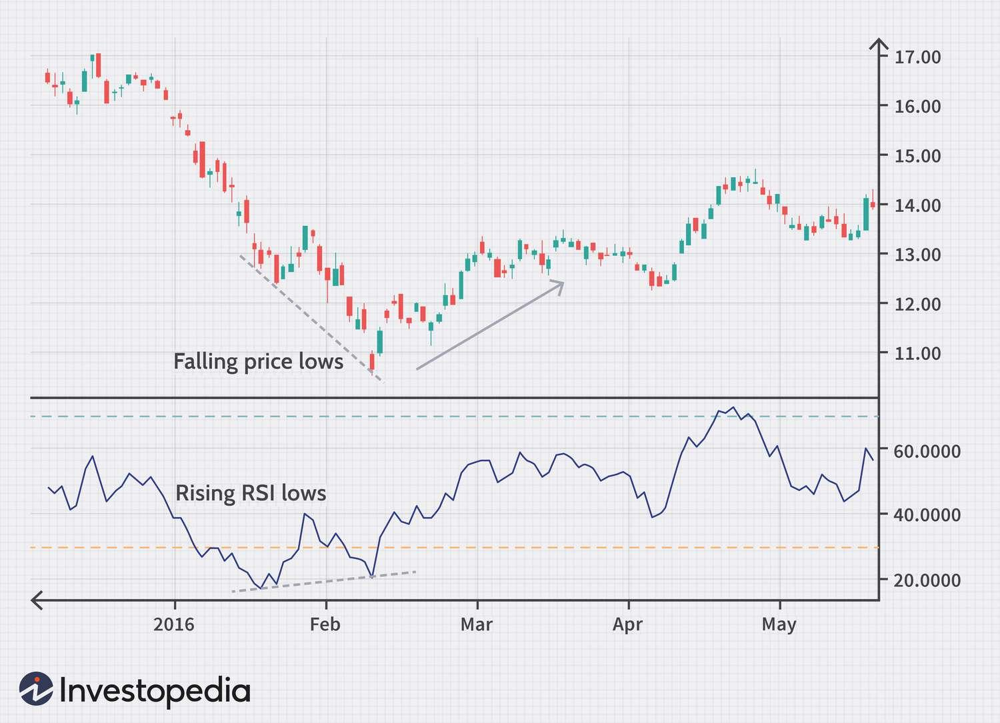

The Relative Strength Index (RSI) is a widely-utilized technical indicator in the trading domain, serving as a tool to evaluate the strength and velocity of a security's recent price movements. Conceived by J. Welles Wilder, RSI operates as a momentum oscillator and quantifies price movement changes on a scale from 0 to 100. Traders frequently interpret RSI readings of above 70 as indicative of overbought conditions, while readings below 30 suggest oversold circumstances, providing insights into potential price reversals.

In the sphere of algorithmic trading, RSI becomes an essential component aiding traders in the automation of decision-making processes aligned with market conditions. The indicator's momentum-based nature complements algorithmic strategies by identifying overbought and oversold signals, crucial for determining optimal entry and exit points. Consequently, integrating RSI into trading algorithms offers traders a competitive edge by enabling data-driven decisions that are responsive to dynamic market environments.

This article investigates into the formula for RSI, examining its computational mechanics and application methodologies within algorithmic trading contexts. By exploring strategic implementations and potential drawbacks, the narrative aims to furnish a thorough understanding of how RSI can enhance trading algorithms' efficiency and accuracy. The overarching goal is to empower traders with the knowledge to effectively leverage RSI, thereby refining their trading strategies and decision-making prowess in continually evolving financial markets.

## Table of Contents

## Understanding RSI and Its Calculation

The Relative Strength Index (RSI) is a momentum oscillator utilized extensively by traders to evaluate the speed and change of price movements in securities. The computation of RSI involves the formula:

$$
\text{RSI} = 100 - \left(\frac{100}{1 + \text{RS}}\right)
$$

where RS stands for the relative strength, which is the ratio of the average gain to the average loss over a specified period (N). Traditionally, a 14-period timeframe is deployed, as it provides a balanced responsiveness to price fluctuations, allowing traders to effectively monitor overbought and oversold conditions.

To compute RSI, the following steps are undertaken:

1. **Determine Average Gain and Loss**: Initially, calculate the average gains and losses separately by summing up the gains and losses over the N-period and then dividing each by N.

2. **Compute Relative Strength (RS)**: RS is calculated by dividing the average gain by the average loss:

   \[ \text{RS} = \frac{\text{Average Gain}}{\text{Average Loss}}
$$

3. **Calculate RSI**: Substitute RS in the RSI formula to obtain the Relative Strength Index.

The RSI values oscillate between 0 and 100. Generally, a reading above 70 suggests that the asset may be overbought, while a reading below 30 might indicate oversold conditions. These thresholds are critical for traders in evaluating potential reversal points or changes in trend [momentum](/wiki/momentum).

The initial RSI computation establishes a foundational baseline using simple averages, which are subsequently refined using techniques such as exponential smoothing. This refinement ensures greater accuracy and reliability in capturing trends and anomalies within the securities market. By analyzing RSI values, traders can discern whether a security's pricing is navigating typical market ranges or if it is approaching atypical levels, thereby facilitating more informed trading decisions.

## Importance of RSI in Algorithmic Trading

The Relative Strength Index (RSI) is a vital indicator in [algorithmic trading](/wiki/algorithmic-trading) due to its ability to identify potential overbought and oversold conditions, providing traders with a strategic advantage in recognizing reversal points. As a momentum oscillator, RSI can be seamlessly integrated into trading algorithms to confirm the strength and direction of existing trends. Through its comparison of recent gains against recent losses, it offers insights into whether a security's price might reverse or continue its current trajectory.

One of the key applications of RSI in algorithmic trading is its use in detecting divergences between price movements and RSI readings. Such divergences occur when the direction of the price trend is not mirrored by the RSI trend, signaling potential market reversals. For instance, if a security's price continues to rise while the RSI begins to decline, it might indicate a weakening momentum, hinting at a possible downward correction.

Moreover, RSI allows traders to customize alerts by setting defined thresholds and parameters that cater to specific market conditions or asset characteristics. By configuring these parameters, traders can calibrate their algorithms to trigger buy or sell signals when the RSI crosses certain levels. For example, a trader might configure an algorithm to initiate a buy order when the RSI falls below 30, typically representing oversold conditions, and to sell when the RSI exceeds 70, indicating overbought conditions.

These insights derived from RSI can be vital in formulating algorithmic trading strategies. By analyzing RSI readings, traders can determine optimal entry and [exit](/wiki/exit-strategy) points, thereby enhancing their trading performance. The flexibility offered by RSI to adjust its sensitivity helps adapt to various market [volatility](/wiki/volatility-trading-strategies) and [liquidity](/wiki/liquidity-risk-premium) conditions, further refining the timing and accuracy of trades.

In conclusion, the integration of RSI into algorithmic trading systems can significantly bolster a trader's ability to anticipate and react to market movements. Through careful calibration and combination with other technical indicators, RSI can be a powerful tool in developing a robust and adaptive trading strategy.

## RSI Strategy Implementations in Algo Trading

Relative Strength Index (RSI) is a widely employed tool within algorithmic trading to enhance the decision-making process through the identification and validation of trading signals. It frequently operates alongside other technical indicators like Moving Averages and the Moving Average Convergence Divergence (MACD) to provide a comprehensive analysis of market conditions. This multi-indicator approach allows traders to gain greater assurance in the signals provided by RSI, reducing the risk of false positives and improving trading outcomes.

One of the basic yet effective strategies utilizing RSI involves identifying overbought and oversold conditions. Tradition dictates that RSI values above 70 indicate overbought conditions, suggesting that a security might be due for a price correction or reversal. Conversely, RSI values below 30 are taken as signs of oversold conditions, hinting at a potential price increase. By adhering to this strategy, traders may execute buy orders when RSI approaches these lower thresholds and sell when the indicator ascends past the upper limits. This buying low and selling high approach exploits the cyclical nature of market movements and attempts to capitalize on reversal points.

A more nuanced application of RSI within algorithmic strategies is the analysis of RSI divergence. Divergence occurs when the price trend of a security and the RSI indicator's direction move in opposite paths. For instance, if security prices are hitting new highs while the RSI is decreasing, this negative divergence may signal weakening momentum and a possible reversal downward. Positive divergence, where prices achieve new lows while RSI trends upward, may suggest a bottoming out for the security. Algorithmic trading systems can be designed to detect these divergences and respond by implementing trades that anticipate these shifts.

Algorithmic scripts often set predefined RSI thresholds to trigger trading actions. For example, a script may initiate a buy order when RSI crosses above a set level, such as 30, indicating an exit from oversold conditions. Similarly, it might issue a sell order once RSI drops below a higher threshold, like 70, when a security exits overbought status. These scripts can autonomously operate within set parameters to facilitate responsive and disciplined trading actions, reducing the emotional and cognitive biases that can affect manual trading.

Advancements in [artificial intelligence](/wiki/ai-artificial-intelligence) (AI) and [machine learning](/wiki/machine-learning) are further refining the application of RSI in algorithmic trading. These technologies can tailor RSI signals to the unique patterns and behaviors observed in different markets or securities. For instance, machine learning models can analyze historical data to identify specific RSI settings that have resulted in successful trades under similar conditions. Consequently, AI-enhanced RSI models can dynamically adjust their criteria to ensure they align with current market dynamics, offering a more robust and adaptive trading solution.

In conclusion, RSI strategy implementations in algorithmic trading are diverse and adaptable, catering to different trading styles and market conditions. Whether through collaboration with other indicators, detection of price divergences, or leveraging AI for personalized strategies, RSI remains a crucial component in developing effective and efficient trading algorithms.

## Limitations and Considerations of RSI in Algo Trading

The Relative Strength Index (RSI), while highly regarded for its ability to indicate overbought and oversold conditions, has its limitations, particularly when applied to algorithmic trading. Firstly, as a lagging indicator, RSI may produce false signals in highly volatile or ranging markets. In such environments, rapid price movements can occur without substantial changes in underlying market conditions, potentially leading RSI to signal entries or exits based on short-lived price fluctuations rather than genuine market trends.

In fast-moving markets, the efficacy of RSI might be compromised if it is not used alongside other technical indicators. For instance, combining RSI with trend-following indicators like the Moving Average Convergence Divergence (MACD) or Bollinger Bands can provide a more comprehensive view of market conditions and validate RSI signals. Similarly, customizing the RSI settings, such as adjusting the period length, can help mitigate false signals and enhance responsiveness to market changes.

Relying solely on RSI is precarious, as it does not account for fundamental market factors or economic indicators. Therefore, it is prudent for traders to integrate RSI with a broader system of checks and balances. A comprehensive trading strategy might encompass multiple technical indicators, [fundamental analysis](/wiki/fundamental-analysis), and risk management protocols to validate decisions and reduce inaccuracies.

Another consideration is the impact of transaction costs and market liquidity on the application of RSI strategies. High-frequency trading or frequent entry and exit signals generated by RSI can accumulate substantial transaction fees, eroding potential profits. Additionally, trading in low-liquidity markets could result in slippage, where the execution price significantly deviates from the expected price, adversely impacting strategy performance.

Optimization of RSI sensitivity settings is essential for tailoring its performance to specific securities or trading conditions. Different securities exhibit unique volatility patterns and price dynamics; therefore, parameter tuning, such as modifying the RSI length or threshold levels, can enhance its effectiveness. In Python, for instance, the `pandas` library can be used to backtest different RSI configurations across historical data to identify the most suitable settings for a given asset or market condition.

Implementing RSI effectively in algorithmic trading requires acknowledging these limitations and strategically adapting the indicator to align with comprehensive risk management and trading plans.

## Conclusion

The Relative Strength Index (RSI) continues to be a vital instrument for algorithmic traders, providing crucial insights into the strength of market trends and potential price reversals. Understanding the mathematical foundation and implications of RSI allows traders to craft more sophisticated trading algorithms that are both adaptive and resilient in diverse market conditions. 

When implemented prudently, RSI can serve as a pivotal element of an algorithmic trading strategy, enhancing both the timing and accuracy of trading decisions. This requires strategic integration with other technical indicators, such as Moving Averages or MACD, to confirm signals and address the lagging nature of RSI. Algorithmic traders must focus on continuously refining RSI parameters to tailor them to specific securities and market environments, thus ensuring relevance and effectiveness.

Furthermore, successful use of RSI in algorithmic strategies necessitates ongoing analysis and [backtesting](/wiki/backtesting). This involves systematic testing of RSI models to verify their performance and make necessary adjustments as market dynamics evolve. Traders should remain vigilant to the limitations associated with RSI, particularly its propensity to generate false signals in fast-moving or ranging markets. Complementing RSI with a more comprehensive system of checks and balances mitigates risk and enhances overall strategy robustness.

In conclusion, while RSI offers significant advantages for algorithmic trading, its true value is unlocked through careful application, continuous refinement, and strategic integration with other trading tools. Such an approach not only maximizes the utility of RSI but also empowers algorithmic traders to navigate complex market landscapes with greater confidence and precision.

## References & Further Reading

[1]: Wilder, J. W. (1978). ["New Concepts in Technical Trading Systems."](https://books.google.com/books/about/New_Concepts_in_Technical_Trading_System.html?id=WesJAQAAMAAJ) Trend Research.

[2]: ["Technical Analysis of the Financial Markets: A Comprehensive Guide to Trading Methods and Applications"](https://www.amazon.com/Technical-Analysis-Financial-Markets-Comprehensive/dp/0735200661) by John J. Murphy

[3]: ["Algorithmic Trading: Winning Strategies and Their Rationale"](https://www.wiley.com/en-us/Algorithmic+Trading%3A+Winning+Strategies+and+Their+Rationale-p-9781118460146) by Ernest P. Chan  

[4]: Bloomberg Education. ["Relative Strength Index (RSI): A Practical Trading Guide."](https://chartschool.stockcharts.com/table-of-contents/technical-indicators-and-overlays/technical-indicators/relative-strength-index-rsi)

[5]: Kaufman, P. J. (2005). ["The New Trading Systems and Methods, 4th Edition."](https://www.wiley.com/en-us/New+Trading+Systems+and+Methods%2C+4th+Edition-p-9780471268475) Wiley Trading.