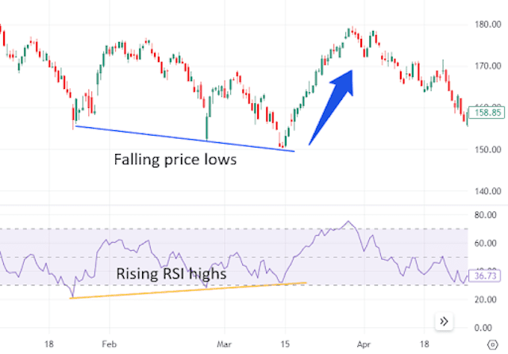

## Table of Contents

## What is the Relative Strength Index (RSI)?

The Relative Strength Index (RSI) is a tool used in trading to see if a stock or other investment is overbought or oversold. It was created by J. Welles Wilder Jr. and is shown as a number between 0 and 100. When the RSI is above 70, it means the investment might be overbought and could go down in price soon. When it's below 30, it means the investment might be oversold and could go up in price soon.

Traders use the RSI to help them decide when to buy or sell. For example, if the RSI goes from below 30 to above 30, it might be a good time to buy because the price could go up. If it goes from above 70 to below 70, it might be a good time to sell because the price could go down. The RSI can also show if the price of an investment is moving in a strong trend, which can help traders make better decisions.

## How is the RSI calculated?

The RSI is calculated using the average gains and losses of an investment over a certain period, usually 14 days. First, you find the average gain and the average loss over those 14 days. The average gain is the total of all the days where the price went up, divided by 14. The average loss is the total of all the days where the price went down, divided by 14. If the price stays the same, it's counted as a loss.

Next, you use these averages to find the relative strength (RS). The RS is the average gain divided by the average loss. Then, you use the RS to calculate the RSI with this formula: RSI = 100 - (100 / (1 + RS)). The RSI number you get will be between 0 and 100. Every day, you update the average gain and loss by using the new price change and a formula that gives more weight to recent changes. This way, the RSI keeps up with the latest price movements.

## What does the RSI measure in trading?

The RSI, or Relative Strength Index, measures how fast and how much a price of a stock or other investment is changing. It looks at how many days the price goes up compared to how many days it goes down. This helps traders see if the price is moving too fast in one direction. The RSI gives a number between 0 and 100. If the number is above 70, it means the price might be too high and could go down soon. If it's below 30, it means the price might be too low and could go up soon.

Traders use the RSI to help them decide when to buy or sell. If the RSI goes from below 30 to above 30, it might be a good time to buy because the price could go up. If it goes from above 70 to below 70, it might be a good time to sell because the price could go down. The RSI can also show if the price is moving in a strong trend. This helps traders make better decisions about when to get in or out of an investment.

## What are the common RSI settings used in trading strategies?

The most common RSI setting used in trading strategies is a 14-day period. This means that the RSI is calculated using the price changes over the last 14 days. Traders find this period useful because it gives a good balance between reacting quickly to price changes and not being too jumpy. Many trading platforms have the 14-day RSI set as the default, so it's easy for traders to use this setting without changing anything.

Some traders also use shorter periods like 9 days or 7 days for the RSI. These shorter periods make the RSI more sensitive to recent price changes. Traders who like to make quick trades might prefer these settings because they can spot overbought or oversold conditions faster. On the other hand, some traders use longer periods like 21 days or 25 days. These longer periods make the RSI less sensitive and smoother, which can be helpful for traders who want to see bigger trends and avoid getting too many false signals.

## How can the RSI be used to identify overbought and oversold conditions?

The RSI helps traders spot when a stock or investment might be overbought or oversold. If the RSI number is over 70, it means the price might be too high and could go down soon. This is called being overbought. Traders might see this as a sign to sell or wait before buying. On the other hand, if the RSI number is below 30, it means the price might be too low and could go up soon. This is called being oversold. Traders might see this as a good time to buy or get ready to buy.

Traders also look for when the RSI moves from being oversold to not oversold, or from overbought to not overbought. For example, if the RSI goes from below 30 to above 30, it might be a signal to buy because the price could start going up. If the RSI goes from above 70 to below 70, it might be a signal to sell because the price could start going down. By watching these changes, traders can make better decisions about when to buy or sell their investments.

## What are the typical RSI levels that indicate buying or selling opportunities?

The RSI helps traders find good times to buy or sell by looking at certain levels. If the RSI goes above 70, it means the price might be too high and could go down soon. This is a signal for traders to think about selling or waiting before buying. When the RSI drops from above 70 back to below 70, it's another sign that the price might start going down, so it could be a good time to sell.

On the other hand, if the RSI goes below 30, it means the price might be too low and could go up soon. This is a signal for traders to think about buying or getting ready to buy. When the RSI rises from below 30 back to above 30, it's another sign that the price might start going up, so it could be a good time to buy. By watching these RSI levels, traders can make better choices about when to buy or sell their investments.

## Can you explain the concept of RSI divergence and its significance in trading?

RSI divergence happens when the price of a stock or investment and its RSI move in different directions. For example, if the price keeps going up but the RSI starts going down, that's called bearish divergence. It might mean the price will stop going up soon and could start going down. On the other hand, if the price keeps going down but the RSI starts going up, that's called bullish divergence. It might mean the price will stop going down soon and could start going up.

Traders watch for RSI divergence because it can help them see when a trend might be about to change. If they see a bearish divergence, they might decide to sell or wait before buying more. If they see a bullish divergence, they might decide to buy or get ready to buy. By paying attention to these signals, traders can make better decisions and try to make more money from their investments.

## How can traders use RSI to confirm trend directions?

Traders can use the RSI to confirm if a trend is strong or if it might be changing. When a stock or investment is going up in a strong trend, the RSI will often stay above 50. If the RSI keeps going up along with the price, it shows that the trend is strong and likely to keep going up. This can give traders more confidence to keep holding their investments or even buy more.

On the other hand, if the price is going down in a strong trend, the RSI will often stay below 50. If the RSI keeps going down along with the price, it shows that the trend is strong and likely to keep going down. This can help traders decide if they should sell their investments or wait before buying. By watching the RSI and how it moves with the price, traders can get a better idea of whether a trend is likely to continue or if it might be time to make a change.

## What are some common RSI trading strategies for beginners?

For beginners, a simple RSI trading strategy is to buy when the RSI goes below 30 and then rises back above 30. This means the stock or investment might be oversold and could start going up in price. When you see this happen, it might be a good time to buy. On the other hand, you can sell when the RSI goes above 70 and then drops back below 70. This means the stock or investment might be overbought and could start going down in price. When you see this happen, it might be a good time to sell.

Another easy strategy is to look for RSI divergence. If the price keeps going up but the RSI starts going down, it's called bearish divergence. This might mean the price will stop going up soon, so it could be a good time to sell or wait before buying more. If the price keeps going down but the RSI starts going up, it's called bullish divergence. This might mean the price will stop going down soon, so it could be a good time to buy or get ready to buy. By watching these signals, beginners can start making better trading decisions.

## How can more advanced traders combine RSI with other technical indicators?

More advanced traders often combine the RSI with other technical indicators to get a better picture of the market. One common way is to use the RSI with moving averages. A moving average smooths out price data to show a clearer trend. If the RSI shows a stock is oversold and the price is also below a moving average, it could be a strong sign to buy. On the other hand, if the RSI shows a stock is overbought and the price is above a moving average, it might be a good time to sell. By looking at both the RSI and moving averages, traders can make more confident decisions.

Another way advanced traders use the RSI is with the MACD (Moving Average Convergence Divergence). The MACD helps show the strength and direction of a trend. If the RSI shows a stock is oversold and the MACD also shows a bullish signal, like when the MACD line crosses above the signal line, it can be a strong sign to buy. If the RSI shows a stock is overbought and the MACD shows a bearish signal, like when the MACD line crosses below the signal line, it can be a good time to sell. Using the RSI along with the MACD can help traders spot better trading opportunities and confirm their decisions.

## What are the potential pitfalls and limitations of using the RSI in trading strategies?

One big problem with using the RSI is that it can give false signals. Sometimes, the RSI might say a stock is overbought or oversold, but the price keeps going in the same direction. For example, during a strong trend, the RSI might stay above 70 for a long time, making traders think it's time to sell when it's not. This can lead to selling too early or buying too late, which can cause traders to lose money. Another issue is that the RSI works best in a market that's moving sideways, not in a strong trend. In a strong trend, the RSI might not be as helpful because the price can keep going up or down even when the RSI suggests otherwise.

Another limitation of the RSI is that it's just one tool among many. Relying only on the RSI can be risky because it doesn't tell the whole story of the market. Traders need to use other tools and indicators to confirm what the RSI is saying. For example, looking at moving averages, volume, or other indicators can help traders make better decisions. Also, the RSI is based on past price data, so it can't predict the future. This means traders should be careful not to depend too much on the RSI and should always think about other things that might affect the market, like news events or economic reports.

## How can expert traders adjust RSI parameters for different market conditions?

Expert traders can change the RSI settings to fit different market situations. In a market that moves a lot, they might use a shorter period like 9 or 7 days for the RSI. This makes the RSI react faster to price changes. It's good for when the market is moving quickly and traders want to catch short-term trends. But, this can also make the RSI give more false signals, so traders need to be careful.

In a market that doesn't move much, expert traders might use a longer period like 21 or 25 days for the RSI. This makes the RSI smoother and less jumpy. It's good for when the market is calm and traders want to see bigger trends without getting too many false signals. By changing the RSI period, expert traders can make the tool work better for the current market conditions and help them make better trading decisions.

## What is the RSI Indicator and How Can It Be Understood?

The Relative Strength Index (RSI) is a [momentum](/wiki/momentum) oscillator that measures the velocity and magnitude of directional price movements. Created by J. Welles Wilder in 1978, the RSI is a critical tool used by traders to identify overbought or oversold conditions in a trading market. The RSI is formulated to provide a reading between 0 and 100, which reflects the asset's current and historical strength or weakness based on closing prices over a specified period.

### RSI Formula and Components

The RSI is calculated using the formula:

$$

RSI = 100 - \frac{100}{1 + RS} 
$$

where RS (Relative Strength) is the average of X days' up closes divided by the average of X days' down closes. Here’s a step-by-step calculation:

1. **Calculate the Average Gain and Average Loss:** 
   - For each day, calculate the change in price.
   - Separate the changes into positive and negative changes over the given period (e.g., 14 days).
   - Average the gains and losses.

2. **Compute Relative Strength (RS):**
   \[ 
   RS = \frac{\text{Average Gain}}{\text{Average Loss}} 

$$

3. **Calculate the RSI Value:**
   \[ 
   RSI = 100 - \left(\frac{100}{1 + RS}\right)

$$

### Oscillation Between 0 and 100

The RSI oscillates between zero and 100, signaling potential overbought or oversold conditions. A traditional interpretation uses the thresholds of 70 and 30:
- A reading above 70 suggests that a security is becoming overbought or overvalued, potentially indicating a reversal or corrective pullback in price.
- A reading below 30 suggests that a security is oversold or undervalued, which could indicate a reversal or upward correction.

### Significance of Mean-Reversion Properties

Mean-reversion is a financial theory suggesting that asset prices and historical returns will revert to their long-term mean or average level. The RSI's ability to signal overbought and oversold markets is inherently tied to mean-reversion, as extreme RSI values typically precede a reversion towards average price ranges.

When an asset's RSI indicates overbought levels, mean-reversion properties suggest that prices may fall back towards a more fundamental value. Conversely, an RSI indicating oversold conditions implies that prices might rise as they return to equilibrium. Traders leverage mean-reversion strategies by using RSI levels to identify potential entry and [exit](/wiki/exit-strategy) points, anticipating that price movements will revert to the mean over time.

The RSI's mean-reversion tendencies make it a valuable tool in various trading strategies, as it helps traders take advantage of price retracements and continuations in trending markets.

## How can RSI be implemented in algorithmic trading?

The implementation of the Relative Strength Index (RSI) in [algorithmic trading](/wiki/algorithmic-trading) involves a series of methodical steps to ensure accurate and efficient trading decisions. This section outlines the critical stages and considerations necessary for integrating RSI into automated trading systems.

### Steps to Integrate RSI into Algo-Trading Systems

1. **Data Acquisition and Preparation**:
   Begin by accessing reliable and timely financial data. Data sources can include APIs from financial data providers like Alpha Vantage or Yahoo Finance. The data should be cleaned and prepared, which includes handling missing values and adjusting for splitting data into timeframes suitable for RSI calculations.

2. **Calculation of RSI**:
   The RSI is computed using the formula:
$$
   RSI_n = 100 - \left(\frac{100}{1 + RS}\right)

$$

   where $RS$ (Relative Strength) is the ratio of average gains to average losses over a specified period $n$. Typically, $n = 14$ periods is used by default. The formula for RS is:
$$
   RS = \frac{\text{Average Gain}}{\text{Average Loss}}

$$

   The average gain and average loss are exponentially smoothed, often using the following initial formula for their calculation:
$$
   \text{Average Gain} = \frac{\sum \text{Gains in lookback period}}{n}

$$
$$
   \text{Average Loss} = \frac{\sum \text{Losses in lookback period}}{n}

$$

   These averages are then smoothed for following periods using a simplified moving average.

3. **Algorithm Design**:
   Integrate the RSI values into trading algorithms where buy/sell signals trigger based on RSI thresholds. Common thresholds are 30 for oversold conditions (buy signal) and 70 for overbought conditions (sell signal).

4. **Backtesting**:
   Thoroughly backtest the RSI-based strategy using historical data to verify its effectiveness. Python libraries such as Backtrader or PyAlgoTrade can automate [backtesting](/wiki/backtesting) by simulating the algorithm across past market conditions.

   ```python
   import backtrader as bt

   class RSIStrategy(bt.Strategy):
       params = (('rsi_period', 14), ('buy_threshold', 30), ('sell_threshold', 70),)

       def __init__(self):
           self.rsi = bt.indicators.RSI_SMA(self.data.close, period=self.params.rsi_period)

       def next(self):
           if self.rsi < self.params.buy_threshold:
               self.buy()
           elif self.rsi > self.params.sell_threshold:
               self.sell()

   # Running the backtest
   cerebro = bt.Cerebro()
   cerebro.addstrategy(RSIStrategy)
   # Add data feed and initial cash, etc.
   cerebro.run()
   ```

### Choosing the Correct RSI Settings and Parameters

Choosing the correct parameters for RSI involves adapting the lookback period and thresholds to fit the trading asset and timeframe. Shorter RSI periods can be used for more volatile assets or shorter timeframes, while longer periods might be better suited for more stable assets to reduce noise.

### Importance of Backtesting RSI Strategies

Backtesting is crucial to evaluate the historical performance of RSI-based strategies under varying market conditions. It allows traders to refine parameters, detect potential pitfalls, and understand how external factors might have influenced outcomes. Additionally, backtesting helps in optimizing strategies by offering insights before committing real capital, thus enhancing risk management and strategy robustness.

In conclusion, successful integration of RSI into automated trading requires precise implementation and careful parameter selection, reinforced by rigorous backtesting to ensure the strategy aligns with market behavior and risk tolerance.

## References & Further Reading

[1]: Wilder, J. W. (1978). ["New Concepts in Technical Trading Systems"](https://books.google.com/books/about/New_Concepts_in_Technical_Trading_System.html?id=WesJAQAAMAAJ). Trend Research.

[2]: Levy, A. J. (1996). ["The Complete Guide to Option Pricing Formulas"](https://www.amazon.com/Complete-Guide-Option-Pricing-Formulas/dp/0786312408) (2nd edition). McGraw-Hill.

[3]: Chan, E. P. (2009). ["Quantitative Trading: How to Build Your Own Algorithmic Trading Business"](https://github.com/ftvision/quant_trading_echan_book). Wiley.

[4]: Aronson, D. R. (2006). ["Evidence-Based Technical Analysis: Applying the Scientific Method and Statistical Inference to Trading Signals"](https://www.amazon.com/Evidence-Based-Technical-Analysis-Scientific-Statistical/dp/0470008741). Wiley.

[5]: Jansen, S. (2020). ["Machine Learning for Algorithmic Trading: Predictive Models to Extract Signals from Market and Alternative Data for Systematic Trading Strategies with Python"](https://www.amazon.com/Machine-Learning-Algorithmic-Trading-alternative/dp/1839217715). Packt Publishing.