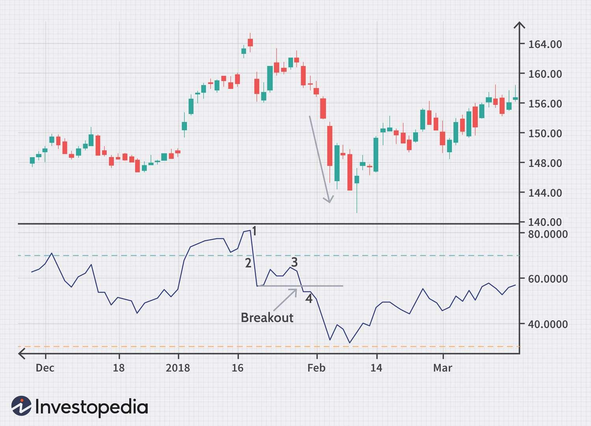

The Relative Strength Index (RSI) is a widely recognized and utilized momentum oscillator developed to measure the speed and change of price movements in financial markets. A prominent tool among traders, RSI is revered for its ability to indicate overbought and oversold conditions in an asset's price, making it a valuable asset in trading strategies, including algorithmic trading. RSI's popularity in algo trading can be attributed to its straightforward calculation and the ease of integrating it within automated systems that continuously analyze market data.

The RSI indicator was introduced by J. Welles Wilder in his 1978 book "New Concepts in Technical Trading Systems." Wilder, a mechanical engineer turned technical analyst, crafted the RSI as part of his broader effort to provide traders with mechanical and systematic approaches to trading. The RSI quickly gained traction due to its simplicity and the effective insights it offers into the market's potential price reversals.



Mathematically, RSI is computed using the formula:

$$
RSI = 100 - \left( \frac{100}{1 + \frac{\text{Average Gain}}{\text{Average Loss}}} \right)
$$

where the average gain and average loss are typically calculated over a 14-period timeframe, although traders may adjust this period based on their specific trading objectives and market conditions.

Given its ability to quantify market sentiment through numerical values ranging from 0 to 100, RSI provides traders with actionable insights. Generally, an RSI value above 70 signifies that an asset may be overbought, while a value below 30 indicates it may be oversold. These signals are particularly useful in algorithmic trading systems, where precise, rules-based decisions are crucial.

In conclusion, the RSI is an integral component in the toolkit of both manual and automated trading strategies. Its development by Welles Wilder marked a significant advancement in technical analysis, providing traders with a robust method to gauge market dynamics effectively.

## Table of Contents

## Understanding the RSI Indicator

The Relative Strength Index (RSI) is a [momentum](/wiki/momentum) oscillator that measures the velocity and magnitude of directional price movements. Created by J. Welles Wilder in 1978, the RSI is a critical tool used by traders to identify overbought or oversold conditions in a trading market. The RSI is formulated to provide a reading between 0 and 100, which reflects the asset's current and historical strength or weakness based on closing prices over a specified period.

### RSI Formula and Components

The RSI is calculated using the formula:

$$

RSI = 100 - \frac{100}{1 + RS} 
$$

where RS (Relative Strength) is the average of X days' up closes divided by the average of X days' down closes. Here’s a step-by-step calculation:

1. **Calculate the Average Gain and Average Loss:** 
   - For each day, calculate the change in price.
   - Separate the changes into positive and negative changes over the given period (e.g., 14 days).
   - Average the gains and losses.

2. **Compute Relative Strength (RS):**
   \[ 
   RS = \frac{\text{Average Gain}}{\text{Average Loss}} 

$$

3. **Calculate the RSI Value:**
   \[ 
   RSI = 100 - \left(\frac{100}{1 + RS}\right)

$$

### Oscillation Between 0 and 100

The RSI oscillates between zero and 100, signaling potential overbought or oversold conditions. A traditional interpretation uses the thresholds of 70 and 30:
- A reading above 70 suggests that a security is becoming overbought or overvalued, potentially indicating a reversal or corrective pullback in price.
- A reading below 30 suggests that a security is oversold or undervalued, which could indicate a reversal or upward correction.

### Significance of Mean-Reversion Properties

Mean-reversion is a financial theory suggesting that asset prices and historical returns will revert to their long-term mean or average level. The RSI's ability to signal overbought and oversold markets is inherently tied to mean-reversion, as extreme RSI values typically precede a reversion towards average price ranges.

When an asset's RSI indicates overbought levels, mean-reversion properties suggest that prices may fall back towards a more fundamental value. Conversely, an RSI indicating oversold conditions implies that prices might rise as they return to equilibrium. Traders leverage mean-reversion strategies by using RSI levels to identify potential entry and [exit](/wiki/exit-strategy) points, anticipating that price movements will revert to the mean over time.

The RSI's mean-reversion tendencies make it a valuable tool in various trading strategies, as it helps traders take advantage of price retracements and continuations in trending markets.

## Implementing RSI in Algorithmic Trading

The implementation of the Relative Strength Index (RSI) in [algorithmic trading](/wiki/algorithmic-trading) involves a series of methodical steps to ensure accurate and efficient trading decisions. This section outlines the critical stages and considerations necessary for integrating RSI into automated trading systems.

### Steps to Integrate RSI into Algo-Trading Systems

1. **Data Acquisition and Preparation**:
   Begin by accessing reliable and timely financial data. Data sources can include APIs from financial data providers like Alpha Vantage or Yahoo Finance. The data should be cleaned and prepared, which includes handling missing values and adjusting for splitting data into timeframes suitable for RSI calculations.

2. **Calculation of RSI**:
   The RSI is computed using the formula:
$$
   RSI_n = 100 - \left(\frac{100}{1 + RS}\right)

$$

   where $RS$ (Relative Strength) is the ratio of average gains to average losses over a specified period $n$. Typically, $n = 14$ periods is used by default. The formula for RS is:
$$
   RS = \frac{\text{Average Gain}}{\text{Average Loss}}

$$

   The average gain and average loss are exponentially smoothed, often using the following initial formula for their calculation:
$$
   \text{Average Gain} = \frac{\sum \text{Gains in lookback period}}{n}

$$
$$
   \text{Average Loss} = \frac{\sum \text{Losses in lookback period}}{n}

$$

   These averages are then smoothed for following periods using a simplified moving average.

3. **Algorithm Design**:
   Integrate the RSI values into trading algorithms where buy/sell signals trigger based on RSI thresholds. Common thresholds are 30 for oversold conditions (buy signal) and 70 for overbought conditions (sell signal).

4. **Backtesting**:
   Thoroughly backtest the RSI-based strategy using historical data to verify its effectiveness. Python libraries such as Backtrader or PyAlgoTrade can automate [backtesting](/wiki/backtesting) by simulating the algorithm across past market conditions.

   ```python
   import backtrader as bt

   class RSIStrategy(bt.Strategy):
       params = (('rsi_period', 14), ('buy_threshold', 30), ('sell_threshold', 70),)

       def __init__(self):
           self.rsi = bt.indicators.RSI_SMA(self.data.close, period=self.params.rsi_period)

       def next(self):
           if self.rsi < self.params.buy_threshold:
               self.buy()
           elif self.rsi > self.params.sell_threshold:
               self.sell()

   # Running the backtest
   cerebro = bt.Cerebro()
   cerebro.addstrategy(RSIStrategy)
   # Add data feed and initial cash, etc.
   cerebro.run()
   ```

### Choosing the Correct RSI Settings and Parameters

Choosing the correct parameters for RSI involves adapting the lookback period and thresholds to fit the trading asset and timeframe. Shorter RSI periods can be used for more volatile assets or shorter timeframes, while longer periods might be better suited for more stable assets to reduce noise.

### Importance of Backtesting RSI Strategies

Backtesting is crucial to evaluate the historical performance of RSI-based strategies under varying market conditions. It allows traders to refine parameters, detect potential pitfalls, and understand how external factors might have influenced outcomes. Additionally, backtesting helps in optimizing strategies by offering insights before committing real capital, thus enhancing risk management and strategy robustness.

In conclusion, successful integration of RSI into automated trading requires precise implementation and careful parameter selection, reinforced by rigorous backtesting to ensure the strategy aligns with market behavior and risk tolerance.

## RSI Trading Strategies

The Relative Strength Index (RSI) is a versatile tool integral to several trading strategies due to its capability to identify momentum, overbought, and oversold conditions in financial markets. This section explores common RSI-based trading strategies, with a focus on RSI divergence, and RSI overbought/oversold signals, and how they can be applied within systematic trading frameworks.

**RSI Divergence Strategy**

RSI divergence occurs when the price of an asset and the RSI indicator move in opposite directions. Divergence is classified into two types: bullish divergence and bearish divergence.

- **Bullish Divergence**: This occurs when the price makes a lower low, but the RSI makes a higher low. This suggests that the bearish momentum is weakening, potentially indicating an upcoming bullish reversal.

- **Bearish Divergence**: This happens when the price makes a higher high, but the RSI makes a lower high, signaling a weakening in bullish momentum and a possible reversal to the downside.

For both divergences, the key is recognizing that while the price continues in a given direction, the RSI suggests a slowing momentum, offering traders a potential entry or exit point.

**RSI Overbought/Oversold Signals**

The RSI oscillates between 0 and 100, with readings above 70 typically considered overbought and readings below 30 deemed oversold.

- **Overbought Signal**: When the RSI exceeds 70, it suggests an asset may be overvalued and ripe for a correction. Traders look for sell signals when the RSI crosses below the 70 threshold.

- **Oversold Signal**: Conversely, an RSI reading under 30 indicates a potential undervaluation. Traders anticipate a buying opportunity as the RSI moves above 30.

These signals are particularly effective in range-bound markets where prices tend to peak and trough within a stable range.

**Application in Systematic Trading**

Integrating these RSI strategies within an automated trading system requires precise rule definition and execution logic. A basic implementation example in Python could be structured as follows:

```python
import pandas as pd

def compute_rsi(data, window=14):
    """Calculate the RSI for a given data series."""
    delta = data.diff()
    gain = (delta.where(delta > 0, 0)).rolling(window=window).mean()
    loss = (-delta.where(delta < 0, 0)).rolling(window=window).mean()
    rs = gain / loss
    rsi = 100 - (100 / (1 + rs))
    return rsi

# Example usage
prices = pd.Series([your_price_data_here])
rsi = compute_rsi(prices)

# Identify signals
sell_signals = rsi[(rsi > 70) & (rsi.shift() <= 70)]
buy_signals = rsi[(rsi < 30) & (rsi.shift() >= 30)]
```

This code demonstrates a simple RSI calculation, with logic to determine overbought and oversold conditions. In more sophisticated systems, these signals would trigger automated trades based on pre-defined criteria and risk management rules.

In addition to systematic approaches, traders often combine RSI strategies with other technical indicators to refine entry and exit points, which is explored in subsequent sections. Understanding and appropriately applying RSI strategies can significantly enhance a trader's ability to exploit market dynamics efficiently.

## RSI Backtesting and Optimization

Backtesting RSI strategies is essential in algorithmic trading to evaluate their viability and profitability before deployment in live markets. This process enables traders to simulate trading strategies using historical data to ascertain their performance and refine them accordingly. Conducting thorough backtests helps identify potential weaknesses and strengths within the strategy, allowing for adjustments that improve overall efficacy.

Among the popular tools and frameworks used for backtesting RSI strategies are MetaTrader 4/5, TradingView, and Python libraries such as Backtrader and Zipline. These platforms provide a robust environment for developing, testing, and optimizing trading strategies by offering comprehensive data sets and technical indicator packages, including the Relative Strength Index (RSI).

MetaTrader 4/5 offers a powerful strategy tester equipped with a variety of technical indicators, enabling the backtesting of custom-built RSI-based strategies. On TradingView, traders can leverage the built-in scripting language, Pine Script, to create and test RSI strategies. Python libraries like Backtrader and Zipline provide the flexibility to program more complex trading algorithms with access to a broad range of historical market data.

Successful RSI strategy backtests require careful optimization of strategy parameters. For instance, determining appropriate RSI period settings is crucial. A common choice is the 14-period RSI, originally recommended by Welles Wilder. However, different markets or assets might require adjustments for optimal results. Backtesting can reveal the most suitable settings for specific trading conditions.

Let’s examine a hypothetical case study using the Python Backtrader library to test a simple RSI overbought/oversold strategy. Below is an example Python script illustrating such a backtest:

```python
import backtrader as bt

class RsiStrategy(bt.Strategy):
    params = (('rsi_period', 14), ('rsi_upper', 70), ('rsi_lower', 30),)

    def __init__(self):
        self.rsi = bt.indicators.RSI(self.data.close, period=self.params.rsi_period)

    def next(self):
        if self.rsi < self.params.rsi_lower:
            self.buy()
        elif self.rsi > self.params.rsi_upper:
            self.sell()

if __name__ == '__main__':
    cerebro = bt.Cerebro()
    cerebro.addstrategy(RsiStrategy)

    data = bt.feeds.YahooFinanceData(dataname='AAPL', fromdate=datetime(2020, 1, 1), todate=datetime(2021, 1, 1))
    cerebro.adddata(data)

    cerebro.run()
    cerebro.plot()
```

In this script, the RSI strategy is tested on Apple Inc. (AAPL) stock data over the year 2020. The strategy buys when the RSI falls below 30 and sells when it rises above 70. This straightforward example demonstrates how backtesting can provide insights into strategy performance, as reflected in the plotted results.

Real-world cases of successful RSI backtests reveal strategies that consistently generate returns. For instance, combining RSI with trend-following indicators and adaptive stop-loss techniques has proven effective in volatile markets. Backtesting such multivariate strategies can uncover valuable insights and offer a competitive edge in algorithmic trading.

By rigorously backtesting and optimizing RSI strategies, traders gain confidence in their trading systems, ensuring they are robust and adaptable to changing market conditions. Proper optimization and the iterative process of backtesting are integral to creating reliable and profitable RSI-driven trading models.

## Enhancing RSI Strategies with Additional Indicators

Combining the Relative Strength Index (RSI) with other technical indicators can enhance trading strategies by providing more robust signals, filtering out noise, and increasing overall trading accuracy. Trading signals derived from the RSI are often strengthened when corroborated by other indicators, allowing traders to develop more sophisticated strategies that better handle various market conditions.

### Benefits of Combining Indicators

The key advantage of using additional indicators alongside RSI is the potential to eliminate false signals and confirm trading decisions. By merging different tools, traders can cross-verify the validity of an RSI signal, reducing the likelihood of acting on misleading data from a single source. This convergence approach also allows for a more comprehensive analysis of market trends and conditions, improving decision-making.

### Popular Indicators to Complement RSI

1. **Moving Averages**: Moving Averages (MA) are commonly used with RSI to identify the overall trend direction. A simple strategy involves using a moving average crossover to confirm RSI signals. For example, if RSI indicates overbought conditions (RSI>70), a bearish signal is confirmed if the price falls below the moving average. Conversely, an RSI oversold condition (RSI<30) is confirmed as bullish if the price rises above the moving average.

2. **Moving Average Convergence Divergence (MACD)**: The MACD, which focuses on the momentum and trend-following characteristics, can be used to filter RSI signals. For instance, an RSI overbought signal could be further validated by a MACD line crossing below the signal line. Similarly, an RSI-based oversold condition gains validity when the MACD line crosses above the signal line.

### Strategies for Multi-Indicator Convergence

Integrating RSI with other indicators involves developing strategies where signals are only acted upon when confirmed by additional technical tools. This can significantly boost trading precision. Here's a sample Python pseudocode outline for a simple strategy involving RSI and Moving Average:

```python
import pandas as pd

def trading_signal(data, rsi_period=14, ma_period=50):
    # Calculate RSI
    delta = data['Close'].diff()
    gain = (delta.where(delta > 0, 0)).rolling(window=rsi_period).mean()
    loss = (-delta.where(delta < 0, 0)).rolling(window=rsi_period).mean()

    rs = gain / loss
    rsi = 100 - (100 / (1 + rs))
    data['RSI'] = rsi

    # Calculate Moving Average
    ma = data['Close'].rolling(window=ma_period).mean()
    data['MA'] = ma

    # Generate trading signal
    buy_signal = (rsi < 30) & (data['Close'] > ma)
    sell_signal = (rsi > 70) & (data['Close'] < ma)

    data['Signal'] = 0
    data.loc[buy_signal, 'Signal'] = 1
    data.loc[sell_signal, 'Signal'] = -1

    return data

# Usage
# df = pd.read_csv('historical_data.csv')
# signals = trading_signal(df)
```

In this outline, signals are only generated when both the RSI and the Moving Average indicate the potential for a price reversal. Such synergistic strategies ensure only the strongest signals result in trades, thereby refining the efficacy of the trading system.

Additionally, aligning RSI with MACD could involve adjusting signal thresholds or using the histogram as a divergence tool to enhance the accuracy of trade entries and exits, thus optimizing strategy results.

By combining RSI with complementary technical indicators, traders can achieve a holistic view of the market, resulting in more effective and profitable trading strategies.

## Challenges and Considerations

The Relative Strength Index (RSI) is a widely utilized momentum oscillator in algorithmic trading; however, it comes with its set of challenges and considerations that traders must be mindful of to deploy it effectively. One of the primary challenges is the indicator's inherent tendency towards false signals, particularly during trending markets. Since RSI is primarily designed to detect overbought and oversold conditions in a sideways market, it might generate misleading buy or sell signals during strong bullish or bearish trends.

To address this, traders should avoid relying solely on RSI signals and consider the market context. Integrating RSI with trend-following indicators like moving averages can help filter out false signals. Additionally, setting higher threshold levels, such as adjusting the RSI overbought level from 70 to 80 and the oversold level from 30 to 20, might reduce the frequency of false signals in trending markets.

Another significant consideration is the choice of RSI settings and parameters, particularly the look-back period. The default RSI uses a 14-period timeframe, but traders might tweak this setting based on their specific trading strategies and the market's [volatility](/wiki/volatility-trading-strategies). Shorter periods can lead to more frequent signals while longer periods can produce more reliable, albeit less frequent, signals. 

Backtesting is essential for understanding how RSI performs with these different parameters. Traders need to conduct thorough backtesting using historical data to identify optimal settings and validate the performance of RSI-based strategies before live deployment. Python, with backtesting libraries like Backtrader or PyAlgoTrade, provides a robust environment for such testing:

```python
import backtrader as bt
import pandas as pd

# Example RSI strategy
class RsiStrategy(bt.Strategy):
    params = (('rsi_period', 14), ('overbought', 70), ('oversold', 30),)

    def __init__(self):
        self.rsi = bt.indicators.RSI(period=self.p.rsi_period)

    def next(self):
        if self.rsi < self.p.oversold:
            self.buy()
        elif self.rsi > self.p.overbought:
            self.sell()

# Setting up backtesting environment
cerebro = bt.Cerebro()
data = bt.feeds.YahooFinanceData(dataname='AAPL', fromdate=pd.Timestamp('2020-01-01'), 
                                todate=pd.Timestamp('2022-01-01'))
cerebro.adddata(data)
cerebro.addstrategy(RsiStrategy)
cerebro.run()
cerebro.plot()
```

Risk management is pivotal when employing RSI strategies. Stop-loss orders can help mitigate the risk of substantial losses due to false signals. Furthermore, position sizing rules and diversification across different assets or timeframes can reduce exposure to any single RSI signal potentially leading to adverse outcomes.

In conclusion, while RSI is a potent tool in the algorithmic trading arsenal, its effectiveness largely depends on careful consideration of the market conditions, parameter optimization, and stringent risk management practices. Combining RSI with additional indicators, consistent backtesting, and robust risk protocols can enhance its utility and minimize potential pitfalls.

## Conclusion

The Relative Strength Index (RSI) stands out as a pivotal tool in the domain of algorithmic trading, largely due to its ability to identify potential buy and sell signals by analyzing the momentum of price movements. Its advantages in algo trading are multifaceted. Among these, the RSI's simplicity and adaptability are paramount. By providing clear overbought and oversold signals through its oscillation between levels of 0 to 100, RSI aids traders in making informed decisions about entry and exit points. This clarity is instrumental for the automated trade executions that define algo trading systems.

Furthermore, RSI's mean-reversion properties play a crucial role in capturing profitable reversals, enabling traders to capitalize on temporary price extremes. Traders considering incorporating RSI strategies must pay heed to the optimization of RSI settings, such as the look-back period, which can significantly affect performance.

Key takeaways for traders focusing on RSI strategies involve the necessity of backtesting and optimization. Thorough backtesting, using historical data, is essential to gauge the performance and viability of RSI-based strategies. Tools like Python’s Backtrader or R’s quantstrat can facilitate such evaluations, ensuring traders possess a robust strategy before live deployment.

As algo trading continues to evolve, the future potential of RSI is entrenched in its combination with other technical indicators for enhanced accuracy and reliability. By integrating complementary indicators, traders can reduce false signals, thus improving the robustness of trading models. For instance, combining RSI with Moving Averages or the Moving Average Convergence Divergence (MACD) can potentiate RSI's predictive power.

In conclusion, RSI remains a valuable component of automated trading systems due to its adaptability and potential for integration. Its relevance will likely persist, becoming even more pronounced as traders develop more sophisticated models, further embedding RSI within algorithmic frameworks for more nuanced and accurate trading solutions.

## References & Further Reading

[1]: Wilder, J. W. (1978). ["New Concepts in Technical Trading Systems"](https://books.google.com/books/about/New_Concepts_in_Technical_Trading_System.html?id=WesJAQAAMAAJ). Trend Research.

[2]: Levy, A. J. (1996). ["The Complete Guide to Option Pricing Formulas"](https://www.amazon.com/Complete-Guide-Option-Pricing-Formulas/dp/0786312408) (2nd edition). McGraw-Hill.

[3]: Chan, E. P. (2009). ["Quantitative Trading: How to Build Your Own Algorithmic Trading Business"](https://github.com/ftvision/quant_trading_echan_book). Wiley.

[4]: Aronson, D. R. (2006). ["Evidence-Based Technical Analysis: Applying the Scientific Method and Statistical Inference to Trading Signals"](https://www.amazon.com/Evidence-Based-Technical-Analysis-Scientific-Statistical/dp/0470008741). Wiley.

[5]: Jansen, S. (2020). ["Machine Learning for Algorithmic Trading: Predictive Models to Extract Signals from Market and Alternative Data for Systematic Trading Strategies with Python"](https://www.amazon.com/Machine-Learning-Algorithmic-Trading-alternative/dp/1839217715). Packt Publishing.