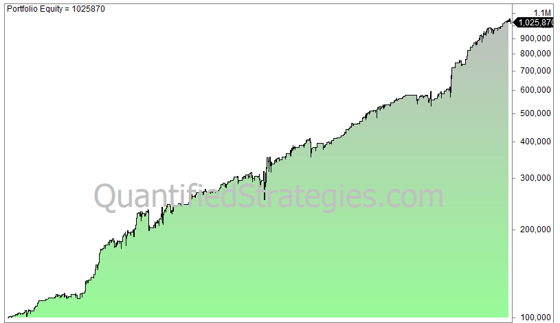

## Table of Contents

## What is the RSI2 strategy and how does it work?

The RSI2 strategy is a trading method that uses the Relative Strength Index (RSI) with a 2-day setting to find good times to buy or sell stocks. The RSI is a tool that measures how fast and how much a stock's price has changed. When the RSI2 drops below 20, it means the stock might be a good buy because it's probably been going down a lot and might start going up soon. When the RSI2 goes above 80, it might be a good time to sell because the stock has likely been going up a lot and might start going down soon.

This strategy works by helping traders spot when a stock is oversold or overbought. If a stock is oversold (RSI2 below 20), traders might buy it, hoping the price will go back up. If a stock is overbought (RSI2 above 80), traders might sell it, thinking the price will go down. By using these signals, traders try to make money by buying low and selling high. However, like all trading strategies, it's not perfect and traders should be careful and use other information too.

## What is the SPY and why is it used in the RSI2 strategy?

The SPY, or SPDR S&P 500 ETF Trust, is a type of investment that tracks the S&P 500 index. The S&P 500 is a list of 500 big companies in the United States, and the SPY tries to match how well these companies are doing. People use the SPY because it's an easy way to invest in a lot of big companies at once, instead of buying each company's stock separately.

In the RSI2 strategy, the SPY is used because it's a good way to see how the whole market is doing. Since the RSI2 strategy looks for times when the market might be going up or down a lot, using the SPY helps traders see these big moves in the overall market. By watching the RSI2 of the SPY, traders can decide when to buy or sell based on the whole market's movements, not just one company's stock.

## How do you calculate the RSI2 indicator?

To calculate the RSI2 indicator, you first need to find the difference between the closing prices of a stock over two days. If today's closing price is higher than yesterday's, that's a positive change. If it's lower, it's a negative change. After finding these changes, you take the average of the positive changes and the average of the negative changes over the last two days. The RSI2 is then calculated using a formula: RSI2 = 100 - (100 / (1 + (Average Gain / Average Loss))). This gives you a number between 0 and 100.

The RSI2 is used to see if a stock is oversold or overbought. If the RSI2 is below 20, it means the stock might be oversold, and it could be a good time to buy. If the RSI2 is above 80, it means the stock might be overbought, and it could be a good time to sell. Traders use this to try and buy low and sell high, based on how the stock's price has been moving recently.

## What are the typical settings for the RSI2 on the SPY?

The typical setting for the RSI2 on the SPY is to use a 2-day period. This means you look at the stock's price changes over the last two days to figure out if it's a good time to buy or sell. When the RSI2 drops below 20, it suggests the SPY might be oversold, meaning it could be a good time to buy. When the RSI2 goes above 80, it suggests the SPY might be overbought, meaning it could be a good time to sell.

Traders use these settings to try and make money by buying the SPY when it's low and selling when it's high. The RSI2 helps them see when the market might be ready for a change in direction. It's a simple way to get signals about the overall market's movements, but it's important to remember that no strategy works perfectly all the time, so traders should use other information too.

## What are the entry and exit signals for the RSI2 strategy on SPY?

The entry signal for the RSI2 strategy on the SPY happens when the RSI2 value drops below 20. This means the SPY has likely been going down a lot over the last two days and might be ready to go back up. When traders see this, they might decide it's a good time to buy the SPY, hoping to make money when the price goes up again.

The exit signal for the RSI2 strategy on the SPY happens when the RSI2 value goes above 80. This means the SPY has likely been going up a lot over the last two days and might be ready to go back down. When traders see this, they might decide it's a good time to sell the SPY, trying to make money before the price starts to drop.

Using these signals, traders try to buy low and sell high. But remember, the RSI2 strategy is not perfect and should be used with other information to make the best trading decisions.

## Can you explain the concept of overbought and oversold in the context of RSI2 on SPY?

In the RSI2 strategy on the SPY, "overbought" means the stock has been going up a lot and might be ready to go down. This happens when the RSI2 value goes above 80. When traders see the RSI2 above 80, they think the SPY has been going up too fast and might not keep going up. So, they might decide to sell their SPY shares to make money before the price drops.

On the other hand, "oversold" means the stock has been going down a lot and might be ready to go back up. This happens when the RSI2 value drops below 20. When traders see the RSI2 below 20, they think the SPY has been going down too much and might start going up again. So, they might decide to buy the SPY, hoping to make money when the price goes back up.

## How does one manage risk when using the RSI2 strategy on SPY?

Managing risk when using the RSI2 strategy on SPY is important to protect your money. One way to do this is by setting stop-loss orders. A stop-loss order is like a safety net that tells your broker to sell your SPY shares if the price drops to a certain level. This can help you avoid losing too much money if the market goes down after you buy. Another way to manage risk is by not putting all your money into one trade. Instead, you can spread your money across different investments, which is called diversification. This way, if the SPY doesn't go up as you hoped, you won't lose everything.

Another important part of managing risk is to not get too excited about buying and selling based only on the RSI2 signals. It's a good idea to use other tools and information too, like looking at the bigger picture of the market or using other indicators. This can give you a better idea of whether the RSI2 signal is a good one to follow. Also, always think about how much money you can afford to lose. Never invest more than you can handle losing, and be ready to change your plan if things don't go as expected. By being careful and using these strategies, you can help protect your money while using the RSI2 strategy on SPY.

## What are some common pitfalls to avoid when using the RSI2 strategy on SPY?

One common pitfall to avoid when using the RSI2 strategy on SPY is relying too much on just the RSI2 signals. The RSI2 can give you a good idea about when to buy or sell, but it's not perfect. Sometimes, the market can keep going down even after the RSI2 says it's oversold, or it can keep going up even after it says it's overbought. That's why it's important to use other tools and information too, like looking at the bigger picture of the market or using other indicators. This can help you make better decisions and not get tricked by the RSI2 signals alone.

Another pitfall is not setting up good ways to manage risk. If you don't use stop-loss orders, you could lose a lot of money if the market suddenly goes down after you buy. Also, putting all your money into one trade can be risky. It's better to spread your money across different investments, so you're not betting everything on the SPY going up. And remember, never invest more than you can afford to lose. By being careful and using these strategies, you can avoid some of the common mistakes people make when using the RSI2 strategy on SPY.

## How can the RSI2 strategy be optimized for better performance on SPY?

To optimize the RSI2 strategy for better performance on SPY, you can start by combining it with other indicators. The RSI2 alone can be helpful, but it's not perfect. Using other tools like moving averages or the MACD can give you a fuller picture of what the market is doing. For example, if the RSI2 says the SPY is oversold, but the moving average shows the market is still going down, you might want to wait before buying. By using more than one tool, you can make better decisions and avoid getting tricked by just one signal.

Another way to optimize the RSI2 strategy is by adjusting the entry and exit points. Instead of always buying when the RSI2 goes below 20 and selling when it goes above 80, you might want to try different numbers. Some traders find that waiting for the RSI2 to go a bit lower, like below 15, before buying can work better. And selling when it goes a bit higher, like above 85, might help too. By testing different levels, you can find what works best for you and the SPY. Remember, it's important to keep an eye on how well your changes are working and be ready to adjust them if needed.

## What are the historical performance results of the RSI2 strategy on SPY?

The RSI2 strategy on SPY has shown mixed results over time. Some studies have found that using the RSI2 to buy when it drops below 20 and sell when it goes above 80 can lead to good profits. For example, a study from 2005 to 2010 showed that following these signals could have made more money than just holding onto the SPY. But, the strategy doesn't always work well. There have been times when the market kept going down even after the RSI2 said it was oversold, or kept going up after it said it was overbought. This means that while the RSI2 can be helpful, it's not perfect and can lead to losses if you rely on it too much.

To get a better idea of how well the RSI2 strategy works on SPY, it's important to look at different time periods and market conditions. Some traders have found that the strategy works better in certain types of markets, like when the market is going up and down a lot. But in calm markets, the RSI2 signals might not be as useful. Also, the strategy's performance can change over time. What worked well in the past might not work as well in the future. So, it's a good idea to keep testing and adjusting the strategy to see what works best for you.

## How does the RSI2 strategy on SPY compare to other trading strategies?

The RSI2 strategy on SPY is simple to use and can be a good way to make money if the market is moving a lot. It tells you to buy when the RSI2 goes below 20, which means the market might be ready to go up, and to sell when it goes above 80, which means the market might be ready to go down. Compared to other strategies, like using moving averages or the MACD, the RSI2 is easier to understand and doesn't need a lot of complicated math. But, it can be risky because the market doesn't always do what the RSI2 says it will. Sometimes, the market keeps going down even after the RSI2 says it's oversold, or keeps going up after it says it's overbought.

Other trading strategies might give you more information to help you make better decisions. For example, using moving averages can show you the bigger picture of where the market is going, and the MACD can tell you when the market's speed is changing. These strategies can be more complex but might help you avoid some of the mistakes that can happen with the RSI2. The RSI2 strategy can be a good start for new traders because it's easy to use, but experienced traders might find that combining it with other strategies can lead to better results. It's important to test different strategies and see what works best for you and the SPY.

## What advanced techniques can be used to enhance the RSI2 strategy on SPY?

One advanced technique to enhance the RSI2 strategy on SPY is to use it along with other indicators, like moving averages or the MACD. The RSI2 can tell you when the market might be ready to go up or down, but it's not perfect. By looking at moving averages, you can see the bigger picture of where the market is going. If the RSI2 says the SPY is oversold but the moving average shows the market is still going down, you might want to wait before buying. The MACD can also help by showing you when the market's speed is changing. Using these tools together can give you a better idea of what the market is doing and help you make smarter decisions.

Another way to enhance the RSI2 strategy is by changing the entry and exit points. Instead of always buying when the RSI2 goes below 20 and selling when it goes above 80, you might want to try different numbers. Some traders find that waiting for the RSI2 to go a bit lower, like below 15, before buying can work better. And selling when it goes a bit higher, like above 85, might help too. You can also use something called a trailing stop-loss order, which moves up as the price goes up. This can help you keep more of your profits if the market keeps going up after you buy. By testing different levels and using these advanced techniques, you can make the RSI2 strategy work better for you on the SPY.

## What is the Relative Strength Index (RSI) and how is it understood?

The Relative Strength Index (RSI) is a widely-used [momentum](/wiki/momentum) oscillator in financial markets, designed to measure the speed and magnitude of price movements. Developed by J. Welles Wilder Jr. in 1978, the RSI operates on a scale from 0 to 100 and is predominantly used to identify overbought or oversold conditions in a market. An asset is traditionally considered overbought when its RSI reading exceeds 70, and oversold when the RSI falls below 30. These threshold levels suggest potential reversal points, which are crucial in devising mean-reversion trading strategies.

Mathematically, the RSI is calculated as follows:

$$
RSI = 100 - \frac{100}{1 + RS}
$$

where:

$$
RS = \frac{\text{Average Gain over } n \text{ periods}}{\text{Average Loss over } n \text{ periods}}
$$

In practice, a 14-period timeframe is often used, although traders may adjust this based on their specific needs. The RSI fluctuates between 0 and 100, with high values indicating that the market might be overbought, and low values suggesting it might be oversold.

This indicator's strength lies in its ability to highlight potential reversal points by gauging the magnitude of recent price changes relative to previous gains and losses. Mean-reversion strategies leverage this information, aiming to capitalize on temporary mispricings, or deviations, by anticipating a reversion to a mean value. By identifying when an asset has potentially exhausted its current trend—whether bullish or bearish—traders can better time their entry and [exit](/wiki/exit-strategy) points, optimizing their trading decisions to enhance profitability. 

Overall, the RSI’s simplicity and effectiveness make it a valuable tool for both novice and experienced traders looking to implement [algorithmic trading](/wiki/algorithmic-trading) strategies.

## References & Further Reading

[1]: Wilder, J. W. (1978). ["New Concepts in Technical Trading Systems"](https://www.amazon.com/New-Concepts-Technical-Trading-Systems/dp/0894590278). Trend Research.

[2]: Connors, L., & Alvarez, C. (2009). ["Short Term Trading Strategies That Work"](https://www.amazon.com/Short-Term-Trading-Strategies-That/dp/0981923909). TradingMarkets Publishing Group.

[3]: Tharp, V. K. (1998). ["Trade Your Way to Financial Freedom"](https://www.amazon.com/Trade-Your-Way-Financial-Freedom/dp/007147871X). McGraw-Hill Education.

[4]: Ferguson, R. (2012). ["Algorithmic Trading & DMA: An introduction to direct access trading strategies"](https://www.gbv.de/dms/zbw/626979455.pdf). 4Myeloma Press.

[5]: Chan, E. (2009). ["Quantitative Trading: How to Build Your Own Algorithmic Trading Business"](https://github.com/ftvision/quant_trading_echan_book). Wiley Trading.

[6]: Hill, R. J., & Ready, M. J. (1991). ["The Impact of the 1987 Stock Market Crash on US Stocks"](https://www.federalreservehistory.org/essays/stock-market-crash-of-1987). Journal of Finance.