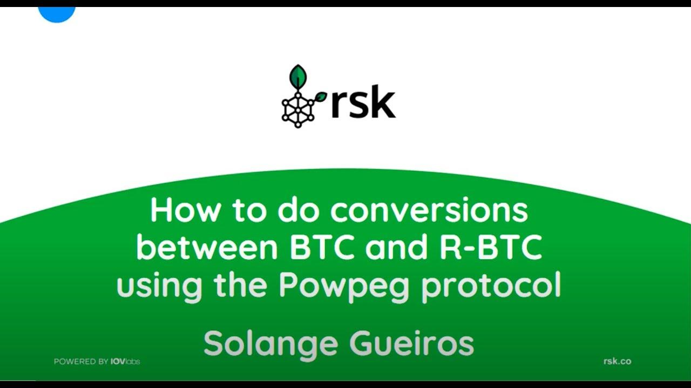

## Table of Contents

## What is RSK and what does it aim to achieve?

RSK, also known as Rootstock, is a smart contract platform that works alongside the Bitcoin blockchain. It aims to bring smart contract functionality to Bitcoin, allowing developers to create decentralized applications (dApps) and execute complex transactions on the Bitcoin network. RSK uses a two-way peg system, which means users can move their bitcoins between the Bitcoin blockchain and the RSK blockchain. This allows users to use their bitcoins in smart contracts on RSK and then move them back to the Bitcoin blockchain when needed.

The main goal of RSK is to enhance the Bitcoin ecosystem by adding smart contract capabilities without compromising the security and stability of the Bitcoin network. By doing this, RSK hopes to attract more developers and users to the Bitcoin space, increasing its overall utility and adoption. RSK also aims to provide a more scalable solution for smart contracts compared to other platforms, as it leverages the security and widespread use of Bitcoin.

## What is RBTC and how does it relate to Bitcoin?

RBTC is a type of cryptocurrency that you can use on the RSK network. It is closely tied to Bitcoin because you can exchange one RBTC for one Bitcoin, and vice versa. This means that if you have Bitcoin, you can move it to the RSK network and it becomes RBTC, which you can then use to do things like smart contracts on RSK. When you're done, you can move it back to the Bitcoin network and it becomes Bitcoin again.

The main reason RBTC exists is to make it easier for people to use Bitcoin in smart contracts on the RSK network. Since RBTC and Bitcoin have the same value, you don't lose or gain money when you move between the two networks. This makes it simple and safe for people to try out new things on RSK while still using their Bitcoin.

## How is RBTC created and managed on the RSK network?

RBTC is created when someone wants to use their Bitcoin on the RSK network. They send their Bitcoin to a special address on the Bitcoin blockchain, and then the same amount of RBTC is created for them on the RSK network. This process is called a two-way peg. It's like moving money from one bank account to another, except here it's between the Bitcoin and RSK networks. The total amount of RBTC that can exist is always the same as the total amount of Bitcoin that has been moved to the RSK network.

Once RBTC is on the RSK network, it can be used just like Bitcoin, but with the added ability to use it in smart contracts. People can send RBTC to each other, use it in dApps, or hold onto it. When someone wants to move their RBTC back to the Bitcoin network, they send their RBTC to a special address on the RSK network, and then the same amount of Bitcoin is released back to them on the Bitcoin blockchain. This keeps the value of RBTC and Bitcoin the same, making it easy and safe to move between the two networks.

## What are the main functionalities of RBTC within the RSK ecosystem?

RBTC is the main currency used on the RSK network. It lets you do things that you can't do with regular Bitcoin, like using smart contracts. Smart contracts are like special agreements that can do things automatically, like sending money when certain conditions are met. With RBTC, you can use these smart contracts to create new apps and services on the RSK network. This means you can do more with your Bitcoin by turning it into RBTC and using it on RSK.

RBTC also makes it easy to move money between the Bitcoin and RSK networks. You can turn your Bitcoin into RBTC to use on RSK, and then turn it back into Bitcoin when you're done. This back-and-forth movement is called a two-way peg, and it keeps the value of RBTC the same as Bitcoin. So, you don't lose or gain money when you switch between the two. This makes it safe and simple to try out new things on the RSK network while still using your Bitcoin.

## How does the two-way peg system work between Bitcoin and RBTC?

The two-way peg system is like a bridge between Bitcoin and RBTC. When you want to use your Bitcoin on the RSK network, you send it to a special address on the Bitcoin blockchain. Once it's there, the same amount of RBTC is created for you on the RSK network. This means you can now use your Bitcoin as RBTC to do things like smart contracts on RSK. The total amount of RBTC that can exist is always the same as the total amount of Bitcoin that has been moved to the RSK network, so it's like moving money from one account to another.

When you're done using RBTC on the RSK network and want to turn it back into Bitcoin, you send your RBTC to another special address on the RSK network. Once it's there, the same amount of Bitcoin is released back to you on the Bitcoin blockchain. This keeps the value of RBTC and Bitcoin the same, so you don't lose or gain money when you switch between the two. It's a safe and simple way to try out new things on the RSK network while still using your Bitcoin.

## What are the transaction fees like on the RSK network compared to Bitcoin?

On the RSK network, transaction fees are generally lower than on the Bitcoin network. This is because RSK can handle more transactions at once, so it doesn't get as crowded. When you use RBTC on RSK, you pay a small fee to the miners who help process your transaction. These fees can change based on how busy the network is, but they are usually less than what you would pay on Bitcoin.

Bitcoin transaction fees can be higher because the network can only handle a certain number of transactions at a time. When a lot of people want to send Bitcoin, the fees go up because everyone is competing to get their transactions processed first. This can make using Bitcoin more expensive, especially during busy times. So, if you're looking to save on fees, using RBTC on the RSK network might be a better choice.

## How does RSK enhance the smart contract capabilities of Bitcoin?

RSK makes Bitcoin smarter by adding the ability to use smart contracts. Smart contracts are like special agreements that can do things automatically, like sending money when certain conditions are met. With RSK, you can turn your Bitcoin into RBTC and use it in these smart contracts. This means you can create new apps and services that weren't possible with just Bitcoin. RSK uses the same security as Bitcoin, so you don't have to worry about your money being less safe.

RSK also makes it easy to move your money between Bitcoin and RBTC. You can send your Bitcoin to a special address on the Bitcoin blockchain, and it turns into RBTC on the RSK network. When you're done, you can send your RBTC back to another special address on the RSK network, and it turns back into Bitcoin on the Bitcoin blockchain. This back-and-forth movement keeps the value of RBTC the same as Bitcoin, so you don't lose or gain money when you switch between the two. This makes it simple and safe to try out new things on the RSK network while still using your Bitcoin.

## What security measures does RSK implement to protect RBTC transactions?

RSK keeps RBTC transactions safe by using the same strong security as the Bitcoin network. It does this by making sure that the RSK network is tied closely to Bitcoin. When you move your Bitcoin to RSK to turn it into RBTC, it's locked up on the Bitcoin blockchain. This means that to steal RBTC, someone would have to break into both the RSK and Bitcoin networks at the same time, which is very hard to do.

RSK also uses a system called the two-way peg to keep your money safe. When you want to turn your RBTC back into Bitcoin, RSK checks to make sure everything is okay before letting your Bitcoin go. This helps stop people from trying to cheat the system. Plus, RSK has its own group of people, called miners, who help keep the network running smoothly and securely. They check every transaction to make sure it's valid, adding another layer of protection for your RBTC.

## Can you explain the role of miners in the RSK network and how they are incentivized?

Miners on the RSK network are like helpers who keep the system running smoothly. They use their computers to check and add new transactions to the RSK blockchain. This process is called mining, and it's important because it makes sure that all the transactions on RSK are safe and correct. Miners also help create new blocks, which are like pages in a big book where all the transactions are written down. Without miners, the RSK network wouldn't work properly.

Miners are encouraged to do their job by getting rewards. Every time they successfully add a new block to the RSK blockchain, they get paid in RBTC. This payment is their incentive to keep mining and helping the network. The more they mine, the more RBTC they can earn. This system makes sure that there are always enough miners working to keep the RSK network secure and running well.

## How does RSK's merge-mining with Bitcoin work and what are its benefits?

RSK uses something called merge-mining with Bitcoin. This means that the same miners who help keep the Bitcoin network running can also help with the RSK network at the same time. When miners work on solving a puzzle for a new Bitcoin block, they can also add a little bit of information about RSK. This way, they don't have to use extra energy or time to mine for RSK separately. It's like doing two jobs at once, but it's not harder or more expensive.

The big benefit of merge-mining is that it makes RSK very secure. Because it uses the same miners as Bitcoin, RSK gets to use the strong security of the Bitcoin network. This means it's very hard for anyone to attack or mess with the RSK network. Also, merge-mining helps RSK save energy and costs because miners don't have to do extra work. This makes the whole system more efficient and helps keep the fees low for people using RBTC on the RSK network.

## What are some of the advanced use cases for RBTC and smart contracts on RSK?

RBTC and smart contracts on RSK can be used for many cool things that go beyond just sending money. For example, you can create decentralized apps (dApps) that let people do things like trade digital items without needing a middleman. Imagine you have a game where players can buy and sell special items using RBTC. The smart contract can make sure the trade is fair and automatic, so no one gets cheated. Another use is in finance, where you can use RBTC to set up loans or investments that work by themselves. If someone borrows RBTC, the smart contract can make sure they pay it back with interest at the right time.

Another advanced use is in supply chain management. Companies can use RBTC and smart contracts to keep track of goods as they move from one place to another. The smart contract can record every step of the journey, making sure everything is done correctly and on time. This helps prevent fraud and makes the whole process more transparent. Also, in voting systems, RBTC can be used to make sure votes are counted fairly and securely. The smart contract can keep the votes private but also make sure no one votes more than once. This can make voting more trustworthy and easier to manage.

## How does RSK plan to evolve and what are the future developments expected for RBTC?

RSK has big plans to grow and get even better. They want to make it easier for more people to use smart contracts with their Bitcoin. One way they plan to do this is by improving how fast and cheap transactions can be. They're also working on making the network even more secure and reliable. This means that in the future, using RBTC on RSK will be even safer and more convenient for everyone.

Another thing RSK is looking at is making it easier for developers to build new apps and services on their network. They want to create more tools and resources that help people come up with new ideas. This could lead to lots of new ways to use RBTC, like in games, finance, or even voting systems. As RSK keeps growing, RBTC will become more useful and valuable, helping to make the whole Bitcoin ecosystem stronger and more interesting.

## References & Further Reading

[1]: "Smart Contracts: Blockchain in the Financial Sector" by Thomas Bocek, in "Business Transformation through Blockchain", provides insights into how smart contracts impact financial industries. (https://link.springer.com/chapter/10.1007/978-3-319-98911-2_2)

[2]: "Bitcoin Sidechains" by Adam Back et al., discusses the concept of sidechains, including RSK as an extension of Bitcoin's capabilities. (https://hackernoon.com/exploring-bitcoin-sidechains-and-their-use-cases)

[3]: Lerner, Sergio. "RSK: Bitcoin Powered Smart Contracts". A foundational technical article on how RSK integrates smart contracts with Bitcoin. (https://eprint.iacr.org/2022/684)

[4]: "Algorithmic Trading and DMA: An Introduction to Direct Access Trading Strategies" by Barry Johnson provides a comprehensive guide to algorithmic trading concepts applicable to RSK. (https://www.amazon.com/Algorithmic-Trading-DMA-introduction-strategies/dp/0956399207)

[5]: "Mastering Bitcoin: Unlocking Digital Cryptocurrencies" by Andreas M. Antonopoulos provides detailed explanations of blockchain technologies, including Bitcoin and extensions like RSK. (https://books.google.com/books/about/Mastering_Bitcoin.html?id=IXmrBQAAQBAJ)

[6]: "Programming Bitcoin: Learn How to Program Bitcoin from Scratch" by Jimmy Song includes insights into blockchain programming, relevant for understanding smart contracts on RSK. (https://github.com/jimmysong/programmingbitcoin)