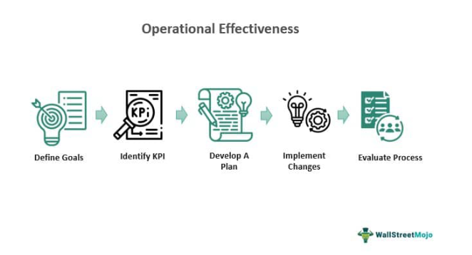

RTS Realtime Systems Group, now part of Bloomberg LP, has played a pivotal role in revolutionizing the technological framework of algorithmic trading. This specialized form of trading capitalizes on complex algorithms and the processing of high-speed data to make informed financial transactions. It has become essential in global markets, where rapid execution and precision are paramount.

Low latency trading is at the heart of RTS's impact, chiefly benefiting high-frequency traders (HFTs). This form of trading relies on executing a large number of orders at extremely high speeds, often milliseconds or even microseconds. The reduced latency provided by RTS’s systems allows traders to capitalize on minuscule price discrepancies across markets, a process crucial for strategies like statistical arbitrage. This capability can provide traders with a significant edge, allowing them to execute transactions faster than their competitors, thus maximizing profitability.

RTS's real-time trading solutions extend to a global clientele, encompassing banks, exchanges, and proprietary trading firms. These clients demand robust and reliable infrastructure to facilitate large volumes of trade at lightning speeds. By providing comprehensive software and connectivity solutions, RTS enables seamless trading across diverse asset classes and global markets.

The trend towards algorithmic trading is accelerating as financial organizations seek to enhance efficiency and mitigate the risks associated with human error. Advanced techniques and technologies, such as machine learning and predictive analytics, are also being integrated into trading systems, further underlining the importance of companies like RTS in the financial sector. The ability to quickly analyze vast data sets and execute trades in real-time remains crucial in maintaining competitive advantage.

RTS Realtime Systems Group has distinguished itself with its reputation and presence in major financial centers, thus facilitating better market accessibility for its clients. Its strategic establishment in these hubs underscores its commitment to delivering high-quality trading solutions tailored to the needs of different market participants.

The merging of RTS's technological expertise with Bloomberg's vast informational resources promises continued innovation in algorithmic trading solutions, underscoring the sustained relevance and influence of RTS in the ever-evolving financial landscape.

## Table of Contents

## RTS Realtime Systems Group: A Global Trading Solutions Provider

RTS Realtime Systems Group, established in 1992, has grown into a significant player in the landscape of electronic trading solutions. Founded to address the emerging needs of the [algorithmic trading](/wiki/algorithmic-trading) community, RTS has built a comprehensive suite of offerings that cater to a diverse range of financial entities, including exchanges, banks, and proprietary trading firms. Over the years, the company has solidified its reputation for providing robust, efficient, and state-of-the-art trading technologies.

The electronic trading software solutions from RTS are vast and varied, catering to the intricate needs of the modern financial sphere. Key among these solutions is the RTD Realtime Trading Desktop, a platform designed to map intricate trading strategies onto a user-friendly interface, thereby empowering traders to execute their strategies with precision. Additionally, RTS developed RTD Tango, an automated trading platform renowned for its adaptability and comprehensive suite of features. These offerings underline RTS's commitment to providing solutions that enhance trading accuracy and efficiency.

RTS's strategic acquisition, notably of First Futures Software Engineering Pvt. Ltd., played a pivotal role in expanding its operational capabilities and presence. This acquisition not only broadened RTS's technological prowess but also strengthened its foothold in the fast-evolving global markets. By integrating First Futures' software and expertise, RTS enhanced its ability to deliver enhanced trading solutions tailored to dynamic market demands.

The integration of RTS with Bloomberg LP in 2014 was a defining moment in its evolution. This acquisition allowed RTS to amplify its impact by leveraging Bloomberg's vast resources and technological expertise. Post-acquisition, RTS's technologies were seamlessly integrated into Bloomberg's suite of trading platforms, enhancing the reach and efficiency of traders worldwide. This integration signifies the synergistic potential between a global financial data powerhouse and a specialty trading solutions provider, resulting in enriched service offerings across both entities.

RTS's client base spans critical pillars of the financial ecosystem. By delivering solutions to exchanges, banks, and proprietary trading firms, RTS has positioned itself as an integral enabler of financial transactions globally. Its technology supports a broad spectrum of market participants, offering tools that are both cost-effective and performance-driven. This capability not only underscores the company's expertise but also its unwavering commitment to supporting the advancement of global financial markets.

In conclusion, RTS Realtime Systems Group's trajectory since its inception in 1992 represents a story of innovation, strategic growth, and adaptive integration with global leaders like Bloomberg. Through its comprehensive suite of solutions and strategic acquisitions, RTS has cemented its place as a global provider of trading technologies, serving a diverse and demanding clientele.

## Innovative Trading Solutions by RTS

RTS Realtime Systems Group has established itself as a leader in electronic trading software, offering a suite of innovative products tailored to meet the demanding needs of modern traders. Among its core offerings are the RTD Realtime Trading Desktop and RTD Tango, both of which are instrumental in facilitating automated trading. The RTD Realtime Trading Desktop serves as a comprehensive platform for real-time market analysis and trading execution. It integrates seamlessly with various trading environments, allowing traders to efficiently manage their portfolios and make informed decisions swiftly.

RTD Tango, on the other hand, is specifically designed for automated trading, providing a robust framework for developing, testing, and deploying trading algorithms. With its emphasis on automation and flexibility, RTD Tango enables traders to leverage algorithmic strategies across multiple asset classes, including equities, futures, and [forex](/wiki/forex-system). This flexibility ensures that traders can adapt to changing market conditions and optimize their trading performance.

In addition to these core products, RTS offers advanced tools such as RTD CORE, RTD Tango Backtester, and RTD GUARD. RTD CORE acts as a centralized system for risk management and execution, supporting traders in managing orders and monitoring risk in real time. The RTD Tango Backtester enhances strategy development by allowing users to test their trading algorithms against historical data, thus ensuring that strategies are robust before deploying them in live markets. Meanwhile, RTD GUARD focuses on providing security and protective measures, safeguarding trading operations from unexpected market fluctuations and technical disruptions.

RTS's solutions are designed to support multiple asset classes and ensure connectivity to global markets, facilitating seamless integration with major financial exchanges worldwide. This global connectivity is crucial for traders looking to access diverse market opportunities and optimize their trading strategies across different geographical locations.

A key advantage of RTS's offerings is their role in reducing costs and increasing efficiency for traders. By automating trading processes and offering real-time risk management solutions, RTS helps traders minimize manual intervention and operational errors, leading to significant cost savings. Furthermore, the company's focus on market connectivity and ultra-fast trading capabilities ensures that traders can capitalize on the slightest market movements, which is especially beneficial in high-frequency trading environments.

Overall, RTS Realtime Systems Group's innovative trading solutions emphasize market connectivity, real-time risk management, and automated trading capabilities, empowering traders to navigate complex financial markets effectively and efficiently.

## Real-Time Algorithmic Trading with Low Latency

Algorithmic trading refers to the use of complex algorithms and software to make trading decisions at speeds and frequencies that a human trader cannot match. This methodology relies on mathematical models and formulas to execute orders based on predetermined criteria, enabling trades to be conducted with precision and efficiency. The increasing prominence of algorithmic trading in financial markets is driven by its ability to process vast amounts of data quickly, reducing transaction costs and mitigating the impact of human emotions on trading decisions.

Low latency trading is a crucial element within high-frequency trading ([HFT](/wiki/high-frequency-trading-strategies)) environments, where the difference between profit and loss can be determined by milliseconds. Low latency refers to the minimal delay between the sending of an order and the execution of a trade. This speed advantage allows traders to capitalize on brief price fluctuations, providing a significant edge in competitive markets.

The partnership between RTS Realtime Systems Group and PhillipCapital illustrates the capabilities of RTS in delivering low latency trading solutions. This collaboration enhances the ability of traders to access markets swiftly and execute trades efficiently, thereby maximizing profitability. Through this partnership, RTS demonstrates its expertise in reducing latency and improving market connectivity, which is essential for successful high-frequency trading.

RTS technology supports a variety of strategies, including [arbitrage](/wiki/arbitrage) and statistical trading. Arbitrage involves exploiting price differences between markets or related instruments, while statistical trading uses quantitative models to identify trading opportunities. These strategies require rapid data analysis and order execution, which are supported by RTS's robust infrastructure.

The technological infrastructure of RTS is designed to provide high-speed trading solutions. This includes state-of-the-art data centers, advanced trading platforms, and sophisticated software tools. The company's platforms, such as RTD Realtime Trading Desktop and RTD Tango, are equipped to handle multiple asset classes and connect to global markets. RTS's continuous focus on innovation and technology ensures that its clients remain competitive by offering access to ultra-fast trading and comprehensive risk management solutions.

## The Global Reach and Impact of RTS

RTS Realtime Systems Group has established a significant presence in global financial markets, operating offices in key financial hubs such as Frankfurt, London, New York, Singapore, and Tokyo. This strategic placement allows RTS to cater to a broad clientele, providing real-time trading solutions and maintaining proximity to major financial exchanges. This international footprint has been essential in delivering consistent service and support to its global clients, minimizing latency and ensuring rapid execution of trades.

A critical [factor](/wiki/factor-investing) in RTS's global success is its establishment of data centers worldwide. These data centers play a pivotal role in reducing latency, which is crucial for high-frequency trading. By positioning its infrastructure close to major exchanges, RTS ensures that its trading platforms and solutions can execute trades at unparalleled speeds. For instance, its data centers are known for their high-speed connectivity, robustness, and reliability, which collectively contribute to superior trading performance.

One notable example of RTS's strategic data center deployment is in the Middle East, particularly with its Dubai data center. This center underscores RTS's commitment to expanding its services in emerging markets and illustrates its adaptability to the diverse needs of different regions. The Dubai data center serves as a gateway to the Middle East markets, a region that has been rapidly modernizing its financial systems, thus opening new opportunities for algorithmic trading.

RTS's extensive global infrastructure is key to its competitive edge. The company leverages this infrastructure to offer seamless market connectivity, allowing its clients to access multiple asset classes and trade across different markets efficiently. RTS's global network ensures that clients benefit from reduced transaction costs and improved execution speeds, providing them with a significant advantage in the competitive world of algorithmic trading.

The collaboration of RTS with top exchange platforms further amplifies its benefits to clients. By partnering with leading exchanges, RTS enhances its market connectivity and [liquidity](/wiki/liquidity-risk-premium) offerings, thereby providing its clients with access to a vast pool of trading opportunities. These partnerships enable clients to execute complex trading strategies by leveraging advanced technologies designed for speed and scalability. This results in optimized trading performance, heightened competitiveness, and expanded market reach for RTS's clientele. 

In summary, RTS Realtime Systems Group's strategic global presence, robust data center infrastructure, and collaborations with major exchanges cement its status as a leader in providing cutting-edge trading solutions. These elements collectively empower its clients to excel in the fast-paced world of algorithmic trading.

## Conclusion

RTS Realtime Systems Group has played a pivotal role in transforming the algorithmic trading landscape, influencing market dynamics through pioneering technological advancements. By consistently delivering robust trading solutions, RTS has reaffirmed its position as a leader in providing cutting-edge trading technologies. These solutions have driven the evolution of the trading industry, promoting efficiency and optimizing performance in algorithmic trading environments.

Under Bloomberg LP's stewardship, RTS is poised for a promising future. Integrating within Bloomberg's comprehensive suite of financial services can offer RTS an enhanced strategic platform to grow its offerings and expand its market reach. This acquisition presents opportunities for RTS to leverage Bloomberg's resources, expertise, and infrastructure, promising continued innovation and refined technological solutions tailored to the evolving needs of the financial sector.

The ongoing advancements in algorithmic trading underscore the need for agile, sophisticated technologies that can adapt to rapid market changes. RTS is committed to remaining at the forefront of these developments, continually refining its products to support the complex strategies employed by modern traders. As algorithmic trading strategies become more intricate, RTS’s dedication to innovation ensures it remains integral to the future of trading technologies.

Companies like RTS are indispensable in the ever-evolving financial sector, providing the necessary tools and technology to navigate increasingly complex market systems. Their commitment to innovation and excellence shapes the fabric of global trading, setting standards, and driving the industry forward. As markets and technologies advance, the continuous contribution of firms like RTS is vital for fostering growth, stability, and efficiency in the financial marketplace.

## References & Further Reading

[1]: ["Advances in Financial Machine Learning"](https://www.amazon.com/Advances-Financial-Machine-Learning-Marcos/dp/1119482089) by Marcos Lopez de Prado

[2]: ["Machine Learning for Algorithmic Trading"](https://www.amazon.com/Machine-Learning-Algorithmic-Trading-alternative/dp/1839217715) by Stefan Jansen

[3]: ["Quantitative Trading: How to Build Your Own Algorithmic Trading Business"](https://github.com/LucindaYa/quant-resources/blob/master/Quantitative%20Trading%20How%20to%20Build%20Your%20Own%20Algorithmic%20Trading%20Business.pdf) by Ernest P. Chan

[4]: Wilde, Penny. ["Algorithmic and High-Frequency Trading."](https://www.amazon.com/Algorithmic-High-Frequency-Trading-Mathematics-Finance/dp/1107091144) New York: Cambridge University Press, 2012.

[5]: Gomber, P., Arndt, B., Lutat, M., & Uhle, T. ["High-Frequency Trading."](https://papers.ssrn.com/sol3/papers.cfm?abstract_id=1858626) Journal of Financial Markets.