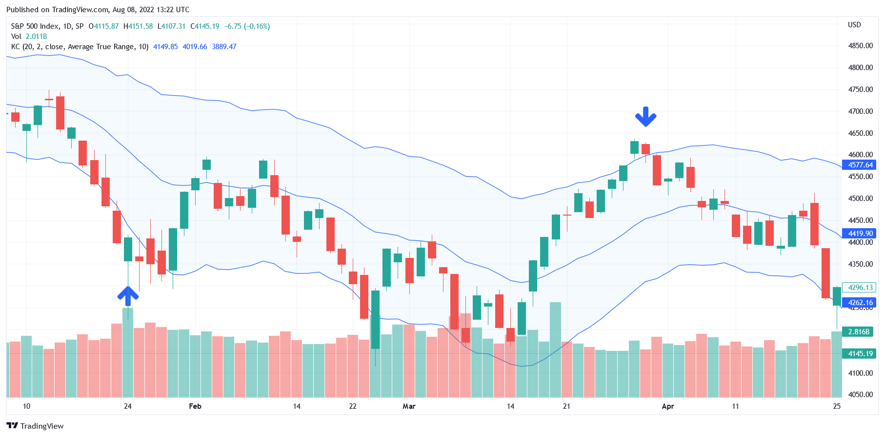

## Table of Contents

## What is the Rubber Band Trading Strategy?

The Rubber Band Trading Strategy is a way to trade stocks or other financial things by looking at how prices move up and down. It's called the "Rubber Band" because it's like when you stretch a rubber band and it snaps back. In trading, the idea is that when prices go too far away from their normal range, they will eventually come back to that range. Traders use this strategy to buy when prices are low and sell when prices are high, hoping to make money from the price moving back to normal.

To use the Rubber Band Trading Strategy, traders first find out what the normal price range is for the thing they are trading. They do this by looking at past prices over a certain time, like days, weeks, or months. Once they know the normal range, they watch the prices. If the price goes much lower than the normal range, they might buy, thinking it will go back up. If the price goes much higher than the normal range, they might sell, thinking it will go back down. This strategy needs careful watching and understanding of the market, but it can help traders make good choices about when to buy and sell.

## How does the Rubber Band Trading Strategy work?

The Rubber Band Trading Strategy works by watching how prices of stocks or other things go up and down. Traders think of prices like a rubber band. When you stretch a rubber band a lot, it wants to go back to its normal shape. In trading, if a price goes too far away from what's normal, traders think it will come back to that normal range. So, they look at past prices to see what the normal range is. If the price goes way lower than normal, traders might buy, hoping the price will go back up. If the price goes way higher than normal, they might sell, hoping the price will go back down.

To use this strategy, traders need to keep a close eye on the market. They watch the prices every day to see if they are moving outside the normal range. It's important to know the normal range well because that helps traders decide when to buy or sell. This strategy can help traders make money if they can guess right about when prices will snap back to normal. But it's not always easy, and traders need to be careful and patient.

## What are the key components of the Rubber Band Trading Strategy?

The Rubber Band Trading Strategy is all about watching how prices move and guessing when they will come back to normal. The main part of this strategy is figuring out what the normal price range is for the thing you are trading. Traders look at past prices over a certain time, like days or weeks, to see where prices usually are. Once they know this normal range, they can start watching the prices to see if they go too far away from it.

If the price goes much lower than the normal range, traders might decide to buy. They think the price will snap back up, just like a rubber band. On the other hand, if the price goes much higher than the normal range, traders might decide to sell. They think the price will snap back down. The key to this strategy is being patient and watching the market closely to make the right guesses about when prices will return to normal.

## What markets can the Rubber Band Trading Strategy be applied to?

The Rubber Band Trading Strategy can be used in many different markets. It works well in the stock market, where traders look at the prices of stocks to see if they are going too far from their normal range. It can also be used in the forex market, where people trade different currencies. In the forex market, traders watch how the value of one currency changes against another to find good times to buy or sell.

This strategy is also useful in the commodities market, where things like gold, oil, and wheat are traded. Traders can look at the prices of these commodities to see if they are moving outside their usual range. Even in the cryptocurrency market, where digital currencies like Bitcoin are traded, the Rubber Band Trading Strategy can be applied. Traders watch the prices of cryptocurrencies to find moments when they might snap back to normal, helping them decide when to buy or sell.

## What are the advantages of using the Rubber Band Trading Strategy?

The Rubber Band Trading Strategy has several benefits that make it attractive for traders. One big advantage is that it helps traders find good times to buy and sell. By watching how prices move away from their normal range, traders can guess when prices might snap back. This can lead to making money if the guesses are right. Another advantage is that this strategy can be used in many different markets, like stocks, forex, commodities, and even cryptocurrencies. This means traders can use the same idea in different places to make trading decisions.

Another benefit is that the Rubber Band Trading Strategy is easy to understand. It uses a simple idea that anyone can grasp: prices that go too far from normal will likely come back. This makes it a good choice for both new and experienced traders. However, it's important to remember that while the strategy is simple, it still needs careful watching and patience. Traders need to keep a close eye on the market to make the best use of this strategy.

## What are the potential risks and limitations of the Rubber Band Trading Strategy?

The Rubber Band Trading Strategy can have some risks and limits that traders need to know about. One big risk is that prices don't always snap back to normal like a rubber band. Sometimes, prices can keep going up or down and never come back to the range traders expect. This can lead to losing money if traders buy or sell at the wrong time. Another risk is that markets can be unpredictable. Things like news, events, or changes in the economy can make prices move in ways that are hard to guess. This means traders might make wrong guesses about when prices will return to normal.

There are also some limits to this strategy. It needs a lot of watching and patience. Traders have to keep a close eye on the market all the time to see when prices move outside their normal range. This can be tiring and take a lot of time. Also, the strategy works best when there is a clear normal range for prices. If the market is too wild or if prices don't have a clear pattern, it can be hard to use this strategy well. Traders need to be ready to change their plans if the market doesn't act like they expect.

## How can a beginner start using the Rubber Band Trading Strategy?

To start using the Rubber Band Trading Strategy, a beginner should first learn about the normal price range of the thing they want to trade. This means looking at past prices over a certain time, like days or weeks, to see where prices usually are. Once they know this normal range, they can start watching the prices every day to see if they go too far away from it. If the price goes much lower than normal, a beginner might decide to buy, thinking the price will snap back up. If the price goes much higher than normal, they might decide to sell, thinking the price will snap back down.

It's important for a beginner to be patient and keep a close eye on the market. They need to be ready to wait for the right time to buy or sell. This strategy can be used in many markets, like stocks, forex, or cryptocurrencies, so beginners can start with whatever they feel comfortable with. But they should remember that prices don't always snap back like a rubber band, and the market can be unpredictable. So, they need to be ready to change their plans if things don't go as expected.

## What technical indicators are commonly used with the Rubber Band Trading Strategy?

When using the Rubber Band Trading Strategy, traders often use technical indicators to help them see when prices might snap back to normal. One common indicator is the Bollinger Bands. These bands show the normal range of prices by drawing lines above and below the average price. When the price goes outside these bands, it might be a sign that the price will come back to the middle. Another useful indicator is the Relative Strength Index (RSI). The RSI helps traders see if a thing is being bought or sold too much. If the RSI is too high, it might mean the price will go down soon. If it's too low, it might mean the price will go up.

Another indicator that traders use with the Rubber Band Trading Strategy is the Moving Average Convergence Divergence (MACD). The MACD helps traders see when the price trend might change. It does this by showing the difference between two moving averages. When the MACD line crosses above or below a signal line, it can be a sign that the price might snap back. These indicators help traders make better guesses about when to buy or sell. But remember, no indicator is perfect, and traders need to use them carefully with the Rubber Band Strategy.

## How do you set up entry and exit points in the Rubber Band Trading Strategy?

To set up entry points in the Rubber Band Trading Strategy, you need to watch the prices and see when they move outside their normal range. If the price goes much lower than normal, that might be a good time to buy. You think the price will snap back up like a rubber band. To find this, you look at the price charts and use indicators like Bollinger Bands or the Relative Strength Index (RSI). When the price goes below the lower Bollinger Band or the RSI shows the price is oversold, you might decide it's time to buy. But remember, you need to be patient and make sure the price is really far from normal before you buy.

For exit points, you watch for the opposite. If the price goes much higher than normal, that might be a good time to sell. You think the price will snap back down. Again, you use indicators to help you decide. When the price goes above the upper Bollinger Band or the RSI shows the price is overbought, you might decide it's time to sell. It's important to keep watching the market even after you buy or sell. You might need to change your plans if the price doesn't come back to normal like you expect. The key is to be ready to act when the price moves far from its normal range, but also be ready to wait and watch.

## Can the Rubber Band Trading Strategy be automated, and if so, how?

Yes, the Rubber Band Trading Strategy can be automated using computer programs that watch prices and make trades for you. To do this, you need to use software that can look at price charts and use technical indicators like Bollinger Bands or the Relative Strength Index (RSI). The program would be set up to buy when the price goes much lower than normal and to sell when the price goes much higher than normal. This means you need to tell the computer what counts as "much lower" or "much higher" by setting rules based on the indicators you use.

Automating the Rubber Band Trading Strategy can save you time because the computer does the watching and trading for you. But you still need to check on the program now and then to make sure it's working right. Markets can change, and what worked before might not work the same way later. So, you might need to change the rules you set for the computer or even turn off the automation if things aren't going as planned. Remember, while automation can help, it's not perfect, and you should always keep an eye on what's happening.

## What are some real-world examples of the Rubber Band Trading Strategy in action?

Imagine a trader named Sarah who uses the Rubber Band Trading Strategy to trade stocks. Sarah looks at the price of a company's stock over the last few months and sees that it usually stays between $50 and $60. One day, the stock price drops to $45, which is much lower than its normal range. Sarah thinks the price will snap back up, so she buys the stock. A few days later, the price goes back up to $55, and Sarah sells her stock, making a profit. This is how the Rubber Band Trading Strategy worked for Sarah.

Another example is John, who trades in the forex market. He watches the exchange rate between the US dollar and the Euro. Usually, the rate stays around 1.10 to 1.20. One week, the rate drops to 1.05, which is much lower than normal. John thinks the rate will snap back up, so he buys Euros with his US dollars. A few days later, the rate goes back up to 1.15, and John sells his Euros, making a profit. This shows how John used the Rubber Band Trading Strategy in the forex market.

## How can an expert refine and optimize the Rubber Band Trading Strategy for better performance?

An expert can refine and optimize the Rubber Band Trading Strategy by using more detailed data and better technical indicators. They might look at more than just the past prices, like trading volumes or other market trends, to get a clearer picture of what's normal. They could also use more advanced indicators, like custom-made Bollinger Bands or a mix of different indicators, to make better guesses about when prices will snap back. By doing this, they can find the best times to buy and sell, making their trades more successful.

Another way experts can improve the strategy is by using automation and backtesting. They can set up computer programs to watch the market and make trades based on the Rubber Band Strategy. These programs can be fine-tuned to look for the right signals and make trades faster than a person could. Experts can also test their strategy on past data to see how well it would have worked before. This helps them see what works and what doesn't, so they can make their strategy even better. By using these methods, experts can get the most out of the Rubber Band Trading Strategy.

## What is the Rubber Band Strategy and how can it be understood?

The Rubber Band trading strategy leverages periods of exaggerated price movements, aiming to profit from the inevitable corrections that follow. Central to this approach is the identification of overbought and oversold conditions within a market, which can be effectively pinpointed using technical analysis tools such as Keltner Channels and Bollinger Bands.

Keltner Channels are constructed around a moving average with upper and lower bands set by the Average True Range (ATR). These bands expand and contract based on market volatility. When a price breaks through the Keltner Channels' upper or lower limits, it signals potential overbought or oversold conditions, suggesting a likely reversal to mean levels.

Bollinger Bands function similarly by using a moving average with bands calculated based on standard deviations of the price. As prices move towards the upper band, they indicate an overbought condition; conversely, movement towards the lower band signifies an oversold condition.

The Rubber Band strategy adopts a contrarian stance, predicated on the statistical notion that prices will revert to their mean after significant deviations. This can be expressed mathematically by recognizing that most price movements exhibit mean-reversion properties, often reverting to their average value over time. This concept is mathematically expressed as:

$$

P_t = \mu + \theta (P_{t-1} - \mu) + \epsilon_t 
$$

where $P_t$ is the price at time $t$, $\mu$ is the long-term mean price, $\theta$ represents the speed of reversion, and $\epsilon_t$ is a random error term.

Traders deploying this strategy benefit by recognizing these temporary anomalies as opportunities to enter trades anticipating a return to average price levels. Python can be employed to automate the identification process or to simulate the historical effectiveness of the strategy. Below is a sample Python snippet using pandas and numpy libraries to identify signals based on Bollinger Bands:

```python
import numpy as np
import pandas as pd

def compute_bollinger_bands(data, window=20, num_std_dev=2):
    rolling_mean = data['Close'].rolling(window=window).mean()
    rolling_std = data['Close'].rolling(window=window).std()
    upper_band = rolling_mean + (rolling_std * num_std_dev)
    lower_band = rolling_mean - (rolling_std * num_std_dev)
    return upper_band, lower_band

# Assume 'df' is a pandas DataFrame with historical price data
df['Upper_Band'], df['Lower_Band'] = compute_bollinger_bands(df)
df['Buy_Signal'] = (df['Close'] < df['Lower_Band'])
df['Sell_Signal'] = (df['Close'] > df['Upper_Band'])
```

This Python example calculates the Bollinger Bands and identifies buy signals when the price dips below the lower band, and sell signals when the price exceeds the upper band. This strategic use of band indicators facilitates timely trades that capitalize on market corrections, further reinforcing the Rubber Band strategy's aim to exploit price extremes.

## References & Further Reading

[1]: Bergstra, J., Bardenet, R., Bengio, Y., & Kégl, B. (2011). ["Algorithms for Hyper-Parameter Optimization."](https://papers.nips.cc/paper/4443-algorithms-for-hyper-parameter-optimization) Advances in Neural Information Processing Systems 24.

[2]: ["Advances in Financial Machine Learning"](https://www.amazon.com/Advances-Financial-Machine-Learning-Marcos/dp/1119482089) by Marcos Lopez de Prado

[3]: ["Evidence-Based Technical Analysis: Applying the Scientific Method and Statistical Inference to Trading Signals"](https://www.amazon.com/Evidence-Based-Technical-Analysis-Scientific-Statistical/dp/0470008741) by David Aronson

[4]: ["Machine Learning for Algorithmic Trading"](https://github.com/stefan-jansen/machine-learning-for-trading) by Stefan Jansen

[5]: ["Quantitative Trading: How to Build Your Own Algorithmic Trading Business"](https://books.google.com/books/about/Quantitative_Trading.html?id=j70yEAAAQBAJ) by Ernest P. Chan