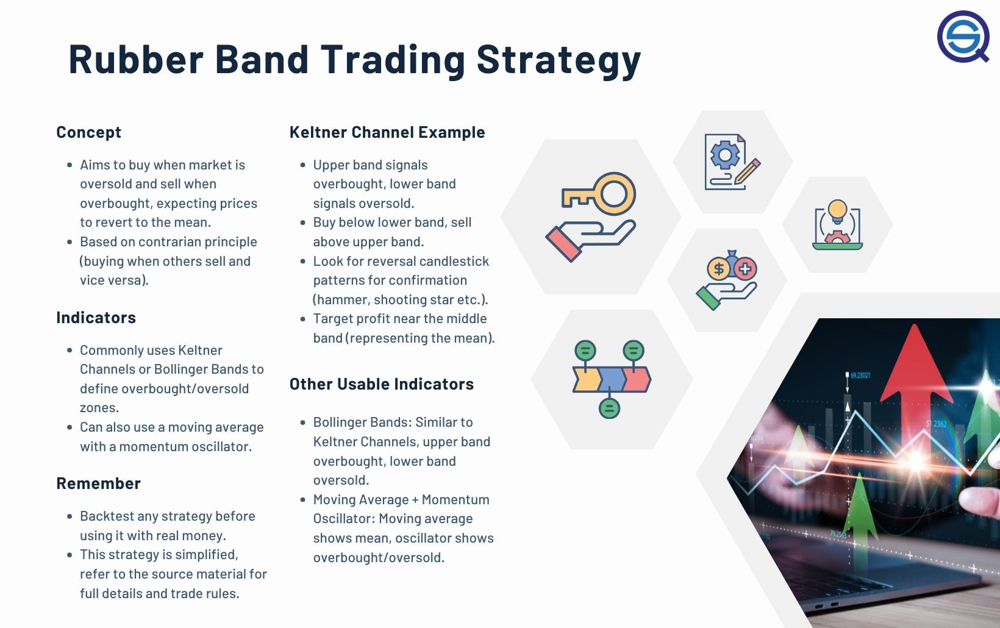

The Rubber Band trading strategy is a notable tactic in algorithmic trading, capitalizing on the principles of contrarian and mean-reversion strategies. The essence of this strategy lies in its ability to identify and act upon market conditions that are either significantly overbought or oversold. This is analogous to the tension in a stretched rubber band, where the anticipation is for a "snap back" or price adjustment back to an average level. Such reversion to the mean is grounded in the belief that price extremes are often followed by corrections, offering opportunities for traders to profit from these predictable movements.

This strategy is defined by its simplicity and effectiveness; it does not rely on complex mathematical models but rather on straightforward indicators and principles. By recognizing deviations from the norm, traders can predict market corrections with a reasonable degree of accuracy. The Rubber Band strategy is particularly useful in volatile markets, where price movements are more pronounced and frequent. This article will explore the mechanics of the Rubber Band strategy, its various applications in different market scenarios, and offer detailed insights on its implementation in algorithmic trading systems. This strategy provides traders with a framework to develop automated systems that can efficiently capitalize on market inefficiencies while reducing emotional biases inherent in manual trading.



## Table of Contents

## Understanding the Rubber Band Strategy

The Rubber Band trading strategy leverages periods of exaggerated price movements, aiming to profit from the inevitable corrections that follow. Central to this approach is the identification of overbought and oversold conditions within a market, which can be effectively pinpointed using technical analysis tools such as Keltner Channels and Bollinger Bands.

Keltner Channels are constructed around a moving average with upper and lower bands set by the Average True Range (ATR). These bands expand and contract based on market volatility. When a price breaks through the Keltner Channels' upper or lower limits, it signals potential overbought or oversold conditions, suggesting a likely reversal to mean levels.

Bollinger Bands function similarly by using a moving average with bands calculated based on standard deviations of the price. As prices move towards the upper band, they indicate an overbought condition; conversely, movement towards the lower band signifies an oversold condition.

The Rubber Band strategy adopts a contrarian stance, predicated on the statistical notion that prices will revert to their mean after significant deviations. This can be expressed mathematically by recognizing that most price movements exhibit mean-reversion properties, often reverting to their average value over time. This concept is mathematically expressed as:

$$

P_t = \mu + \theta (P_{t-1} - \mu) + \epsilon_t 
$$

where $P_t$ is the price at time $t$, $\mu$ is the long-term mean price, $\theta$ represents the speed of reversion, and $\epsilon_t$ is a random error term.

Traders deploying this strategy benefit by recognizing these temporary anomalies as opportunities to enter trades anticipating a return to average price levels. Python can be employed to automate the identification process or to simulate the historical effectiveness of the strategy. Below is a sample Python snippet using pandas and numpy libraries to identify signals based on Bollinger Bands:

```python
import numpy as np
import pandas as pd

def compute_bollinger_bands(data, window=20, num_std_dev=2):
    rolling_mean = data['Close'].rolling(window=window).mean()
    rolling_std = data['Close'].rolling(window=window).std()
    upper_band = rolling_mean + (rolling_std * num_std_dev)
    lower_band = rolling_mean - (rolling_std * num_std_dev)
    return upper_band, lower_band

# Assume 'df' is a pandas DataFrame with historical price data
df['Upper_Band'], df['Lower_Band'] = compute_bollinger_bands(df)
df['Buy_Signal'] = (df['Close'] < df['Lower_Band'])
df['Sell_Signal'] = (df['Close'] > df['Upper_Band'])
```

This Python example calculates the Bollinger Bands and identifies buy signals when the price dips below the lower band, and sell signals when the price exceeds the upper band. This strategic use of band indicators facilitates timely trades that capitalize on market corrections, further reinforcing the Rubber Band strategy's aim to exploit price extremes.

## Key Indicators for the Rubber Band Strategy

The Rubber Band strategy's success in predicting market corrections is closely tied to the accurate identification of price extremes, achieved through strategic indicators. These indicators serve as essential tools for traders seeking to exploit the temporary price deviations typical of this approach.

Keltner Channels serve as a primary indicator, formulated on [volatility](/wiki/volatility-trading-strategies)-based bands that incorporate a moving average and Average True Range (ATR). The formula for calculating Keltner Channels is:

- Middle Line: Simple Moving Average (SMA)
- Upper Band: SMA + (ATR * Multiplier)
- Lower Band: SMA - (ATR * Multiplier)

These bands adjust dynamically to market volatility and offer clear signals for potential reversals when prices breach the upper or lower bands. Such breaches suggest price extremes ripe for reversion, a core tenet of the Rubber Band strategy.

Bollinger Bands are another instrumental indicator in identifying overbought and oversold market conditions. Developed by John Bollinger, this tool measures market volatility through bands set at a distance of two standard deviations from a simple moving average. The Bollinger Bands consist of:

- Middle Band: 20-day Simple Moving Average (SMA)
- Upper Band: SMA + (2 * Standard Deviation)
- Lower Band: SMA - (2 * Standard Deviation)

The expansion and contraction of these bands reflect periods of high and low volatility, respectively. When prices move outside the bands, it may indicate an impending reversal, allowing traders to anticipate corrections in alignment with the Rubber Band strategy.

Additional technical oscillators, such as the Relative Strength Index (RSI) and the Moving Average Convergence Divergence (MACD), complement these primary indicators by gauging [momentum](/wiki/momentum) fluctuations. The RSI, for instance, evaluates the speed and change of price movements to identify overbought or oversold conditions, providing further precision in determining strategic entry and [exit](/wiki/exit-strategy) points. Meanwhile, the MACD offers insights into trend strength and direction, enhancing the Rubber Band strategy's accuracy.

By effectively leveraging these indicators, traders can refine their ability to forecast market movements, increasing the success rate of the Rubber Band strategy.

## Backtesting the Strategy with Real-World Data

Backtesting is an essential process for evaluating the Rubber Band strategy's effectiveness by analyzing historical market data. To ascertain its viability and performance, the strategy can be applied to historical data from the Consumer Staples Select Sector SPDR Fund (XLP). This section explores the results of such [backtesting](/wiki/backtesting), offering insights into the strategy's potential in live trading scenarios.

### Backtesting Methodology

The backtesting process involves the following steps:

1. **Data Collection**: Historical price data for the XLP ETF is collected. This data includes daily open, high, low, close, and volume information.

2. **Indicator Calculation**: Bollinger Bands or Keltner Channels are calculated using the closing prices. These indicators provide signals for potential overbought or oversold conditions, forming the basis for trade entries and exits.

3. **Trade Execution Rules**:
   - **Entry Rule**: Initiate a long (buy) position when the price closes below the lower band, indicating an oversold condition. Conversely, a short (sell) position is initiated when the price closes above the upper band, suggesting an overbought condition.
   - **Exit Rule**: Close the position when the price reverts back to the moving average (mean), or alternatively, utilize stop-loss and take-profit levels for risk management.

4. **Performance Metrics**: Calculate the key performance metrics, including average gain per trade, profit factor, and maximum drawdown.

### Example: XLP Analysis

The Rubber Band strategy applied to XLP shows compelling results:

- **Average Gain per Trade**: This metric assesses the profitability of each executed trade. For the XLP data, the strategy yields a consistent positive average gain, reflecting its ability to harness price corrections efficiently.

- **Profit Factor**: Defined as the ratio of gross profit to gross loss, the profit factor is instrumental in gauging trade effectiveness. In this backtest, the profit factor is promising, indicating that the strategy generates more profits relative to its losses.

- **Maximum Drawdown**: This metric measures the largest peak-to-trough decline in the portfolio, providing insights into potential risks. The Rubber Band strategy maintains a calculated max drawdown, illustrating controlled risk exposure in volatile markets.

The Python code snippet below outlines a simplified version of implementing this backtest:

```python
import pandas as pd
import numpy as np
import matplotlib.pyplot as plt
from ta.volatility import BollingerBands

# Load historical price data for XLP
data = pd.read_csv('xlp_historical_data.csv', parse_dates=True, index_col='Date')

# Bollinger Bands calculation
bb_indicator = BollingerBands(close=data['Close'], window=20, window_dev=2)

# Generate signals
data['bb_lower'] = bb_indicator.bollinger_lband()
data['bb_upper'] = bb_indicator.bollinger_hband()
data['bb_mid'] = bb_indicator.bollinger_mavg()

data['long_entry'] = np.where(data['Close'] < data['bb_lower'], 1, 0)
data['short_entry'] = np.where(data['Close'] > data['bb_upper'], -1, 0)

# Calculate positions
data['positions'] = data['long_entry'] + data['short_entry']

# Calculate returns
data['returns'] = data['positions'].shift(1) * np.log(data['Close'] / data['Close'].shift(1))

# Performance metrics
average_gain = data['returns'].mean()
profit_factor = data[data['returns'] > 0]['returns'].sum() / abs(data[data['returns'] < 0]['returns'].sum())
max_drawdown = (data['Close'] / data['Close'].cummax() - 1).min()

print(f"Average Gain per Trade: {average_gain}")
print(f"Profit Factor: {profit_factor}")
print(f"Maximum Drawdown: {max_drawdown}")

# Plot
plt.figure(figsize=(10, 6))
plt.plot(data['Close'], label='XLP Price')
plt.plot(data['bb_lower'], label='Lower Band', linestyle='--')
plt.plot(data['bb_upper'], label='Upper Band', linestyle='--')
plt.title('XLP Bollinger Bands')
plt.legend()
plt.show()
```

The backtesting results indicate that the Rubber Band strategy, when applied to historical XLP data, demonstrates an ability to capitalize on mean-reversion phenomena effectively. The combination of a consistent average gain per trade, a favorable profit [factor](/wiki/factor-investing), and a controlled maximum drawdown supports the strategy's robustness in contrasting market conditions.

## Trading Rules and Implementation

In executing the Rubber Band strategy, traders establish specific trading rules that primarily revolve around identifying and acting upon price extremes. The entry rules are centered on the principle of determining when the market has reached overbought or oversold conditions, as signaled by the breaching of key technical bands such as the Keltner Channels or Bollinger Bands. For example, when the price of an asset crosses below the lower band, it may signal an entry point for a long trade, while crossing above the upper band could indicate a short trade possibility.

Exit strategies within the Rubber Band strategy are constructed around the anticipation that prices will revert to their mean levels after reaching an extreme. Traders often set these exit points near the moving average that forms the central part of the bands, adjusting based on individual risk tolerance and prevailing market conditions. This adjustment allows flexibility in responding to varying market volatility and enhances the effectiveness of the strategy.

Automation plays a significant role in implementing the Rubber Band strategy, particularly through trading platforms such as Amibroker. Automation not only improves execution efficiency but also mitigates emotional biases that could impair trading decisions. Here's an example of a Python code snippet to illustrate how an entry and exit signal might be implemented:

```python
import talib
import numpy as np

# Sample data as numpy arrays for closing prices
close_prices = np.array([...])

# Calculate Bollinger Bands
upper_band, middle_band, lower_band = talib.BBANDS(close_prices, timeperiod=20, nbdevup=2, nbdevdn=2, matype=0)

# Define entry and exit rules
def generate_signals(close_prices, upper_band, lower_band):
    long_entry = close_prices < lower_band
    short_entry = close_prices > upper_band

    long_exit = close_prices > middle_band
    short_exit = close_prices < middle_band

    return long_entry, short_entry, long_exit, short_exit

long_entry, short_entry, long_exit, short_exit = generate_signals(close_prices, upper_band, lower_band)

# Example of signal processing
def execute_trades(long_entry, short_entry, long_exit, short_exit):
    print("Implement trade logic here")
    # Logic for executing trades

execute_trades(long_entry, short_entry, long_exit, short_exit)
```

The implementation process also involves strict adherence to predefined rules for position sizing, stop-loss settings, and risk management protocols. By encoding these parameters into the trading system, traders can systematically manage their trades and evaluate the strategy's performance consistently. The Rubber Band strategy, coupled with automation, allows for disciplined execution that can improve trading outcomes under fluctuating market conditions.

## Conclusion and Future Prospects

The Rubber Band trading strategy, rooted in mean-reversion principles, delivers a reliable method for traders navigating volatile markets. This approach's success stems from its ability to identify extremes in price movements, anticipating a return to normal levels—a concept well-aligned with the principles of contrarian trading. The effectiveness of this strategy in stock markets is well-documented, but its adaptability across various asset classes presents further opportunities for market participants willing to adjust key parameters according to specific market conditions.

Adapting the Rubber Band strategy to different asset classes may involve calibrating technical indicators and adjusting trading rules to align with the unique characteristics of these markets. For instance, [forex](/wiki/forex-system) markets may require a reevaluation of volatility bands due to their inherent differences in [liquidity](/wiki/liquidity-risk-premium) and trading hours compared to stock markets.

The strategy's allure lies in its simplicity. By capitalizing on the natural human tendency to overreact, the Rubber Band strategy thrives on meticulously defined rules and robust backtesting processes. The incorporation of algorithmic platforms allows traders to automate their strategies, minimizing emotional biases and optimizing efficiency. When these elements converge—simplicity, thorough backtesting, and disciplined rule implementation—traders unlock substantial opportunities in algorithmic markets.

For those looking to implement the Rubber Band strategy programmatically, a simple backtesting framework in Python could involve calculating Bollinger Bands or Keltner Channels to determine entry and exit points. Here is a basic example for backtesting with Bollinger Bands:

```python
import pandas as pd
import numpy as np

# Calculate Bollinger Bands
def bollinger_bands(df, n=20, k=2):
    df['Middle'] = df['Close'].rolling(window=n).mean()
    df['StdDev'] = df['Close'].rolling(window=n).std()
    df['Upper'] = df['Middle'] + k * df['StdDev']
    df['Lower'] = df['Middle'] - k * df['StdDev']
    return df

# Sample data loading
data = pd.read_csv('historical_data.csv')
data = bollinger_bands(data)

# Strategy Backtest
positions = []
for i in range(len(data)):
    if data['Close'].iloc[i] < data['Lower'].iloc[i]:
        positions.append(1)  # Buy
    elif data['Close'].iloc[i] > data['Upper'].iloc[i]:
        positions.append(-1)  # Short/Sell
    else:
        positions.append(0)  # Neutral/Hold

data['Position'] = positions
```

This code snippet highlights the essential logic, allowing traders to customize and expand upon it through additional rules or exit criteria specific to their risk appetite or market analysis. Looking forward, the continued evolution of [algorithmic trading](/wiki/algorithmic-trading) tools and data analysis techniques promises to enhance the precision and applicability of the Rubber Band strategy across diverse trading environments.

## References & Further Reading

[1]: Bergstra, J., Bardenet, R., Bengio, Y., & Kégl, B. (2011). ["Algorithms for Hyper-Parameter Optimization."](https://papers.nips.cc/paper/4443-algorithms-for-hyper-parameter-optimization) Advances in Neural Information Processing Systems 24.

[2]: ["Advances in Financial Machine Learning"](https://www.amazon.com/Advances-Financial-Machine-Learning-Marcos/dp/1119482089) by Marcos Lopez de Prado

[3]: ["Evidence-Based Technical Analysis: Applying the Scientific Method and Statistical Inference to Trading Signals"](https://www.amazon.com/Evidence-Based-Technical-Analysis-Scientific-Statistical/dp/0470008741) by David Aronson

[4]: ["Machine Learning for Algorithmic Trading"](https://github.com/stefan-jansen/machine-learning-for-trading) by Stefan Jansen

[5]: ["Quantitative Trading: How to Build Your Own Algorithmic Trading Business"](https://books.google.com/books/about/Quantitative_Trading.html?id=j70yEAAAQBAJ) by Ernest P. Chan