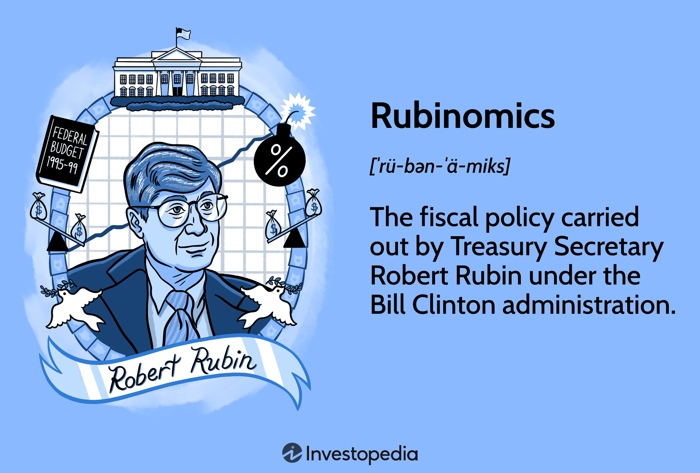

## Table of Contents

## What is Rubinomics?

Rubinomics refers to the economic policies implemented by Robert Rubin during his time as the U.S. Treasury Secretary in the 1990s. These policies focused on reducing the federal budget deficit and promoting economic growth through fiscal discipline. Rubin believed that by cutting the deficit, interest rates would decrease, which would encourage more spending and investment from businesses and consumers. This approach was seen as a way to create a stable and prosperous economy.

The impact of Rubinomics was significant during the Clinton administration. The federal budget deficit was successfully reduced, and the economy experienced a period of strong growth and low unemployment. Critics, however, argue that the focus on deficit reduction might have overlooked other important areas, such as income inequality and infrastructure investment. Despite the debate, Rubinomics is often credited with contributing to the economic boom of the late 1990s.

## Who is Robert Rubin and what is his connection to Rubinomics?

Robert Rubin is a former U.S. Treasury Secretary who served during President Bill Clinton's administration from 1995 to 1999. Before that, he worked at Goldman Sachs, a big investment bank, where he became co-chairman. Rubin is known for his economic ideas, which people call Rubinomics.

Rubinomics is the name given to the economic policies Robert Rubin helped create and support while he was Treasury Secretary. These policies focused on lowering the federal budget deficit. Rubin believed that by doing this, interest rates would go down, which would help businesses and people spend and invest more. This approach helped the economy grow a lot in the late 1990s.

## What are the key principles of Rubinomics?

The main idea behind Rubinomics is to keep the government's budget in check. Robert Rubin, who was the U.S. Treasury Secretary, thought that if the government spends less than it earns, it can lower the federal budget deficit. This means the government won't have to borrow as much money. When the deficit goes down, interest rates can also go down. Lower interest rates make it cheaper for people and businesses to borrow money, which can lead to more spending and investment.

This approach helped the economy grow a lot during the late 1990s. People had more money to spend, and businesses were more willing to invest. This led to more jobs and a stronger economy overall. However, some people think that focusing too much on the deficit might have ignored other important issues, like making sure everyone's income is fair and spending money on things like roads and schools. Even with these concerns, Rubinomics is often seen as a big reason why the economy did so well during that time.

## How does Rubinomics differ from other economic theories?

Rubinomics is different from other economic theories because it focuses a lot on lowering the federal budget deficit. Robert Rubin thought that if the government spent less than it earned, it would not need to borrow so much money. This would help lower interest rates, making it cheaper for people and businesses to borrow money. When borrowing is cheaper, people spend more, and businesses invest more, which can help the economy grow. This is different from other theories that might focus more on things like increasing government spending or cutting taxes to boost the economy.

Some economic theories, like Keynesian economics, believe that the government should spend more money, especially during tough economic times, to help the economy recover. They think that increasing government spending can create jobs and increase demand for goods and services. On the other hand, Rubinomics focuses on keeping the budget balanced and reducing the deficit, even during good times. This approach is more like what's called "fiscal conservatism," which aims to keep government spending under control to maintain economic stability. While Rubinomics helped the economy grow in the late 1990s, it has been criticized for not paying enough attention to issues like income inequality and the need for public investments in things like infrastructure.

## What were the main economic policies implemented during the Rubinomics era?

During the Rubinomics era, the main focus was on reducing the federal budget deficit. Robert Rubin, who was the U.S. Treasury Secretary, believed that if the government spent less than it earned, it would not need to borrow as much money. This would help lower interest rates, making it cheaper for people and businesses to borrow money. When borrowing is cheaper, people spend more, and businesses invest more, which can help the economy grow. To achieve this, the government worked on cutting spending and increasing taxes. These efforts helped to bring down the deficit and set the stage for economic growth.

Another important policy during the Rubinomics era was maintaining a strong and stable dollar. A stable dollar helps keep inflation low and makes the U.S. economy more attractive to foreign investors. This stability was seen as key to encouraging more investment and spending. Overall, these policies helped the economy grow a lot during the late 1990s. People had more money to spend, and businesses were more willing to invest. This led to more jobs and a stronger economy overall.

## What impact did Rubinomics have on the U.S. economy during the 1990s?

Rubinomics had a big impact on the U.S. economy during the 1990s. It focused on reducing the federal budget deficit, which meant the government spent less than it earned. By doing this, interest rates went down, making it cheaper for people and businesses to borrow money. When borrowing was cheaper, people spent more and businesses invested more. This led to a lot of economic growth. The economy grew so much that it created a lot of jobs, and unemployment went down.

Another important part of Rubinomics was keeping the dollar strong and stable. A stable dollar helped keep inflation low and made the U.S. economy attractive to foreign investors. This stability encouraged more investment and spending. Overall, Rubinomics helped make the 1990s a time of strong economic growth and low unemployment. However, some people thought that focusing too much on the deficit might have ignored other important issues, like making sure everyone's income was fair and spending money on things like roads and schools.

## How did Rubinomics influence fiscal policy?

Rubinomics had a big impact on fiscal policy by focusing on reducing the federal budget deficit. Robert Rubin thought that if the government spent less than it earned, it would not need to borrow as much money. This would help lower interest rates, making it cheaper for people and businesses to borrow money. When borrowing is cheaper, people spend more, and businesses invest more. This helped the economy grow a lot in the 1990s. The government worked on cutting spending and increasing taxes to bring down the deficit. This approach to fiscal policy helped create a period of strong economic growth and low unemployment.

Another important part of Rubinomics was keeping the dollar strong and stable. A stable dollar helped keep inflation low and made the U.S. economy more attractive to foreign investors. This stability encouraged more investment and spending. By focusing on these fiscal policies, Rubinomics helped make the 1990s a time of economic prosperity. However, some people thought that focusing too much on the deficit might have ignored other important issues, like making sure everyone's income was fair and spending money on things like roads and schools.

## What role did Rubinomics play in global economic stability?

Rubinomics helped make the world economy more stable by focusing on keeping the U.S. economy strong. Robert Rubin thought that if the U.S. government spent less than it earned, it would not need to borrow as much money. This would help lower interest rates, making it cheaper for people and businesses to borrow money. When borrowing was cheaper, people spent more and businesses invested more. This helped the U.S. economy grow a lot in the 1990s, and a strong U.S. economy can help keep the whole world's economy stable. Other countries saw the U.S. doing well and felt more confident about their own economies.

Another way Rubinomics helped global economic stability was by keeping the dollar strong and stable. A stable dollar helped keep inflation low, not just in the U.S. but around the world. When the dollar is stable, it makes the U.S. economy attractive to foreign investors. This encouraged more investment and spending from other countries, which helped keep the global economy stable. Overall, Rubinomics played a big role in making the world's economy more stable by helping the U.S. economy grow and stay strong.

## What criticisms have been leveled against Rubinomics?

Some people didn't like Rubinomics because they thought it focused too much on cutting the federal budget deficit. They said that by trying to spend less money, the government might not have enough to help people who needed it. For example, some people thought that Rubinomics didn't do enough to make sure everyone's income was fair. They worried that rich people were getting richer while others were not getting help. Also, some said that Rubinomics didn't spend enough money on important things like roads and schools, which could help everyone in the long run.

Others criticized Rubinomics for not thinking about the future enough. They said that while it helped the economy grow in the 1990s, it might have caused problems later on. For instance, some people think that by focusing so much on the deficit, Rubinomics might have made it harder to deal with big problems like the financial crisis that happened in 2008. Critics also said that Rubinomics didn't do enough to prepare for future economic challenges, like making sure there were good jobs for everyone and that the economy was strong enough to handle big changes.

## How has the legacy of Rubinomics influenced subsequent economic policies?

The legacy of Rubinomics has had a big impact on the way governments think about money and spending. After Rubinomics helped the U.S. economy grow in the 1990s, many leaders started to focus more on keeping the budget in check. They saw how cutting the deficit could help lower interest rates, making it easier for people and businesses to borrow money. This idea became popular, and many governments around the world tried to follow a similar approach. They worked on spending less than they earned and tried to keep their economies stable by keeping their currencies strong.

However, the focus on the budget deficit also led to some challenges. Some people thought that governments were too worried about the deficit and not enough about helping everyone. This led to debates about how to balance the need for a strong economy with the need to help people who were struggling. In the years after Rubinomics, leaders had to think about these issues as they made their own economic plans. They tried to learn from Rubinomics but also wanted to address the criticisms, like making sure everyone's income was fair and spending enough on important things like roads and schools.

## What are the long-term effects of Rubinomics on income inequality?

Rubinomics focused a lot on cutting the federal budget deficit, which helped the economy grow in the 1990s. But some people think it made income inequality worse. When the government spends less, it might not have enough money to help people who need it the most. This means that rich people could keep getting richer, while others might not get the help they need. So, while the economy was doing well overall, the gap between the rich and the poor might have grown bigger.

After Rubinomics, many people started to worry more about income inequality. They saw that even though the economy was strong, not everyone was benefiting equally. This led to more discussions about how to make sure everyone has a fair chance. Governments started to think about ways to help people who were struggling, like by spending more on education and health care. So, while Rubinomics helped the economy grow, it also made people think more about how to make sure everyone's income is fair.

## How can the principles of Rubinomics be applied to current economic challenges?

The principles of Rubinomics, like keeping the budget in check and lowering the deficit, can still help with today's economic problems. Right now, many countries are worried about their debts and how much they spend. By focusing on spending less than they earn, governments can lower their deficits. This can make interest rates go down, which means people and businesses can borrow money more easily. When borrowing is cheaper, people might spend more, and businesses might invest more. This can help the economy grow, just like it did in the 1990s.

However, it's important to learn from the criticisms of Rubinomics too. While cutting the deficit can help the economy, it's also important to make sure everyone's income is fair and that the government spends enough on things like schools and roads. Today, many people are worried about income inequality, so any plan to lower the deficit should also think about how to help those who need it most. By balancing these goals, governments can use the ideas of Rubinomics to tackle current economic challenges while also making sure everyone benefits from a strong economy.

## References & Further Reading

[1]: Rubin, Robert. ["In an Uncertain World: Tough Choices from Wall Street to Washington"](https://www.amazon.com/Uncertain-World-Choices-Street-Washington/dp/0375757309). Random House, 2003.

[2]: ["The Clinton Presidency: A Historic Era of Growth and Prosperity"](https://clintonwhitehouse5.archives.gov/WH/Accomplishments/eightyears-01.html).

[3]: Srinivasaraghavan, Krishnamurthy, and Kumar, Nath. ["Algorithmic Trading](https://arxiv.org/abs/2102.00824). Vikram University.

[4]: Greenspan, Alan. ["The Age of Turbulence: Adventures in a New World"](https://www.amazon.com/Age-Turbulence-Adventures-New-World/dp/0143114166). Penguin Books, 2007.

[5]: ["The Impact of Globalization on the U.S. Economy"](https://usreporter.com/the-impact-of-globalization-on-the-american-economy-and-culture/). Testimony by Alan Greenspan before the Committee on Banking, Housing, and Urban Affairs, U.S. Senate, February 11, 2003.