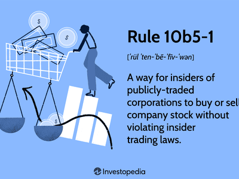

Rule 10b-18, promulgated by the U.S. Securities and Exchange Commission (SEC) in 1982, provides a structured framework for companies executing stock buybacks. This regulatory safeguard, often referred to as the "safe harbor" provision, is designed to facilitate stock repurchases by companies while concurrently minimizing the potential for market manipulation and insider trading. The rule delineates specific conditions that, if adhered to, allow companies to repurchase their shares without the looming threat of market manipulation allegations. These conditions focus on the manner, timing, price, and volume of the buyback transactions.

Understanding the intricacies of Rule 10b-18 is essential for companies seeking to navigate the often complex compliance landscape associated with stock buybacks. The rule is integral in preserving fair trading practices by restricting manipulative behaviors that could artificially influence stock prices. It strikes a balance between allowing companies the freedom to manage their capital structures through buybacks and ensuring market integrity.



This article aims to provide a comprehensive examination of Rule 10b-18, highlighting the compliance requirements and implications of the rule for stock buybacks. Additionally, it will address how modern advancements, such as algorithmic trading, are integrated within this regulatory framework to optimize buyback strategies while maintaining regulatory compliance. This exploration is intended for corporate decision-makers, legal professionals, and financial analysts vested in understanding the regulatory intricacies that influence stock repurchase programs.

## Table of Contents

## Understanding Stock Buybacks and Rule 10b-18

Stock buybacks, also known as share repurchases, are financial strategies employed by companies to return capital to shareholders by buying back their own shares from the marketplace. This process effectively reduces the number of outstanding shares in the market, which can result in an increase in Earnings Per Share (EPS) and potentially buoy the stock's market price. Under Rule 10b-18, established by the U.S. Securities and Exchange Commission (SEC) in 1982, companies are offered a "safe harbor" when conducting these buybacks. This safe harbor provision protects companies from allegations of market manipulation, provided they adhere to specific regulations.

Rule 10b-18 outlines four principal conditions that guide buyback practices: manner, timing, price, and volume. These conditions are designed to ensure that companies engage in repurchases transparently and fairly. 

1. **Manner of Purchase**: Under Rule 10b-18, a company must conduct all repurchases through a single broker or dealer per day. This condition aims to prevent the company from exerting undue influence across multiple market sources, which could distort pricing.

2. **Timing of Buybacks**: This condition restricts companies from making buybacks at the opening of trading or during the last half-hour of the trading session for highly liquid securities. For less liquid securities, the restriction extends to the last ten minutes. The intent is to prevent companies from affecting closing prices, which are critical in evaluating stock performance.

3. **Price Conditions**: The buyback price must not exceed the highest independent bid or the last independent transaction price, whichever is higher. This stipulation is in place to prevent companies from artificially inflating stock prices by repurchasing at disproportionately high prices.

4. **Volume Limitations**: Companies are restricted to repurchasing no more than 25% of the average daily trading volume (ADTV) over the prior four weeks. This limitation helps to minimize market disruption and maintain the integrity of trading volumes.

While compliance with Rule 10b-18 is voluntary, it is prudent for companies to adhere to these guidelines to mitigate potential legal risks. Not following these conditions might expose a company to accusations of market manipulation or insider trading, subjecting it to legal scrutiny and financial penalties. Therefore, companies pursuing stock buybacks often carefully design their strategies within these frameworks to align with both corporate financial goals and regulatory expectations.

## Key Guidelines and Compliance Requirements of Rule 10b-18

To qualify for the safe harbor provided by Rule 10b-18, companies engaging in stock buybacks must adhere to specific compliance requirements designed to prevent market manipulation. These requirements focus on four key areas: the manner, timing, price, and [volume](/wiki/volume-trading-strategy) of the repurchase.

1. **Manner of Purchase**: Companies must limit their repurchases to a single broker or dealer each day. This restriction ensures that the buyback activity is centralized, decreasing the likelihood of exerting undue influence on the stock price through multiple simultaneous transactions across different trading platforms.

2. **Timing of Repurchases**: The timing for buybacks is regulated, particularly for stocks with lower average daily trading volumes. Rule 10b-18 restricts companies from making repurchases at certain times of the trading day to minimize potential disruptions in the trading market. Specifically, purchases are typically prohibited during the opening and closing periods of the trading day when the market is more susceptible to volatility. This regulation helps maintain market stability and integrity.

3. **Price Limitations**: To prevent companies from artificially inflating stock prices, Rule 10b-18 dictates that repurchase prices cannot exceed the highest independent bid or the last quoted price. This ensures that buybacks are conducted at competitive and fair market rates, aligning with investor protections against manipulation.

4. **Volume Restrictions**: Rule 10b-18 imposes volume limitations, allowing companies to repurchase only up to 25% of the average daily trading volume (ADTV) of their shares. This volume cap helps prevent companies from significantly impacting the stock's liquidity and price through large-scale buybacks in a short period.

These guidelines collectively create a compliant framework within which companies can conduct stock repurchases while mitigating legal risks associated with market manipulation allegations. By adhering to these conditions, companies can benefit from the safe harbor protection that Rule 10b-18 offers.

## Algorithmic Trading in Compliance with Rule 10b-18

Algorithmic trading plays an instrumental role in enhancing the efficiency and execution of stock buybacks within the framework of Rule 10b-18. By leveraging complex algorithms, companies can efficiently monitor real-time stock prices and trading volumes, enabling them to make optimal repurchasing decisions that comply with regulatory guidelines. These advanced algorithms provide a systematic approach to executing buybacks, ensuring that the timing, price, and volume conditions of Rule 10b-18 are meticulously adhered to.

One of the key benefits of employing [algorithmic trading](/wiki/algorithmic-trading) in stock buybacks is its ability to handle large volumes of data with precision and speed. Algorithms can be programmed to react instantaneously to market conditions, adjusting buyback strategies as needed to remain aligned with Rule 10b-18's stipulations. For example, an algorithm can continuously track the highest independent bid and the last quoted price, ensuring that any repurchase does not exceed these limits—a core requirement of the rule.

Moreover, automation through algorithmic trading minimizes human errors and the potential for regulatory breaches. Compliance mechanisms can be integrated into trading algorithms to automatically monitor buyback activities against Rule 10b-18’s parameters. These mechanisms facilitate adherence to volume limitations, which restrict daily buybacks to no more than 25% of the stock’s average daily trading volume. To implement this, one could use a simple Python script to calculate the permissible volume based on historical trading data:

```python
def compute_buyback_limit(average_daily_volume):
    return average_daily_volume * 0.25

# Example usage
average_daily_volume = 1000000  # Example trading volume
buyback_limit = compute_buyback_limit(average_daily_volume)
print(f"Permissible buyback volume: {buyback_limit}")
```

Such automation extends beyond compliance, serving to optimize the financial outcomes of buybacks. Algorithms can identify patterns and predict price movements, empowering companies to strategically execute buybacks at times that maximize shareholder value. Furthermore, algorithmic trading systems can incorporate [machine learning](/wiki/machine-learning) models to refine these predictive capabilities over time.

In summary, algorithmic trading provides a robust framework for executing stock buybacks within the regulatory confines of Rule 10b-18. The ability to rapidly process market data and automatically adjust buyback strategies not only ensures compliance but also enhances the efficiency and financial effectiveness of corporate buybacks.

## Benefits and Criticisms of Rule 10b-18 Compliance

Rule 10b-18, by offering a structured framework for stock buybacks, provides several benefits for corporations engaging in such operations. A primary advantage is that the rule allows companies to repurchase their shares without the apprehension of legal repercussions, provided they adhere to the guideline's stipulations. This assurance can lead to a boost in stock prices, as buybacks often signal to the market that the company has confidence in its financial health and future prospects. By reducing the number of shares outstanding, buybacks have the potential to improve earnings per share (EPS). An enhanced EPS could strengthen investor confidence, as it often suggests improved profitability on a per-share basis.

However, Rule 10b-18 is not without criticisms. Skeptics argue that the prioritization of buybacks, sustained by the safe harbor of Rule 10b-18, may contribute to short-term stock price gains rather than creating long-term value. This perspective is rooted in the concern that companies might allocate excess capital to buybacks instead of reinvesting in business operations, innovation, or long-term strategic growth initiatives. The focus on immediate stock price enhancement could detract from foundational investments that foster sustainable development and competitive advantage.

Furthermore, the emphasis on buybacks might lead to an inflation of stock prices temporarily, without corresponding improvements in the company's underlying operational performance. Critics assert that this can potentially distort market perceptions and valuations, posing risks to genuine investor interests focused on the company's long-term trajectory.

In summary, while Rule 10b-18 compliance facilitates an environment where companies can [carry](/wiki/carry-trading) out stock buybacks with reduced legal concerns, thereby potentially boosting investor confidence and stock prices, it also faces critique for promoting strategies that prioritize short-term financial metrics over enduring business growth.

## Common Pitfalls and Legal Challenges in Stock Buybacks

Non-compliance with the conditions of Rule 10b-18 subjects companies to potential legal risks and accusations of market manipulation. One of the primary challenges companies face during stock buybacks is adhering to these stipulated guidelines. Any deviation may result in allegations that the company is artificially inflating stock prices, thereby misleading investors.

A significant legal challenge involves potential insider trading during buybacks, necessitating a strict observance of trading blackout periods. Insider trading refers to the buying or selling of a public company's stock by someone who has non-public, material information about that stock. To mitigate this risk, companies must ensure that buybacks do not coincide with periods when they possess undisclosed material information. Establishing specific blackout periods around earnings announcements or other significant corporate events is a common practice to prevent violations.

Misinterpretation of volume or price restrictions often leads to unintended regulatory violations. Rule 10b-18 specifies that the volume of repurchased shares should not exceed 25% of the average daily trading volume (ADTV) over the previous four weeks. Miscalculating this limit, or failing to account for block trades which are exempt under certain conditions, can lead to non-compliance. Furthermore, the rule mandates that the purchase price of the buyback should not exceed the higher of the last independent trade’s price or the current highest independent bid. Misjudging these pricing guidelines can easily occur, particularly in volatile markets, resulting in regulatory breaches.

To minimize these pitfalls, companies can employ automated systems and algorithms. These technological solutions facilitate precise monitoring of trading conditions and ensure adherence to Rule 10b-18. By automating trade execution, firms can better manage compliance risks associated with timing, price, and volume constraints. Utilizing technology helps in maintaining transparent records, reduces human error, and aligns buying strategies with regulatory demands.

In summary, while Rule 10b-18 offers a framework to reduce legal risks in stock repurchases, non-compliance can lead to significant legal repercussions. Companies must remain vigilant in interpreting and adhering to the specified conditions to safeguard against allegations of market manipulation and insider trading.

## Best Practices for Ensuring Rule 10b-18 Compliance

To ensure effective Rule 10b-18 compliance, corporations should focus on developing comprehensive compliance programs that address the specific conditions of the regulation. This approach allows companies to conduct stock buybacks while minimizing legal risks and ensuring adherence to regulatory requirements.

1. **Comprehensive Compliance Programs**: Developing a thorough compliance program involves understanding the four main conditions of Rule 10b-18: manner, timing, price, and volume of stock repurchases. These programs should include clear policies and procedures to ensure every buyback adheres to the regulation's conditions. Establishing internal controls and auditing mechanisms can further bolster compliance, ensuring any deviations are promptly identified and rectified.

2. **Training for Corporate Executives**: Regular training sessions for corporate executives are vital in mitigating insider trading risks associated with stock buybacks. Such training can equip executives with the knowledge to recognize and navigate potential legal pitfalls, emphasizing the importance of adhering to trading blackout periods and maintaining awareness of non-public information. By promoting a culture of compliance, companies can foster ethical decision-making during buyback activities.

3. **Technology and Algorithmic Trading**: The integration of advanced technology and algorithmic trading can streamline adherence to the conditions set by Rule 10b-18. Algorithms can dynamically monitor stock prices and trading volumes, ensuring that buybacks fall within prescribed limits. Automation can also facilitate timely and efficient execution of trades, reducing the likelihood of human error. Companies can develop custom algorithms to analyze market data and adjust buyback strategies in real-time, aligning operations with regulatory compliance seamlessly.

Overall, these best practices serve as a robust framework for ensuring adherence to Rule 10b-18, enabling companies to undertake stock buybacks with confidence and legality. By prioritizing regulatory compliance and leveraging technology, businesses can enhance shareholder value and uphold market integrity.

## Final Thoughts on Rule 10b-18 and Stock Buybacks

Rule 10b-18 plays a crucial role in regulating corporate stock buyback strategies while ensuring adherence to legal frameworks that prevent market manipulation. This regulation offers companies a safeguarded approach to repurchasing their shares, allowing them to boost shareholder value without violating securities laws. By providing a safe harbor, Rule 10b-18 encourages responsible buyback activities, which can positively influence market perceptions and investor confidence through mechanisms like improved earnings per share (EPS).

Strict compliance with Rule 10b-18 is essential for companies seeking to capitalize on the benefits of stock buybacks while minimizing legal risks. Companies must adhere to the rule's specific conditions regarding the manner, timing, price, and volume of buybacks to maintain this safe harbor status. Effective compliance not only shields companies from allegations of market manipulation but also enables them to align their buyback strategies with broader financial and strategic objectives.

The landscape of buyback compliance is continually evolving due to regulatory updates and technological advancements. The emergence of algorithmic trading has introduced new efficiencies in executing stock buybacks. Algorithms assist in monitoring stock prices and trading volumes, optimizing repurchase activities, and ensuring adherence to the regulatory conditions. By leveraging these technologies, companies can better navigate the complexities of buyback compliance and strategically time their repurchases to maximize the intended financial impact.

In conclusion, Rule 10b-18 remains a pivotal regulation that balances corporate buyback ambitions with necessary legal constraints. With stringent adherence to the rule, complemented by innovative technologies like algorithmic trading, companies can effectively carry out stock buybacks to enhance shareholder value, all while respecting insider trading and market manipulation laws. The synergy between regulatory guidance and technological innovation continues to shape the future dynamics of stock buyback strategies.

## References & Further Reading

[1]: Fried, Jesse M. (2005). ["Informed Trading and False Signaling with Open Market Repurchases."](https://papers.ssrn.com/sol3/papers.cfm?abstract_id=564682) California Management Review.

[2]: Bhattacharya, Utpal & Jacobsen, Stacy & Ronn, Ehud. (2009). ["The Role of News in the Financial Markets: Evidence from Stock Repurchases and Insider Trading."](https://www.jstor.org/stable/40505905) Review of Financial Studies.

[3]: ["Corporate Finance"](https://www.investopedia.com/terms/c/corporatefinance.asp) by Stephen A. Ross, Randolph W. Westerfield, Jeffrey Jaffe.

[4]: ["Investment Banking: Institutions, Politics, and Law"](https://academic.oup.com/book/7202) by Alan D. Morrison and William J. Wilhelm Jr.

[5]: Carlson, M. A. & Lazarus, E. A. (2006). ["Distribution of Information Regarding Buybacks: Why Rule 10b-18?"](https://psycnet.apa.org/record/2006-03348-004) Brooklyn Journal of Corporate, Financial & Commercial Law.