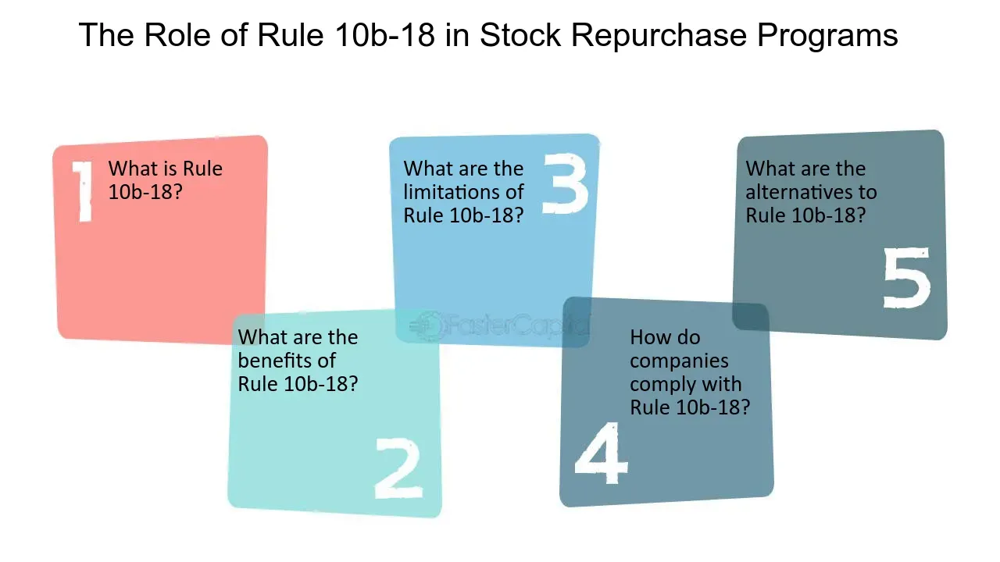

## Table of Contents

## What is Rule 10b-18?

Rule 10b-18 is a regulation set by the U.S. Securities and Exchange Commission (SEC) that helps companies buy back their own shares without breaking rules against stock manipulation. It gives companies a safe way to repurchase their stock by following certain guidelines. This rule was made to make it easier for companies to buy back their shares and to give clear rules about how they should do it.

The rule has specific conditions that companies must follow when they buy back their shares. These conditions include limits on the number of shares they can buy each day, the times they can buy them, and the prices they can pay. If a company follows these rules, it is protected from being accused of manipulating the stock market. This helps companies manage their stock without worrying about breaking the law.

## Why was Rule 10b-18 established?

Rule 10b-18 was set up by the U.S. Securities and Exchange Commission (SEC) to help companies buy back their own shares without getting into trouble for manipulating the stock market. Before this rule, companies were worried about breaking the law when they wanted to buy back their shares. The rule gives companies a clear and safe way to do this, as long as they follow certain rules.

The main reason for creating Rule 10b-18 was to make it easier for companies to buy back their shares and to make the rules clear. This helps companies manage their stock better and gives them peace of mind. By following the rule's guidelines on how many shares they can buy each day, when they can buy them, and what prices they can pay, companies can avoid being accused of stock manipulation.

## Who does Rule 10b-18 apply to?

Rule 10b-18 applies to companies that want to buy back their own shares. These companies are usually listed on the stock market and want to repurchase their stock without breaking the law. The rule helps them do this safely by giving them clear guidelines to follow.

The rule is important for company leaders and the people who handle the buying and selling of the company's shares. It makes sure that everyone knows the rules and can follow them. This helps keep the stock market fair and stops companies from being accused of cheating when they buy back their shares.

## What are the basic conditions that must be met to comply with Rule 10b-18?

To follow Rule 10b-18, companies need to stick to some basic rules when they buy back their shares. They can only buy a certain number of shares each day. This number is based on the average number of shares traded each day over the last four weeks. They also need to be careful about when they buy the shares. They can only buy during certain times of the day, usually when the market is open and trading is active.

Another important rule is about the price they pay for the shares. Companies can't pay more than the highest price someone else paid for the stock that day, or the last price the stock was traded at before the market closed the day before. By following these rules, companies can buy back their shares without worrying about breaking the law. This helps keep things fair and clear in the stock market.

## How does Rule 10b-18 affect stock repurchase programs?

Rule 10b-18 makes it easier for companies to buy back their own shares without breaking the law. It gives companies a safe way to do this by setting clear rules on how many shares they can buy each day, when they can buy them, and what prices they can pay. This helps companies plan their stock repurchase programs better because they know exactly what they need to do to stay within the law.

By following Rule 10b-18, companies can avoid being accused of manipulating the stock market. This is important because it helps keep the stock market fair and gives investors confidence. When companies follow these rules, they can buy back their shares in a way that is clear and safe, which can help them manage their stock better and possibly increase the value of their remaining shares.

## What are the limitations on the volume of shares that can be repurchased under Rule 10b-18?

Rule 10b-18 sets a limit on how many shares a company can buy back each day. The company can't buy more than 25% of the average number of shares that were traded each day over the last four weeks. This rule helps make sure that the company doesn't buy too many shares at once, which could mess up the market.

By following this limit, companies can buy back their shares without causing big changes in the stock price. This helps keep the market stable and fair. It also means that companies need to plan their stock repurchase programs carefully to stay within these rules.

## Can you explain the timing restrictions under Rule 10b-18?

Rule 10b-18 has rules about when companies can buy back their shares. They can only buy during certain times of the day. This is usually when the stock market is open and people are actively trading. Companies can't buy shares at the very beginning or end of the trading day. This helps make sure that the buying doesn't affect the stock price too much.

The timing rules are there to keep the market fair. If companies could buy shares at any time, they might try to buy when the price is low or when not many people are trading. By only allowing buying during busy times, Rule 10b-18 helps keep the stock market stable and stops companies from messing with the price.

## What are the price conditions that must be adhered to under Rule 10b-18?

Rule 10b-18 has rules about how much a company can pay for its shares when buying them back. The company can't pay more than the highest price someone else paid for the stock that day. They also can't pay more than the last price the stock was traded at before the market closed the day before. These rules make sure that the company doesn't pay too much for its shares.

By following these price rules, companies help keep the stock market fair. If a company could pay any price, it might try to buy shares when the price is low to make the stock price go up. The price limits stop this from happening and help make sure that the stock price stays stable when the company is buying back shares.

## How does Rule 10b-18 interact with other SEC regulations?

Rule 10b-18 works together with other SEC rules to make sure companies play fair when they buy back their own shares. One important rule it connects with is Rule 10b-5, which stops people from cheating or lying about stocks. Rule 10b-18 helps companies avoid breaking Rule 10b-5 by giving them a safe way to buy back shares if they follow certain rules. This means companies can manage their stock without worrying about being accused of cheating.

Another rule that Rule 10b-18 works with is Regulation M. This rule stops people from doing things that could mess up the stock market, like buying shares right before they sell new ones. Rule 10b-18 makes sure that when companies buy back their shares, they don't do it in a way that breaks Regulation M. By following both rules, companies can keep the stock market fair and stable.

## What are common pitfalls companies face when trying to comply with Rule 10b-18?

One common pitfall companies face when trying to comply with Rule 10b-18 is miscalculating the daily [volume](/wiki/volume-trading-strategy) limit. The rule says a company can't buy more than 25% of the average daily trading volume over the last four weeks. If a company gets this number wrong, they might buy too many shares and break the rule without meaning to. This can happen if they don't keep good records or if they don't check the trading volume often enough.

Another issue is not following the timing rules correctly. Companies can only buy back shares during certain times of the day, not at the very start or end of trading. If they buy at the wrong times, they might be seen as trying to mess with the stock price, which can get them in trouble. It's important for companies to know exactly when they can buy and to stick to those times carefully.

Lastly, companies sometimes struggle with the price conditions. They can't pay more than the highest price paid that day or the last price before the market closed the day before. If they pay too much, even by a little, they could be breaking the rule. This requires companies to keep a close eye on the stock price and make sure they don't overpay when buying back shares.

## How can a company ensure ongoing compliance with Rule 10b-18?

To make sure they keep following Rule 10b-18, a company needs to always check how many shares they can buy each day. They have to look at the average number of shares traded over the last four weeks and make sure they don't buy more than 25% of that number each day. It's important for them to keep good records and update their numbers often. If they do this, they can avoid buying too many shares and breaking the rule without knowing it.

The company also needs to be careful about when and how much they pay for the shares. They can only buy during certain times of the day, not at the start or end of trading. They also can't pay more than the highest price paid that day or the last price before the market closed the day before. By keeping a close watch on the stock price and timing their purchases right, they can make sure they don't pay too much or buy at the wrong time. This helps them stay in line with Rule 10b-18 and keep their stock repurchase program fair and legal.

## What are the potential consequences of non-compliance with Rule 10b-18?

If a company doesn't follow Rule 10b-18, they could get in big trouble. The SEC might say they broke the law and fine them a lot of money. This can hurt the company's reputation and make people trust them less. If investors think the company isn't playing fair, they might sell their shares, which can make the stock price go down.

Not following Rule 10b-18 can also lead to legal problems. The company might have to go to court and face lawsuits from shareholders who think they were cheated. This can take a lot of time and money to fix. It's important for companies to stick to the rules so they can avoid these problems and keep their stock repurchase programs safe and legal.

## References & Further Reading

[1]: Fried, Jesse M. (2005). ["Informed Trading and False Signaling with Open Market Repurchases."](https://papers.ssrn.com/sol3/papers.cfm?abstract_id=564682) California Management Review.

[2]: Bhattacharya, Utpal & Jacobsen, Stacy & Ronn, Ehud. (2009). ["The Role of News in the Financial Markets: Evidence from Stock Repurchases and Insider Trading."](https://www.jstor.org/stable/40505905) Review of Financial Studies.

[3]: ["Corporate Finance"](https://www.investopedia.com/terms/c/corporatefinance.asp) by Stephen A. Ross, Randolph W. Westerfield, Jeffrey Jaffe.

[4]: ["Investment Banking: Institutions, Politics, and Law"](https://academic.oup.com/book/7202) by Alan D. Morrison and William J. Wilhelm Jr.

[5]: Carlson, M. A. & Lazarus, E. A. (2006). ["Distribution of Information Regarding Buybacks: Why Rule 10b-18?"](https://psycnet.apa.org/record/2006-03348-004) Brooklyn Journal of Corporate, Financial & Commercial Law.