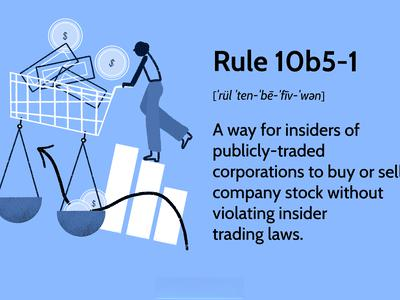

This article explores the intricate relationship between securities fraud, securities regulation, Rule 10b-5, and algorithmic trading. Securities fraud represents a significant threat to the financial industry, resulting in substantial losses for investors and undermining market integrity. This type of fraud encompasses various illicit activities such as misrepresentation, insider trading, and market manipulation, each having severe repercussions for market stability and investor trust.

Regulatory frameworks have been developed to combat securities fraud, with Rule 10b-5 being one of the most pivotal instruments. Enacted under the Securities Exchange Act of 1934, Rule 10b-5 addresses deceptive practices in securities transactions by prohibiting fraudulent statements and omissions. This regulation is essential for maintaining fair and transparent markets, as it targets misleading and dishonest conduct that could compromise the integrity of financial markets.

Algorithmic trading introduces additional complexity into this equation. As a technology-driven strategy that allows for the execution of trades at exceptionally high speeds, algorithmic trading significantly enhances market liquidity and efficiency. However, this same technology also poses substantial challenges for regulators. The automation and speed associated with algorithmic trading can lead to increased market volatility and potential instances of market manipulation. These risks necessitate an urgent response from regulators to monitor and control trading activities effectively within the existing legal frameworks.

Understanding the intersection of these elements—securities fraud, Rule 10b-5, and algorithmic trading—is critical for both market participants and regulators. As technology continues to evolve, stakeholders must remain vigilant and informed on these issues to navigate the complexities of modern financial markets successfully. This awareness is essential not only to ensure compliance with regulatory requirements but also to foster trust and integrity in the global financial system.

## Table of Contents

## Understanding Securities Fraud

Securities fraud involves a spectrum of activities that undermine the integrity of financial markets. At its core, securities fraud is characterized by deceitful practices, such as providing misleading information, engaging in insider trading, or manipulating market activities to benefit unlawfully. These fraudulent actions not only distort the fair operation of financial markets but also cause notable financial harm to investors.

The Federal Bureau of Investigation (FBI) identifies securities fraud as a major white-collar crime, encompassing a variety of schemes designed to swindle investors. These schemes can range from elaborate Ponzi schemes, where returns for older investors are financed through the capital of newer ones, to broker embezzlement, where brokers illegally take possession of assets or funds belonging to clients. Both these activities create a substantial risk for stakeholders and endanger the financial ecosystem.

A critical aspect of securities fraud is the impact of misinformation on investor decisions. Investors rely heavily on the accuracy and transparency of financial information to make informed investment choices. When false statements are disseminated or material facts are omitted, it skews investors' perception of the value or prospects of a security, leading to ill-informed decisions and, consequently, financial losses. This breach of trust highlights why investor protection laws and regulations are essential components of a functional market.

The prevention of securities fraud is paramount to maintaining investor confidence and the efficient operation of markets. Establishing robust regulatory frameworks and rigorous enforcement mechanisms is crucial to deter potential fraudsters and protect the investment landscape's integrity. This ensures that all participants, from individual investors to large institutional entities, can engage in market activities with trust that they are dealt with fairly and transparently, thereby promoting a stable and sustainable financial market.

## Role of Rule 10b-5 in Securities Regulation

Rule 10b-5, under the Securities Exchange Act of 1934, serves as a central mechanism for combating securities fraud by explicitly outlawing deceptive practices in the trading of securities. Developed and enforced by the Securities and Exchange Commission (SEC), this rule plays a critical role in maintaining the integrity and stability of financial markets.

The key aim of Rule 10b-5 is to prohibit any false statements or omissions of material facts in connection with the purchase or sale of any security. An integral component of securities regulation, the rule stipulates that no person can engage in any device or scheme to defraud, make any untrue statement of a material fact, or engage in any act that operates or would operate as a fraud or deceit upon any person, directly or indirectly, in connection with the buying or selling of securities.

Central to understanding violations of Rule 10b-5 are four elements: deceit or omission, materiality, scienter, and causation of loss. Deceit or omission involves untrue statements or the failure to disclose important facts. Materiality pertains to information that could influence an investor's decision-making process. Scienter refers to the intent or knowledge of wrongdoing, indicating that the act was performed with fraudulent intent. Lastly, causation of loss is required to establish that the fraudulent activity directly caused economic harm to the investor.

Rule 10b-5 has been fundamental in the prosecution of insider trading, a practice where individuals trade securities based on non-public, material information, thus gaining an unfair advantage. It has been widely applied in various cases to bring justice to fraudulent securities activities and protect the interests of investors.

Through its rigorous framework, Rule 10b-5 ensures that securities transactions occur in a transparent and honest environment, fostering trust and confidence in the financial markets. Its application has helped to deter fraudulent practices, contributing significantly to fair and efficient market operations.

## Mechanics of Algorithmic Trading

Algorithmic trading employs sophisticated algorithms to automatically execute trades at exceedingly high speeds, fundamentally transforming modern securities markets. By utilizing complex mathematical models and powerful computing systems, traders can exploit small market inefficiencies and execute orders instantaneously, providing substantial improvements in market [liquidity](/wiki/liquidity-risk-premium) and operational efficiency. This systemic enhancement ensures that buy and sell orders are matched more efficiently, reducing the bid-ask spreads and increasing the overall turnover in the financial markets.

The rise of [algorithmic trading](/wiki/algorithmic-trading) has been particularly notable over the past decade, with such trades now accounting for a significant portion of equity market transactions. Indeed, algorithmic trading is estimated to represent approximately 60-75% of trading [volume](/wiki/volume-trading-strategy) in the United States and other developed markets. This approach leverages statistical [arbitrage](/wiki/arbitrage), pairs trading, and index arbitrage as part of its strategy, enabling effective risk management and portfolio optimization.

However, the rapid execution and massive trade volumes characteristic of algorithmic trading also present challenges. The swift nature of algo trades can amplify market [volatility](/wiki/volatility-trading-strategies), potentially leading to phenomena such as "flash crashes"—sudden, severe price drops followed by a rapid recovery—as was notably observed in the so-called Flash Crash of May 6, 2010. This incident highlighted the speed and interconnectivity of modern electronic trading systems and demonstrated how rapidly executed algorithmic trades could trigger acute instability in financial markets. Such events underscore the need for effective risk controls and circuit breakers to mitigate excessive price fluctuations and maintain orderly markets.

Regulatory oversight is further complicated by the task of monitoring these automated systems within existing legal structures. The complexity and opacity of proprietary trading algorithms present significant challenges for regulators in identifying illegal activities, such as market manipulation. Regulators must strive to balance fostering innovation with safeguarding market integrity, prompting the development of advanced monitoring tools and real-time surveillance systems to detect potentially manipulative trading patterns. This requires constant adaptation and collaboration between regulators, market participants, and technology providers to ensure robust market supervision without stifling technological advancement. As the market landscape continues to evolve, effective regulatory frameworks must develop in tandem to mitigate risks and sustain market confidence.

## Challenges of Regulating Algorithmic Trading Under Rule 10b-5

Algorithmic trading has introduced significant complexities in adhering to Rule 10b-5, particularly in preventing manipulative activities and the dissemination of false or misleading information in securities transactions. Due to the automated and high-frequency nature of algorithmic trading, the speed and volume of trades present unique challenges for regulators in the detection and prosecution of fraudulent activities.

The rapid execution inherent in algorithmic trades means these transactions can occur faster than human regulators can monitor them, making it difficult to identify deceptive practices. The anonymity afforded by these trading systems further complicates enforcement efforts, as identifying the parties responsible for potential violations becomes challenging.

To effectively monitor and regulate algorithmic trading, innovative regulatory approaches are necessary. This includes developing technological tools and systems capable of analyzing large sets of trading data in real-time to detect patterns indicative of fraudulent behavior. Advanced analytics and [machine learning](/wiki/machine-learning) models could be employed to flag suspicious activities that deviate from typical market patterns, providing regulators with a proactive strategy to address potential violations.

Additionally, the evolving nature of algorithmic trading necessitates that Rule 10b-5 adapt to technological advancements. Regulators are increasingly required to interpret the applicability of this rule in the context of new trading technologies. For example, algorithmic strategies that engage in high-frequency trading might exploit price swings or create artificial market conditions, raising questions about their compliance under Rule 10b-5. The Securities and Exchange Commission (SEC) and other regulatory bodies must thus continuously update their frameworks and guidelines to incorporate emerging technologies and trading practices.

In summary, the challenges algorithmic trading poses under Rule 10b-5 are multifaceted, primarily due to the anonymous and rapid nature of trades. This necessitates the development of innovative monitoring tools and adaptive regulatory frameworks to maintain market integrity and investor protection.

## Recent Amendments and Enforcement of Rule 10b-5

Recent amendments to Rule 10b-5 have been implemented to bolster transparency and accountability in securities trading, primarily as a response to the evolving technological landscape. These amendments focus on adapting the rule to the challenges posed by modern trading mechanisms, particularly algorithmic trading and insider trading dynamics.

One significant development under the umbrella of Rule 10b-5 is the revision of Rule 10b5-1, which was initially designed to provide a defense for insiders against insider trading accusations. The updated provisions introduce mandatory cooling-off periods for trading plans. These cooling-off periods are intended to minimize the risk of insider trading, ensuring that corporate insiders cannot execute trades too soon after establishing a trading plan, thereby limiting the opportunity to leverage non-public information.

Furthermore, the amendments place restrictions on overlapping trading plans. This change aims to prevent individuals from exploiting multiple concurrent plans to manipulate stock transactions in a manner that could be construed as taking advantage of insider knowledge. Such measures are crucial in maintaining an equitable trading environment by closing loopholes that might otherwise be exploited in the absence of regulatory oversight.

The Securities and Exchange Commission (SEC) has stepped up enforcement actions to uphold these new regulations. The SEC's focus on violations involving intricate trading strategies, such as those employed by algorithmic trading systems, underlines its dedication to evolving regulatory frameworks alongside trading technologies. The Commission's enforcement activities highlight an ongoing commitment to policing fraudulent and manipulative practices within the securities market.

Stakeholders, including traders, financial institutions, and corporations, are advised to remain vigilant and informed regarding these regulatory updates. Ensuring compliance with the latest amendments is paramount to avoid legal repercussions and to sustain investor confidence. Regular monitoring and adapting to the evolving regulatory landscape will help market participants navigate the complexities introduced by technological and strategic trading advances.

## Conclusion

Securities fraud, coupled with rapid technological advancements such as algorithmic trading, poses significant and ongoing challenges for both regulators and market participants. Rule 10b-5, a critical component under the Securities Exchange Act of 1934, remains instrumental in the fight against deceptive practices in securities transactions. While it serves as a fundamental mechanism for maintaining market integrity, its evolution is necessary to effectively address the complexities introduced by technology-driven trading strategies.

As financial markets become increasingly automated, stakeholders must place a stronger emphasis on compliance and ethical practices. Upholding these values is crucial not only for maintaining investor trust but also for ensuring the stability and functionality of global markets. For instance, algorithmic trading, which offers efficiencies and liquidity benefits, may also exacerbate risks such as market manipulation and flash crashes if not properly regulated.

Achieving sustainable development in financial markets requires ongoing dialogue and cooperation among regulators, industry participants, and technology providers. Modern market dynamics demand innovative regulatory approaches that adapt to technological changes while balancing transparency, efficiency, and security. Stakeholders must stay informed of regulatory updates and engage in proactive discussions to safeguard against emerging threats.

Through collective efforts, regulators and market participants can ensure that advancements in trading technologies contribute positively to the market environment, reinforcing the foundational principles set forth by regulations like Rule 10b-5. This collaborative approach will be pivotal in fostering a resilient and trustworthy financial ecosystem.

## References & Further Reading

[1]: Langevoort, D. C. (2009). ["The SEC, Retail Investors, and the Institutionalization of the Securities Markets"](https://virginialawreview.org/wp-content/uploads/2020/12/1025.pdf). Virginia Law Review, 95(4), 1025-1056.

[2]: Gomber, P., Arndt, B., Lutat, M., & Uhle, T. (2011). ["High-frequency trading"](https://papers.ssrn.com/sol3/papers.cfm?abstract_id=1858626). Business & Information Systems Engineering, 3(2), 93-96.

[3]: Bainbridge, S. M. (1986). ["Insider Trading under the Federal Securities Laws: A Functional Approach to the Issue of the Fiduciary Obligation"](https://www.movoto.com/bainbridge-ny/2007-county-road-35-bainbridge-ny-13733/pid_ehammggqjh/). Michigan Law Review, 70(1), 1-80.

[4]: Hasbrouck, J., & Saar, G. (2013). ["Low-latency trading"](https://www.sciencedirect.com/science/article/abs/pii/S1386418113000165). The Review of Financial Studies, 26(7), 1711-1752.

[5]: Aldridge, I. (2013). ["High-Frequency Trading: A Practical Guide to Algorithmic Strategies and Trading Systems"](https://books.google.com/books/about/High_Frequency_Trading.html?id=8QpIsVUMhmEC). Wiley.