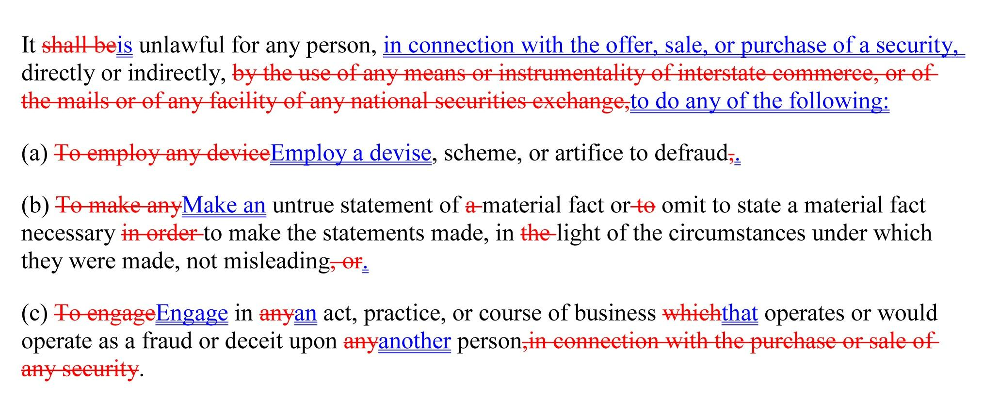

## Table of Contents

## What is Rule 10b-5 and why is it important?

Rule 10b-5 is a regulation set by the U.S. Securities and Exchange Commission (SEC) that aims to prevent fraud in the stock market. It makes it illegal for anyone to use false information or to lie when they buy or sell stocks. This rule is part of the Securities Exchange Act of 1934 and is one of the most important rules for protecting investors.

The importance of Rule 10b-5 lies in its role in maintaining fairness and trust in the financial markets. By stopping people from using lies or false information, it helps make sure that everyone has a fair chance to make good decisions about buying and selling stocks. This rule helps keep the market honest and protects everyday investors from being tricked by dishonest people.

## Who does Rule 10b-5 apply to?

Rule 10b-5 applies to anyone who buys or sells stocks or other securities. This includes individual investors, big companies, and even people who work for those companies. If you're involved in the stock market, you need to follow this rule.

The rule is important because it stops people from lying or using false information when they trade stocks. This means that everyone, from small investors to big corporations, has to be honest and fair. By making sure everyone follows the same rules, it helps keep the stock market a safe and fair place for everyone.

## What are the key elements of a securities fraud claim under Rule 10b-5?

To make a securities fraud claim under Rule 10b-5, you need to show a few important things. First, someone made a false statement or left out important information that should have been shared. This false statement or missing information needs to be about something important that could affect someone's decision to buy or sell a stock. Second, the person who made the false statement or left out the information knew it was wrong or was careless in not knowing it was wrong. They can't just make a mistake; they need to have been dishonest or reckless.

The next part is showing that the false statement or missing information was used to trick people into buying or selling stocks. This means the false information needs to have been a big reason why someone decided to trade. Finally, you need to prove that because of the false statement or missing information, someone lost money. They need to show that if the truth had been known, they would have made a different choice and not lost money. These are the main things you need to prove to win a securities fraud claim under Rule 10b-5.

## Can you explain the concept of materiality in the context of Rule 10b-5?

Materiality is a key idea in Rule 10b-5. It means that the false statement or missing information has to be important enough that it could affect someone's decision to buy or sell a stock. If the information is not important, then it's not considered material, and it won't count as fraud under the rule.

Think of it like this: if you were deciding whether to buy a car and someone told you it had a small scratch on the door, that might not change your mind. But if they didn't tell you the car's engine was broken, that's a big deal and could make you decide not to buy it. In the stock market, material information is like the broken engine - it's something big that people need to know before they make their choices.

## What is the difference between primary and secondary liability under Rule 10b-5?

Under Rule 10b-5, primary liability means you're directly responsible for the fraud. This happens when you make a false statement or leave out important information yourself. If you're the one lying or not telling the whole truth, and someone loses money because of it, you can be held directly responsible. It's like if you tell someone a car is in perfect condition when you know it's not, and they buy it and then find out it's broken - you're directly to blame.

Secondary liability is different. It means you're not the one who made the false statement or left out information, but you helped someone else do it. This can happen if you help spread the false information or if you know about the fraud and do nothing to stop it. It's like if you know your friend is selling a broken car and you help them advertise it as perfect without saying anything about the problem. You're not the one lying directly, but you're still involved in the fraud.

## How does the 'scienter' requirement affect Rule 10b-5 claims?

The 'scienter' requirement is a big deal in Rule 10b-5 claims. It means that the person who made the false statement or left out important information has to have done it on purpose or been really careless. They can't just make a mistake; they have to know what they're doing is wrong or not care enough to check if it's right. This makes it harder to win a fraud case because you have to show that the person was dishonest or reckless, not just wrong.

This requirement helps keep the rule fair. It stops people from being sued just because they made a small mistake. It makes sure that only people who really meant to trick others or were very careless get in trouble. This way, the rule focuses on stopping serious fraud and protects honest people from unfair lawsuits.

## What are some common defenses to a Rule 10b-5 securities fraud claim?

One common defense to a Rule 10b-5 securities fraud claim is that the statements made were just opinions, not facts. If someone says they think a stock will go up, that's different from saying it will definitely go up. Opinions can't be proven false, so they don't count as fraud. Another defense is that the information wasn't important enough to matter. If the false statement or missing information wouldn't have changed someone's mind about buying or selling a stock, then it's not fraud.

Another defense is that the person didn't know the information was false or didn't know it was important. This is called lack of scienter. If someone can show they didn't mean to trick anyone and were careful with the information they shared, they might not be held responsible. Finally, some people might argue that the person who lost money didn't rely on the false information when making their decision. If they would have made the same choice even with the truth, then they can't claim fraud caused their loss.

## How does Rule 10b-5 interact with other securities laws and regulations?

Rule 10b-5 works together with other securities laws and rules to keep the stock market fair and honest. It's part of the Securities Exchange Act of 1934, which is a big law that sets rules for buying and selling stocks. Other parts of this law, like Section 10(b), help make sure that people can't lie or use false information when trading stocks. Rule 10b-5 is like a specific tool that the Securities and Exchange Commission (SEC) uses to stop fraud, and it fits into the bigger picture of laws that protect investors.

There are also other rules and laws that work alongside Rule 10b-5. For example, the Sarbanes-Oxley Act of 2002 makes companies be more honest about their financial information, which helps prevent fraud. The Dodd-Frank Act of 2010 added more rules to stop risky behavior in the financial markets. All these laws and rules together create a strong system that tries to keep the stock market safe and fair for everyone. Rule 10b-5 is an important part of this system because it directly stops people from using lies to trick others in the stock market.

## Can you discuss a landmark case that has shaped the interpretation of Rule 10b-5?

One of the most important cases that shaped Rule 10b-5 is the 1976 case called Ernst & Ernst v. Hochfelder. In this case, the Supreme Court said that to be guilty of fraud under Rule 10b-5, you have to know you're doing something wrong or be really careless. This is called the "scienter" requirement. Before this case, some people thought you could be guilty just for making a mistake. But the court made it clear that you have to have a bad intention or be very reckless for it to count as fraud.

This decision changed how people think about Rule 10b-5. It made it harder to win a fraud case because you have to show that the person knew what they were doing was wrong or didn't care enough to check. This helps make sure that only people who really meant to trick others or were very careless get in trouble. The Ernst & Ernst v. Hochfelder case is a big reason why Rule 10b-5 focuses on stopping serious fraud and not just punishing small mistakes.

## What are the potential penalties for violating Rule 10b-5?

If someone breaks Rule 10b-5, they can face some serious penalties. The Securities and Exchange Commission (SEC) can fine them a lot of money. The fines can be up to three times the amount of money they made from the fraud, or they might have to pay back the money they got from it. The SEC can also stop them from working in the stock market again, which means they can't buy or sell stocks or work for a company that does. Sometimes, they might even have to go to jail if they broke other laws too.

Besides the SEC, people who lost money because of the fraud can also sue the person who broke the rule. They can ask for money to cover what they lost, plus extra money to punish the person who tricked them. This can add up to a lot of money. All these penalties are there to make sure people think twice before trying to cheat others in the stock market.

## How has Rule 10b-5 evolved over time, and what recent changes have been made?

Rule 10b-5 has changed a lot since it was first made. It started in 1934 as part of the Securities Exchange Act, but over time, courts and the SEC have explained what it means and how it works. One big change came in 1976 with the Ernst & Ernst v. Hochfelder case, which said you have to know you're doing something wrong or be very careless for it to count as fraud. This made it harder to win a fraud case but also made sure only serious fraud was punished. Other cases and rules have also helped shape what counts as fraud and who can be held responsible.

In recent years, there haven't been big changes to Rule 10b-5 itself, but other laws and rules have affected how it's used. For example, the Dodd-Frank Act of 2010 added new ways for people to report fraud and get rewards for helping catch wrongdoers. Also, the SEC keeps updating its rules to make sure they work well with new technology and ways of trading stocks. Even though Rule 10b-5 hasn't changed much on paper, how it's used and enforced keeps evolving to keep up with the changing world of the stock market.

## What are the best practices for companies to avoid violations of Rule 10b-5?

To avoid violations of Rule 10b-5, companies need to make sure they are always honest and clear when they talk about their business. They should have good rules in place for sharing information with investors. This means making sure everyone in the company knows what they can and can't say about the company's performance, plans, and financial health. Companies should also check their information carefully before they share it to make sure it's correct and not misleading. If they find out something they said was wrong, they should fix it quickly and tell everyone.

Another important thing is to train employees about what Rule 10b-5 means and how to follow it. This helps everyone understand that lying or leaving out important information can get the company in big trouble. Companies should also have a way for employees to report any problems they see without being scared of getting in trouble themselves. By being open and honest, and by making sure everyone knows the rules, companies can avoid breaking Rule 10b-5 and keep their investors' trust.

## References & Further Reading

[1]: Langevoort, D. C. (2009). ["The SEC, Retail Investors, and the Institutionalization of the Securities Markets"](https://virginialawreview.org/wp-content/uploads/2020/12/1025.pdf). Virginia Law Review, 95(4), 1025-1056.

[2]: Gomber, P., Arndt, B., Lutat, M., & Uhle, T. (2011). ["High-frequency trading"](https://papers.ssrn.com/sol3/papers.cfm?abstract_id=1858626). Business & Information Systems Engineering, 3(2), 93-96.

[3]: Bainbridge, S. M. (1986). ["Insider Trading under the Federal Securities Laws: A Functional Approach to the Issue of the Fiduciary Obligation"](https://www.movoto.com/bainbridge-ny/2007-county-road-35-bainbridge-ny-13733/pid_ehammggqjh/). Michigan Law Review, 70(1), 1-80.

[4]: Hasbrouck, J., & Saar, G. (2013). ["Low-latency trading"](https://www.sciencedirect.com/science/article/abs/pii/S1386418113000165). The Review of Financial Studies, 26(7), 1711-1752.

[5]: Aldridge, I. (2013). ["High-Frequency Trading: A Practical Guide to Algorithmic Strategies and Trading Systems"](https://books.google.com/books/about/High_Frequency_Trading.html?id=8QpIsVUMhmEC). Wiley.