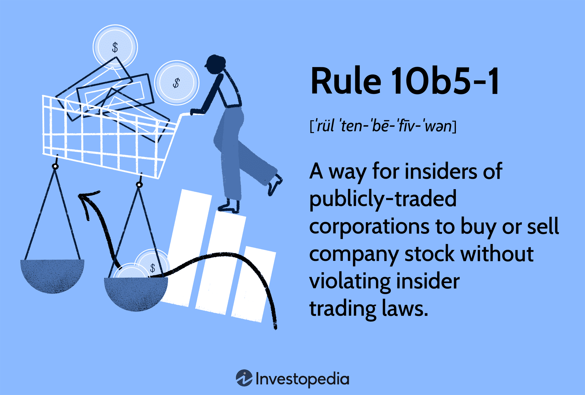

Rule 10b5-1 is a regulatory mechanism established by the Securities and Exchange Commission (SEC) to provide company insiders with a lawful method of trading their company’s stocks, while safeguarding against accusations of insider trading. This regulation is crucial for company executives and insiders within publicly traded companies, as it facilitates a structured approach to trading that mitigates potential legal issues related to material nonpublic information (MNPI).

Understanding the nuances of Rule 10b5-1 is vital for ensuring compliance with insider trading laws and for leveraging the legitimate trading opportunities it presents. The rule outlines specific criteria for establishing predetermined trading plans, providing a framework that aligns with broader SEC regulations aimed at preventing securities fraud.



This article investigates into the details of Rule 10b5-1, examining its operational requirements set by the SEC. We explore how the rule applies to automated trading and assess recent amendments that have been made to enhance transparency and prevent abuse. Additionally, the discussion addresses the impact of Rule 10b5-1 on insider trading practices and its intersection with algorithmic trading strategies. By understanding these elements, insiders and algorithmic traders can effectively navigate the complexities of insider trading regulations and maintain compliance in an evolving financial landscape.

## Table of Contents

## Understanding Rule 10b5-1: An Overview

Rule 10b5-1 is a provision implemented by the Securities and Exchange Commission (SEC) that enables corporate insiders to create a standardized framework for trading their own company’s securities without breaching insider trading rules. The primary intent of these trading plans is to shield insiders, such as executives and directors, from allegations that trading decisions are influenced by material nonpublic information (MNPI).

A Rule 10b5-1 plan can only be instituted when the insider does not possess any MNPI. This stipulation ensures that the plan's parameters are set objectively without the potentiality of exploiting undisclosed information for personal gain. Once the plan is established, trades occur based on the predetermined criteria, irrespective of any subsequent MNPI the insider might acquire.

The rule is a subsection of Rule 10b-5 under the Securities Exchange Act of 1934, which is a broader regulatory framework aimed at preventing fraudulent activities in the securities market. Rule 10b-5 prohibits any act or omission resulting in fraud or deceit in connection with the purchase or sale of any security. By providing a legal pathway for insiders to trade securities, Rule 10b5-1 offers a strategic compliance mechanism aligning with Rule 10b-5’s overarching anti-fraud objectives.

The utilization of Rule 10b5-1 planning allows insiders to plan trades in advance, promoting transparency and minimizing potential conflicts of interest. By adhering to this regulatory guideline, insiders can engage in securities transactions without the constant scrutiny of potential insider trading violations, thus maintaining orderly market conduct while executing legitimate trades.

## SEC Requirements for Rule 10b5-1 Plans

Rule 10b5-1 plans are subject to strict requirements to ensure compliance with Securities and Exchange Commission (SEC) regulations. Three primary criteria must be met for a Rule 10b5-1 plan to be considered valid:

1. **Specificity**: The plan must clearly outline the specifics of future trades. This includes detailing the price, amount of securities to be traded, and the exact dates on which these transactions will occur. The precise nature of these instructions is crucial for ensuring that trades made under the plan cannot be misconstrued as being based on material nonpublic information (MNPI). By specifying these parameters, insiders demonstrate that their trading actions were predetermined and not opportunistically timed based on insider knowledge.

2. **Formulaic Trading**: Rule 10b5-1 plans must incorporate a formula or algorithm that establishes how trades should be executed. Such formulas ensure that all trading decisions adhere to a pre-established criterion and are not subject to discretionary changes by the insider. For instance, a plan might dictate that trades occur if a stock price reaches a specific threshold or at regular intervals specified within the plan. Here is an example Python snippet illustrating how one might define a formulaic rule:

    ```python
    # Example of a formulaic trading plan
    class TradingPlan:
        def __init__(self, target_price, shares):
            self.target_price = target_price
            self.shares = shares

        def should_execute_trade(self, current_price):
            return current_price >= self.target_price

    plan = TradingPlan(target_price=100, shares=50)
    current_market_price = 105

    if plan.should_execute_trade(current_market_price):
        print(f"Execute trade for {plan.shares} shares.")
    ```

3. **Autonomous Brokers**: Trades must be executed by brokers who operate independently of the insider's influence and without access to MNPI. This independence is imperative as it ensures that trading activities are carried out according to the predetermined plan. The broker acts solely based on the instructions outlined in the plan, further insulating the insider from accusations of trading based on MNPI.

By adhering to these criteria, Rule 10b5-1 plans offer a structured approach for insiders to conduct legitimate transactions, ensuring they remain on the right side of insider trading laws. Compliance with these requirements is essential for keeping the integrity of trading practices within public companies while safeguarding against potential abuses.

## Amendments to Rule 10b5-1

In December 2022, the Securities and Exchange Commission (SEC) revised Rule 10b5-1 to address potential exploitation and enhance the regulation's transparency and effectiveness. A significant aspect of these amendments is the introduction of a mandatory "cooling-off" period. This period requires a delay between the adoption or amendment of a trading plan and the commencement of any transactions. The duration of this cooling-off period is intended to prevent insiders from initiating trades based on newly acquired, potentially material nonpublic information (MNPI).

Furthermore, the amendments necessitate that insiders certify their lack of possession of MNPI when establishing their trading plans. This certification acts as a formal declaration that the insider is not aware of any MNPI and that their actions are conducted in good faith. This measure aims to prevent the misuse of trading plans as a loophole for conducting trades based on undisclosed information.

These changes were implemented in response to criticism that the prior framework allowed insiders to exploit their access to MNPI. By instituting these enhancements, the SEC aims to bolster investor confidence and ensure that the protective mechanism of Rule 10b5-1 is not manipulated for unfair trading advantages. The revised rule underscores the importance of reinforcing integrity and fairness in financial markets, while still permitting insiders to manage their trading activities legally and transparently.

## Impact on Insider Trading and Algorithmic Trading

Rule 10b5-1 was established as a protective legal measure against accusations of insider trading, facilitating company insiders in conducting stock transactions under a pre-approved plan. This regulatory structure is crucial for maintaining public trust, particularly when it intersects with the rapid evolution of [algorithmic trading](/wiki/algorithmic-trading). Algorithmic trading, which employs complex mathematical models and algorithms to execute trades at speeds and frequencies previously impossible, must comply with Rule 10b5-1 to ensure adherence to legal standards.

An essential aspect of compliance with Rule 10b5-1 in algorithmic trading involves integrating these plans into trading algorithms while ensuring trades are made autonomously from insiders' direct knowledge or influence regarding material nonpublic information (MNPI). This separation helps prevent the misuse of confidential information, facilitating fair market practices. Python, a prevalent language used for financial modeling and analysis, can effectively incorporate 10b5-1 plans. With Python's extensive libraries like NumPy and pandas, mathematical models and algorithms can be defined precisely, enabling the specification of criteria for trades within the predetermined plans.

For instance, using Python, a simple implementation of a 10b5-1 trading plan might look like this:

```python
import pandas as pd

def execute_trade_plan(trading_plan, current_market_data):
    for plan in trading_plan:
        if plan['date'] <= current_market_data['date'] and \
           plan['price'] >= current_market_data['price']:
            print(f"Executing trade for {plan['amount']} shares at {current_market_data['price']}")
        else:
            print(f"Plan conditions not met for date {current_market_data['date']}")

# Sample data
trading_plan = [
    {'date': '2023-08-20', 'price': 150, 'amount': 100},
    {'date': '2023-09-15', 'price': 155, 'amount': 200},
]

current_market_data = {'date': '2023-08-20', 'price': 150}

execute_trade_plan(trading_plan, current_market_data)
```

This compliance is paramount in volatile markets where algorithmic trading can intensify fluctuations, thus requiring additional diligence. By maintaining transparency and ensuring that trades conform to a Rule 10b5-1 plan, companies boost investor confidence and safeguard against potential legal repercussions. This strategy effectively balances the efficiency of algorithmic trading with the legislative intent of Rule 10b5-1, promoting orderly market conduct while leveraging technological advances in trading.

Ultimately, the integration of Rule 10b5-1 within algorithmic trading frameworks serves not only as a legal obligation but also as a mechanism to sustain market integrity and investor trust, which are vital components in the increasingly automated financial landscape.

## Conclusion

Rule 10b5-1 is a key regulatory framework that enables company insiders to engage in legal trading activities while maintaining orderly market behavior. It strikes a balance by allowing insiders to plan and execute trades without the risk of violating insider trading laws, provided they adhere to specific guidelines. The recent amendments by the Securities and Exchange Commission (SEC) are designed to strengthen the framework against potential misuse and enhance investor confidence in the equity markets. These changes assist in fortifying the rule's protections, ensuring that insiders are not exploiting material nonpublic information (MNPI) for personal gain.

Understanding the nuances of Rule 10b5-1 is crucial for company insiders and algorithmic traders. Both parties must navigate the complexities of insider trading laws to ensure compliance and maintain integrity in their trading practices. For insiders, setting up robust trading plans and maintaining transparency are essential steps to lawful trading. Algorithmic traders must incorporate these rules into their trading algorithms to prevent inadvertent violations that could occur due to market fluctuations and rapid transactions.

Ultimately, the SEC's focus on improving Rule 10b5-1 aims to provide a structured environment for fair trading, minimizing legal risks and fostering a trustworthy financial market landscape. By complying with these updated requirements, insiders and algorithmic traders can effectively manage and execute their trading strategies while adhering to legal standards.

## References & Further Reading

[1]: SEC. (2022). ["SEC Adopts New Requirements for 10b5-1 Plans and Disclosure Enhancements"] (https://www.sec.gov/newsroom/press-releases/2022-210). U.S. Securities and Exchange Commission.

[2]: Bainbridge, S. M. (2001). "Insider Trading under the 1995 Private Securities Litigation Reform Act". The Business Lawyer, Vol. 57, No. 3, pp. 991-1022.

[3]: Hazen, T. L. (2003). "Law of Securities Regulation". West Academic Publishing.

[4]: Atkins, B. (2023). ["Understanding Rule 10b5-1 Trading Plans"](https://www.schwab.com/learn/story/understanding-rule-10b5-1-plans). The National Law Review.

[5]: CBSL Securities. ["Rule 10b5-1 Trading Plans"](https://www.schwab.com/learn/story/understanding-rule-10b5-1-plans). CBSL Securities Law.

[6]: Thomson, R. (2018). ["Algorithmic Trading: Winning Strategies and Their Rationale"](https://archive.ncarb.org/abe-20/publication/Documents/Algorithmic_Trading_Winning_Strategies_And_Their_Rationale.pdf) by Ernest P. Chan.