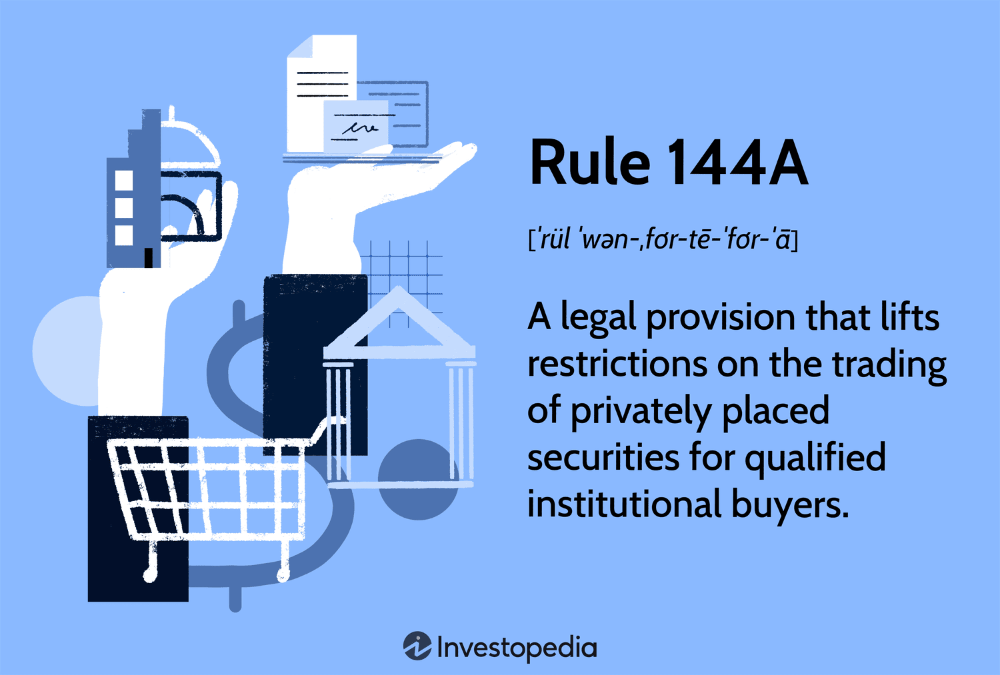

## Table of Contents

## What is Rule 144A?

Rule 144A is a regulation in the United States that makes it easier for companies to sell their stocks or bonds to big investors without having to go through all the usual paperwork and public disclosures. It was created by the Securities and Exchange Commission (SEC) to help companies raise money more quickly and with less hassle. Under Rule 144A, companies can sell securities to "qualified institutional buyers," which are large institutions like banks, insurance companies, and pension funds that have at least $100 million in assets they can invest.

This rule helps companies because it speeds up the process of raising money. Instead of waiting for months to complete all the required public filings, a company can sell its securities almost immediately to these big investors. For the investors, Rule 144A offers a chance to buy securities that are not available to the general public, which can sometimes lead to higher returns. However, these securities cannot be resold to just anyone; they must be sold to other qualified institutional buyers, keeping the securities in a somewhat private market.

## Who does Rule 144A apply to?

Rule 144A applies to companies that want to sell their stocks or bonds and to big investors who want to buy them. The companies can be from anywhere in the world, not just the U.S. The rule helps these companies sell their securities faster and with less paperwork. They don't have to go through all the usual steps that are needed when selling to the general public.

The big investors that can buy these securities are called "qualified institutional buyers." These are large organizations like banks, insurance companies, and pension funds that have at least $100 million in money they can invest. These investors get to buy securities that are not available to regular people, which can sometimes mean bigger profits for them. But they can only sell these securities to other qualified institutional buyers, not to anyone else.

## What are the main allowances provided by Rule 144A?

Rule 144A makes it easier for companies to sell their stocks or bonds to big investors. It allows companies to skip a lot of the paperwork and public disclosures that are usually required when selling securities. This means companies can sell their securities much faster and with less hassle. They don't have to wait for months to complete all the usual steps. This is really helpful for companies that need to raise money quickly.

The rule also allows big investors, called qualified institutional buyers, to buy these securities. These investors have to have at least $100 million in money they can invest. They get a chance to buy securities that are not available to the general public, which can sometimes lead to higher returns. However, these investors can only sell the securities they buy to other qualified institutional buyers, not to anyone else. This keeps the securities in a private market, away from regular people.

## How does Rule 144A affect the resale of securities?

Rule 144A affects the resale of securities by limiting who can buy them after the initial sale. When big investors, known as qualified institutional buyers, buy securities under Rule 144A, they can't sell those securities to just anyone. They can only sell them to other qualified institutional buyers. This keeps the securities in a private market, away from regular people.

This rule helps keep the securities somewhat private even after they're sold. It means that only big investors with at least $100 million to invest can keep trading these securities among themselves. This can make the securities more valuable because they're not available to the general public, but it also limits who can buy and sell them.

## What are the eligibility requirements for securities under Rule 144A?

Securities under Rule 144A must be from companies that want to sell their stocks or bonds to big investors. These companies can be from anywhere in the world, not just the U.S. The main thing is that the securities are sold to qualified institutional buyers. These are big investors like banks, insurance companies, and pension funds that have at least $100 million in money they can invest.

The securities themselves don't have to meet any special requirements, but the way they're sold does. Companies can sell these securities without going through all the usual paperwork and public disclosures that are needed when selling to the general public. This makes it easier and faster for companies to raise money. However, after the initial sale, the securities can only be resold to other qualified institutional buyers, keeping them in a private market.

## What are the benefits of Rule 144A for issuers?

Rule 144A makes it easier for companies to sell their stocks or bonds to big investors. It lets companies skip a lot of the paperwork and public disclosures that are usually needed when selling securities. This means companies can sell their securities much faster and with less hassle. They don't have to wait for months to complete all the usual steps, which is really helpful for companies that need to raise money quickly.

The rule also helps companies reach big investors who have a lot of money to invest. These investors are called qualified institutional buyers, and they have at least $100 million in money they can use. By selling to these big investors, companies can raise the money they need without having to go through the long process of selling to the general public. This makes it easier and faster for companies to get the funds they need to grow or invest in new projects.

## What are the benefits of Rule 144A for investors?

Rule 144A lets big investors, called qualified institutional buyers, buy securities that are not available to regular people. These investors have at least $100 million in money they can invest. By buying these securities, they can sometimes get higher returns because they are buying something that not everyone can buy. This can be a good opportunity for them to make more money.

Also, Rule 144A makes it easier for these big investors to trade securities among themselves. They can buy and sell these securities quickly without having to wait for all the usual paperwork and public disclosures. This means they can move their money around faster and take advantage of good investment opportunities as soon as they come up.

## What are the common criticisms of Rule 144A?

Some people criticize Rule 144A because they think it makes the market less fair. They say that by letting only big investors buy certain securities, smaller investors miss out on good investment opportunities. These securities can be very profitable, and regular people can't buy them. This can make the market seem unfair because only rich investors get a chance to make more money.

Another criticism is that Rule 144A might make it easier for companies to hide important information. Since they don't have to do all the usual public disclosures, some worry that companies might not be as open about their financial health. This could make it harder for investors to know if they're making a good investment or not. It's important for investors to have all the information they need to make smart choices, and some think Rule 144A might get in the way of that.

## How does Rule 144A impact market liquidity?

Rule 144A can make the market more liquid for big investors. It lets companies sell their stocks or bonds to these big investors without all the usual paperwork and public disclosures. This means companies can sell their securities faster and more easily. When big investors can buy and sell these securities among themselves quickly, it can make the market more active. This is good for the big investors because they can move their money around faster and take advantage of good investment opportunities as soon as they come up.

However, Rule 144A can also make the market less liquid for regular people. The securities sold under this rule can only be resold to other big investors, not to the general public. This means that these securities stay in a private market, away from regular investors. Because only a small group of big investors can trade these securities, it can limit how much they are bought and sold. This can make the market seem less fair because regular people don't get to join in on these investment opportunities.

## What are the potential risks associated with Rule 144A?

One big risk with Rule 144A is that it might make the market less fair. Only big investors, called qualified institutional buyers, can buy the securities sold under this rule. This means regular people can't get a chance to invest in these securities, which can sometimes be very profitable. This can make it seem like the rich get richer while regular people miss out on good investment opportunities. It can also make the market less open because only a small group of big investors can trade these securities.

Another risk is that companies might not be as open about their financial health. Under Rule 144A, companies don't have to do all the usual public disclosures when they sell securities to big investors. This means investors might not get all the information they need to make smart choices. If companies can hide important details, it can be harder for investors to know if they're making a good investment or not. This lack of information can make investing riskier for everyone involved.

## How has Rule 144A been amended over time, and why?

Rule 144A was first created by the Securities and Exchange Commission (SEC) in 1990. Since then, it has been changed a few times to make it work better for companies and big investors. One big change happened in 2012 when the SEC made it easier for foreign companies to sell their securities under Rule 144A. This was done to help more companies from around the world raise money in the U.S. without having to go through all the usual steps. The SEC wanted to make it easier for these companies to get the money they needed to grow.

Another change came in 2015 when the SEC updated the rules about who can be a qualified institutional buyer. They made it so that more types of big investors could buy securities under Rule 144A. This was done to let more big investors join in on these investment opportunities. The SEC made these changes because they wanted to help companies raise money more easily and to give more big investors a chance to buy securities that are not available to the general public.

## What are the expert opinions on the future of Rule 144A?

Many experts think that Rule 144A will keep being important in the future. They believe it will keep helping companies raise money quickly and easily. As more companies from around the world want to sell their securities in the U.S., Rule 144A will be a big help. It lets these companies skip a lot of the paperwork and public disclosures that are usually needed. This makes it easier for them to get the money they need to grow. Experts also think that more types of big investors might be allowed to buy securities under Rule 144A. This would give more investors a chance to join in on these investment opportunities.

Some experts worry about the risks of Rule 144A, though. They think it might make the market less fair because only big investors can buy these securities. This means regular people miss out on good investment opportunities. These experts believe that the SEC might need to change Rule 144A to make it more fair for everyone. They also worry that companies might not be as open about their financial health because they don't have to do all the usual public disclosures. If this keeps happening, it could make investing riskier for everyone involved.

## References & Further Reading

[1]: Lowry, M. (2018). ["The Journal of Financial Economics"](https://www.michelle-lowry.com/published-papers) - explores regulations and market liquidity.

[2]: Casey, K. (1997). ["Rule 144A: The Secondary Market for Private Placements"](https://www.mayerbrown.com/-/media/files/perspectives-events/publications/2021/08/rule144a-whatsthedeal_2021.pdf) Fordham Law Review.

[3]: Lopez de Prado, M. (2018). ["Advances in Financial Machine Learning"](https://www.amazon.com/Advances-Financial-Machine-Learning-Marcos/dp/1119482089).

[4]: Fabozzi, F. J., Focardi, S. M., & Jonas, C. (2010). ["Quantitative Equity Investing: Techniques and Strategies"](https://www.semanticscholar.org/paper/Quantitative-Equity-Investing%3A-Techniques-and-Fabozzi-Focardi/1c49a2a53919f7e65cb96f16691b8ff726fd3cd7).

[5]: Bank for International Settlements. (2011). ["High-frequency Trading in the Foreign Exchange Market"](https://www.bis.org/publ/mktc05.pdf).

[6]: Securities and Exchange Commission. (2012). ["Report of the SEC's Division of Trading and Markets"](https://www.sec.gov/reports).