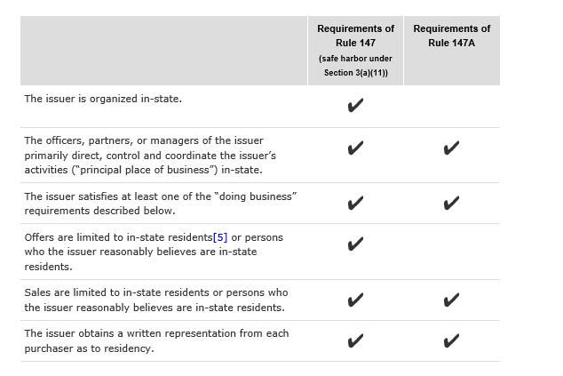

## Table of Contents

## What is Rule 147?

Rule 147 is a regulation from the U.S. Securities and Exchange Commission (SEC) that helps companies sell stocks or other securities without registering them with the SEC. This rule is part of what's called an "intrastate offering," which means the securities can only be sold to people living in the same state where the company is based. This makes it easier for small businesses to raise money from local investors without going through the complicated and expensive process of registering with the SEC.

The main idea behind Rule 147 is to keep the investment local. For example, a company in California can only sell its securities to people who live in California. This rule also has some specific requirements, like the company must do most of its business in the state where it's selling the securities. By following these rules, companies can avoid the need for federal registration, making it simpler and less costly to raise money from their community.

## What is the purpose of Rule 147?

Rule 147 from the SEC helps small businesses raise money by selling stocks or other securities without the need to register with the federal government. The main goal is to make it easier for these companies to get funding from people in their own state. By keeping the investment local, businesses can avoid the complicated and expensive process of registering with the SEC, which can be a big help for small companies that don't have a lot of money to spend on legal fees and paperwork.

The rule is all about intrastate offerings, meaning the securities can only be sold to people living in the same state as the company. This keeps the money flowing within the local community and helps support local economies. To use Rule 147, a company must do most of its business in the state where it's selling the securities, making sure the investment stays local and benefits the people and businesses in that area.

## Who can use Rule 147?

Rule 147 can be used by small businesses that want to raise money by selling stocks or other securities. These businesses must be based in a specific state and can only sell their securities to people who live in that same state. This rule is great for small companies because it helps them avoid the complicated and expensive process of registering with the SEC, which is the federal government's way of making sure securities are sold fairly.

To use Rule 147, a company needs to make sure most of its business happens in the state where it's selling the securities. This means the company should be doing most of its work, like making products or providing services, in that state. By following these rules, small businesses can keep the investment local and help their community grow, all while keeping things simple and less costly.

## What are the key requirements for issuers under Rule 147?

To use Rule 147, a company needs to make sure it's doing most of its business in the state where it wants to sell its securities. This means the company should be making its products or providing its services mostly in that state. The company also needs to have its main office in that state. This helps keep the investment local and supports the local economy.

The company can only sell its securities to people who live in the same state. This is called an intrastate offering. The company must be careful to check where its investors live to make sure they are from the same state. By following these rules, the company can avoid the need to register with the SEC, which saves time and money.

## How does Rule 147 differ from other exemptions like Rule 504 and Rule 506?

Rule 147 is different from Rule 504 and Rule 506 because it focuses on keeping investments local. Under Rule 147, a company can only sell its securities to people living in the same state where the company is based. This is called an intrastate offering. The company also needs to do most of its business in that state. This makes it easier for small businesses to raise money from their community without needing to register with the SEC, which can be expensive and complicated.

On the other hand, Rule 504 and Rule 506 are part of Regulation D and allow companies to raise money from investors across the country, not just in one state. Rule 504 lets companies raise up to $10 million in a year from any investor, but they still need to follow state securities laws. Rule 506 is split into two parts: Rule 506(b) allows companies to raise unlimited amounts of money but they can only sell to a limited number of accredited investors and up to 35 non-accredited investors, while Rule 506(c) lets companies raise money from accredited investors only, but they must take steps to verify that these investors are accredited. Both Rule 504 and Rule 506 require companies to file a Form D with the SEC, which is not required under Rule 147.

## What are the recent amendments to Rule 147?

In 2016, the SEC updated Rule 147 to make it easier for small businesses to raise money. The new version is called Rule 147A. One big change is that companies can now sell securities to people who live or work in the state, not just people who live there. This makes it easier for companies to find investors because they can include people who work in the state but live somewhere else. Also, the new rule lets companies sell securities online, which wasn't allowed before. This helps small businesses reach more people in their state without having to meet them in person.

Another important change is that Rule 147A allows companies to do business outside the state, as long as they do most of their business in the state where they're selling the securities. This gives companies more flexibility to grow and work in other states while still using the local investment rule. The new rule also makes it clear that companies don't need to register with the SEC if they follow these rules, which helps them save time and money. These changes make Rule 147A a better tool for small businesses looking to raise money from their local community.

## How do the recent amendments affect the geographical scope of offerings under Rule 147?

The recent amendments to Rule 147, now known as Rule 147A, have changed the rules about who can buy securities. Before, only people living in the same state as the company could buy them. Now, the rule says that people who live or work in the state can buy the securities. This makes it easier for companies to find investors because they can include people who work in the state but live somewhere else.

Another big change is that companies can now sell their securities online, which wasn't allowed before. This helps them reach more people in their state without having to meet them in person. Also, the new rule allows companies to do some business outside the state, as long as most of their business is still in the state where they're selling the securities. This gives companies more flexibility to grow while still using the local investment rule.

## What changes have been made to the investment limits and disclosure requirements in the recent amendments?

The recent amendments to Rule 147, now called Rule 147A, haven't changed the investment limits directly. Companies can still raise money without a specific cap, as long as they follow the rules about selling to people who live or work in their state. But the new rule does make it easier for companies to find investors because they can now sell securities online and to people who work in the state but live elsewhere. This means more people might be interested in investing, which could help companies raise more money without changing the actual limits.

As for disclosure requirements, Rule 147A hasn't added any new federal disclosure rules. Companies still don't need to register with the SEC if they follow the intrastate offering rules. However, they might need to follow state-specific disclosure rules, which can vary from one state to another. This means companies need to check what their state requires for disclosure when they're selling securities to local investors.

## How do the amendments impact the verification process for investor residency?

The amendments to Rule 147, now known as Rule 147A, have made it easier for companies to check where their investors live or work. Before, companies could only sell securities to people who lived in the same state. Now, they can also sell to people who work in that state, even if they live somewhere else. This means companies need to make sure their investors either live in the state or have a job there. They can ask for things like a driver's license to prove where someone lives, or a pay stub to show where they work.

Even though the rules are a bit more flexible now, companies still need to be careful about checking where their investors are from. They have to keep good records to show that their investors meet the new rules. This helps make sure they're following the law and can keep selling their securities without having to register with the SEC. The changes make it easier for companies to find investors, but they still need to do their homework to make sure everything is done right.

## What are the potential benefits of the recent amendments for issuers?

The recent amendments to Rule 147, now known as Rule 147A, make it easier for small businesses to raise money. Before, companies could only sell their securities to people living in the same state. Now, they can also sell to people who work in that state, even if they live somewhere else. This means more people can invest, which can help companies raise more money. Plus, companies can now sell their securities online, which wasn't allowed before. This makes it easier for them to reach more potential investors without having to meet them in person.

Another big benefit is that companies can do some business outside their state, as long as most of their business is still in the state where they're selling the securities. This gives companies more flexibility to grow and work in other places while still using the local investment rule. Also, since companies don't need to register with the SEC if they follow these rules, they can save time and money. These changes make it simpler for small businesses to get the money they need from their local community.

## What challenges might issuers face due to the recent amendments?

The recent changes to Rule 147, now called Rule 147A, might make things a bit harder for companies trying to raise money. One challenge is that they now need to check not just where their investors live, but also where they work. This means more work for the company to make sure they're following the rules. They have to keep good records to show that their investors either live in the state or have a job there. If they don't do this right, they could get in trouble with the law.

Another challenge is that even though companies can now sell their securities online, they still need to make sure they're only selling to people who live or work in their state. This can be hard to do online because it's easy for people to pretend they're from somewhere they're not. Companies need to be careful and might need to use special tools or methods to check where their online investors are really from. This can take more time and money, but it's important to stay within the rules.

## How should issuers adapt their compliance strategies to align with the recent amendments to Rule 147?

To adapt to the recent changes in Rule 147, now called Rule 147A, companies need to update how they check where their investors live or work. Before, they only had to make sure their investors lived in the same state. Now, they also need to check if investors work in that state, even if they live somewhere else. This means companies will need to ask for things like pay stubs to prove where someone works, in addition to things like driver's licenses to show where they live. Keeping good records of this information is really important to make sure they're following the new rules.

Another thing companies need to do is be careful when selling their securities online. The new rules allow this, but they still have to make sure they're only selling to people who live or work in their state. This can be tricky online because people can say they're from anywhere. Companies might need to use special tools or methods to check where their online investors are really from. This can take more time and money, but it's worth it to stay within the rules and avoid getting in trouble with the law. By being careful and thorough with their checks, companies can make the most of the new rules and raise money more easily from their local community.

## References & Further Reading

[1]: United States Securities and Exchange Commission. ["Intrastate Offering Exemption (Rule 147)."](https://www.sec.gov/resources-small-businesses/small-business-compliance-guides/intrastate-offering-exemptions) 

[2]: United States Securities and Exchange Commission. ["SEC Adopts Rule Amendments to Facilitate Intrastate and Regional Securities Offerings."](https://www.mondaq.com/unitedstates/securities/1561850/be-prepared-for-edgar-next-changes-so-you-arent-locked-out-of-edgar-right-before-a-filing-deadline)

[3]: Fenwick, Mark D., Kaal, Wulf A., & Vermeulen, Erik P. M. (2017). ["Regulation Tomorrow: What Happens When Technology is Faster than the Law?"](https://digitalcommons.wcl.american.edu/cgi/viewcontent.cgi?params=/context/aublr/article/1028/&path_info=6.3_Fenwicketal.pdf) American University Business Law Review.

[4]: Moloney, Niamh. (2010). ["Securities Regulation in the European Union: Adapting to a Changing Landscape."](https://books.google.com/books/about/EU_Securities_and_Financial_Markets_Regu.html?id=3g-gBQAAQBAJ) Edward Elgar Publishing.

[5]: Lopez de Prado, Marcos. ["Advances in Financial Machine Learning."](https://www.amazon.com/Advances-Financial-Machine-Learning-Marcos/dp/1119482089) 

[6]: Chan, Ernest P. ["Quantitative Trading: How to Build Your Own Algorithmic Trading Business."](https://github.com/ftvision/quant_trading_echan_book) 